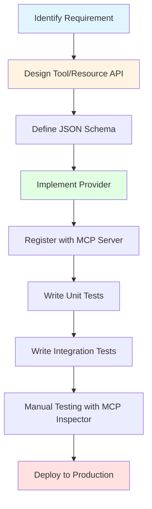
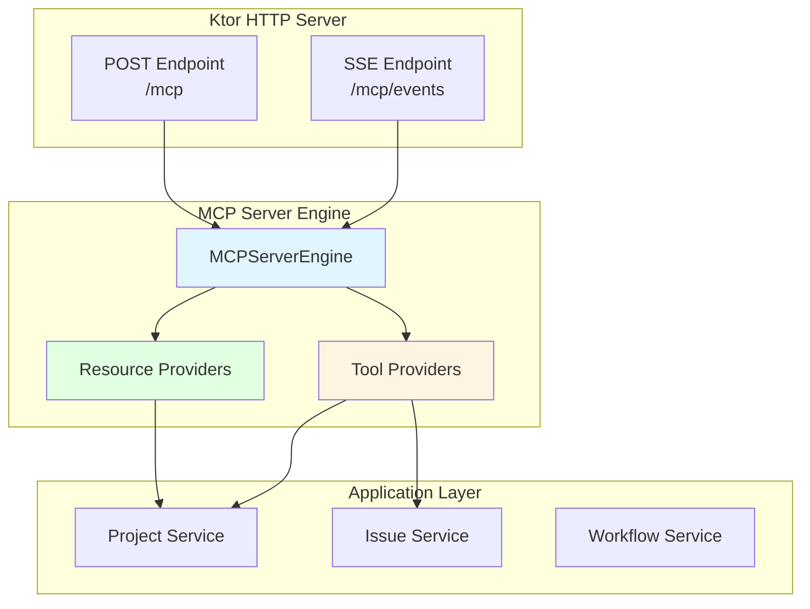
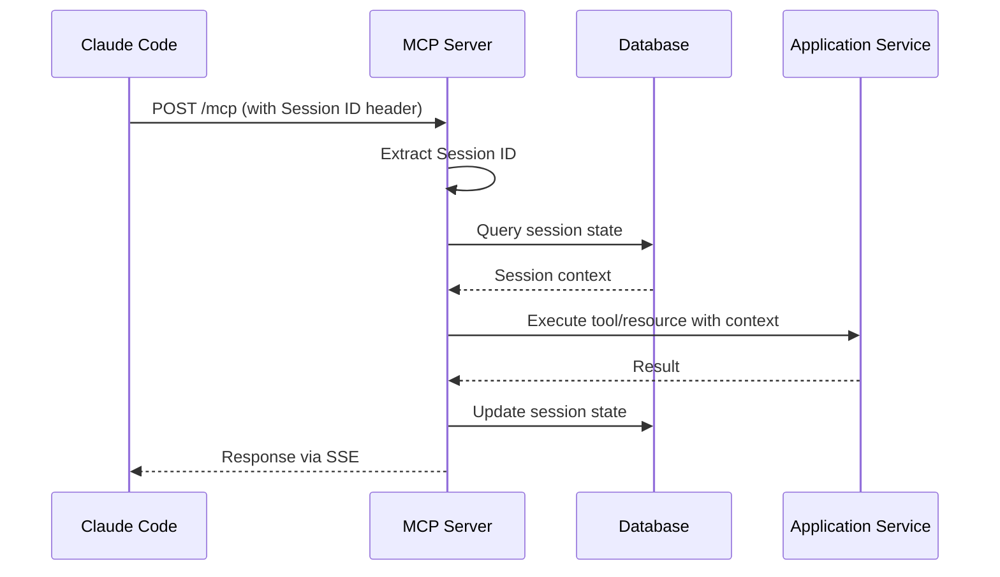

# MCP Development Guide

## Overview

Model Context Protocol (MCP) development in CycleTime involves extending the project orchestration capabilities exposed to Claude Code through standardized resources, tools, and prompts. This guide covers the complete development lifecycle for creating custom MCP components.

### What is MCP Development?

MCP development in CycleTime context means:

- **Creating custom MCP tools** - Executable functions that modify project state (create/update entities)
- **Defining MCP resources** - Read-only data endpoints that expose project information
- **Implementing server components** - Core server infrastructure using official MCP Kotlin SDK
- **Integrating with application layer** - Connecting MCP components to domain services

### When to Create Custom MCP Components

**Create Custom MCP Tools When:**
- Adding new project management operations (e.g., bulk issue updates)
- Implementing workflow automation (e.g., multi-step development processes)
- Exposing domain-specific commands to Claude Code
- Integrating external services (Linear, GitHub, etc.)

**Create Custom MCP Resources When:**
- Exposing new data views to Claude Code (e.g., sprint summaries)
- Providing aggregated project analytics
- Surfacing cross-entity relationships
- Implementing custom query capabilities

**Extend MCP Server When:**
- Adding new transport mechanisms (beyond SSE + HTTP POST)
- Implementing custom authentication/authorization
- Adding protocol-level features (subscriptions, streaming)

### Development Workflow Overview



### Prerequisites

**Technical Knowledge:**
- Kotlin programming language (coroutines, sealed classes)
- Ktor web framework (routing, plugins, dependency injection)
- MCP protocol concepts (resources, tools, JSON-RPC)
- JSON Schema validation
- Domain-Driven Design patterns

**Development Environment:**
- JDK 21 or later
- Gradle 8.x
- IntelliJ IDEA or VS Code with Kotlin plugin
- MCP Inspector (for manual testing)

**CycleTime Familiarity:**
- Understanding of domain model (Projects, Issues, Workflows)
- Application service layer architecture
- Testing standards and patterns

## MCP Server Implementation Patterns

CycleTime uses the official **MCP Kotlin SDK v0.7.2** maintained by Anthropic and JetBrains. The server integrates with Ktor for HTTP/SSE transport.

### Server Architecture



### Ktor Integration with MCP SDK

**Application.kt** - Server configuration:

```kotlin
import io.ktor.server.application.*
import io.ktor.server.sse.*
import io.spiralhouse.cycletime.mcp.server.configureMCP

fun Application.configureMCP() {
    // Install SSE plugin for server-sent events
    install(SSE)

    // Configure MCP routing
    configureMCPRouting()
}
```

### MCP Server Engine Implementation

**MCPServerEngine.kt** - Core server interface:

```kotlin
package io.spiralhouse.cycletime.mcp.server

import io.spiralhouse.cycletime.mcp.providers.ResourceProvider
import io.spiralhouse.cycletime.mcp.tools.ToolProvider

/**
 * MCP server engine interface.
 * Provides access to tool and resource providers.
 */
interface MCPServerEngine {
    fun getResourceProviders(): List<ResourceProvider>
    fun getToolProviders(): List<ToolProvider>
}

/**
 * Default implementation using dependency injection.
 */
class DefaultMCPServerEngine(
    private val resourceProviders: List<ResourceProvider> = emptyList(),
    private val toolProviders: List<ToolProvider> = emptyList()
) : MCPServerEngine {

    override fun getResourceProviders(): List<ResourceProvider> = resourceProviders

    override fun getToolProviders(): List<ToolProvider> = toolProviders
}
```

### Ktor Native Dependency Injection

CycleTime uses **Ktor Native DI** (completed in SPI-458) for dependency injection:

```kotlin
import io.ktor.server.application.*
import io.spiralhouse.cycletime.application.services.*
import io.spiralhouse.cycletime.mcp.tools.*

fun Application.configureDependencies() {
    dependencies {
        // Application services
        provide<ProjectApplicationService> { /* ... */ }
        provide<IssueApplicationService> { /* ... */ }

        // Tool providers
        provide<DefaultProjectToolProvider> {
            DefaultProjectToolProvider(instance())
        }
        provide<DefaultIssueToolProvider> {
            DefaultIssueToolProvider(instance())
        }

        // MCP server engine
        provide<MCPServerEngine> {
            DefaultMCPServerEngine(
                toolProviders = listOf(
                    instance<DefaultProjectToolProvider>(),
                    instance<DefaultIssueToolProvider>()
                )
            )
        }
    }
}
```

### SSE Transport Implementation

**SSE Endpoint** - Server-to-client event streaming:

```kotlin
import io.ktor.server.routing.*
import io.ktor.server.sse.*
import io.ktor.sse.*

fun Application.configureMCPRouting() {
    routing {
        // SSE endpoint for server-to-client streaming
        sse("/mcp/events") {
            val sessionId = generateSessionId()

            try {
                // Register session for message delivery
                sessionManager.registerSession(sessionId, this)

                // Send session ID to client
                send(ServerSentEvent(
                    data = """{"sessionId":"$sessionId"}""",
                    event = "connected"
                ))

                // Keep-alive loop
                while (true) {
                    send(ServerSentEvent(data = "ping", event = "ping"))
                    delay(30_000) // 30 second heartbeat
                }
            } finally {
                sessionManager.unregisterSession(sessionId)
            }
        }

        // POST endpoint for client-to-server requests
        post("/mcp") {
            handleMCPRequest(call)
        }
    }
}
```

## Creating Custom MCP Tools

MCP tools are executable functions that Claude Code can invoke to perform operations. Tools follow a provider pattern for registration and lifecycle management.

### Tool Provider Pattern

**ToolProvider Interface:**

```kotlin
package io.spiralhouse.cycletime.mcp.tools

/**
 * Interface for tool providers.
 * Providers organize related tools under a namespace.
 */
interface ToolProvider {
    val namespace: String
    fun getTools(): List<Tool> = emptyList()        // Synchronous tools
    fun getAsyncTools(): List<Tool> = emptyList()   // Asynchronous tools
}
```

### Complete Tool Provider Example

**DefaultProjectToolProvider.kt** - Project management tools:

```kotlin
package io.spiralhouse.cycletime.mcp.tools

import io.spiralhouse.cycletime.application.commands.*
import io.spiralhouse.cycletime.application.services.*
import io.spiralhouse.cycletime.domain.valueobjects.*
import kotlinx.serialization.json.*

class DefaultProjectToolProvider(
    private val projectService: ProjectApplicationService
) : AbstractToolProvider() {
    override val namespace: String = "project"

    override fun getAsyncTools(): List<Tool> = listOf(
        // Create project tool
        Tool(
            name = "create_project",
            description = "Create a new CycleTime project",
            parametersSchema = buildJsonObject {
                put("type", "object")
                put("properties", buildJsonObject {
                    put("name", buildRequiredStringParam("Project name"))
                    put("description", buildOptionalStringParam("Project description"))
                })
                put("required", buildJsonArray { add("name") })
            },
            handler = ToolHandler.Async { params ->
                Result.runCatching {
                    val name = extractRequiredParam(params, "name")
                    val description = extractOptionalParam(params, "description")

                    val command = CreateProjectCommand(
                        name = name,
                        description = description
                    )
                    val result = projectService.createProject(command)
                    buildJsonObject {
                        put("id", result.id.value)
                        put("name", result.name)
                    }
                }
            }
        ),

        // Get project tool
        Tool(
            name = "get_project",
            description = "Get a project by ID",
            parametersSchema = buildJsonObject {
                put("type", "object")
                put("properties", buildJsonObject {
                    put("id", buildRequiredStringParam("Project ID"))
                })
                put("required", buildJsonArray { add("id") })
            },
            handler = ToolHandler.Async { params ->
                Result.runCatching {
                    val id = extractRequiredParam(params, "id")
                    val project = projectService.getProject(ProjectId(id))
                        ?: throw IllegalArgumentException("Project not found: $id")
                    Json.encodeToJsonElement(project)
                }
            }
        )
    )
}
```

### Tool Metadata and JSON Schema

**JSON Schema for Tool Parameters:**

```kotlin
// Helper functions for common schema patterns
fun buildRequiredStringParam(description: String): JsonObject = buildJsonObject {
    put("type", "string")
    put("description", description)
}

fun buildOptionalStringParam(description: String): JsonObject = buildJsonObject {
    put("type", "string")
    put("description", description)
}

fun buildEnumParam(description: String, values: List<String>): JsonObject = buildJsonObject {
    put("type", "string")
    put("enum", buildJsonArray { values.forEach { add(it) } })
    put("description", description)
}

// Example: Complex schema with nested objects
val complexSchema = buildJsonObject {
    put("type", "object")
    put("properties", buildJsonObject {
        put("title", buildRequiredStringParam("Issue title"))
        put("type", buildEnumParam("Issue type", listOf("EPIC", "STORY", "SUBTASK")))
        put("metadata", buildJsonObject {
            put("type", "object")
            put("properties", buildJsonObject {
                put("priority", buildJsonObject {
                    put("type", "number")
                    put("minimum", 1)
                    put("maximum", 5)
                })
            })
        })
    })
    put("required", buildJsonArray {
        add("title")
        add("type")
    })
}
```

### Parameter Handling and Validation

**Parameter Extraction Utilities:**

```kotlin
abstract class AbstractToolProvider : ToolProvider {

    protected fun extractRequiredParam(params: JsonElement, key: String): String {
        return params.jsonObject[key]?.jsonPrimitive?.content
            ?: throw IllegalArgumentException("Missing required parameter: $key")
    }

    protected fun extractOptionalParam(params: JsonElement, key: String): String? {
        return params.jsonObject[key]?.jsonPrimitive?.content
    }

    protected fun extractIntParam(params: JsonElement, key: String): Int? {
        return params.jsonObject[key]?.jsonPrimitive?.intOrNull
    }

    protected fun extractBoolParam(params: JsonElement, key: String, default: Boolean = false): Boolean {
        return params.jsonObject[key]?.jsonPrimitive?.booleanOrNull ?: default
    }
}
```

### Error Handling with JSON-RPC Error Codes

**Exception to Error Code Mapping:**

```kotlin
package io.spiralhouse.cycletime.mcp.tools.exceptions

sealed class ToolException(
    message: String,
    val errorCode: ToolErrorCode
) : Exception(message)

enum class ToolErrorCode(val code: Int) {
    TOOL_NOT_FOUND(-32601),
    INVALID_PARAMETERS(-32602),
    EXECUTION_ERROR(-32000),
    TIMEOUT(-32001)
}

class ToolNotFoundException(toolName: String) :
    ToolException("Tool not found: $toolName", ToolErrorCode.TOOL_NOT_FOUND)

class ParameterValidationException(
    val toolName: String,
    val validationErrors: List<String>
) : ToolException(
    "Tool $toolName parameter validation failed: ${validationErrors.joinToString(", ")}",
    ToolErrorCode.INVALID_PARAMETERS
)

class ToolExecutionException(toolName: String, cause: Throwable) :
    ToolException("Tool execution failed: $toolName - ${cause.message}", ToolErrorCode.EXECUTION_ERROR) {
    init { initCause(cause) }
}
```

### Tool Registration

**ToolRegistry** - Thread-safe tool management:

```kotlin
package io.spiralhouse.cycletime.mcp.tools

class ToolRegistry(
    private val validator: JsonSchemaValidator = JsonSchemaValidator()
) {
    private val tools = ConcurrentHashMap<String, Tool>()

    fun register(tool: Tool): Boolean {
        return tools.putIfAbsent(tool.name, tool) == null
    }

    fun getAllToolMetadata(): List<ToolMetadata> {
        return tools.values.map {
            ToolMetadata(it.name, it.description, it.parametersSchema)
        }.sortedBy { it.name }
    }

    suspend fun invokeAsync(
        toolName: String,
        parameters: JsonElement,
        timeout: Long
    ): Result<JsonElement> {
        val tool = tools[toolName]
            ?: return Result.failure(ToolNotFoundException(toolName))

        val asyncHandler = (tool.handler as? ToolHandler.Async)?.handler
            ?: return Result.failure(ToolNotFoundException(toolName))

        // Validate parameters against schema
        val validationResult = validator.validate(parameters, tool.parametersSchema)
        if (!validationResult.isValid) {
            return Result.failure(
                ParameterValidationException(toolName, validationResult.errors)
            )
        }

        return try {
            withTimeout(timeout) {
                asyncHandler(parameters)
            }
        } catch (e: TimeoutCancellationException) {
            Result.failure(ToolTimeoutException(toolName, timeout))
        } catch (e: Exception) {
            Result.failure(ToolExecutionException(toolName, e))
        }
    }
}
```

## Defining MCP Resources

MCP resources expose read-only project data to Claude Code through URI-based addressing.

### Resource Provider Interface

```kotlin
package io.spiralhouse.cycletime.mcp.resources

interface ResourceProvider {
    val name: String
    val isRunning: Boolean

    suspend fun start()
    suspend fun stop()

    suspend fun listResources(
        filter: ResourceFilter? = null,
        pagination: ResourcePagination? = null
    ): List<Resource>

    suspend fun getResource(uri: String): Resource?
    suspend fun readResource(uri: String): String
}
```

### Resource Data Model

```kotlin
package io.spiralhouse.cycletime.mcp.resources

data class Resource(
    val uri: String,                        // e.g., "cycletime://projects/proj_123"
    val name: String,                       // Human-readable name
    val description: String? = null,
    val mimeType: String,                   // e.g., "application/json"
    val content: ResourceContent? = null,
    val metadata: ResourceMetadata? = null
)

sealed class ResourceContent {
    data class Text(val data: String) : ResourceContent()
    data class Binary(val data: String) : ResourceContent() // base64 encoded
}

data class ResourceMetadata(
    val created: Instant,
    val modified: Instant,
    val size: Long,
    val version: String? = null
)
```

### URI Patterns and Addressing

**Collection vs Individual Resource Patterns:**

```kotlin
// Collection resources (list all)
cycletime://projects                    // All projects
cycletime://issues                      // All issues
cycletime://workflows                   // All workflows

// Individual resources (single entity)
cycletime://projects/{projectId}        // Specific project
cycletime://issues/{issueId}           // Specific issue
cycletime://sessions/active            // Active session

// Filtered collections
cycletime://issues?project={projectId}  // Issues in project
cycletime://issues?status=open         // Open issues
```

### Working Resource Provider Example

```kotlin
class ProjectResourceProvider(
    private val projectService: ProjectApplicationService
) : ResourceProvider {
    override val name = "projects"
    override var isRunning = false

    override suspend fun start() {
        isRunning = true
    }

    override suspend fun stop() {
        isRunning = false
    }

    override suspend fun listResources(
        filter: ResourceFilter?,
        pagination: ResourcePagination?
    ): List<Resource> {
        val projects = projectService.listProjects()
        return projects.map { project ->
            Resource(
                uri = "cycletime://projects/${project.id.value}",
                name = project.name,
                description = project.description,
                mimeType = "application/json",
                content = ResourceContent.Text(
                    Json.encodeToString(project)
                )
            )
        }
    }

    override suspend fun getResource(uri: String): Resource? {
        val projectId = extractProjectId(uri) ?: return null
        val project = projectService.getProject(ProjectId(projectId)) ?: return null

        return Resource(
            uri = uri,
            name = project.name,
            description = project.description,
            mimeType = "application/json",
            content = ResourceContent.Text(
                Json.encodeToString(project)
            )
        )
    }

    override suspend fun readResource(uri: String): String {
        val resource = getResource(uri)
            ?: throw ResourceNotFoundException(uri)
        return when (val content = resource.content) {
            is ResourceContent.Text -> content.data
            is ResourceContent.Binary ->
                String(Base64.getDecoder().decode(content.data))
            null -> "{}"
        }
    }

    private fun extractProjectId(uri: String): String? {
        return uri.removePrefix("cycletime://projects/").takeIf { it.isNotBlank() }
    }
}
```

## Session Management and Lifecycle

MCP uses a **stateless per-request** pattern at the protocol level with application-level session persistence.

### Session Architecture



### Session ID Extraction from Headers

```kotlin
suspend fun handleMCPRequest(call: ApplicationCall) {
    // Extract session ID from header or request body
    val sessionId = call.request.header("X-MCP-Session-ID")
        ?: extractSessionIdFromBody(call)
        ?: run {
            call.respond(HttpStatusCode.BadRequest, "Missing session ID")
            return
        }

    // Load session context from database
    val sessionContext = loadSessionContext(sessionId)

    // Process request with session context
    val result = processRequest(call, sessionContext)

    // Update session state
    updateSessionState(sessionId, result)
}
```

### Session Context from Database

```kotlin
data class SessionContext(
    val sessionId: String,
    val userId: String?,
    val currentProject: ProjectId?,
    val metadata: Map<String, String>
)

suspend fun loadSessionContext(sessionId: String): SessionContext {
    return transaction {
        SessionStates.select { SessionStates.id eq sessionId }
            .singleOrNull()
            ?.let { row ->
                SessionContext(
                    sessionId = row[SessionStates.id],
                    userId = row[SessionStates.userId],
                    currentProject = row[SessionStates.currentProjectId]?.let { ProjectId(it) },
                    metadata = Json.decodeFromString(row[SessionStates.metadata])
                )
            } ?: SessionContext(sessionId, null, null, emptyMap())
    }
}
```

### Session Persistence Strategies

**Database Schema:**

```sql
CREATE TABLE session_states (
    id VARCHAR(255) PRIMARY KEY,
    user_id VARCHAR(255),
    current_project_id VARCHAR(255),
    metadata JSON,
    created_at TIMESTAMP,
    last_activity TIMESTAMP
);
```

**Session Update Pattern:**

```kotlin
suspend fun updateSessionState(sessionId: String, result: ToolResult) {
    transaction {
        SessionStates.update({ SessionStates.id eq sessionId }) {
            it[lastActivity] = Clock.System.now()
            // Update project context if tool modified project
            result.projectId?.let { projectId ->
                it[currentProjectId] = projectId.value
            }
        }
    }
}
```

## Testing MCP Implementations

Testing follows the three-tier strategy: unit tests (fast, isolated), integration tests (real infrastructure), and system tests (end-to-end).

### Unit Testing Tool Providers

```kotlin
class ProjectToolProviderTest : DescribeSpec({
    lateinit var mockProjectService: ProjectApplicationService
    lateinit var toolProvider: DefaultProjectToolProvider

    beforeEach {
        mockProjectService = mockk<ProjectApplicationService>()
        toolProvider = DefaultProjectToolProvider(mockProjectService)
    }

    describe("create_project tool") {
        it("should create project with valid parameters") {
            val expectedProject = ProjectDto(
                id = ProjectId("proj_123"),
                name = "Test Project"
            )
            coEvery { mockProjectService.createProject(any()) } returns expectedProject

            val tool = toolProvider.getAsyncTools()
                .find { it.name == "create_project" }!!

            val params = buildJsonObject {
                put("name", "Test Project")
            }

            val result = runBlocking {
                (tool.handler as ToolHandler.Async).handler(params)
            }

            result.isSuccess shouldBe true
            result.getOrNull()?.jsonObject?.get("name")?.jsonPrimitive?.content shouldBe "Test Project"
        }

        it("should fail with missing required parameter") {
            val tool = toolProvider.getAsyncTools()
                .find { it.name == "create_project" }!!

            val params = buildJsonObject { /* empty */ }

            val result = runBlocking {
                (tool.handler as ToolHandler.Async).handler(params)
            }

            result.isFailure shouldBe true
        }
    }
})
```

### Integration Testing with MCP Server

```kotlin
class MCPServerIntegrationTest : DescribeSpec({
    lateinit var database: Database
    lateinit var toolRegistry: ToolRegistry

    beforeEach {
        database = Database.connect("jdbc:h2:mem:test")
        transaction(database) {
            SchemaUtils.create(Projects, Issues)
        }

        val projectService = ProjectApplicationService(/* real dependencies */)
        val toolProvider = DefaultProjectToolProvider(projectService)

        toolRegistry = ToolRegistry()
        toolProvider.getAsyncTools().forEach { toolRegistry.register(it) }
    }

    afterEach {
        TransactionManager.closeAndUnregister(database)
    }

    describe("tool invocation via registry") {
        it("should execute create_project and persist to database") {
            val params = buildJsonObject {
                put("name", "Integration Test Project")
            }

            val result = runBlocking {
                toolRegistry.invokeAsync("create_project", params, timeout = 5000)
            }

            result.isSuccess shouldBe true

            // Verify database persistence
            val projects = transaction(database) {
                Projects.selectAll().toList()
            }
            projects.size shouldBe 1
        }
    }
})
```

### Testing SSE Transport

```kotlin
class SSETransportTest : DescribeSpec({
    describe("SSE connection lifecycle") {
        it("should establish connection and receive events") = testApplication {
            application {
                configureMCP()
            }

            val client = createClient {
                install(SSE)
            }

            client.sse("/mcp/events") {
                incoming.collect { event ->
                    when (event.event) {
                        "connected" -> {
                            val data = Json.parseToJsonElement(event.data!!)
                            data.jsonObject["sessionId"] shouldNotBe null
                        }
                        "ping" -> {
                            event.data shouldBe "ping"
                        }
                    }
                }
            }
        }
    }
})
```

### Mock Strategies

```kotlin
// Mock application service
val mockProjectService = mockk<ProjectApplicationService>()
coEvery { mockProjectService.createProject(any()) } returns ProjectDto(...)

// Mock database provider
val mockDbProvider = mockk<DatabaseProvider>()
every { mockDbProvider.getConnection() } returns mockDatabase

// Mock time provider for deterministic testing
val mockTimeProvider = MockTimeProvider()
mockTimeProvider.setTime("2025-10-20T10:00:00Z")
```

## Debugging and Troubleshooting

### Common Issues and Solutions

**Issue: Tool not found errors**

```kotlin
// Problem: Tool not registered
val result = toolRegistry.invoke("missing_tool", params)
// Error: ToolNotFoundException

// Solution: Verify registration
toolProvider.getAsyncTools().forEach { tool ->
    println("Registering: ${tool.name}")
    toolRegistry.register(tool)
}
```

**Issue: Parameter validation failures**

```kotlin
// Problem: Schema mismatch
val params = buildJsonObject {
    put("name", 123) // Should be string
}

// Solution: Use helper functions for type safety
val params = buildJsonObject {
    put("name", extractRequiredParam(rawParams, "name")) // Type-safe extraction
}
```

### Logging and Diagnostics

```kotlin
import org.slf4j.LoggerFactory

class DefaultProjectToolProvider(
    private val projectService: ProjectApplicationService
) : AbstractToolProvider() {
    private val logger = LoggerFactory.getLogger(DefaultProjectToolProvider::class.java)

    override fun getAsyncTools(): List<Tool> = listOf(
        Tool(
            name = "create_project",
            handler = ToolHandler.Async { params ->
                logger.debug("create_project invoked with params: $params")
                Result.runCatching {
                    // Implementation
                }.onSuccess {
                    logger.info("Project created successfully")
                }.onFailure { error ->
                    logger.error("Failed to create project", error)
                }
            }
        )
    )
}
```

### Protocol Validation

**Enable JSON-RPC validation logging:**

```kotlin
// application.conf
ktor {
    development = true
    log {
        level = DEBUG
    }
}

mcp {
    protocol {
        validateSchemas = true
        logInvalidRequests = true
    }
}
```

**Validate JSON schemas before registration:**

```kotlin
fun validateToolSchema(tool: Tool) {
    val validator = JsonSchemaValidator()
    val testParams = buildJsonObject { /* sample params */ }
    val result = validator.validate(testParams, tool.parametersSchema)
    require(result.isValid) { "Invalid schema: ${result.errors}" }
}
```

### Cross-Reference to Troubleshooting Guides

For specific issues, refer to these troubleshooting guides:

- **[MCP Troubleshooting Overview](../troubleshooting/mcp/overview.md)** - General troubleshooting approach
- **[Connection Issues](../troubleshooting/mcp/connection-issues.md)** - SSE connection problems
- **[Protocol Validation Issues](../troubleshooting/mcp/protocol-validation-issues.md)** - JSON-RPC format errors
- **[Error Codes Reference](../troubleshooting/mcp/error-codes.md)** - Complete error code catalog

## See Also

### Concept Documentation
- [MCP Protocol Concepts](../../concepts/mcp/mcp-protocol-concepts.md) - Protocol fundamentals
- [JSON-RPC Pattern](../../patterns/mcp/json-rpc-pattern.md) - Message handling
- [SSE Transport Pattern](../../patterns/mcp/sse-transport-pattern.md) - Transport layer

### Development Resources
- [Testing Standards](.claude/shared/testing-standards.md) - Testing strategy
- [Development Setup](./development-setup.md) - Environment configuration

### External References
- [MCP Official Specification](https://modelcontextprotocol.io/) - Protocol specification
- [MCP Kotlin SDK](https://github.com/modelcontextprotocol/kotlin-sdk) - Official SDK documentation
- [JSON Schema Specification](https://json-schema.org/) - Schema validation reference
