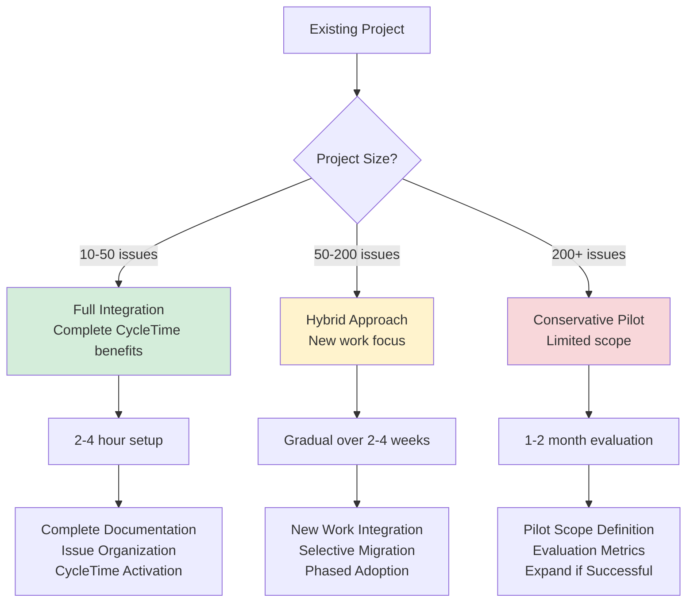

# CycleTime Project Onboarding Guide

**Version:** 1.0
**Date:** July 30, 2025

**Related Documents:**
📋 [PRD](../../reference/PRD.md) | 🏗️ [Architecture Overview](../../architecture/overview.md) | 👤 [User Experience](../../reference/user-experience.md)

---

## Overview

CycleTime provides guided onboarding for both new and existing projects through a
simple "Onboarding Assistant" that helps determine the best approach for
integrating CycleTime with ongoing work. Rather than complex automated analysis, CycleTime
uses targeted questions to understand project state and provide realistic
recommendations.

## New Project Onboarding

For new (greenfield) projects, CycleTime provides comprehensive Project Bootstrap
that includes:

1. **Requirements Gathering**: Interactive interview process or PRD acceptance
2. **Project Structure Creation**: Repository scaffolding and toolchain setup
3. **Issue Tracking Setup**: Epic/Story/Subtask hierarchy creation
4. **Development Environment**: Complete development toolchain configuration

See [User Experience Guide](../../reference/user-experience.md) for detailed new project workflows.

## Existing Project Integration

### Onboarding Assistant Flow

The Onboarding Assistant uses a simple question-based approach to recommend the optimal integration strategy based on project size, documentation status, and team activity level.

#### Integration Decision Flow



#### Initial Assessment Through Questions

```
User: "I want to use CycleTime with my existing project that's already in Linear"

Claude: "Great! I can help you integrate CycleTime with your existing project. Let me ask
a few questions to recommend the best approach:

**Project Context:**
1. **Project Size**: Roughly how many issues do you have?
   - Small (10-50 issues)
   - Medium (50-200 issues)
   - Large (200+ issues)

2. **Documentation Status**: Do you have project requirements documented?
   - Yes, we have comprehensive PRD and architecture docs
   - We have some documentation but it's incomplete
   - No, documentation is minimal or missing

3. **Issue Organization**: How are your issues structured?
   - Well organized with Epic → Story → Subtask hierarchy
   - Mostly organized but with some gaps
   - Mixed structure, needs cleanup

4. **Current Activity**: How active is development?
   - Very active (daily commits, multiple people)
   - Moderately active (weekly activity)
   - Maintenance mode (occasional updates)

Based on your answers, I'll recommend the best way to get started with CycleTime."

User: "Medium size, some documentation, mostly organized, very active"

Claude: "Perfect! Based on your answers, here's my recommendation:

## 🎯 **Recommended Approach: Hybrid Integration**

Your project is a good candidate for gradual CycleTime integration:

### **Phase 1: Start with New Work (Immediate)**
- Use CycleTime for new features and stories going forward
- Leave existing in-progress work in current workflow
- Create new Epic/Story/Subtask structures using CycleTime standards

### **Phase 2: Documentation Review (Week 1-2)**
- Review and enhance existing documentation to CycleTime standards
- I can help identify gaps and suggest improvements
- Add missing PRD sections or architecture details

### **Phase 3: Gradual Expansion (Week 3+)**
- Optionally bring existing work into CycleTime workflows
- Apply CycleTime orchestration to broader project scope
- Full integration when ready

**Benefits of This Approach:**
✅ No disruption to current active development
✅ Immediate value from CycleTime for new work
✅ Gradual learning and adoption
✅ Preserve existing team velocity

Ready to start with Phase 1?"
```

### Integration Strategies by Project Size

#### Small Project Fast Track (10-50 issues)

```
User: "Small size, minimal documentation, mixed structure, moderately active"

Claude: "Excellent! Small projects are perfect for full CycleTime integration:

## 🚀 **Recommended Approach: Full Integration**

Your project size (10-50 issues) is ideal for comprehensive CycleTime onboarding:

### **Quick Integration Plan**

**Step 1: Documentation Foundation**
- Create basic PRD.md based on existing project goals
- Guided documentation creation for essential project artifacts
- Add simple architecture overview

**Step 2: Issue Organization Review**
- Review current issue structure
- Recommendations for Epic/Story/Subtask organization
- Optional: guided cleanup of structural issues

**Step 3: CycleTime Activation**
- Connect CycleTime to your project
- Set up task orchestration
- Enable CycleTime workflow management

**Why Full Integration Works for Your Project:**
✅ Small scope makes comprehensive review manageable
✅ Moderate activity allows time for setup
✅ Complete CycleTime benefits from day one
✅ Strong foundation for future growth

Would you like to start with the documentation foundation?"
```

#### Medium Project Hybrid Integration (50-200 issues)

For medium-sized projects, CycleTime recommends a gradual approach:

**Phase 1: New Work Integration**

- Use CycleTime for all new Epics and Stories
- Leave existing active work unchanged
- Establish CycleTime patterns for future development

**Phase 2: Documentation Enhancement**

- Review existing documentation for CycleTime compatibility
- Fill gaps in PRD, architecture, or technical documentation
- Establish standardized documentation structure

**Phase 3: Optional Existing Work Integration**

- Selectively bring existing work into CycleTime workflows
- Focus on high-value or strategic initiatives
- Maintain flexibility based on team preferences

#### Large Project Conservative Approach (200+ issues)

```
User: "Large size, comprehensive docs, well organized, very active"

Claude: "Smart! Large, active projects need careful integration:

## 🛡️ **Recommended Approach: Conservative Integration**

For large, active projects (200+ issues), I recommend starting small:

### **Phase 1: Pilot with New Epic (Week 1)**
- Select one new Epic for CycleTime pilot
- Use CycleTime workflow for this Epic only
- Existing work continues unchanged

### **Phase 2: Evaluate and Expand (Week 2-4)**
- Assess CycleTime value with pilot Epic
- Gradually expand to additional new work
- Optional: bring selected existing work into CycleTime

### **Phase 3: Broader Integration (Month 2+)**
- Expand CycleTime usage based on pilot success
- Consider broader project integration if beneficial
- Maintain flexibility to use CycleTime where it adds most value

**Why Conservative Approach:**
✅ Minimal disruption to established workflows
✅ Proven value before broader commitment
✅ Maintains team productivity during evaluation
✅ Flexible expansion based on results

**Good News:** Your existing documentation and organization mean you're
already following many CycleTime best practices!

Ready to identify a good pilot Epic to start with?"
```

## Simple Health Checks (Small Projects Only)

For small projects (< 100 issues), CycleTime can perform basic validation to identify
improvement opportunities:

### Health Check Process

```kotlin
data class SimpleHealthCheck(
    val projectSize: ProjectSize,

    // Only performed for SMALL projects
    val basicMetrics: BasicMetrics? = null,
    val recommendations: List<String> // Simple, actionable recommendations
) {
    enum class ProjectSize { SMALL, MEDIUM, LARGE }

    data class BasicMetrics(
        val totalIssues: Int,
        val orphanedStories: Int, // Stories without parent Epic
        val directEpicSubtasks: Int, // Subtasks directly under Epic
        val issuesWithoutEstimates: Int, // Stories lacking estimates
        val documentationFound: List<String> // List of found docs
    )
}
```

### Example Health Check Results

```
**Project Health Assessment**

📊 **Basic Metrics:**
- Total Issues: 47
- Orphaned Stories: 3 (stories without parent Epic)
- Direct Epic Subtasks: 1 (subtasks directly under Epic, bypassing Story)
- Issues Without Estimates: 8 (stories missing story points)
- Documentation Found: README.md

🔧 **Recommendations:**
1. **Create PRD.md** to document project requirements and scope
2. **Move 3 orphaned Stories** under appropriate Epics for better organization
3. **Add estimates to 8 Stories** using Fibonacci scale (1,2,3,5,8,13) for better planning
4. **Consider adding ARCHITECTURE.md** for technical overview and system design
5. **Review Epic structure** - one subtask bypasses Story level (should be Epic → Story → Subtask)

**Remediation approach:** Guided documentation creation and issue organization
**CycleTime can help with:** All documentation creation and issue organization
```

### Health Check Limitations

**Small Projects (< 100 issues):**

- ✅ Basic structural analysis
- ✅ Documentation gap identification
- ✅ Simple organizational recommendations
- ✅ Estimate and hierarchy validation

**Medium/Large Projects (100+ issues):**

- ❌ No automated analysis due to complexity
- ✅ Questionnaire-based assessment only
- ✅ Manual guidance and recommendations
- ✅ Gradual integration strategies

## Realistic Scope and Limitations

### What CycleTime Won't Do

CycleTime is designed with realistic limitations to ensure reliable, valuable
assistance:

**❌ Complex Automated Analysis**

- No automated analysis of large projects (200+ issues)
- No complex cross-issue inference or pattern detection
- No automated documentation generation from existing data
- No large-scale automated restructuring

**❌ Context-Heavy Operations**

- No comprehensive codebase analysis for large repositories
- No automated requirement extraction from extensive existing work
- No complex project archaeology or historical analysis

### What CycleTime Will Do

**✅ Guided Assessment and Recommendations**

- Structured questionnaire to understand project state
- Realistic recommendations based on project size and activity
- Simple health checks for small projects only
- Clear integration pathways that preserve team velocity

**✅ Manual Guidance and Support**

- Step-by-step guidance for remediation tasks
- Template-based documentation creation assistance
- Issue organization recommendations with clear examples
- Gradual integration strategies tailored to project context

**✅ Immediate Value for New Work**

- Full CycleTime orchestration for new Epics and Stories
- Professional project management for future development
- Established patterns that can optionally expand to existing work

## Integration Success Patterns

### Successful Integration Characteristics

**Small Projects (10-50 issues):**

- Complete integration approach recommended
- Comprehensive CycleTime benefits from day one
- Strong foundation for future growth
- Manageable scope for full review and organization

**Medium Projects (50-200 issues):**

- Gradual integration approach recommended
- Hybrid approach with new work focus
- Selective existing work integration
- Phased adoption over multiple weeks

**Large Projects (200+ issues):**

- Conservative pilot approach recommended
- Limited scope with careful evaluation
- Flexible expansion based on demonstrated value
- Phased adoption over multiple months, varies by team needs

### Common Integration Challenges

**Documentation Gaps**

- Missing or incomplete PRD/requirements documentation
- Inconsistent architecture documentation
- Solution: CycleTime provides templates and guided creation

**Issue Structure Inconsistencies**

- Mixed Epic/Story/Subtask hierarchies
- Inconsistent estimation practices
- Solution: Gradual standardization with clear patterns

**Team Workflow Disruption**

- Concerns about changing established processes
- Active development momentum
- Solution: Conservative approach focusing on new work first

**Tool Integration Complexity**

- Multiple existing tools and workflows
- Complex project management setups
- Solution: Provider-agnostic approach with optional integration

## Next Steps After Onboarding

Once onboarding is complete, projects transition to full CycleTime orchestration:

1. **Daily Task Orchestration**: Intelligent next-task recommendations based on
   dependencies and priorities
2. **Documentation Maintenance**: Ongoing documentation updates and
   architectural decision recording
3. **Quality Gate Management**: TDD workflow integration and quality assurance
   processes
4. **Cross-Session Continuity**: Seamless project state recovery across Claude
   Code sessions
5. **Milestone Tracking**: Progress monitoring and phase-based project
   management

See [User Experience Guide](../../reference/user-experience.md) for detailed ongoing development workflows.
