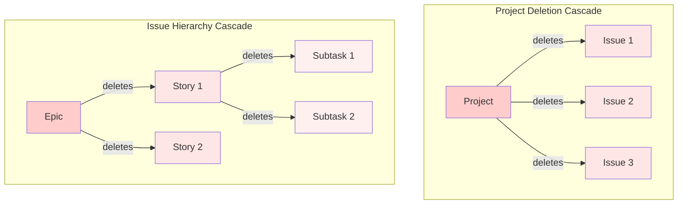
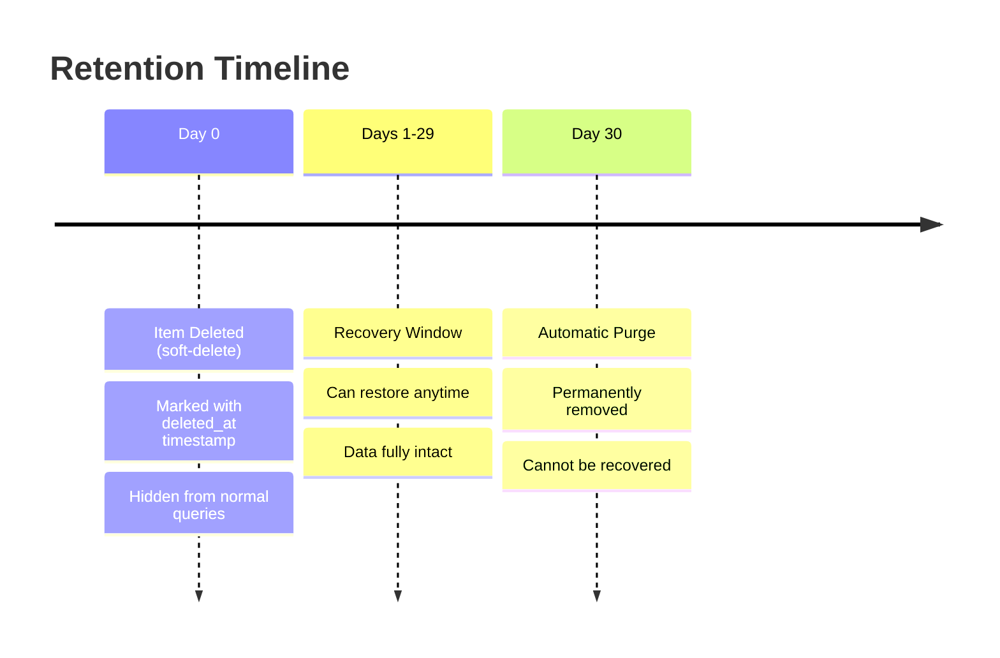
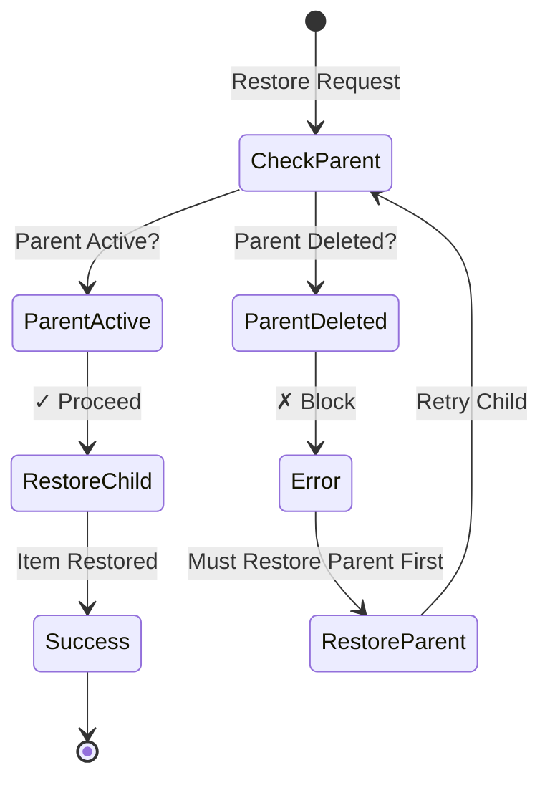

# Soft-Deletion Recovery Guide

## Overview

CycleTime implements a **soft-deletion pattern** that provides a safety net for accidentally deleted data. When you delete a project or issue, it's not immediately removed from the database. Instead, it's marked as deleted and hidden from normal queries, but remains recoverable for 30 days.

### Why Soft-Deletion?

- **Accident Recovery**: Restore items deleted by mistake
- **Audit Trail**: Track when items were deleted and restored
- **Data Safety**: 30-day grace period before permanent removal
- **Referential Integrity**: Maintain parent-child relationships

### Key Concepts

- **Soft-Delete**: Sets a `deleted_at` timestamp instead of removing the record
- **Recovery Window**: 30 days to restore before automatic purge
- **Cascade Deletion**: Deleting a parent automatically soft-deletes all children
- **Parent-First Restoration**: Must restore parent before children

## Recovery Workflows

### Recover a Deleted Project

When a project is accidentally deleted, follow these steps to recover it:

#### Step 1: List Deleted Projects

First, find the deleted project in the deletion list:

```bash
# List all soft-deleted projects (most recent first)
claude mcp__cycletime__project_list_deleted
```

Example output:
```json
{
  "projects": [
    {
      "id": "abc-123-def-456",
      "name": "Q4 Planning",
      "deleted_at": "2025-11-20T14:30:00Z",
      "description": "Q4 roadmap and resource planning"
    },
    {
      "id": "ghi-789-jkl-012",
      "name": "Legacy Migration",
      "deleted_at": "2025-11-15T09:15:00Z",
      "description": "Database migration project"
    }
  ]
}
```

#### Step 2: Restore the Project

Use the project ID to restore:

```bash
# Restore the specific project
claude mcp__cycletime__project_restore_project '{"id": "abc-123-def-456"}'
```

Success response:
```json
{
  "success": true,
  "message": "Project 'Q4 Planning' restored successfully"
}
```

#### Step 3: Verify Restoration

Confirm the project is active again:

```bash
# Get the restored project
claude mcp__cycletime__project_get_project '{"id": "abc-123-def-456"}'
```

The project should now appear in normal project lists and the `deleted_at` field should be `null`.

### Recover a Deleted Issue

Issue recovery requires checking parent status first:

#### Step 1: Find the Deleted Issue

```bash
# List all soft-deleted issues
claude mcp__cycletime__issue_list_deleted
```

Example output:
```json
{
  "issues": [
    {
      "id": "issue-123",
      "title": "Implement authentication",
      "project_id": "project-456",
      "parent_id": null,
      "type": "STORY",
      "deleted_at": "2025-11-21T10:00:00Z"
    },
    {
      "id": "subtask-789",
      "title": "Add JWT validation",
      "project_id": "project-456",
      "parent_id": "issue-123",
      "type": "SUBTASK",
      "deleted_at": "2025-11-21T10:00:00Z"
    }
  ]
}
```

#### Step 2: Check Parent Status

Before restoring an issue, verify its parent (project or parent issue) is active:

```bash
# Check if parent project is active
claude mcp__cycletime__project_get_project '{"id": "project-456"}'
```

If the parent is deleted, you'll see a `deleted_at` timestamp. **You must restore the parent first.**

#### Step 3: Restore in Correct Order

For hierarchical issues (Epic → Story → Subtask), restore from parent to child:

```bash
# 1. First restore the parent story (if deleted)
claude mcp__cycletime__issue_restore_issue '{"id": "issue-123"}'

# 2. Then restore the subtask
claude mcp__cycletime__issue_restore_issue '{"id": "subtask-789"}'
```

### List All Deleted Items

To see everything that's been soft-deleted:

#### Projects with Deletion Status

```bash
# Include deleted projects in listing
claude mcp__cycletime__project_list_projects '{"includeDeleted": true}'
```

Items with `deleted_at` timestamps are soft-deleted. Items with `deleted_at: null` are active.

#### Issues with Deletion Status

```bash
# Include deleted issues in listing
claude mcp__cycletime__issue_list_issues '{"includeDeleted": true}'
```

### Verify Successful Restoration

After restoring items, verify they're accessible:

1. **Check Direct Access**:
   ```bash
   claude mcp__cycletime__project_get_project '{"id": "restored-project-id"}'
   ```

2. **Confirm in Active Lists**:
   ```bash
   # Should appear in standard list (without includeDeleted flag)
   claude mcp__cycletime__project_list_projects
   ```

3. **Verify Children Status** (if applicable):
   ```bash
   # Check if child issues need separate restoration
   claude mcp__cycletime__issue_list_issues '{"includeDeleted": true}'
   ```

## Cascade Behavior

Understanding cascade relationships is critical for successful recovery:



### Deletion Rules

1. **Project Deletion**: Cascades to ALL issues in the project
2. **Epic Deletion**: Cascades to all child stories and their subtasks
3. **Story Deletion**: Cascades to all subtasks
4. **Subtask Deletion**: No cascade (leaf node)

### Restoration Rules

1. **No Automatic Cascade**: Restoring a parent does NOT restore children
2. **Parent-First Required**: Cannot restore child if parent is deleted
3. **Explicit Choice**: Each item must be explicitly restored

## 30-Day Retention Policy

Soft-deleted items are automatically purged after 30 days:



### Important Notes

- **No Extensions**: The 30-day period cannot be extended
- **No Partial Recovery**: After purge, data cannot be reconstructed
- **Backup Strategy**: For critical data, maintain external backups
- **Purge Schedule**: Runs daily at 02:00 UTC (low-traffic time)

## Restoration Rules

### Parent-First Requirement

You cannot restore a child item if its parent is deleted:



**Example Scenario**:
1. Project "Alpha" is deleted (all issues cascade delete)
2. User tries to restore Issue #123 from Project Alpha
3. **Result**: Error - "Cannot restore issue - parent project is deleted"
4. **Solution**: Restore Project Alpha first, then Issue #123

### No Automatic Child Restoration

When you restore a parent, children remain deleted until explicitly restored:

**Rationale**:
- Some children might be intentionally deleted
- Allows selective restoration
- Prevents restoring obsolete items
- Gives user full control

**Example Workflow**:
```bash
# 1. Restore project
claude mcp__cycletime__project_restore_project '{"id": "proj-1"}'
# Project restored, but issues still deleted

# 2. List issues to see what needs restoration
claude mcp__cycletime__issue_list_deleted

# 3. Selectively restore needed issues
claude mcp__cycletime__issue_restore_issue '{"id": "issue-1"}'
claude mcp__cycletime__issue_restore_issue '{"id": "issue-3"}'
# issue-2 left deleted (not needed)
```

### Idempotent Operations

Restore operations are idempotent - safe to call multiple times:

```bash
# First call: Restores the item
claude mcp__cycletime__project_restore_project '{"id": "proj-1"}'
> Success: Project restored

# Second call: No error, already restored
claude mcp__cycletime__project_restore_project '{"id": "proj-1"}'
> Success: Project already active
```

This safety feature prevents errors in automation scripts or retry logic.

## Troubleshooting

### "Cannot restore issue - parent is deleted"

**Problem**: Attempting to restore an issue whose parent (project or parent issue) is soft-deleted.

**Solution**:
1. Identify the parent using the issue details
2. Check parent status: `mcp__cycletime__project_get_project` or `mcp__cycletime__issue_get_issue`
3. Restore parent first
4. Retry issue restoration

**Example Fix**:
```bash
# Failed attempt
claude mcp__cycletime__issue_restore_issue '{"id": "issue-123"}'
> Error: Cannot restore issue - parent project is deleted

# Check parent project
claude mcp__cycletime__project_list_deleted
> Find project-456 in deleted list

# Restore parent first
claude mcp__cycletime__project_restore_project '{"id": "project-456"}'
> Success

# Now restore issue
claude mcp__cycletime__issue_restore_issue '{"id": "issue-123"}'
> Success
```

### "Project not in deleted list"

**Problem**: Cannot find a project in the deleted items list.

**Possible Causes**:

1. **Already Restored**: Check active projects
   ```bash
   claude mcp__cycletime__project_list_projects
   ```

2. **Purged After 30 Days**: If deleted >30 days ago, it's permanently removed
   - Check deletion logs if available
   - No recovery possible after purge

3. **Never Existed**: Verify the project ID is correct

### "How do I recover a project deleted 40 days ago?"

**Answer**: Unfortunately, this is not possible. The 30-day retention policy automatically purges soft-deleted items after 30 days. Once purged, data is permanently removed and cannot be recovered through CycleTime.

**Prevention Strategies**:
- Regular backups of critical projects
- Export important data periodically
- Train users on deletion impact
- Consider longer retention for critical systems (future feature)

### "Restored parent but children still missing"

**This is expected behavior**. Restoration does not cascade. You must explicitly restore each child item you want to recover.

**Solution**:
```bash
# After restoring parent project
# List all deleted issues for that project
claude mcp__cycletime__issue_list_deleted

# Filter mentally for issues with matching project_id
# Restore each needed issue individually
claude mcp__cycletime__issue_restore_issue '{"id": "issue-1"}'
claude mcp__cycletime__issue_restore_issue '{"id": "issue-2"}'
```

### Performance Issues After Restoration

**Problem**: Queries seem slower after restoring many items.

**Possible Causes**:
- Index fragmentation after many restore operations
- Statistics need updating

**Solution**:
- Allow system to reindex (happens automatically)
- If persistent, contact system administrator
- Performance should normalize within minutes

## Best Practices

### Regular Audits

Periodically review deleted items to:
- Clean up items that won't be restored
- Identify patterns of accidental deletion
- Verify retention policy is appropriate

```bash
# Weekly audit of deleted items
claude mcp__cycletime__project_list_deleted
claude mcp__cycletime__issue_list_deleted
```

### Deletion Confirmation

Before deleting critical items:
1. Verify the item is correct
2. Check for dependencies
3. Inform stakeholders
4. Document the deletion reason

### Recovery Testing

Periodically test the recovery process:
1. Create a test project
2. Delete it
3. Practice recovery steps
4. Verify all data restored correctly

This ensures team familiarity with the recovery process before an actual incident.

### Documentation

When restoring items, document:
- What was restored
- Why it was deleted initially
- Who requested restoration
- Any items intentionally left deleted

## Related Documentation

- [ADR-008: Soft-Deletion Pattern](../../architecture/decisions/ADR-008-soft-deletion-pattern.md) - Architectural decisions and trade-offs
- [MCP Tools Reference](../../reference/api/mcp-tools-reference.md) - Complete MCP tool documentation
- [Database Schema](../../reference/database-schema.md) - Database structure and relationships