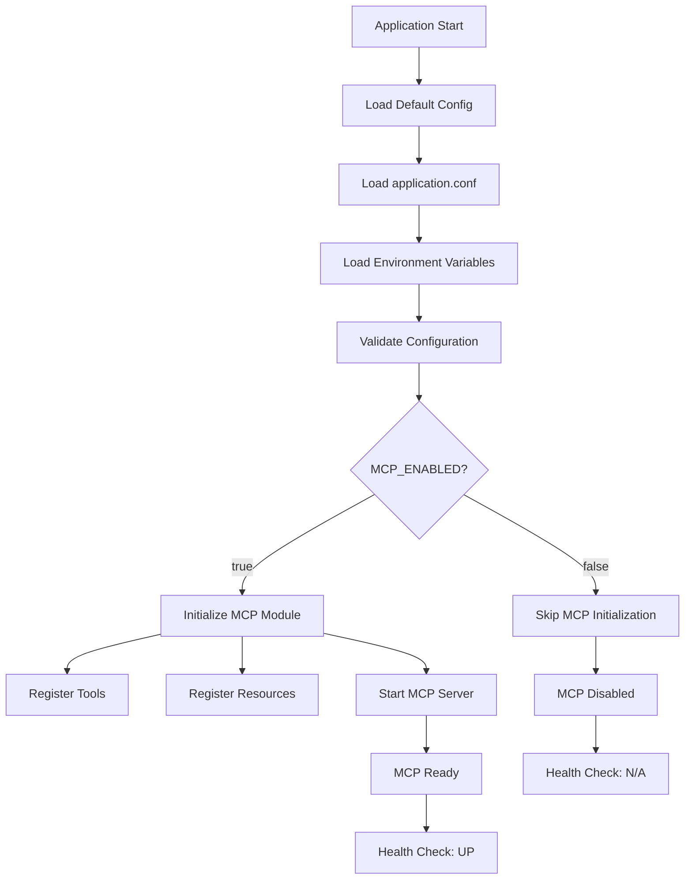
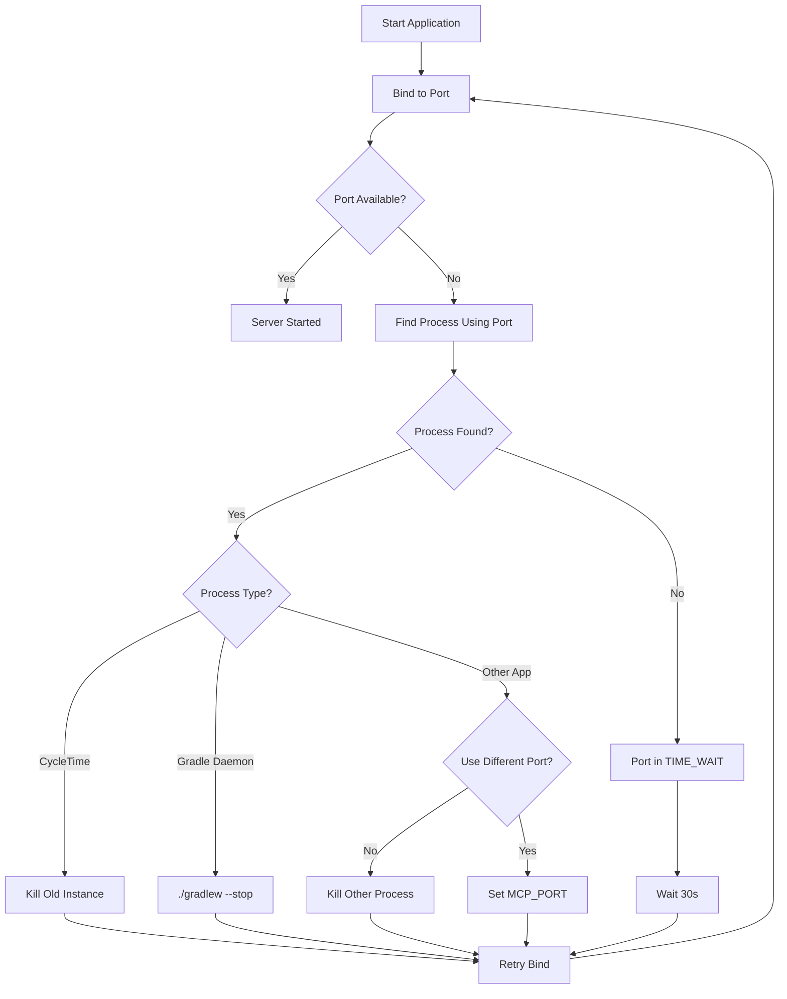

# MCP Configuration Troubleshooting

Solutions for MCP server configuration and port binding problems.

## Issue Categories

This guide covers two configuration-related issues:
1. [MCP Server Disabled](#issue-9-mcp-server-disabled) - Server starts but MCP not available
2. [Port Already in Use](#issue-10-port-already-in-use) - Port binding conflicts

---

## Issue 9: MCP Server Disabled

### Symptoms

```bash
$ curl http://localhost:8080/mcp
curl: (7) Failed to connect to localhost port 8080: Connection refused
```

```bash
$ ./gradlew run
# Server starts but no MCP endpoints available
# HTTP 404 on /mcp
```

**Observable Behavior**:
- Application starts successfully
- Other endpoints work (if any)
- MCP endpoints return 404
- No MCP initialization messages in logs

### Root Causes

1. **MCP explicitly disabled**
   - `MCP_ENABLED=false` in environment
   - Configuration file disabled MCP
   - Feature flag turned off

2. **Configuration not loaded**
   - Configuration file missing
   - Environment variables not read
   - Default configuration excludes MCP

3. **Module not initialized**
   - MCP module not loaded
   - Initialization error not surfaced
   - Dependency injection failure

### Step-by-Step Solutions

**Solution 1: Verify MCP configuration**

```bash
# Check application logs for MCP configuration
./gradlew run | grep -i "mcp"

# Expected output:
# MCP Configuration loaded: enabled=true, host=0.0.0.0, port=8080, path=/mcp
# Initializing MCP server...
# MCP server started successfully

# If "enabled=false":
# MCP disabled by configuration
```

**Solution 2: Enable MCP explicitly**

```bash
# Set environment variable
export MCP_ENABLED=true
./gradlew run

# Or inline
MCP_ENABLED=true ./gradlew run

# Verify enabled in logs
# Look for: "MCP Configuration loaded: enabled=true"
```

**Solution 3: Check configuration file**

```bash
# Check application.conf
cat src/main/resources/application.conf | grep -A5 "mcp"

# Expected:
# mcp {
#   enabled = true
#   host = "0.0.0.0"
#   port = 8080
#   path = "/mcp"
# }

# If enabled = false, change to true or use env var override
```

**Solution 4: Verify module initialization**

```bash
# Check Application.kt for MCP module
cat src/main/kotlin/io/spiralhouse/cycletime/Application.kt | grep -i "mcp"

# Expected:
# configureMCP()  // MCP module initialization

# If missing, add module initialization
```

**Solution 5: Test with minimal configuration**

```bash
# Start with all defaults
./gradlew clean run

# MCP should be enabled by default
# If not, check MCPConfiguration.kt default values
cat src/main/kotlin/io/spiralhouse/cycletime/config/MCPConfiguration.kt | grep "enabled"

# Expected:
# val enabled: Boolean = true
```

### Prevention Tips

- **Default to enabled**: MCP should be enabled by default
  ```kotlin
  data class MCPConfiguration(
    val enabled: Boolean = true,  // Default enabled
    val host: String = "0.0.0.0",
    val port: Int = 8080,
    val path: String = "/mcp"
  )
  ```

- **Clear configuration logging**: Log configuration at startup
  ```kotlin
  fun configureMCP() {
    val config = loadMCPConfiguration()
    log.info("MCP Configuration: enabled=${config.enabled}, host=${config.host}, port=${config.port}")

    if (!config.enabled) {
      log.warn("MCP server is DISABLED")
      return
    }

    // Initialize MCP...
  }
  ```

- **Configuration validation**: Validate configuration on startup
  ```kotlin
  fun validateConfiguration(config: MCPConfiguration) {
    if (!config.enabled) {
      log.warn("MCP is disabled - set MCP_ENABLED=true to enable")
    }
    if (config.port < 1024) {
      log.error("MCP port ${config.port} requires root privileges")
    }
  }
  ```

- **Health check verification**: Include MCP status in health checks
  ```bash
  curl http://localhost:8080/health

  # Response includes MCP status
  {
    "status": "healthy",
    "components": {
      "mcp": {
        "status": "up",
        "enabled": true,
        "endpoint": "http://0.0.0.0:8080/mcp"
      }
    }
  }
  ```

### Configuration Loading Order



### Related Configuration

- `MCPConfiguration.kt:22` - Enabled flag
- `Application.kt` - Module initialization
- Environment: `MCP_ENABLED`

---

## Issue 10: Port Already in Use

### Symptoms

```bash
$ ./gradlew run

> Task :run FAILED
Exception in thread "main" java.net.BindException: Address already in use
    at sun.nio.ch.Net.bind0(Native Method)
    at sun.nio.ch.Net.bind(Net.java:461)
    ...

FAILURE: Build failed with an exception.
```

**Observable Behavior**:
- Application fails to start
- "Address already in use" or "Bind exception" error
- Port 8080 (or configured port) unavailable
- Immediate failure on startup

### Root Causes

1. **Port already bound**
   - Previous server instance still running
   - Another application using the same port
   - Zombie Gradle daemon process

2. **Improper shutdown**
   - Server crashed without releasing port
   - Ctrl+C didn't clean up properly
   - Port in TIME_WAIT state

3. **Port conflict**
   - Multiple instances attempting to start
   - Development and test servers conflicting
   - Docker container using same port

### Step-by-Step Solutions

**Solution 1: Find and kill process using the port**

```bash
# Find process using port 8080
lsof -i :8080

# Example output:
# COMMAND   PID      USER   FD   TYPE DEVICE SIZE/OFF NODE NAME
# java    12345 jburbridge   42u  IPv6  0x123  0t0  TCP *:http-alt (LISTEN)

# Kill the process
kill -9 12345

# Verify port is free
lsof -i :8080  # Should show nothing

# Start server again
./gradlew run
```

**Solution 2: Use different port**

```bash
# Start server on alternative port
MCP_PORT=3006 ./gradlew run

# Update client configuration for SSE connection
curl -N http://localhost:3006/mcp/events

# Or use environment variable
export MCP_PORT=3006
./gradlew run
```

**Solution 3: Stop Gradle daemon**

```bash
# Stop all Gradle daemons
./gradlew --stop

# Verify daemons stopped
ps aux | grep gradle  # Should show nothing

# Start server fresh
./gradlew run
```

**Solution 4: Kill all Java processes (CAUTION)**

```bash
# List all Java processes
jps -l

# Example output:
# 12345 org.gradle.launcher.daemon.bootstrap.GradleDaemon
# 67890 io.spiralhouse.cycletime.ApplicationKt

# Kill specific process
kill -9 12345

# Or kill all (CAUTION: affects all Java apps)
pkill -9 java

# Start server
./gradlew run
```

**Solution 5: Wait for port release**

```bash
# If port in TIME_WAIT, wait and retry
for i in {1..10}; do
  lsof -i :8080 && echo "Port still in use, waiting..." && sleep 2 || break
done

# Start server after port released
./gradlew run
```

**Solution 6: Configure SO_REUSEADDR**

```kotlin
// In server configuration
embeddedServer(Netty, port = 8080) {
  // Enable socket reuse
  connector {
    this.shareWorkGroup = true
  }

  // Configure server
  configureMCP()
}
```

### Prevention Tips

- **Proper shutdown**: Use graceful shutdown
  ```bash
  # Instead of Ctrl+C, use Gradle stop
  ./gradlew --stop

  # Or setup signal handler
  trap "echo 'Shutting down...'; ./gradlew --stop; exit" SIGINT SIGTERM
  ```

- **Process management**: Track running servers
  ```bash
  # Create PID file on startup
  echo $$ > server.pid

  # Stop using PID file
  kill $(cat server.pid)
  rm server.pid
  ```

- **Port configuration**: Use environment variables
  ```bash
  # .env file
  MCP_PORT=8080

  # Development override
  MCP_PORT=3006

  # Load in application
  source .env
  ./gradlew run
  ```

- **Health check before start**: Verify port available
  ```bash
  #!/bin/bash
  PORT=${MCP_PORT:-8080}

  if lsof -i :$PORT > /dev/null; then
    echo "Error: Port $PORT already in use"
    echo "Kill existing process or use different port with MCP_PORT=<port>"
    exit 1
  fi

  ./gradlew run
  ```

- **Docker port mapping**: Use explicit port mapping
  ```yaml
  # docker-compose.yml
  services:
    cycletime:
      ports:
        - "8080:8080"  # Host:Container
      environment:
        - MCP_PORT=8080
  ```

### Port Conflict Resolution Flow



### Port Management Script

```bash
#!/bin/bash
# mcp-port-check.sh

PORT=${MCP_PORT:-8080}

echo "Checking port $PORT..."

# Check if port is in use
if lsof -i :$PORT > /dev/null 2>&1; then
  echo "Port $PORT is in use"

  # Get process info
  PROCESS=$(lsof -i :$PORT | tail -n 1)
  PID=$(echo $PROCESS | awk '{print $2}')
  COMMAND=$(echo $PROCESS | awk '{print $1}')

  echo "Process: $COMMAND (PID: $PID)"

  # Ask to kill
  read -p "Kill this process? (y/n) " -n 1 -r
  echo
  if [[ $REPLY =~ ^[Yy]$ ]]; then
    kill -9 $PID
    echo "Process killed"
  else
    echo "Use different port with: MCP_PORT=<port> ./gradlew run"
    exit 1
  fi
fi

echo "Port $PORT is available"
./gradlew run
```

### Related Configuration

- `MCPConfiguration.kt:20` - Port setting
- Environment: `MCP_PORT`

---

## Configuration Best Practices

### Environment Variables

All MCP configuration can be controlled via environment variables:

```bash
# Core Settings
export MCP_ENABLED=true          # Enable/disable MCP server
export MCP_HOST=0.0.0.0          # Bind address
export MCP_PORT=8080             # Server port

# Endpoint Paths
export MCP_SSE_PATH=/mcp/events  # SSE endpoint path
export MCP_POST_PATH=/mcp        # POST endpoint path

# Timeouts
export MCP_TIMEOUT=15000         # Connection timeout (ms)
export MCP_REQUEST_TIMEOUT=60000 # Request timeout (ms)

# Performance
export MCP_SLOW_REQUEST_MS=100   # Slow request threshold
export MCP_METRICS_ENABLED=true  # Enable metrics

# Debugging
export DATABASE_LOGGING=false    # Enable SQL logging
```

### Configuration Precedence

1. **Environment variables** (highest priority)
2. **application.conf** file
3. **Default values** in code (lowest priority)

```kotlin
// Example configuration loading
data class MCPConfiguration(
    val enabled: Boolean = System.getenv("MCP_ENABLED")?.toBoolean()
        ?: config.getBoolean("mcp.enabled")
        ?: true,  // Default

    val port: Int = System.getenv("MCP_PORT")?.toInt()
        ?: config.getInt("mcp.port")
        ?: 8080  // Default
)
```

### Development vs Production

```bash
# Development configuration
export MCP_ENABLED=true
export MCP_PORT=8080
export MCP_METRICS_ENABLED=true
export DATABASE_LOGGING=true

# Production configuration
export MCP_ENABLED=true
export MCP_PORT=8080
export MCP_METRICS_ENABLED=true
export DATABASE_LOGGING=false
export MCP_REQUEST_TIMEOUT=120000
```

## Related Guides

- [MCP Troubleshooting Overview](./overview.md) - Quick reference to all issues
- [Connection Troubleshooting](./connection-issues.md) - Connection and SSE issues
- [Protocol Troubleshooting](./protocol-issues.md) - JSON-RPC and tool/resource errors
- [Performance Troubleshooting](./performance-issues.md) - Slow responses and timeouts

## See Also

- [MCP Development Guide](../../development/mcp-development.md) - Development workflows
- [MCP Architecture](../../../architecture/overview.md#mcp-server-integration) - System architecture
- [Configuration Management](../../../reference/technical-design/configuration-management.md) - Configuration patterns
