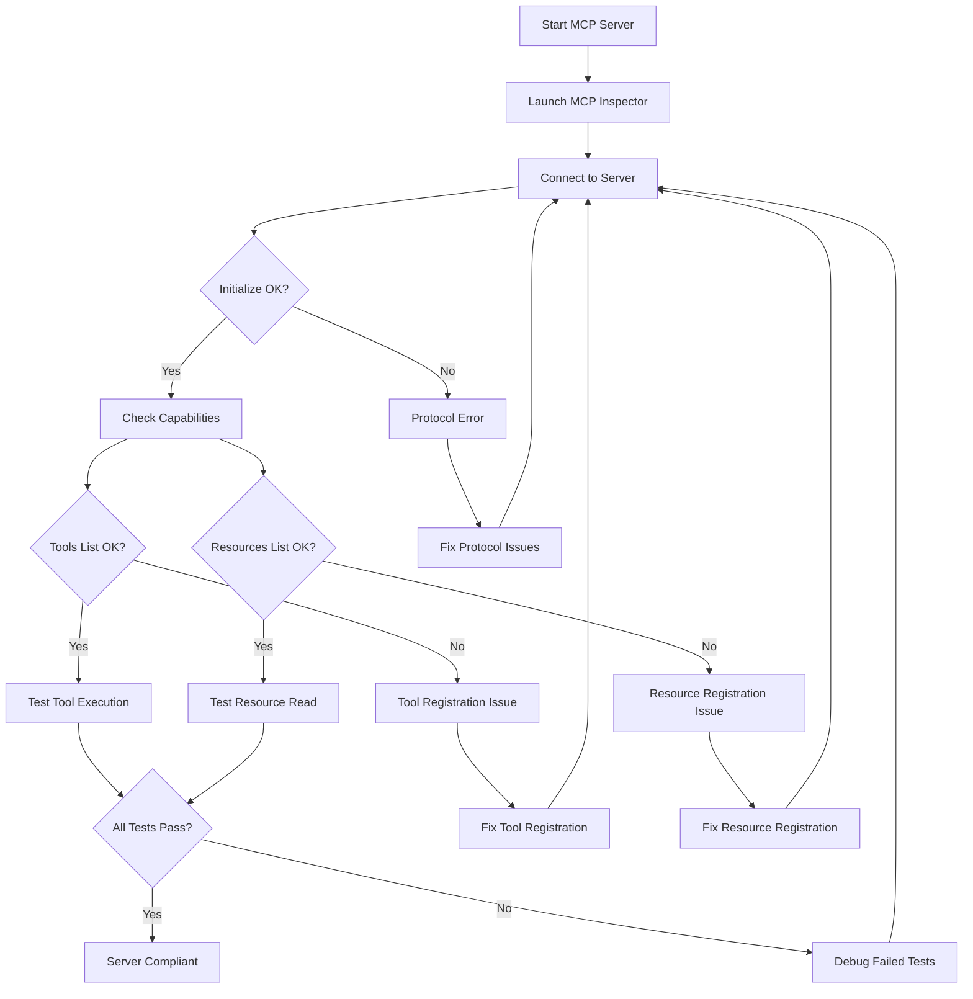
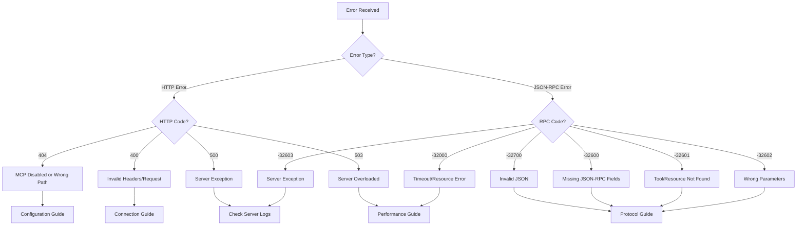

# MCP Diagnostic Tools and Error Codes

Reference guide for MCP diagnostic tools, error codes, and recovery procedures.

## Contents

1. [MCP Inspector](#mcp-inspector) - Official protocol validation tool
2. [Quick Health Check](#quick-health-check) - Server connectivity verification
3. [Performance Monitor](#performance-monitor) - Performance metrics tracking
4. [Connection Debugger](#connection-debugger) - Connection troubleshooting
5. [Common Error Codes](#common-error-codes) - Error code reference
6. [Recovery Checklist](#recovery-checklist) - Step-by-step recovery
7. [Getting Help](#getting-help) - Escalation procedures

---

## MCP Inspector

### Overview

**MCP Inspector** is the official protocol validation tool from Anthropic for testing MCP server compliance.

**Purpose**: Validate MCP server protocol compliance and simulate client connections

**When to Use**:
- ✅ curl tests pass but Claude Code won't connect
- ✅ Validating protocol compliance after changes
- ✅ Debugging tool/resource registration issues
- ✅ Verifying JSON-RPC 2.0 error responses
- ✅ Simulating client connection

### Installation

```bash
npm install -g @modelcontextprotocol/inspector
```

### Basic Usage

**Method 1 - SSE Transport (Recommended)**:

```bash
# Terminal 1: Start CycleTime
./gradlew run

# Terminal 2: Launch Inspector with SSE
npx @modelcontextprotocol/inspector sse http://localhost:8080

# Access Inspector UI at http://localhost:6274
# Connection auto-established
```

**Method 2 - Direct Connection**:

```bash
# Terminal 1: Start CycleTime
./gradlew run

# Terminal 2: Launch Inspector
npx @modelcontextprotocol/inspector

# Open http://localhost:6274
# Click "Connect" → "Direct Connection" → Enter "http://localhost:8080"
```

### Quick Validation Checklist

In Inspector UI (http://localhost:6274):

1. ✅ Initialize request succeeds
2. ✅ Tools list shows 17 tools
3. ✅ Resources list shows 4 providers
4. ✅ Tool execution returns correct structure
5. ✅ Error responses properly formatted

### Diagnostic Pattern: "curl works, Claude Code doesn't"

```bash
# Step 1: Validate with curl
curl http://localhost:8080/mcp  # ✅ Returns server info

# Step 2: Validate with Inspector
npx @modelcontextprotocol/inspector sse http://localhost:8080

# Step 3: Check Inspector results
# - ✅ Inspector connects: Protocol OK, Claude Code config issue
# - ❌ Inspector fails: Protocol violation, server issue
```

### Inspector Advantages Over curl

- Shows exact JSON-RPC protocol errors
- Validates MCP spec compliance
- Tests capability exchange
- Simulates real client connection
- Visualizes protocol flow

### Inspector Workflow



### Related Documentation

- [MCP Testing Guide](../../getting-started/mcp-testing.md#protocol-validation-with-mcp-inspector)
- [MCP Development](../../development/mcp-development.md#validating-with-mcp-inspector)

---

## Quick Health Check

Verify MCP server is running and accessible:

```bash
#!/bin/bash
# mcp-health-check.sh

echo "=== MCP Server Health Check ==="

# Check if server is running
echo -n "Server running: "
if curl -f -s http://localhost:8080/mcp > /dev/null; then
  echo "✅ YES"
else
  echo "❌ NO"
  echo "Start server with: ./gradlew run"
  exit 1
fi

# Check server info
echo -n "Server info: "
curl -s http://localhost:8080/mcp | jq -r '.name + " v" + .version'

# Check SSE connectivity
echo -n "SSE Connection: "
if timeout 2 curl -N -f http://localhost:8080/mcp/events > /dev/null 2>&1; then
  echo "✅ OK"
else
  echo "❌ FAILED"
fi

# Check tools via POST endpoint
echo "Available tools:"
curl -s -X POST http://localhost:8080/mcp \
  -H "Content-Type: application/json" \
  -d '{"jsonrpc":"2.0","id":1,"method":"tools/list","params":{}}' | \
  jq -r '.result.tools[].name' | \
  sed 's/^/  - /'

# Check resources via POST endpoint
echo "Available resources:"
curl -s -X POST http://localhost:8080/mcp \
  -H "Content-Type: application/json" \
  -d '{"jsonrpc":"2.0","id":1,"method":"resources/list","params":{}}' | \
  jq -r '.result.resources[].uri' | \
  sed 's/^/  - /'

echo "=== Health Check Complete ==="
```

**Usage**:

```bash
chmod +x mcp-health-check.sh
./mcp-health-check.sh
```

---

## Performance Monitor

Track MCP server performance metrics in real-time:

```bash
#!/bin/bash
# mcp-perf-monitor.sh

echo "=== MCP Performance Monitor ==="

# Enable metrics
export MCP_METRICS_ENABLED=true
export MCP_SLOW_REQUEST_MS=100

# Monitor requests
while true; do
  clear
  echo "=== MCP Performance Stats ==="
  echo "Time: $(date)"
  echo ""

  curl -s http://localhost:8080/mcp/stats | jq '{
    totalRequests,
    slowRequests,
    averageResponseTime,
    p95ResponseTime,
    p99ResponseTime,
    errorRate
  }'

  sleep 5
done
```

**Usage**:

```bash
chmod +x mcp-perf-monitor.sh
./mcp-perf-monitor.sh
```

**Metrics Explanation**:

| Metric | Description | Good Value |
|--------|-------------|------------|
| totalRequests | Total requests processed | N/A (informational) |
| slowRequests | Requests exceeding threshold | <5% of total |
| averageResponseTime | Average response time (ms) | <100ms |
| p95ResponseTime | 95th percentile response time | <200ms |
| p99ResponseTime | 99th percentile response time | <500ms |
| errorRate | Percentage of failed requests | <1% |

---

## Connection Debugger

Debug MCP connection issues with detailed output:

```bash
#!/bin/bash
# mcp-debug-connection.sh

echo "=== MCP Connection Debugger ==="

# Check HTTP endpoint
echo "1. Testing HTTP endpoint..."
curl -v http://localhost:8080/mcp 2>&1 | grep -E "(HTTP|connected|Server)"

echo ""
echo "2. Testing SSE endpoint..."
curl -v -N \
  -H "Accept: text/event-stream" \
  --max-time 2 \
  http://localhost:8080/mcp/events 2>&1 | grep -E "(HTTP|Content-Type)"

echo ""
echo "3. Testing JSON-RPC request via POST..."
curl -X POST http://localhost:8080/mcp \
  -H "Content-Type: application/json" \
  -d '{"jsonrpc":"2.0","id":1,"method":"tools/list","params":{}}'

echo ""
echo "=== Debug Complete ==="
```

**Usage**:

```bash
chmod +x mcp-debug-connection.sh
./mcp-debug-connection.sh
```

---

## Common Error Codes

### JSON-RPC Error Codes

| Code | Meaning | Common Causes | Solution Guide |
|------|---------|---------------|----------------|
| -32700 | Parse error | Invalid JSON syntax | [Protocol Issues](./protocol-issues.md#issue-4-invalid-json-rpc-request) |
| -32600 | Invalid Request | Missing required JSON-RPC fields | [Protocol Issues](./protocol-issues.md#issue-4-invalid-json-rpc-request) |
| -32601 | Method not found | Wrong tool/resource name | [Protocol Issues](./protocol-issues.md#issue-5-tool-not-found) |
| -32602 | Invalid params | Wrong parameter format or missing required params | [Protocol Issues](./protocol-issues.md#issue-6-resource-not-found) |
| -32603 | Internal error | Server-side exception | Check server logs |
| -32000 | Server error | Timeout, resource not found, etc. | [Performance Issues](./performance-issues.md) |

### HTTP Status Codes

| Code | Meaning | Common Causes | Solution Guide |
|------|---------|---------------|----------------|
| 404 | Not Found | Wrong path, MCP disabled, server not started | [Configuration Issues](./configuration-issues.md#issue-9-mcp-server-disabled) |
| 400 | Bad Request | Malformed SSE connection request, incorrect headers | [Connection Issues](./connection-issues.md#issue-2-sse-connection-failed) |
| 500 | Internal Server Error | Server crash, unhandled exception | Check server logs |
| 503 | Service Unavailable | Server overloaded, database down | [Performance Issues](./performance-issues.md) |

### Error Code Decision Tree



---

## Recovery Checklist

When encountering MCP issues, follow this systematic checklist:

### Basic Connectivity

- [ ] Verify server is running: `curl http://localhost:8080/mcp`
- [ ] Check SSE connection: `curl -N http://localhost:8080/mcp/events`
- [ ] Verify port availability: `lsof -i :8080`

### Protocol Validation

- [ ] Validate JSON-RPC format: Include `jsonrpc`, `id`, `method`
- [ ] List available tools via POST:
  ```bash
  curl -X POST http://localhost:8080/mcp \
    -H "Content-Type: application/json" \
    -d '{"jsonrpc":"2.0","id":1,"method":"tools/list","params":{}}'
  ```
- [ ] List available resources via POST:
  ```bash
  curl -X POST http://localhost:8080/mcp \
    -H "Content-Type: application/json" \
    -d '{"jsonrpc":"2.0","id":1,"method":"resources/list","params":{}}'
  ```

### Configuration

- [ ] Check MCP enabled: `./gradlew run | grep -i "mcp.*enabled"`
- [ ] Verify port configuration: `echo $MCP_PORT` or check application.conf
- [ ] Check environment variables: `env | grep MCP`

### Performance

- [ ] Enable metrics: `MCP_METRICS_ENABLED=true ./gradlew run`
- [ ] Check database: `DATABASE_LOGGING=true ./gradlew run`
- [ ] Monitor slow queries: `./gradlew run 2>&1 | grep -E "SQL.*[0-9]{3,} ms"`

### Diagnostics

- [ ] Check server logs: `./gradlew run 2>&1 | grep -i error`
- [ ] Run health check: `./mcp-health-check.sh`
- [ ] Test with MCP Inspector: `npx @modelcontextprotocol/inspector sse http://localhost:8080`

### Recovery Actions

- [ ] Restart server: `./gradlew --stop && ./gradlew run`
- [ ] Clear Gradle cache: `./gradlew clean`
- [ ] Check for port conflicts: `lsof -i :8080`
- [ ] Verify configuration files: `cat src/main/resources/application.conf`

---

## Getting Help

### Before Asking for Help

Gather diagnostic information to help troubleshoot:

```bash
#!/bin/bash
# mcp-diagnostic-report.sh

echo "=== MCP Diagnostic Report ==="
echo "Generated: $(date)"
echo ""

# 1. Server info
echo "=== Server Info ==="
curl -s http://localhost:8080/mcp | jq '.'
echo ""

# 2. Server logs (last 100 lines)
echo "=== Server Logs (last 100 lines) ==="
./gradlew run 2>&1 | tail -100
echo ""

# 3. System info
echo "=== System Info ==="
echo "OS: $(uname -a)"
echo "Java: $(java -version 2>&1 | head -1)"
echo "Gradle: $(./gradlew --version | grep Gradle)"
echo ""

# 4. Port status
echo "=== Port Status ==="
lsof -i :8080
echo ""

# 5. Configuration
echo "=== Environment Configuration ==="
env | grep MCP
echo ""

echo "=== Diagnostic Report Complete ==="
```

**Usage**:

```bash
chmod +x mcp-diagnostic-report.sh
./mcp-diagnostic-report.sh > diagnostic-report.txt
```

### Escalation Path

Follow this escalation path for unresolved issues:

1. **Check this troubleshooting guide**
   - [Overview](./overview.md) - Quick reference
   - Category-specific guides (Connection, Protocol, Performance, Configuration)

2. **Review server logs for errors**
   ```bash
   ./gradlew run 2>&1 | grep -i error
   ```

3. **Test with diagnostic tools**
   - MCP Inspector
   - Health check script
   - Connection debugger

4. **Search GitHub issues**
   - [CycleTime Issues](https://github.com/spiralhouse/cycletime/issues)
   - [MCP SDK Issues](https://github.com/modelcontextprotocol/kotlin-sdk/issues)

5. **Create new issue with diagnostic information**
   - Include diagnostic report
   - Provide steps to reproduce
   - Include error messages and logs
   - Specify environment (OS, Java version, etc.)

### Issue Template

When creating a GitHub issue:

```markdown
## Problem Description
[Brief description of the issue]

## Steps to Reproduce
1. [Step 1]
2. [Step 2]
3. [Step 3]

## Expected Behavior
[What you expected to happen]

## Actual Behavior
[What actually happened]

## Diagnostic Information
- CycleTime version: [version]
- OS: [OS and version]
- Java version: [java -version output]
- MCP Inspector result: [Pass/Fail with details]

## Server Logs
```
[Paste relevant server logs]
```

## Configuration
```bash
[env | grep MCP output]
```
```

---

## Diagnostic Tools Summary

| Tool | Purpose | When to Use |
|------|---------|-------------|
| **MCP Inspector** | Protocol validation | Testing protocol compliance, debugging client connection issues |
| **Health Check** | Quick server verification | Verifying server is running and accessible |
| **Performance Monitor** | Real-time metrics | Tracking response times and identifying slow requests |
| **Connection Debugger** | Connection troubleshooting | Diagnosing connection failures and SSE issues |
| **Diagnostic Report** | Comprehensive diagnostics | Preparing information for GitHub issues |

---

## Related Documentation

### Troubleshooting Guides

- [MCP Troubleshooting Overview](./overview.md) - Quick reference to all issues
- [Connection Issues](./connection-issues.md) - Connection and SSE troubleshooting
- [Protocol Issues](./protocol-issues.md) - JSON-RPC and tool/resource errors
- [Performance Issues](./performance-issues.md) - Slow responses and timeouts
- [Configuration Issues](./configuration-issues.md) - MCP configuration problems

### Development Resources

- [MCP Development Guide](../../development/mcp-development.md) - Development workflows
- [MCP Testing Guide](../../getting-started/mcp-testing.md) - Testing MCP servers
- [MCP Architecture](../../../architecture/overview.md#mcp-server-integration) - System architecture

### External Resources

- [MCP Protocol Specification](https://modelcontextprotocol.io/) - Official MCP protocol
- [MCP Inspector Documentation](https://github.com/modelcontextprotocol/inspector) - Inspector tool docs
- [JSON-RPC 2.0 Specification](https://www.jsonrpc.org/specification) - Protocol reference
