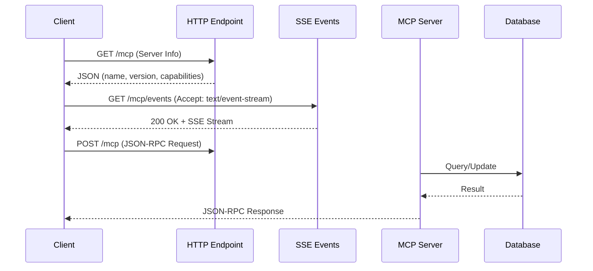

# MCP Troubleshooting Overview

Comprehensive troubleshooting reference for Model Context Protocol (MCP) server and client issues in CycleTime.

## Overview

This guide addresses the top 10 common MCP issues encountered during development and deployment. Each issue includes symptoms, root causes, concrete solutions, and prevention tips.

## Quick Reference

| Issue | Problem | Category | Guide |
|-------|---------|----------|-------|
| #1 | Connection Refused | Connection | [Connection Issues](./connection-issues.md#issue-1-connection-refused) |
| #2 | SSE Connection Failed | Connection | [Connection Issues](./connection-issues.md#issue-2-sse-connection-failed) |
| #3 | Connection Timeout | Connection | [Connection Issues](./connection-issues.md#issue-3-connection-timeout) |
| #4 | Invalid JSON-RPC Request | Protocol | [Protocol Issues](./protocol-issues.md#issue-4-invalid-json-rpc) |
| #5 | Tool Not Found | Protocol | [Protocol Issues](./protocol-issues.md#issue-5-tool-not-found) |
| #6 | Resource Not Found | Protocol | [Protocol Issues](./protocol-issues.md#issue-6-resource-not-found) |
| #7 | Slow Response Times | Performance | [Performance Issues](./performance-issues.md#issue-7-slow-response-times) |
| #8 | Request Timeout | Performance | [Performance Issues](./performance-issues.md#issue-8-request-timeout) |
| #9 | MCP Server Disabled | Configuration | [Configuration Issues](./configuration-issues.md#issue-9-mcp-disabled) |
| #10 | Port Already in Use | Configuration | [Configuration Issues](./configuration-issues.md#issue-10-port-conflict) |

## Troubleshooting by Category

### Connection Issues
Problems establishing or maintaining connections to the MCP server.
- [Connection Troubleshooting Guide](./connection-issues.md)
- Covers: Connection refused, SSE failures, timeouts

### Protocol Issues
JSON-RPC protocol errors and tool/resource discovery problems.
- [Protocol Troubleshooting Guide](./protocol-issues.md)
- Covers: Invalid requests, tool not found, resource not found

### Performance Issues
Slow responses and timeout problems.
- [Performance Troubleshooting Guide](./performance-issues.md)
- Covers: Slow response times, request timeouts, optimization

### Configuration Issues
Server configuration and port binding problems.
- [Configuration Troubleshooting Guide](./configuration-issues.md)
- Covers: MCP disabled, port conflicts, environment settings

## MCP Architecture Context

Understanding the request flow helps diagnose issues:



## Configuration Defaults

Understanding default configuration helps diagnose issues quickly:

**Connection Settings** (MCPConfiguration.kt):
- Host: `0.0.0.0` (all interfaces)
- Port: `8080`
- SSE Path: `/mcp/events`
- POST Path: `/mcp`
- Enabled: `true`

**SSE Settings**:
- Timeout: `15000ms` (15 seconds)
- Keep-alive interval: `30000ms` (30 seconds)

**Performance Settings**:
- Request timeout: `60000ms` (60 seconds)
- Slow request threshold: `100ms`
- Metrics enabled: `true` (by default)

**Environment Variables**:
```bash
MCP_ENABLED=true          # Enable/disable MCP server
MCP_HOST=0.0.0.0          # Bind address
MCP_PORT=8080             # Server port
MCP_SSE_PATH=/mcp/events  # SSE endpoint path
MCP_POST_PATH=/mcp        # POST endpoint path
MCP_TIMEOUT=15000         # Connection timeout (ms)
MCP_REQUEST_TIMEOUT=60000 # Request timeout (ms)
MCP_SLOW_REQUEST_MS=100   # Slow request threshold
MCP_METRICS_ENABLED=true  # Enable metrics (default: true)
DATABASE_LOGGING=false    # Enable SQL logging
```

## Additional Resources

- **[Diagnostic Tools](./diagnostics-tools.md)** - MCP Inspector, health checks, log analysis
- **[Common Error Codes](./error-codes.md)** - JSON-RPC error code reference
- **[Recovery Checklist](./recovery-checklist.md)** - Step-by-step recovery procedures

## Getting Help

If you encounter issues not covered in this guide:

1. Check the [MCP Development Guide](../../development/mcp-development.md)
2. Review [MCP Architecture](../../../architecture/overview.md#mcp-server-integration)
3. Search [GitHub Issues](https://github.com/spiralhouse/cycletime/issues)
4. Ask in the development team channel

## Related Documentation

- [MCP Development Guide](../../development/mcp-development.md) - Development workflows
- [MCP Testing Guide](../../../testing/mcp-testing.md) - Testing MCP servers and clients
- [Architecture Overview](../../../architecture/overview.md) - System architecture
