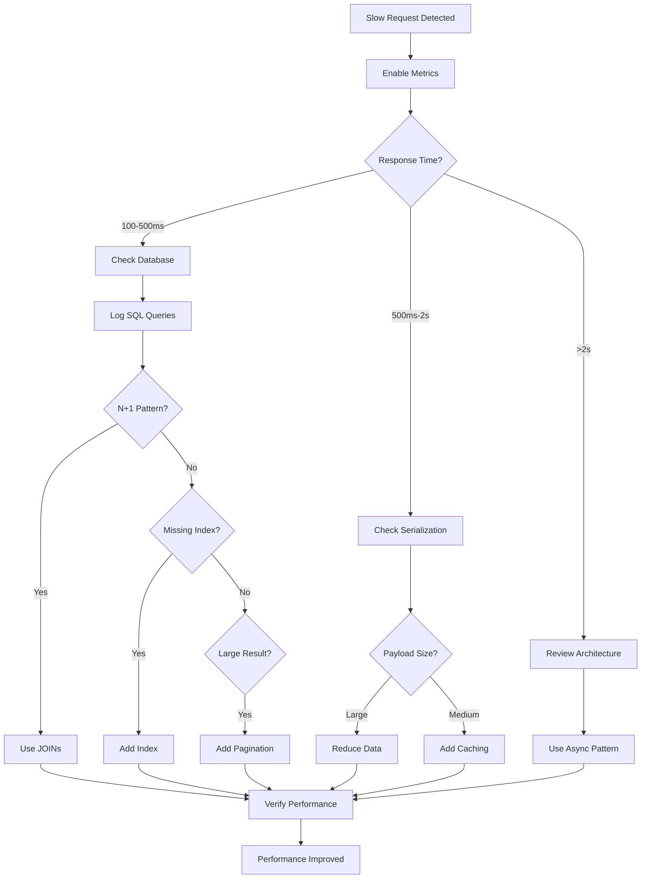
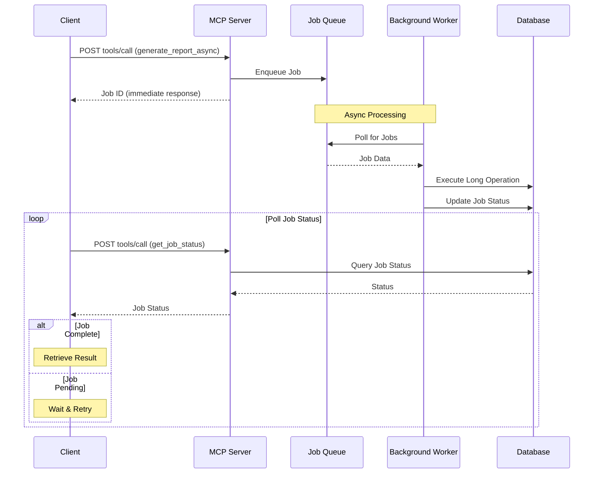

# MCP Performance Troubleshooting

Solutions for slow response times and request timeout issues.

## Issue Categories

This guide covers two performance-related issues:
1. [Slow Response Times](#issue-7-slow-response-times) - Requests complete but take too long
2. [Request Timeout](#issue-8-request-timeout) - Requests timeout before completion

---

## Issue 7: Slow Response Times

### Symptoms

```bash
# Request takes >1 second to respond
> {"jsonrpc":"2.0","id":1,"method":"tools/call","params":{"name":"list_projects"}}

# Long delay...

< {
    "jsonrpc": "2.0",
    "result": {...},
    "id": 1
  }
```

**Observable Behavior**:
- Requests complete but take longer than expected
- Response times >100ms (slow request threshold)
- Progressive slowdown over time
- Some requests fast, others slow

### Root Causes

1. **Database query performance**
   - Missing database indices
   - N+1 query problems
   - Large dataset without pagination
   - Inefficient JOIN operations

2. **Excessive data serialization**
   - Large response payloads
   - Nested object graphs
   - No result limiting

3. **Resource contention**
   - Connection pool exhaustion
   - Thread pool saturation
   - Memory pressure
   - Disk I/O bottlenecks

4. **Network latency**
   - Large message sizes exceeding frame size
   - Network congestion
   - DNS resolution delays

### Step-by-Step Solutions

**Solution 1: Enable performance monitoring**

```bash
# Start server with metrics enabled
MCP_METRICS_ENABLED=true MCP_SLOW_REQUEST_MS=100 ./gradlew run

# Check metrics endpoint
curl http://localhost:8080/mcp/stats

# Expected response:
# {
#   "totalRequests": 1523,
#   "slowRequests": 42,
#   "averageResponseTime": 87,
#   "p95ResponseTime": 234,
#   "p99ResponseTime": 456
# }
```

**Solution 2: Enable database query logging**

```bash
# Start server with SQL logging
DATABASE_LOGGING=true ./gradlew run

# Monitor slow queries in logs
./gradlew run 2>&1 | grep -E "SQL.*[0-9]{3,} ms"

# Look for:
# - Queries taking >100ms
# - N+1 query patterns (same query repeated)
# - Missing indices (table scans)
# - Large result sets
```

**Solution 3: Optimize database queries**

```kotlin
// ❌ SLOW - N+1 query problem
fun getAllProjectsWithIssues(): List<ProjectWithIssues> {
  return transaction {
    Project.all().map { project ->
      ProjectWithIssues(
        project = project,
        issues = Issue.find { Issues.projectId eq project.id }.toList()  // N queries!
      )
    }
  }
}

// ✅ FAST - Single query with JOIN
fun getAllProjectsWithIssues(): List<ProjectWithIssues> {
  return transaction {
    (Projects innerJoin Issues)
      .selectAll()
      .groupBy { it[Projects.id] }
      .map { (projectId, rows) ->
        ProjectWithIssues(
          project = rows.first().toProject(),
          issues = rows.map { it.toIssue() }
        )
      }
  }
}
```

**Solution 4: Implement result pagination**

```bash
# Add pagination to list endpoints
> {
    "jsonrpc":"2.0",
    "id":1,
    "method":"tools/call",
    "params":{
      "name":"list_projects",
      "arguments":{
        "limit": 50,
        "offset": 0
      }
    }
  }

# Smaller result set = faster response
```

**Solution 5: Enable caching**

```bash
# Start server with caching enabled
MCP_CACHE_ENABLED=true MCP_CACHE_TTL=300 ./gradlew run

# Monitor cache hit rate
curl http://localhost:8080/mcp/stats | jq '.cacheHitRate'
```

**Solution 6: Enable async processing**

```bash
# Start server with async enabled
MCP_ASYNC_ENABLED=true ./gradlew run

# Long-running operations processed asynchronously
# Client receives immediate acknowledgment
# Result delivered via callback or polling
```

### Prevention Tips

- **Performance budgets**: Set response time targets
  ```bash
  # Fail build if response times exceed budget
  MCP_SLOW_REQUEST_MS=100 ./gradlew test
  ```

- **Database indexing**: Index all foreign keys and query columns
  ```kotlin
  object Projects : Table() {
    val id = varchar("id", 50)
    val name = varchar("name", 255)
    val ownerId = varchar("owner_id", 50).index()  // Index FK

    override val primaryKey = PrimaryKey(id)
  }
  ```

- **Query result limits**: Always limit result sets
  ```kotlin
  fun listProjects(limit: Int = 50, offset: Int = 0): List<Project> {
    return transaction {
      Project.all()
        .limit(limit, offset.toLong())
        .toList()
    }
  }
  ```

- **Load testing**: Test with realistic data volumes
  ```bash
  # Use k6 or similar tool
  k6 run --vus 10 --duration 30s load-test.js
  ```

- **Performance monitoring**: Track metrics in production
  ```bash
  # Enable metrics in production
  MCP_METRICS_ENABLED=true
  MCP_SLOW_REQUEST_MS=100
  ```

### Performance Optimization Flow



### Related Configuration

- `MCPConfiguration.kt:42-43` - Slow request threshold
- `MCPConfiguration.kt:34` - Request timeout
- Environment: `MCP_METRICS_ENABLED`, `MCP_SLOW_REQUEST_MS`, `DATABASE_LOGGING`

---

## Issue 8: Request Timeout

### Symptoms

```bash
> {"jsonrpc":"2.0","id":1,"method":"tools/call","params":{"name":"generate_large_report"}}

# Wait 60+ seconds...

< {
    "jsonrpc": "2.0",
    "error": {
      "code": -32000,
      "message": "Request timeout after 60000ms"
    },
    "id": 1
  }
```

**Observable Behavior**:
- Requests timeout after 60 seconds (default)
- Long-running operations fail to complete
- Connection closes after timeout
- Client receives timeout error

### Root Causes

1. **Long-running operations**
   - Complex data processing
   - Large report generation
   - Batch operations
   - External API calls

2. **Timeout configuration too short**
   - Default 60s insufficient
   - Operations legitimately take longer
   - No async processing option

3. **Inefficient implementation**
   - Synchronous blocking operations
   - No streaming or chunking
   - Resource-intensive calculations

### Step-by-Step Solutions

**Solution 1: Increase request timeout**

```bash
# Start server with longer timeout
MCP_REQUEST_TIMEOUT=120000 ./gradlew run  # 2 minutes

# Verify configuration loaded
# Look for: "MCP request timeout: 120000ms"

# For very long operations
MCP_REQUEST_TIMEOUT=300000 ./gradlew run  # 5 minutes
```

**Solution 2: Optimize operation performance**

```kotlin
// ❌ SLOW - Sequential processing
fun processAllProjects(): Result {
  return transaction {
    Project.all().forEach { project ->
      processProject(project)  // Slow!
    }
  }
}

// ✅ FAST - Batch processing with progress
suspend fun processAllProjects(): Result = coroutineScope {
  transaction {
    Project.all()
      .chunked(100)  // Process in batches
      .map { batch ->
        async {
          batch.forEach { project ->
            processProject(project)
          }
        }
      }
      .awaitAll()
  }
}
```

**Solution 3: Implement streaming responses**

```bash
# Use server-sent events for long operations
> {
    "jsonrpc":"2.0",
    "id":1,
    "method":"tools/call",
    "params":{
      "name":"generate_report_stream",
      "arguments":{"format":"pdf"}
    }
  }

# Server sends progress updates
< {"jsonrpc":"2.0","method":"progress","params":{"percent":25}}
< {"jsonrpc":"2.0","method":"progress","params":{"percent":50}}
< {"jsonrpc":"2.0","method":"progress","params":{"percent":75}}
< {"jsonrpc":"2.0","result":{"url":"..."},"id":1}
```

**Solution 4: Use async job pattern**

```bash
# Start async job
> {
    "jsonrpc":"2.0",
    "id":1,
    "method":"tools/call",
    "params":{
      "name":"generate_report_async",
      "arguments":{"format":"pdf"}
    }
  }

# Immediate response with job ID
< {
    "jsonrpc":"2.0",
    "result":{
      "jobId":"job_abc123",
      "status":"pending"
    },
    "id":1
  }

# Poll for status
> {
    "jsonrpc":"2.0",
    "id":2,
    "method":"tools/call",
    "params":{
      "name":"get_job_status",
      "arguments":{"jobId":"job_abc123"}
    }
  }

# Eventually complete
< {
    "jsonrpc":"2.0",
    "result":{
      "jobId":"job_abc123",
      "status":"complete",
      "result":{"url":"..."}
    },
    "id":2
  }
```

**Solution 5: Monitor slow queries**

```bash
# Enable query logging
DATABASE_LOGGING=true MCP_REQUEST_TIMEOUT=120000 ./gradlew run

# Monitor for queries exceeding threshold
./gradlew run 2>&1 | grep -E "SQL.*[5-9][0-9]{3,} ms"

# Optimize identified slow queries
```

### Prevention Tips

- **Design for async**: Long operations should be async by default
  ```kotlin
  interface ReportService {
    // ✅ Returns job ID immediately
    suspend fun generateReportAsync(format: String): JobId

    // ❌ Blocks until complete
    // suspend fun generateReport(format: String): Report
  }
  ```

- **Timeout documentation**: Document expected response times
  ```markdown
  # API Response Times

  Fast operations (<100ms):
  - get_project, list_projects, create_issue

  Medium operations (100ms-1s):
  - update_project, list_issues, create_workflow

  Long operations (>1s, use async):
  - generate_report, export_data, batch_update
  ```

- **Client timeout matching**: Client timeout > server timeout
  ```kotlin
  // Server timeout: 60s
  // Client timeout: 65s (5s buffer)
  val client = HttpClient(CIO) {
      engine {
          requestTimeout = 65_000  // 5s buffer over server timeout
      }
  }
  ```

- **Progress feedback**: Provide progress updates for long operations
  ```kotlin
  // Progress reporting for long operations
  import kotlinx.coroutines.delay

  suspend fun longOperation(onProgress: (Int) -> Unit) {
      for (i in 1..100) {
          processChunk(i)
          onProgress(i)
          delay(100)
      }
  }

  // Usage
  longOperation { progress ->
      println("Progress: $progress%")
  }
  ```

### Async Job Pattern Architecture



### Related Configuration

- `MCPConfiguration.kt:34` - Request timeout
- Environment: `MCP_REQUEST_TIMEOUT`, `DATABASE_LOGGING`

---

## Performance Benchmarking

### Quick Performance Test

```bash
#!/bin/bash
# mcp-perf-test.sh

echo "=== MCP Performance Benchmark ==="

# Test tools/list (should be <50ms)
echo -n "tools/list: "
START=$(date +%s%N)
curl -s -X POST http://localhost:8080/mcp \
  -H "Content-Type: application/json" \
  -d '{"jsonrpc":"2.0","id":1,"method":"tools/list","params":{}}' > /dev/null
END=$(date +%s%N)
ELAPSED=$(( (END - START) / 1000000 ))
echo "${ELAPSED}ms"

# Test resources/list (should be <50ms)
echo -n "resources/list: "
START=$(date +%s%N)
curl -s -X POST http://localhost:8080/mcp \
  -H "Content-Type: application/json" \
  -d '{"jsonrpc":"2.0","id":1,"method":"resources/list","params":{}}' > /dev/null
END=$(date +%s%N)
ELAPSED=$(( (END - START) / 1000000 ))
echo "${ELAPSED}ms"

# Test list_projects (should be <100ms)
echo -n "list_projects: "
START=$(date +%s%N)
curl -s -X POST http://localhost:8080/mcp \
  -H "Content-Type: application/json" \
  -d '{"jsonrpc":"2.0","id":1,"method":"tools/call","params":{"name":"list_projects","arguments":{}}}' > /dev/null
END=$(date +%s%N)
ELAPSED=$(( (END - START) / 1000000 ))
echo "${ELAPSED}ms"

echo "=== Benchmark Complete ==="
```

### Performance Targets

| Operation Category | Target Response Time | Example Operations |
|-------------------|---------------------|-------------------|
| Protocol Operations | <50ms | tools/list, resources/list |
| Read Operations | <100ms | get_project, list_projects |
| Write Operations | <200ms | create_project, update_issue |
| Complex Operations | <500ms | search, complex queries |
| Long Operations | Use async | reports, exports, batch updates |

## Related Guides

- [MCP Troubleshooting Overview](./overview.md) - Quick reference to all issues
- [Connection Troubleshooting](./connection-issues.md) - Connection and SSE issues
- [Protocol Validation](./protocol-validation-issues.md) - JSON-RPC format and validation errors
- [Protocol Discovery](./protocol-discovery-issues.md) - Tool and resource discovery errors
- [Configuration Troubleshooting](./configuration-issues.md) - MCP configuration issues

## See Also

- [MCP Development Guide](../../development/mcp-development.md) - Development workflows
- [MCP Architecture](../../../architecture/overview.md#mcp-server-integration) - System architecture
- [Database Optimization](../../../development/database-optimization.md) - Database performance tuning
