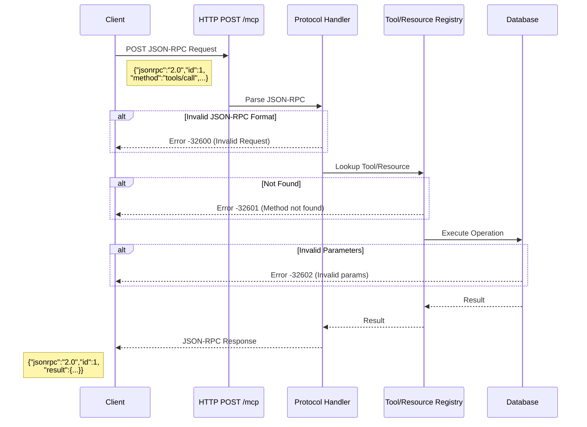

# MCP Protocol Troubleshooting

Solutions for JSON-RPC protocol errors and tool/resource discovery problems.

## Issue Categories

This guide covers three protocol-related issues:
1. [Invalid JSON-RPC Request](#issue-4-invalid-json-rpc-request) - Protocol format errors
2. [Tool Not Found](#issue-5-tool-not-found) - Tool discovery and naming issues
3. [Resource Not Found](#issue-6-resource-not-found) - Resource URI and discovery issues

---

## Issue 4: Invalid JSON-RPC Request

### Symptoms

```bash
# Send malformed request
> {"method": "tools/list"}

# Response
< {
    "jsonrpc": "2.0",
    "error": {
      "code": -32600,
      "message": "Invalid Request"
    },
    "id": null
  }
```

**Observable Behavior**:
- Server returns JSON-RPC error response
- Error code `-32600` (Invalid Request)
- Request not processed
- Connection remains open

### Root Causes

1. **Missing required JSON-RPC fields**
   - Missing `"jsonrpc": "2.0"` field
   - Missing `id` field
   - Missing `method` field

2. **Wrong protocol version**
   - Using JSON-RPC 1.0 format
   - Incorrect version string

3. **Malformed JSON**
   - Syntax errors in JSON
   - Invalid character encoding
   - Truncated messages

4. **Wrong parameter format**
   - Parameters not in object format
   - Missing required parameters
   - Wrong parameter types

### Step-by-Step Solutions

**Solution 1: Use correct JSON-RPC 2.0 format**

```bash
# ✅ CORRECT - Complete JSON-RPC 2.0 request
{
  "jsonrpc": "2.0",
  "id": 1,
  "method": "tools/list",
  "params": {}
}

# ❌ WRONG - Missing jsonrpc field
{
  "id": 1,
  "method": "tools/list"
}

# ❌ WRONG - Wrong version
{
  "jsonrpc": "1.0",
  "id": 1,
  "method": "tools/list"
}

# ❌ WRONG - Missing id
{
  "jsonrpc": "2.0",
  "method": "tools/list"
}
```

**Solution 2: Validate JSON before sending**

```kotlin
// Client-side validation with Ktor and kotlinx.serialization
import kotlinx.serialization.*
import kotlinx.serialization.json.*

@Serializable
data class JsonRpcRequest(
    val jsonrpc: String = "2.0",
    val id: Int,
    val method: String,
    val params: JsonObject = JsonObject(emptyMap())
)

fun createJsonRpcRequest(method: String, params: JsonObject = JsonObject(emptyMap()), id: Int = 1): String {
    require(method.isNotBlank()) { "Method is required" }

    val request = JsonRpcRequest(
        id = id,
        method = method,
        params = params
    )

    return Json.encodeToString(request)
}

// Usage with HTTP POST (client-to-server)
suspend fun HttpClient.sendJsonRpcRequest(
    url: String,
    method: String,
    params: JsonObject = JsonObject(emptyMap())
): HttpResponse {
    val request = createJsonRpcRequest(method, params)
    return this.post(url) {
        header("Content-Type", "application/json")
        setBody(request)
    }
}
```

**Solution 3: Test with known-good requests**

```bash
# Terminal 1: Open SSE stream to receive responses
curl -N http://localhost:8080/mcp/events

# Terminal 2: Send JSON-RPC requests via POST

# Test tools/list
curl -X POST http://localhost:8080/mcp \
  -H "Content-Type: application/json" \
  -d '{"jsonrpc":"2.0","id":1,"method":"tools/list","params":{}}'

# Test resources/list
curl -X POST http://localhost:8080/mcp \
  -H "Content-Type: application/json" \
  -d '{"jsonrpc":"2.0","id":2,"method":"resources/list","params":{}}'

# Test tool call
curl -X POST http://localhost:8080/mcp \
  -H "Content-Type: application/json" \
  -d '{
    "jsonrpc":"2.0",
    "id":3,
    "method":"tools/call",
    "params":{
      "name":"create_project",
      "arguments":{"name":"Test Project","description":"Test"}
    }
  }'
```

**Solution 4: Handle JSON parsing errors**

```kotlin
// Client error handling with HTTP POST responses
import io.ktor.client.*
import io.ktor.client.request.*
import io.ktor.client.statement.*
import kotlinx.serialization.*
import kotlinx.serialization.json.*

@Serializable
data class JsonRpcError(
    val code: Int,
    val message: String
)

@Serializable
data class JsonRpcResponse(
    val jsonrpc: String,
    val id: Int? = null,
    val result: JsonElement? = null,
    val error: JsonRpcError? = null
)

suspend fun sendAndHandleJsonRpcRequest(
    client: HttpClient,
    url: String,
    requestBody: String
) {
    try {
        val response: HttpResponse = client.post(url) {
            header("Content-Type", "application/json")
            setBody(requestBody)
        }

        val responseText = response.bodyAsText()
        val jsonRpcResponse = Json.decodeFromString<JsonRpcResponse>(responseText)

        if (jsonRpcResponse.error != null) {
            println("JSON-RPC Error: ${jsonRpcResponse.error}")
            // Handle specific error codes
            when (jsonRpcResponse.error.code) {
                -32600 -> println("Invalid Request - check JSON-RPC format")
                -32601 -> println("Method not found")
                -32602 -> println("Invalid params")
            }
        } else {
            println("Success: ${jsonRpcResponse.result}")
        }
    } catch (e: SerializationException) {
        println("Failed to parse response: ${e.message}")
    }
}
```

### Prevention Tips

- **Use JSON-RPC client libraries**: Avoid manual formatting
  ```kotlin
  // Create a reusable JSON-RPC client with Ktor HTTP
  import io.ktor.client.*
  import io.ktor.client.request.*
  import io.ktor.client.statement.*
  import kotlinx.serialization.json.*

  class JsonRpcClient(private val postUrl: String) {
      private val client = HttpClient(CIO)

      suspend fun call(method: String, params: JsonObject = JsonObject(emptyMap())): JsonElement? {
          val request = createJsonRpcRequest(method, params, id = 1)

          val response: HttpResponse = client.post(postUrl) {
              header("Content-Type", "application/json")
              setBody(request)
          }

          val responseText = response.bodyAsText()
          val jsonRpcResponse = Json.decodeFromString<JsonRpcResponse>(responseText)
          return jsonRpcResponse.result
      }
  }

  // Usage
  val client = JsonRpcClient("http://localhost:8080/mcp")
  client.call("tools/list")
  ```

- **Schema validation**: Validate requests against JSON-RPC schema
  ```kotlin
  import kotlinx.serialization.json.*
  // Using kotlinx.serialization for compile-time validation
  @Serializable
  data class JsonRpcRequest(
      val jsonrpc: String = "2.0",
      val id: Int,
      val method: String,
      val params: JsonObject = JsonObject(emptyMap())
  ) {
      init {
          require(jsonrpc == "2.0") { "Invalid JSON-RPC version: $jsonrpc" }
          require(method.isNotBlank()) { "Method is required" }
      }
  }

  fun validateRequest(request: JsonRpcRequest): Result<Unit> = runCatching {
      require(request.jsonrpc == "2.0") { "Invalid JSON-RPC version" }
      require(request.method.isNotBlank()) { "Method is required" }
  }
  ```

- **Request logging**: Log all requests for debugging
  ```kotlin
  // Log HTTP POST messages
  suspend fun HttpClient.postWithLogging(url: String, body: String): HttpResponse {
      val formatted = Json.parseToJsonElement(body).toString()
      println("[SEND] $formatted")
      return this.post(url) {
          header("Content-Type", "application/json")
          setBody(body)
      }
  }
  ```

- **Error response handling**: Always handle error responses
  ```kotlin
  // Extension function for response handling
  fun JsonRpcResponse.resultOrThrow(): JsonElement {
      error?.let { err ->
          throw Exception("JSON-RPC Error ${err.code}: ${err.message}")
      }
      return result ?: throw Exception("No result in response")
  }
  ```

### Related Configuration

- `mcp/protocol/` - JSON-RPC protocol handlers
- `mcp/tools/` - Tool implementations
- No environment configuration required

---

## Issue 5: Tool Not Found

### Symptoms

```bash
> {"jsonrpc":"2.0","id":1,"method":"tools/call","params":{"name":"createProject"}}

< {
    "jsonrpc": "2.0",
    "error": {
      "code": -32601,
      "message": "Tool not found: createProject"
    },
    "id": 1
  }
```

**Observable Behavior**:
- Server returns `-32601` error code (Method/Tool not found)
- Tool call fails but connection remains open
- Available tools not matching requested name

### Root Causes

1. **Tool name mismatch**
   - Using camelCase instead of snake_case
   - Typos in tool name
   - Wrong naming convention

2. **Tool not registered**
   - Tool provider not initialized
   - Configuration missing tool registration
   - Development-only tool not available

3. **Wrong tool method**
   - Using `tools/call` instead of correct method
   - Method name not properly formatted

### Step-by-Step Solutions

**Solution 1: List available tools**

```bash
# Terminal 1: Open SSE stream to receive responses
curl -N http://localhost:8080/mcp/events

# Terminal 2: Send tools/list request via POST
curl -X POST http://localhost:8080/mcp \
  -H "Content-Type: application/json" \
  -d '{"jsonrpc":"2.0","id":1,"method":"tools/list","params":{}}'

# Response shows available tools (received in Terminal 1 via SSE)
{
    "jsonrpc": "2.0",
    "result": {
      "tools": [
        {
          "name": "create_project",
          "description": "Create a new project",
          "inputSchema": {...}
        },
        {
          "name": "get_project",
          "description": "Get project by ID",
          "inputSchema": {...}
        },
        {
          "name": "list_projects",
          "description": "List all projects",
          "inputSchema": {...}
        },
        {
          "name": "update_project",
          "description": "Update project",
          "inputSchema": {...}
        }
      ]
    },
    "id": 1
  }
```

**Solution 2: Use correct tool names**

```bash
# ✅ CORRECT - snake_case naming
curl -X POST http://localhost:8080/mcp \
  -H "Content-Type: application/json" \
  -d '{"jsonrpc":"2.0","id":2,"method":"tools/call","params":{"name":"create_project","arguments":{"name":"Test"}}}'

# ❌ WRONG - camelCase naming
curl -X POST http://localhost:8080/mcp \
  -H "Content-Type: application/json" \
  -d '{"jsonrpc":"2.0","id":2,"method":"tools/call","params":{"name":"createProject","arguments":{"name":"Test"}}}'

# ❌ WRONG - kebab-case naming
curl -X POST http://localhost:8080/mcp \
  -H "Content-Type: application/json" \
  -d '{"jsonrpc":"2.0","id":2,"method":"tools/call","params":{"name":"create-project","arguments":{"name":"Test"}}}'
```

**Solution 3: Verify tool provider configuration**

```bash
# Check application logs for tool registration
./gradlew run | grep -i "tool"

# Expected output:
# Registering tool provider: DefaultProjectToolProvider
# Registered 4 tools: create_project, get_project, list_projects, update_project

# If tools not registered, check configuration
cat src/main/kotlin/io/spiralhouse/cycletime/mcp/MCPModule.kt
```

**Solution 4: Test tool with correct parameters**

```bash
# Get tool schema first via POST
curl -X POST http://localhost:8080/mcp \
  -H "Content-Type: application/json" \
  -d '{"jsonrpc":"2.0","id":1,"method":"tools/list","params":{}}'

# Check inputSchema for required parameters in SSE response
# Then call with correct parameters

curl -X POST http://localhost:8080/mcp \
  -H "Content-Type: application/json" \
  -d '{
    "jsonrpc":"2.0",
    "id":2,
    "method":"tools/call",
    "params":{
      "name":"create_project",
      "arguments":{
        "name":"My Project",
        "description":"Test project",
        "startDate":"2024-01-01"
      }
    }
  }'
```

### Prevention Tips

- **Document tool naming conventions**: Use snake_case consistently
  ```
  Tool Naming: snake_case (create_project, list_issues)
  Method Naming: namespace/action (tools/call, resources/read)
  ```

- **Tool discovery on connect**: List tools after connection
  ```kotlin
  import kotlinx.serialization.json.*
  import io.ktor.client.*
  import io.ktor.client.request.*
  import io.ktor.client.statement.*

  // Discover available tools
  @Serializable
  data class ToolInfo(val name: String, val description: String)

  @Serializable
  data class ToolsResult(val tools: List<ToolInfo>)

  suspend fun discoverTools(client: HttpClient, postUrl: String): List<String> {
      val request = createJsonRpcRequest("tools/list", JsonObject(emptyMap()), id = 1)

      val httpResponse: HttpResponse = client.post(postUrl) {
          header("Content-Type", "application/json")
          setBody(request)
      }

      val responseText = httpResponse.bodyAsText()
      val response = Json.decodeFromString<JsonRpcResponse>(responseText)
      val toolsResult = Json.decodeFromJsonElement<ToolsResult>(response.resultOrThrow())

      val toolNames = toolsResult.tools.map { it.name }
      println("Available tools: $toolNames")
      return toolNames
  }
  ```

- **Client-side tool validation**: Check tool exists before calling
  ```kotlin
  // Tool validation before calling
  import kotlinx.serialization.json.*
  import io.ktor.client.*
  import io.ktor.client.request.*
  import io.ktor.client.statement.*

  class ValidatedToolClient(private val client: HttpClient, private val postUrl: String) {
      private lateinit var availableTools: List<String>

      suspend fun initialize() {
          availableTools = discoverTools(client, postUrl)
      }

      suspend fun callTool(name: String, arguments: JsonObject): JsonElement {
          require(name in availableTools) {
              "Tool not found: $name. Available: ${availableTools.joinToString()}"
          }

          val params = buildJsonObject {
              put("name", name)
              put("arguments", arguments)
          }
          val request = createJsonRpcRequest("tools/call", params, id = 1)

          val httpResponse: HttpResponse = client.post(postUrl) {
              header("Content-Type", "application/json")
              setBody(request)
          }

          val responseText = httpResponse.bodyAsText()
          val response = Json.decodeFromString<JsonRpcResponse>(responseText)
          return response.resultOrThrow()
      }
  }
  ```

- **Generate tool clients**: Create type-safe tool wrappers
  ```kotlin
  // Type-safe tool client interface
  @Serializable
  data class CreateProjectArgs(val name: String, val description: String)

  @Serializable
  data class GetProjectArgs(val id: String)

  @Serializable
  data class Project(val id: String, val name: String, val description: String)

  interface ProjectTools {
      suspend fun createProject(args: CreateProjectArgs): Project
      suspend fun getProject(args: GetProjectArgs): Project
      suspend fun listProjects(): List<Project>
      suspend fun updateProject(id: String, args: CreateProjectArgs): Project
  }
  ```

### Related Configuration

- `DefaultProjectToolProvider.kt` - Project tool definitions
- `ToolRegistry.kt` - Tool registration logic
- No environment configuration required

---

## Issue 6: Resource Not Found

### Symptoms

```bash
> {"jsonrpc":"2.0","id":1,"method":"resources/read","params":{"uri":"cycletime://project/123"}}

< {
    "jsonrpc": "2.0",
    "error": {
      "code": -32602,
      "message": "Resource not found: cycletime://project/123"
    },
    "id": 1
  }
```

**Observable Behavior**:
- Server returns `-32602` error code (Invalid params)
- Resource URI not recognized
- Resource exists but URI format incorrect

### Root Causes

1. **Invalid URI format**
   - Wrong protocol (http:// instead of cycletime://)
   - Incorrect path structure
   - Trailing slashes on ID resources
   - Missing required path segments

2. **Resource doesn't exist**
   - Referencing non-existent resource ID
   - Resource deleted or not yet created
   - Wrong resource type

3. **Resource provider not registered**
   - Provider initialization failed
   - Configuration missing provider
   - Development-only resource

### Step-by-Step Solutions

**Solution 1: List available resources**

```bash
# Terminal 1: Open SSE stream to receive responses
curl -N http://localhost:8080/mcp/events

# Terminal 2: Send resources/list request via POST
curl -X POST http://localhost:8080/mcp \
  -H "Content-Type: application/json" \
  -d '{"jsonrpc":"2.0","id":1,"method":"resources/list","params":{}}'

# Response shows available resource templates (received in Terminal 1 via SSE)
{
    "jsonrpc": "2.0",
    "result": {
      "resources": [
        {
          "uri": "cycletime://projects",
          "name": "Project List",
          "description": "List of all projects",
          "mimeType": "application/json"
        },
        {
          "uri": "cycletime://projects/{id}",
          "name": "Project",
          "description": "Individual project details",
          "mimeType": "application/json"
        },
        {
          "uri": "cycletime://issues",
          "name": "Issue List",
          "description": "List of all issues",
          "mimeType": "application/json"
        },
        {
          "uri": "cycletime://sessions/active",
          "name": "Active Session",
          "description": "Current active session",
          "mimeType": "application/json"
        }
      ]
    },
    "id": 1
  }
```

**Solution 2: Use correct URI format**

```bash
# ✅ CORRECT - Valid resource URIs
cycletime://projects
cycletime://projects/proj_abc123
cycletime://issues
cycletime://issues/issue_xyz789
cycletime://sessions/active

# ❌ WRONG - Wrong protocol
http://localhost:8080/projects
projects

# ❌ WRONG - Trailing slash on ID resource
cycletime://projects/proj_abc123/

# ❌ WRONG - Wrong path structure
cycletime://project/123  # Should be "projects" plural
cycletime://projectList  # Should be "projects"
```

**Solution 3: Verify resource exists before reading**

```bash
# Step 1: List resources to find valid IDs (via POST)
curl -X POST http://localhost:8080/mcp \
  -H "Content-Type: application/json" \
  -d '{"jsonrpc":"2.0","id":1,"method":"resources/read","params":{"uri":"cycletime://projects"}}'

# Response (received via SSE):
{
    "jsonrpc": "2.0",
    "result": {
      "contents": [
        {
          "uri": "cycletime://projects",
          "mimeType": "application/json",
          "text": "[{\"id\":\"proj_abc123\",\"name\":\"Project A\"}]"
        }
      ]
    },
    "id": 1
  }

# Step 2: Read specific resource using valid ID
curl -X POST http://localhost:8080/mcp \
  -H "Content-Type: application/json" \
  -d '{"jsonrpc":"2.0","id":2,"method":"resources/read","params":{"uri":"cycletime://projects/proj_abc123"}}'
```

**Solution 4: Check resource provider registration**

```bash
# Check application logs for resource registration
./gradlew run | grep -i "resource"

# Expected output:
# Registering resource provider: DefaultProjectResourceProvider
# Registering resource provider: DefaultIssueResourceProvider
# Registering resource provider: DefaultSessionResourceProvider

# If resources not registered, check configuration
cat src/main/kotlin/io/spiralhouse/cycletime/mcp/MCPModule.kt
```

### Prevention Tips

- **Document URI patterns**: Maintain URI documentation
  ```markdown
  # Resource URI Patterns

  Collection resources (plural):
  - cycletime://projects
  - cycletime://issues
  - cycletime://workflows

  Individual resources (plural + ID):
  - cycletime://projects/{projectId}
  - cycletime://issues/{issueId}
  - cycletime://workflows/{workflowId}

  Special resources:
  - cycletime://sessions/active
  - cycletime://sessions/{sessionId}
  ```

- **URI validation**: Validate URIs client-side
  ```kotlin
  // Resource URI validation
  fun validateResourceUri(uri: String): String {
      val pattern = Regex("^cycletime://[a-z_]+(?:/[a-zA-Z0-9_-]+)?\$")
      require(pattern.matches(uri)) {
          "Invalid resource URI: $uri"
      }
      return uri
  }
  ```

- **Resource discovery**: List resources on startup
  ```kotlin
  import kotlinx.serialization.json.*
  import io.ktor.client.*
  import io.ktor.client.request.*
  import io.ktor.client.statement.*

  // Discover available resources
  @Serializable
  data class ResourceInfo(val uri: String, val name: String, val description: String, val mimeType: String)

  @Serializable
  data class ResourcesResult(val resources: List<ResourceInfo>)

  suspend fun discoverResources(client: HttpClient, postUrl: String): List<ResourceInfo> {
      val request = createJsonRpcRequest("resources/list", JsonObject(emptyMap()), id = 1)

      val httpResponse: HttpResponse = client.post(postUrl) {
          header("Content-Type", "application/json")
          setBody(request)
      }

      val responseText = httpResponse.bodyAsText()
      val response = Json.decodeFromString<JsonRpcResponse>(responseText)
      val resourcesResult = Json.decodeFromJsonElement<ResourcesResult>(response.resultOrThrow())

      println("Available resources: ${resourcesResult.resources.map { it.uri }}")
      return resourcesResult.resources
  }
  ```

- **Generate resource clients**: Create type-safe resource accessors
  ```kotlin
  // Type-safe resource client
  import kotlinx.serialization.json.*
  import io.ktor.client.*
  import io.ktor.client.request.*
  import io.ktor.client.statement.*

  @Serializable
  data class Session(val id: String, val projectId: String, val active: Boolean)

  class ResourceClient(private val client: HttpClient, private val postUrl: String) {
      suspend fun getProjects(): List<Project> {
          return read("cycletime://projects")
      }

      suspend fun getProject(id: String): Project {
          return read("cycletime://projects/$id")
      }

      suspend fun getActiveSession(): Session {
          return read("cycletime://sessions/active")
      }

      private suspend inline fun <reified T> read(uri: String): T {
          val params = buildJsonObject { put("uri", uri) }
          val request = createJsonRpcRequest("resources/read", params, id = 1)

          val httpResponse: HttpResponse = client.post(postUrl) {
              header("Content-Type", "application/json")
              setBody(request)
          }

          val responseText = httpResponse.bodyAsText()
          val response = Json.decodeFromString<JsonRpcResponse>(responseText)
          return Json.decodeFromJsonElement(response.resultOrThrow())
      }
  }
  ```

### Related Configuration

- `DefaultResourceProviders.kt` - Resource provider definitions
- `ResourceRegistry.kt` - Resource registration logic
- No environment configuration required

---

## JSON-RPC Message Flow

Understanding the request/response flow helps diagnose protocol issues:



## Related Guides

- [MCP Troubleshooting Overview](./overview.md) - Quick reference to all issues
- [Connection Troubleshooting](./connection-issues.md) - Connection and SSE issues
- [Performance Troubleshooting](./performance-issues.md) - Slow responses and timeouts
- [Configuration Troubleshooting](./configuration-issues.md) - MCP configuration issues

## See Also

- [MCP Development Guide](../../development/mcp-development.md) - Development workflows
- [MCP Architecture](../../../architecture/overview.md#mcp-server-integration) - System architecture
- [JSON-RPC 2.0 Specification](https://www.jsonrpc.org/specification) - Protocol specification
