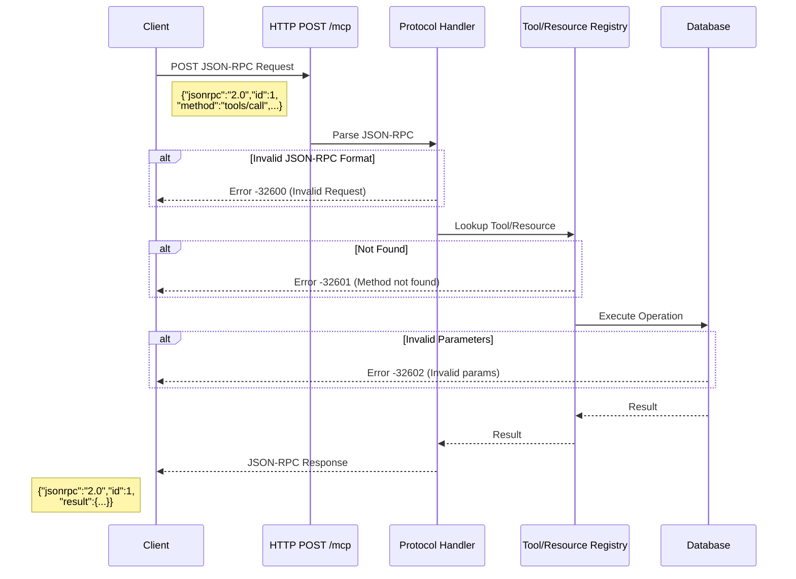

# MCP Protocol Validation Issues

Solutions for JSON-RPC protocol format errors and message validation problems.

## Overview

This guide addresses JSON-RPC protocol validation issues in the MCP server. These issues occur when requests don't conform to the JSON-RPC 2.0 specification or when message formats are incorrect.

**Common validation issues covered:**
- [Invalid JSON-RPC Request](#issue-invalid-json-rpc-request) - Protocol format errors
- Message structure validation
- Parameter format errors
- Request/response validation

**For tool and resource discovery issues**, see [Protocol Discovery Issues](./protocol-discovery-issues.md).

---

## Issue: Invalid JSON-RPC Request

### Symptoms

```bash
# Send malformed request
> {"method": "tools/list"}

# Response
< {
    "jsonrpc": "2.0",
    "error": {
      "code": -32600,
      "message": "Invalid Request"
    },
    "id": null
  }
```

**Observable Behavior**:
- Server returns JSON-RPC error response
- Error code `-32600` (Invalid Request)
- Request not processed
- Connection remains open

### Root Causes

1. **Missing required JSON-RPC fields**
   - Missing `"jsonrpc": "2.0"` field
   - Missing `id` field
   - Missing `method` field

2. **Wrong protocol version**
   - Using JSON-RPC 1.0 format
   - Incorrect version string

3. **Malformed JSON**
   - Syntax errors in JSON
   - Invalid character encoding
   - Truncated messages

4. **Wrong parameter format**
   - Parameters not in object format
   - Missing required parameters
   - Wrong parameter types

### Step-by-Step Solutions

**Solution 1: Use correct JSON-RPC 2.0 format**

```bash
# ✅ CORRECT - Complete JSON-RPC 2.0 request
{
  "jsonrpc": "2.0",
  "id": 1,
  "method": "tools/list",
  "params": {}
}

# ❌ WRONG - Missing jsonrpc field
{
  "id": 1,
  "method": "tools/list"
}

# ❌ WRONG - Wrong version
{
  "jsonrpc": "1.0",
  "id": 1,
  "method": "tools/list"
}

# ❌ WRONG - Missing id
{
  "jsonrpc": "2.0",
  "method": "tools/list"
}
```

**Solution 2: Validate JSON before sending**

```kotlin
// Client-side validation with Ktor and kotlinx.serialization
import kotlinx.serialization.*
import kotlinx.serialization.json.*

@Serializable
data class JsonRpcRequest(
    val jsonrpc: String = "2.0",
    val id: Int,
    val method: String,
    val params: JsonObject = JsonObject(emptyMap())
)

fun createJsonRpcRequest(method: String, params: JsonObject = JsonObject(emptyMap()), id: Int = 1): String {
    require(method.isNotBlank()) { "Method is required" }

    val request = JsonRpcRequest(
        id = id,
        method = method,
        params = params
    )

    return Json.encodeToString(request)
}

// Usage with HTTP POST (client-to-server)
suspend fun HttpClient.sendJsonRpcRequest(
    url: String,
    method: String,
    params: JsonObject = JsonObject(emptyMap())
): HttpResponse {
    val request = createJsonRpcRequest(method, params)
    return this.post(url) {
        header("Content-Type", "application/json")
        setBody(request)
    }
}
```

**Solution 3: Test with known-good requests**

```bash
# Terminal 1: Open SSE stream to receive responses
curl -N http://localhost:8080/mcp/events

# Terminal 2: Send JSON-RPC requests via POST

# Test tools/list
curl -X POST http://localhost:8080/mcp \
  -H "Content-Type: application/json" \
  -d '{"jsonrpc":"2.0","id":1,"method":"tools/list","params":{}}'

# Test resources/list
curl -X POST http://localhost:8080/mcp \
  -H "Content-Type: application/json" \
  -d '{"jsonrpc":"2.0","id":2,"method":"resources/list","params":{}}'

# Test tool call
curl -X POST http://localhost:8080/mcp \
  -H "Content-Type: application/json" \
  -d '{
    "jsonrpc":"2.0",
    "id":3,
    "method":"tools/call",
    "params":{
      "name":"create_project",
      "arguments":{"name":"Test Project","description":"Test"}
    }
  }'
```

**Solution 4: Handle JSON parsing errors**

```kotlin
// Client error handling with HTTP POST responses
import io.ktor.client.*
import io.ktor.client.request.*
import io.ktor.client.statement.*
import kotlinx.serialization.*
import kotlinx.serialization.json.*

@Serializable
data class JsonRpcError(
    val code: Int,
    val message: String
)

@Serializable
data class JsonRpcResponse(
    val jsonrpc: String,
    val id: Int? = null,
    val result: JsonElement? = null,
    val error: JsonRpcError? = null
)

suspend fun sendAndHandleJsonRpcRequest(
    client: HttpClient,
    url: String,
    requestBody: String
) {
    try {
        val response: HttpResponse = client.post(url) {
            header("Content-Type", "application/json")
            setBody(requestBody)
        }

        val responseText = response.bodyAsText()
        val jsonRpcResponse = Json.decodeFromString<JsonRpcResponse>(responseText)

        if (jsonRpcResponse.error != null) {
            println("JSON-RPC Error: ${jsonRpcResponse.error}")
            // Handle specific error codes
            when (jsonRpcResponse.error.code) {
                -32600 -> println("Invalid Request - check JSON-RPC format")
                -32601 -> println("Method not found")
                -32602 -> println("Invalid params")
            }
        } else {
            println("Success: ${jsonRpcResponse.result}")
        }
    } catch (e: SerializationException) {
        println("Failed to parse response: ${e.message}")
    }
}
```

### Prevention Tips

- **Use JSON-RPC client libraries**: Avoid manual formatting
  ```kotlin
  // Create a reusable JSON-RPC client with Ktor HTTP
  import io.ktor.client.*
  import io.ktor.client.request.*
  import io.ktor.client.statement.*
  import kotlinx.serialization.json.*

  class JsonRpcClient(private val postUrl: String) {
      private val client = HttpClient(CIO)

      suspend fun call(method: String, params: JsonObject = JsonObject(emptyMap())): JsonElement? {
          val request = createJsonRpcRequest(method, params, id = 1)

          val response: HttpResponse = client.post(postUrl) {
              header("Content-Type", "application/json")
              setBody(request)
          }

          val responseText = response.bodyAsText()
          val jsonRpcResponse = Json.decodeFromString<JsonRpcResponse>(responseText)
          return jsonRpcResponse.result
      }
  }

  // Usage
  val client = JsonRpcClient("http://localhost:8080/mcp")
  client.call("tools/list")
  ```

- **Schema validation**: Validate requests against JSON-RPC schema
  ```kotlin
  import kotlinx.serialization.json.*
  // Using kotlinx.serialization for compile-time validation
  @Serializable
  data class JsonRpcRequest(
      val jsonrpc: String = "2.0",
      val id: Int,
      val method: String,
      val params: JsonObject = JsonObject(emptyMap())
  ) {
      init {
          require(jsonrpc == "2.0") { "Invalid JSON-RPC version: $jsonrpc" }
          require(method.isNotBlank()) { "Method is required" }
      }
  }

  fun validateRequest(request: JsonRpcRequest): Result<Unit> = runCatching {
      require(request.jsonrpc == "2.0") { "Invalid JSON-RPC version" }
      require(request.method.isNotBlank()) { "Method is required" }
  }
  ```

- **Request logging**: Log all requests for debugging
  ```kotlin
  // Log HTTP POST messages
  suspend fun HttpClient.postWithLogging(url: String, body: String): HttpResponse {
      val formatted = Json.parseToJsonElement(body).toString()
      println("[SEND] $formatted")
      return this.post(url) {
          header("Content-Type", "application/json")
          setBody(body)
      }
  }
  ```

- **Error response handling**: Always handle error responses
  ```kotlin
  // Extension function for response handling
  fun JsonRpcResponse.resultOrThrow(): JsonElement {
      error?.let { err ->
          throw Exception("JSON-RPC Error ${err.code}: ${err.message}")
      }
      return result ?: throw Exception("No result in response")
  }
  ```

### Related Configuration

- `mcp/protocol/` - JSON-RPC protocol handlers
- `mcp/tools/` - Tool implementations
- No environment configuration required

---

## JSON-RPC Message Flow

Understanding the request/response flow helps diagnose protocol validation issues:



## Error Code Reference

**JSON-RPC Standard Error Codes**:

| Code | Meaning | Cause |
|------|---------|-------|
| -32700 | Parse error | Invalid JSON received |
| -32600 | Invalid Request | Missing required fields |
| -32601 | Method not found | Unknown method name |
| -32602 | Invalid params | Wrong parameter format |
| -32603 | Internal error | Server-side error |

**Detailed error code documentation**: See [Error Codes Reference](./error-codes.md)

## Testing Validation

**Test invalid requests to verify error handling**:

```bash
# Test missing jsonrpc field
curl -X POST http://localhost:8080/mcp \
  -H "Content-Type: application/json" \
  -d '{"id":1,"method":"tools/list"}'
# Expected: Error -32600

# Test wrong version
curl -X POST http://localhost:8080/mcp \
  -H "Content-Type: application/json" \
  -d '{"jsonrpc":"1.0","id":1,"method":"tools/list"}'
# Expected: Error -32600

# Test missing id
curl -X POST http://localhost:8080/mcp \
  -H "Content-Type: application/json" \
  -d '{"jsonrpc":"2.0","method":"tools/list"}'
# Expected: Error -32600

# Test malformed JSON
curl -X POST http://localhost:8080/mcp \
  -H "Content-Type: application/json" \
  -d '{"jsonrpc":"2.0","id":1,"method":"tools/list"'
# Expected: Error -32700 (Parse error)
```

## Related Guides

- [Protocol Discovery Issues](./protocol-discovery-issues.md) - Tool and resource discovery problems
- [MCP Troubleshooting Overview](./overview.md) - Quick reference to all issues
- [Connection Troubleshooting](./connection-issues.md) - Connection and SSE issues
- [Performance Troubleshooting](./performance-issues.md) - Slow responses and timeouts
- [Error Codes Reference](./error-codes.md) - Complete error code documentation

## See Also

- [MCP Development Guide](../../development/mcp-development.md) - Development workflows
- [MCP Architecture](../../../architecture/overview.md#mcp-server-integration) - System architecture
- [JSON-RPC 2.0 Specification](https://www.jsonrpc.org/specification) - Protocol specification
- [JSON-RPC Pattern](../../../patterns/mcp/json-rpc-pattern.md) - Implementation patterns
