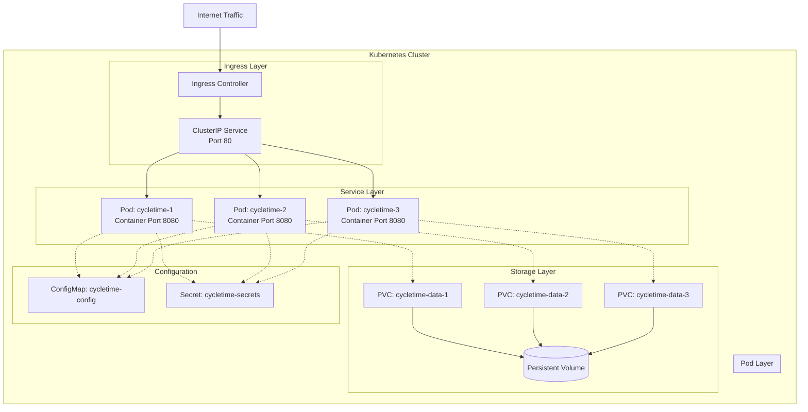

# Deployment Guide

## Overview

This guide covers deploying CycleTime to production environments using Docker and Kubernetes.

## Prerequisites

- Docker 20.10+
- Kubernetes 1.25+ (for K8s deployment)
- kubectl configured
- Access to container registry

## Container Deployment

### Using Pre-built Images

```bash
# Pull latest stable version
docker pull ghcr.io/spiralhouse/cycletime:latest

# Pull specific version
docker pull ghcr.io/spiralhouse/cycletime:0.3.0

# Run container
docker run -d \
  --name cycletime \
  -p 8080:8080 \
  -v /data/cycletime:/data \
  -e DATABASE_URL=jdbc:h2:file:/data/cycletime \
  -e LOG_LEVEL=INFO \
  ghcr.io/spiralhouse/cycletime:latest
```

### Building Custom Images

```bash
# Clone repository
git clone https://github.com/spiralhouse/cycletime.git
cd cycletime

# Build image
docker build -t cycletime:custom .

# Run custom image
docker run -d --name cycletime -p 8080:8080 cycletime:custom
```

## Kubernetes Deployment

### Architecture Overview



### Basic Deployment

```yaml
# cycletime-deployment.yaml
apiVersion: apps/v1
kind: Deployment
metadata:
  name: cycletime
  labels:
    app: cycletime
spec:
  replicas: 3
  selector:
    matchLabels:
      app: cycletime
  template:
    metadata:
      labels:
        app: cycletime
    spec:
      containers:
      - name: cycletime
        image: ghcr.io/spiralhouse/cycletime:latest
        ports:
        - containerPort: 8080
        env:
        - name: DATABASE_URL
          valueFrom:
            secretKeyRef:
              name: cycletime-secrets
              key: database-url
        - name: LOG_LEVEL
          value: "INFO"
        livenessProbe:
          httpGet:
            path: /health
            port: 8080
          initialDelaySeconds: 30
          periodSeconds: 10
        readinessProbe:
          httpGet:
            path: /health
            port: 8080
          initialDelaySeconds: 5
          periodSeconds: 5
        resources:
          requests:
            memory: "256Mi"
            cpu: "250m"
          limits:
            memory: "512Mi"
            cpu: "500m"
---
apiVersion: v1
kind: Service
metadata:
  name: cycletime-service
spec:
  selector:
    app: cycletime
  ports:
    - protocol: TCP
      port: 80
      targetPort: 8080
  type: LoadBalancer
```

### Deploy to Kubernetes

```bash
# Create namespace
kubectl create namespace cycletime-prod

# Create secrets
kubectl create secret generic cycletime-secrets \
  --from-literal=database-url=jdbc:h2:file:/data/cycletime \
  -n cycletime-prod

# Apply deployment
kubectl apply -f cycletime-deployment.yaml -n cycletime-prod

# Check deployment status
kubectl get pods -n cycletime-prod

# Get service endpoint
kubectl get service cycletime-service -n cycletime-prod
```

## Docker Compose

### Production Stack

```yaml
# docker-compose.prod.yml
version: '3.8'

services:
  cycletime:
    image: ghcr.io/spiralhouse/cycletime:latest
    container_name: cycletime-prod
    restart: always
    ports:
      - "80:8080"
    environment:
      - DATABASE_URL=jdbc:h2:file:/data/cycletime
      - LOG_LEVEL=INFO
    volumes:
      - cycletime-data:/data
      - ./logs:/app/logs
    healthcheck:
      test: ["CMD", "curl", "-f", "http://localhost:8080/health"]
      interval: 30s
      timeout: 10s
      retries: 3
      start_period: 40s
    networks:
      - cycletime-network

  nginx:
    image: nginx:alpine
    container_name: cycletime-nginx
    restart: always
    ports:
      - "443:443"
      - "80:80"
    volumes:
      - ./nginx.conf:/etc/nginx/nginx.conf:ro
      - ./ssl:/etc/nginx/ssl:ro
    depends_on:
      - cycletime
    networks:
      - cycletime-network

volumes:
  cycletime-data:
    driver: local

networks:
  cycletime-network:
    driver: bridge
```

### Deploy with Docker Compose

```bash
# Start production stack
docker-compose -f docker-compose.prod.yml up -d

# View logs
docker-compose -f docker-compose.prod.yml logs -f

# Stop services
docker-compose -f docker-compose.prod.yml down
```

## Environment Configuration

The application is configured through environment variables that control server behavior, database connections, and operational features. Required variables must be set for the application to start, while optional variables provide additional control over performance and debugging.

### Required Environment Variables

These variables must be configured in all deployment environments:

| Variable | Description | Example |
|----------|-------------|---------|
| `DATABASE_URL` | Database connection string | `jdbc:h2:file:/data/cycletime` |
| `PORT` | Server port | `8080` |
| `HOST` | Server host | `0.0.0.0` |
| `LOG_LEVEL` | Logging level | `INFO` |

### Optional Configuration

These variables provide additional control over application behavior with sensible defaults:

| Variable | Description | Default |
|----------|-------------|---------|
| `DATABASE_LOGGING` | Enable SQL logging | `false` |
| `MAX_POOL_SIZE` | Database connection pool | `10` |
| `CORS_ENABLED` | Enable CORS | `true` |

## Health Monitoring

### Health Check Endpoint

```bash
curl http://your-server/health
```

Expected response:
```json
{
  "status": "healthy",
  "service": "cycletime",
  "version": "0.3.0",
  "dependencies": {
    "database": "connected"
  }
}
```

### Monitoring Setup

1. **Health Check Endpoint** - Built-in health monitoring at `/health`
2. **Application Logs** - Available in `/app/logs`
3. **Container Logs** - Via Docker/Kubernetes

## Backup and Recovery

### Database Backup

```bash
# Backup H2 database files
docker exec cycletime-prod cp /data/cycletime.mv.db /data/backup.mv.db
docker exec cycletime-prod cp /data/cycletime.trace.db /data/backup.trace.db 2>/dev/null || true

# Copy backup to host
docker cp cycletime-prod:/data/backup.mv.db ./backups/cycletime-$(date +%Y%m%d).mv.db
```

### Restore from Backup

```bash
# Copy backup to container
docker cp ./backups/cycletime-20250823.mv.db cycletime-prod:/data/restore.mv.db

# Restore database
docker exec cycletime-prod sh -c "mv /data/cycletime.mv.db /data/cycletime.mv.db.old && mv /data/restore.mv.db /data/cycletime.mv.db"

# Restart container
docker restart cycletime-prod
```

## Security Considerations

1. **Use Secrets Management** - Never hardcode credentials
2. **Enable TLS** - Always use HTTPS in production
3. **Network Isolation** - Use private networks
4. **Regular Updates** - Keep images updated
5. **Resource Limits** - Set memory and CPU limits
6. **Log Rotation** - Configure log rotation policies

## Troubleshooting

### Container Won't Start

```bash
# Check logs
docker logs cycletime-prod

# Verify environment variables
docker exec cycletime-prod env

# Test database connection (requires H2 console or JDBC client)
docker exec cycletime-prod java -cp /app/lib/h2*.jar org.h2.tools.Shell -url "jdbc:h2:file:/data/cycletime" -sql "SELECT 1"
```

### Performance Issues

```bash
# Check resource usage
docker stats cycletime-prod

# Increase resources in docker-compose.yml
deploy:
  resources:
    limits:
      memory: 1G
      cpus: '1.0'
```

### Database Issues

```bash
# Check database integrity (requires H2 console)
docker exec cycletime-prod java -cp /app/lib/h2*.jar org.h2.tools.Shell -url "jdbc:h2:file:/data/cycletime" -sql "SELECT COUNT(*) FROM INFORMATION_SCHEMA.TABLES"

# Compact database (H2 performs automatic compaction)
docker exec cycletime-prod java -cp /app/lib/h2*.jar org.h2.tools.Shell -url "jdbc:h2:file:/data/cycletime" -sql "SHUTDOWN COMPACT"
```

## Related Documentation

- [Configuration Guide](../getting-started/configuration.md)
- [Environment Management](../ci-cd/environments.md)
- [Installation Guide](../getting-started/installation.md)
- [Troubleshooting Reference](../reference/troubleshooting.md)