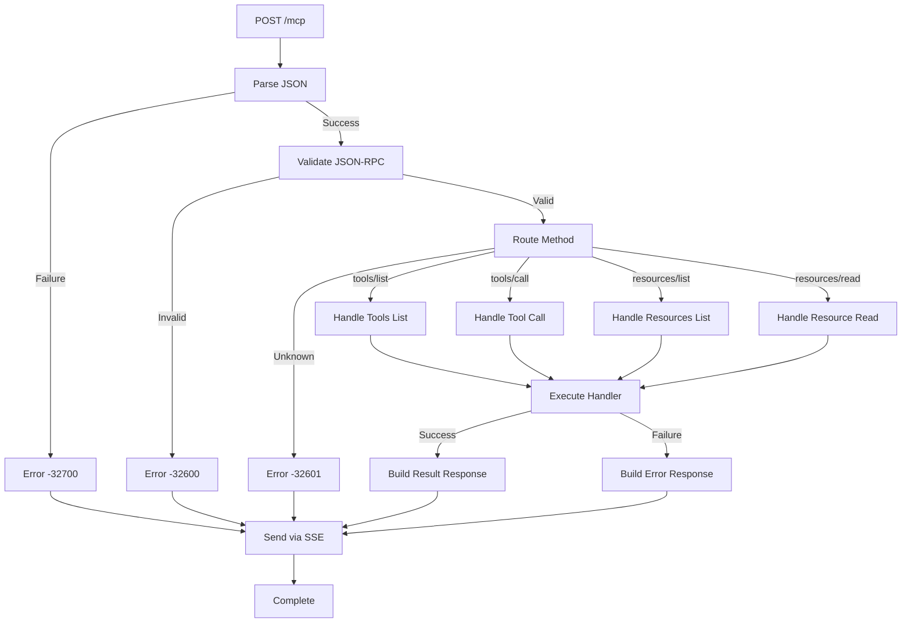

# JSON-RPC Pattern for MCP

## Overview

JSON-RPC 2.0 provides the standardized message format for MCP client-server communication. This pattern documents how to implement robust JSON-RPC handling with proper validation, error handling, and method routing.

### Why JSON-RPC 2.0?

**Advantages**:
- Standardized message format (RFC-like specification)
- Built-in error code system
- Request/response correlation via IDs
- Batch request support
- Language-agnostic

## JSON-RPC 2.0 Message Format

### Request Structure

```json
{
  "jsonrpc": "2.0",      // Required: Protocol version
  "id": 1,               // Required: Request identifier (number or string)
  "method": "tools/call", // Required: Method name
  "params": {            // Optional: Method parameters
    "name": "create_project",
    "arguments": {
      "name": "My Project"
    }
  }
}
```

### Response Structure (Success)

```json
{
  "jsonrpc": "2.0",      // Required: Protocol version
  "id": 1,               // Required: Matches request ID
  "result": {            // Required for success
    "id": "proj_123",
    "name": "My Project",
    "created": "2025-10-19T10:00:00Z"
  }
}
```

### Response Structure (Error)

```json
{
  "jsonrpc": "2.0",      // Required: Protocol version
  "id": 1,               // Required: Matches request ID (null if parse error)
  "error": {             // Required for error
    "code": -32602,      // Standard error code
    "message": "Invalid params: name is required",
    "data": {            // Optional: Additional error details
      "field": "name",
      "constraint": "required"
    }
  }
}
```

## Data Models

### Kotlin Implementation

```kotlin
import kotlinx.serialization.Serializable
import kotlinx.serialization.json.JsonElement
import kotlinx.serialization.json.JsonObject

/**
 * JSON-RPC 2.0 Request
 */
@Serializable
data class JsonRpcRequest(
    val jsonrpc: String = "2.0",
    val method: String,
    val params: JsonElement? = null,
    val id: JsonElement? = null  // number, string, or null
) {
    init {
        require(jsonrpc == "2.0") { "Invalid JSON-RPC version: $jsonrpc" }
        require(method.isNotBlank()) { "Method is required" }
    }
}

/**
 * JSON-RPC 2.0 Response
 */
@Serializable
data class JsonRpcResponse(
    val jsonrpc: String = "2.0",
    val result: JsonElement? = null,
    val error: JsonRpcError? = null,
    val id: JsonElement? = null
) {
    init {
        require(jsonrpc == "2.0") { "Invalid JSON-RPC version: $jsonrpc" }
        require((result == null) != (error == null)) {
            "Response must have either result or error, not both"
        }
    }
}

/**
 * JSON-RPC 2.0 Error
 */
@Serializable
data class JsonRpcError(
    val code: Int,
    val message: String,
    val data: JsonElement? = null
)
```

## Error Codes

### Standard JSON-RPC 2.0 Error Codes

| Code | Message | Meaning |
|------|---------|---------|
| -32700 | Parse error | Invalid JSON was received |
| -32600 | Invalid Request | JSON is not a valid Request object |
| -32601 | Method not found | Method does not exist / is not available |
| -32602 | Invalid params | Invalid method parameter(s) |
| -32603 | Internal error | Internal JSON-RPC error |

### MCP-Specific Error Codes

| Code | Message | Meaning |
|------|---------|---------|
| -32000 | Server error | Generic MCP server error |
| -32001 | Resource not found | Requested resource doesn't exist |
| -32002 | Tool execution failed | Tool execution encountered error |
| -32003 | Session not found | Session ID invalid or expired |

### Exception to Error Code Mapping

```kotlin
/**
 * Base exception for MCP errors
 */
sealed class MCPException(
    message: String,
    val errorCode: Int
) : Exception(message)

/**
 * Resource not found
 */
class ResourceNotFoundException(
    uri: String
) : MCPException("Resource not found: $uri", -32001)

/**
 * Tool execution failed
 */
class ToolExecutionException(
    toolName: String,
    cause: Throwable? = null
) : MCPException("Tool execution failed: $toolName", -32002) {
    init {
        cause?.let { initCause(it) }
    }
}

/**
 * Invalid request
 */
class InvalidRequestException(
    message: String
) : MCPException(message, -32600)

/**
 * Method not found
 */
class MethodNotFoundException(
    method: String
) : MCPException("Method not found: $method", -32601)

/**
 * Session not found
 */
class SessionNotFoundException(
    sessionId: String
) : MCPException("Session not found: $sessionId", -32003)
```

## Request Processing

### Request Handler Architecture



### Implementation

```kotlin
import io.ktor.server.application.*
import io.ktor.server.request.*
import io.ktor.server.response.*
import io.ktor.http.*
import kotlinx.serialization.json.*
import org.slf4j.LoggerFactory

class JsonRpcHandler(
    private val sessionManager: MCPSessionManager,
    private val tools: List<MCPTool>,
    private val resources: List<MCPResource>
) {
    private val logger = LoggerFactory.getLogger(JsonRpcHandler::class.java)

    suspend fun handleRequest(call: ApplicationCall) {
        try {
            // Phase 1: Parse request
            val requestBody = call.receiveText()
            val jsonElement = parseJson(requestBody)
                ?: return respondError(call, -32700, "Parse error", null)

            // Phase 2: Validate JSON-RPC format
            val request = validateRequest(jsonElement)
                ?: return respondError(call, -32600, "Invalid Request", null)

            // Phase 3: Extract session ID
            val sessionId = extractSessionId(call, request)
                ?: return respondError(call, -32003, "Session ID required", request.id)

            // Phase 4: Route and execute
            val response = routeRequest(request, sessionId)

            // Phase 5: Send response via SSE
            sessionManager.sendToSession(sessionId, Json.encodeToJsonElement(response))

            // Phase 6: Acknowledge POST
            call.respond(HttpStatusCode.Accepted)

        } catch (e: Exception) {
            logger.error("Unexpected error processing request", e)
            call.respond(
                HttpStatusCode.InternalServerError,
                mapOf("error" to (e.message ?: "Unknown error"))
            )
        }
    }

    private fun parseJson(body: String): JsonElement? {
        return try {
            Json.parseToJsonElement(body)
        } catch (e: Exception) {
            logger.error("JSON parse error", e)
            null
        }
    }

    private fun validateRequest(json: JsonElement): JsonRpcRequest? {
        return try {
            Json.decodeFromJsonElement<JsonRpcRequest>(json)
        } catch (e: Exception) {
            logger.error("Invalid JSON-RPC request", e)
            null
        }
    }

    private fun extractSessionId(
        call: ApplicationCall,
        request: JsonRpcRequest
    ): String? {
        // Try header first
        call.request.header("X-MCP-Session-ID")?.let { return it }

        // Try request params
        request.params?.jsonObject?.get("sessionId")?.jsonPrimitive?.content?.let { return it }

        return null
    }

    private suspend fun routeRequest(
        request: JsonRpcRequest,
        sessionId: String
    ): JsonRpcResponse {
        return try {
            when (request.method) {
                "initialize" -> handleInitialize(request)
                "tools/list" -> handleToolsList(request)
                "tools/call" -> handleToolCall(request, sessionId)
                "resources/list" -> handleResourcesList(request)
                "resources/read" -> handleResourceRead(request, sessionId)
                "ping" -> handlePing(request)
                else -> createErrorResponse(
                    request.id,
                    -32601,
                    "Method not found: ${request.method}"
                )
            }
        } catch (e: MCPException) {
            createErrorResponse(request.id, e.errorCode, e.message ?: "MCP error")
        } catch (e: Exception) {
            logger.error("Handler error for method: ${request.method}", e)
            createErrorResponse(request.id, -32603, "Internal error: ${e.message}")
        }
    }

    private suspend fun respondError(
        call: ApplicationCall,
        code: Int,
        message: String,
        id: JsonElement?
    ) {
        val errorResponse = createErrorResponse(id, code, message)
        call.respond(
            HttpStatusCode.BadRequest,
            Json.encodeToString(errorResponse)
        )
    }
}
```

## Method Handlers

### Initialize Handler

```kotlin
private fun handleInitialize(request: JsonRpcRequest): JsonRpcResponse {
    val params = request.params?.jsonObject
    val protocolVersion = params?.get("protocolVersion")?.jsonPrimitive?.content

    if (protocolVersion != "2024-11-05") {
        return createErrorResponse(
            request.id,
            -32602,
            "Unsupported protocol version: $protocolVersion"
        )
    }

    return JsonRpcResponse(
        id = request.id,
        result = buildJsonObject {
            put("protocolVersion", "2024-11-05")
            put("serverInfo", buildJsonObject {
                put("name", "CycleTime CE MCP Server")
                put("version", "0.1.0")
            })
            put("capabilities", buildJsonObject {
                putJsonObject("resources") {
                    put("subscribe", false)
                    put("listChanged", true)
                }
                putJsonObject("tools") {}
                putJsonObject("prompts") {}
            })
        }
    )
}
```

### Tools List Handler

```kotlin
private fun handleToolsList(request: JsonRpcRequest): JsonRpcResponse {
    return JsonRpcResponse(
        id = request.id,
        result = buildJsonObject {
            putJsonArray("tools") {
                tools.forEach { tool ->
                    addJsonObject {
                        put("name", tool.name)
                        put("description", tool.description)
                        put("inputSchema", tool.inputSchema)
                    }
                }
            }
        }
    )
}
```

### Tool Call Handler

```kotlin
private suspend fun handleToolCall(
    request: JsonRpcRequest,
    sessionId: String
): JsonRpcResponse {
    val params = request.params?.jsonObject
        ?: return createErrorResponse(request.id, -32602, "Missing parameters")

    val toolName = params["name"]?.jsonPrimitive?.content
        ?: return createErrorResponse(request.id, -32602, "Missing tool name")

    val tool = tools.firstOrNull { it.name == toolName }
        ?: return createErrorResponse(request.id, -32601, "Tool not found: $toolName")

    val arguments = params["arguments"]?.jsonObject ?: buildJsonObject {}

    return try {
        val result = tool.execute(arguments, sessionId)
        JsonRpcResponse(
            id = request.id,
            result = buildJsonObject {
                putJsonArray("content") {
                    addJsonObject {
                        put("type", "text")
                        put("text", Json.encodeToString(result))
                    }
                }
            }
        )
    } catch (e: ToolExecutionException) {
        createErrorResponse(request.id, e.errorCode, e.message ?: "Tool execution failed")
    }
}
```

## Error Response Builder

```kotlin
private fun createErrorResponse(
    id: JsonElement?,
    code: Int,
    message: String,
    data: JsonElement? = null
): JsonRpcResponse {
    return JsonRpcResponse(
        id = id,
        error = JsonRpcError(
            code = code,
            message = message,
            data = data
        )
    )
}
```

## Validation

### Request Validation

```kotlin
fun validateJsonRpcRequest(request: JsonRpcRequest): Result<Unit> {
    return runCatching {
        require(request.jsonrpc == "2.0") {
            "Invalid JSON-RPC version: ${request.jsonrpc}"
        }
        require(request.method.isNotBlank()) {
            "Method is required"
        }
        require(request.id != null) {
            "Request ID is required"
        }
    }
}
```

### Parameter Validation

```kotlin
fun validateToolCallParams(params: JsonObject): Result<ToolCallParams> {
    return runCatching {
        val name = params["name"]?.jsonPrimitive?.content
            ?: throw InvalidRequestException("Missing tool name")

        val arguments = params["arguments"]?.jsonObject
            ?: buildJsonObject {}

        ToolCallParams(name, arguments)
    }
}

data class ToolCallParams(
    val name: String,
    val arguments: JsonObject
)
```

## Testing

### Request/Response Testing

```kotlin
class JsonRpcHandlerTest : StringSpec({
    "should handle valid tools/list request" {
        val request = JsonRpcRequest(
            method = "tools/list",
            id = JsonPrimitive(1)
        )

        val response = handler.routeRequest(request, "session_123")

        response.result shouldNotBe null
        response.error shouldBe null
        response.id shouldBe JsonPrimitive(1)
    }

    "should return error for invalid method" {
        val request = JsonRpcRequest(
            method = "invalid/method",
            id = JsonPrimitive(1)
        )

        val response = handler.routeRequest(request, "session_123")

        response.result shouldBe null
        response.error shouldNotBe null
        response.error?.code shouldBe -32601
    }
})
```

## Best Practices

### 1. Always Include Request ID

```kotlin
// ✅ GOOD - Include ID for correlation
{
  "jsonrpc": "2.0",
  "id": 1,
  "method": "tools/list"
}

// ❌ BAD - Missing ID makes response correlation impossible
{
  "jsonrpc": "2.0",
  "method": "tools/list"
}
```

### 2. Use Appropriate Error Codes

```kotlin
// ✅ GOOD - Specific error code
throw ToolExecutionException("Database connection failed")
// Returns error code -32002

// ❌ BAD - Generic error
throw Exception("Something went wrong")
// Returns generic error code -32603
```

### 3. Validate Before Execution

```kotlin
// ✅ GOOD - Validate parameters first
fun handleToolCall(request: JsonRpcRequest): JsonRpcResponse {
    validateToolCallParams(request.params)
        .onFailure { return createErrorResponse(...) }

    // Execute tool
}

// ❌ BAD - Execute without validation
fun handleToolCall(request: JsonRpcRequest): JsonRpcResponse {
    // May throw NPE or invalid cast
    val toolName = request.params!!["name"]!!
}
```

### 4. Log Error Details

```kotlin
catch (e: Exception) {
    logger.error("Tool execution failed", e) // Full stack trace
    createErrorResponse(
        request.id,
        -32002,
        e.message ?: "Tool execution failed" // User-friendly message
    )
}
```

## Troubleshooting

See [Protocol Validation Issues](../../../guides/troubleshooting/mcp/protocol-validation-issues.md) for common JSON-RPC format and validation issues.

## Related Patterns

- [Streamable HTTP Transport Pattern](./streamable-http-transport-pattern.md) - Delivering JSON-RPC responses via Streamable HTTP
- [Session Integration Pattern](./session-integration-pattern.md) - Extracting session context from requests
- [MCP Testing Pattern](./mcp-testing-pattern.md) - Testing JSON-RPC handlers

## References

- [JSON-RPC 2.0 Specification](https://www.jsonrpc.org/specification) - Official specification
- [MCP Protocol Specification](https://modelcontextprotocol.io/) - MCP-specific requirements
- [kotlinx.serialization](https://github.com/Kotlin/kotlinx.serialization) - Kotlin JSON serialization
