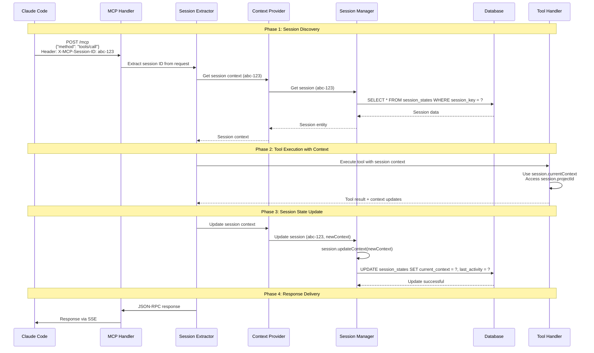
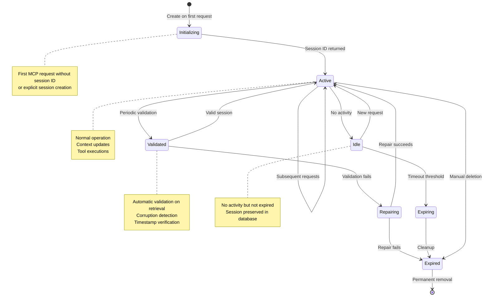

# Session Integration Pattern

## Overview

The Session Integration Pattern bridges the gap between MCP's stateless protocol design and CycleTime's stateful application requirements. This pattern enables Claude Code to maintain development context across multiple interactions while preserving the protocol's simplicity.

### The Core Challenge

MCP is inherently stateless:
- Each request is independent
- No server-side protocol state
- No built-in session management

Claude Code workflows require statefulness:
- Development context across interactions
- Project state persistence
- Issue tracking continuity
- Workflow stage memory

**This pattern solves**: How to provide stateful sessions over a stateless protocol.

### Why Session Integration Matters

**Without session integration**:
- Every request starts from scratch
- No memory of previous actions
- Manual context rebuilding required
- Poor developer experience

**With session integration**:
- Continuous development context
- Automatic state persistence
- Cross-session continuity
- Natural workflow progression

## Pattern Architecture

### High-Level Design

```mermaid
graph TB
    subgraph "Claude Code Client"
        Client[Claude Code]
    end

    subgraph "MCP Protocol Layer (Stateless)"
        Endpoint[/mcp Endpoint]
        Handler[StreamableHttpHandler]
        JSONRPC[JSON-RPC Handler]
    end

    subgraph "Session Integration Layer"
        Extract[Session ID Extractor]
        Context[Session Context Provider]
        Manager[Session Manager]
    end

    subgraph "Application Layer (Stateful)"
        Service[Session Application Service]
        Validator[Session Validator]
    end

    subgraph "Persistence Layer"
        Repo[Session Repository]
        DB[(H2 Database)]
    end

    Client -->|1. POST /mcp<br/>Mcp-Session-ID| Endpoint
    Endpoint --> Handler
    Handler --> JSONRPC
    JSONRPC -->|2. Extract Session ID| Extract
    Extract -->|3. Load Session| Context
    Context --> Manager
    Manager --> Service
    Service --> Repo
    Repo <--> DB

    Context -->|4. Session Context| JSONRPC
    JSONRPC -->|5. Tool/Resource Execution| Context
    Context -->|6. Update Session| Manager
    Manager --> Service

    JSONRPC -->|7. Response| Handler
    Handler -->|8. MCP Response (JSON/SSE)| Client

    style Extract fill:#e1f5ff
    style Context fill:#f0e1ff
    style Manager fill:#fff4e1
```

### Request Flow with Session Integration



## MCP Session Lifecycle

### Session States

Sessions progress through distinct states during their lifetime:



### Session Creation

Sessions are created automatically or explicitly:

**Automatic Creation** (Recommended):
```kotlin
// MCP handler creates session on first request without session ID
suspend fun handleRequest(call: ApplicationCall) {
    val sessionId = extractSessionId(call)
        ?: createNewSession().sessionKey.value

    // Session ID returned to client for subsequent requests
    respondWithSessionId(call, sessionId)
}
```

**Explicit Creation** (via tool):
```kotlin
// Client can explicitly create session via MCP tool
suspend fun createSessionTool(arguments: JsonObject): JsonElement {
    val projectId = arguments["projectId"]?.jsonPrimitive?.content

    val session = sessionManager.createSession(
        projectId = projectId,
        initialContext = SessionContext(
            activeIssues = emptyList(),
            workflowStage = "planning",
            lastAction = "session_created",
            contextData = emptyMap()
        )
    )

    return buildJsonObject {
        put("sessionId", session.sessionKey.value)
        put("createdAt", session.createdAt.toString())
    }
}
```

### Session Discovery

Claude Code discovers session ID through multiple mechanisms:

**1. Session ID in Response Header**:
```kotlin
// Server includes session ID in response
suspend fun respondWithSession(call: ApplicationCall, sessionId: String, response: JsonElement) {
    call.response.header("X-MCP-Session-ID", sessionId)
    call.respond(response)
}
```

**2. Session ID in SSE Event**:
```kotlin
// Session ID sent via SSE on connection
sse("/mcp/events") {
    val sessionId = generateSessionId()

    send(ServerSentEvent(
        data = Json.encodeToString(mapOf("sessionId" to sessionId)),
        event = "connected"
    ))

    // Client caches sessionId for subsequent requests
}
```

**3. Session Resource Query**:
```kotlin
// Client can query active session via resource
suspend fun handleResourceRead(uri: String, sessionContext: SessionContext?): JsonElement {
    return when (uri) {
        "cycletime://sessions/active" -> buildJsonObject {
            put("sessionId", sessionContext?.sessionKey?.value ?: "none")
            put("projectId", sessionContext?.projectId)
            put("workflowStage", sessionContext?.workflowStage)
        }
        else -> throw ResourceNotFoundException(uri)
    }
}
```

### Session Expiration and Cleanup

Sessions expire based on inactivity:

**Expiration Check**:
```kotlin
// Automatic expiration check on retrieval
suspend fun getSession(sessionKey: SessionKey): Session? {
    val session = repository.findBySessionKey(sessionKey)
        ?: return null

    if (session.isExpired(timeProvider.now(), config.maxAge)) {
        repository.delete(sessionKey)
        return null
    }

    return session
}
```

**Automatic Cleanup**:
```kotlin
// Background cleanup process
class SessionCleanupService(
    private val repository: SessionRepository,
    private val timeProvider: TimeProvider,
    private val config: SessionConfig
) {
    suspend fun cleanupExpiredSessions(): CleanupResult {
        val cutoffTime = timeProvider.now().minus(config.maxAge)
        val expiredKeys = repository.findSessionsOlderThan(cutoffTime)

        expiredKeys.forEach { key ->
            repository.delete(key)
        }

        return CleanupResult(deleted = expiredKeys.size)
    }
}
```

## Session State Persistence Strategies

### Database-Backed Sessions (Primary Pattern)

All session state persists to H2 database for durability across server restarts.

#### Session Data Model

```kotlin
/**
 * Domain entity representing a development session
 */
data class Session(
    val id: String,
    val sessionKey: SessionKey,
    val projectId: String?,
    val currentContext: SessionContext,
    val lastActivity: Instant,
    val createdAt: Instant,
    val updatedAt: Instant
) {
    /**
     * Update session context and touch activity timestamp
     */
    fun updateContext(
        newContext: SessionContext,
        timeProvider: TimeProvider
    ): Session {
        val now = timeProvider.now()
        return copy(
            currentContext = newContext,
            lastActivity = now,
            updatedAt = now
        )
    }

    /**
     * Touch session to update last activity
     */
    fun touch(timeProvider: TimeProvider): Session {
        return copy(lastActivity = timeProvider.now())
    }

    /**
     * Check if session has expired
     */
    fun isExpired(currentTime: Instant, maxAge: Duration): Boolean {
        val age = Duration.between(lastActivity, currentTime)
        return age > maxAge
    }
}

/**
 * Type-safe session identifier
 */
@JvmInline
value class SessionKey(val value: String) {
    init {
        require(isValidUUID(value)) { "Invalid session key format: $value" }
    }

    companion object {
        fun generate(): SessionKey = SessionKey(UUID.randomUUID().toString())

        private fun isValidUUID(value: String): Boolean {
            return try {
                UUID.fromString(value)
                true
            } catch (e: IllegalArgumentException) {
                false
            }
        }
    }
}

/**
 * Structured session context data
 */
data class SessionContext(
    val activeIssues: List<String> = emptyList(),
    val workflowStage: String? = null,
    val lastAction: String? = null,
    val contextData: Map<String, String> = emptyMap()
)
```

#### Database Schema

```sql
CREATE TABLE IF NOT EXISTS session_states (
    id VARCHAR(36) PRIMARY KEY DEFAULT RANDOM_UUID(),
    session_key VARCHAR(36) UNIQUE NOT NULL,
    project_id VARCHAR(36),
    current_context TEXT,  -- JSON serialized SessionContext
    last_activity TIMESTAMP NOT NULL DEFAULT CURRENT_TIMESTAMP,
    created_at TIMESTAMP NOT NULL DEFAULT CURRENT_TIMESTAMP,
    updated_at TIMESTAMP NOT NULL DEFAULT CURRENT_TIMESTAMP,
    FOREIGN KEY (project_id) REFERENCES projects(id) ON DELETE CASCADE
);

-- Performance indexes
CREATE INDEX idx_session_states_key ON session_states(session_key);
CREATE INDEX idx_session_states_activity ON session_states(last_activity);
CREATE INDEX idx_session_states_project ON session_states(project_id);
```

#### Repository Pattern

```kotlin
/**
 * Repository interface for session persistence
 */
interface SessionRepository {
    suspend fun save(session: Session): Session
    suspend fun findBySessionKey(sessionKey: SessionKey): Session?
    suspend fun update(session: Session): Session
    suspend fun delete(sessionKey: SessionKey): Boolean
    suspend fun findSessionsOlderThan(cutoffTime: Instant): List<SessionKey>
}

/**
 * H2 implementation using prepared statements
 */
class H2SessionRepository(
    private val database: Database
) : SessionRepository {

    override suspend fun save(session: Session): Session = withContext(Dispatchers.IO) {
        transaction(database) {
            val statement = connection.prepareStatement(
                """
                INSERT INTO session_states
                (id, session_key, project_id, current_context, last_activity, created_at, updated_at)
                VALUES (?, ?, ?, ?, ?, ?, ?)
                """
            )

            statement.setString(1, session.id)
            statement.setString(2, session.sessionKey.value)
            statement.setString(3, session.projectId)
            statement.setString(4, Json.encodeToString(session.currentContext))
            statement.setTimestamp(5, Timestamp.from(session.lastActivity))
            statement.setTimestamp(6, Timestamp.from(session.createdAt))
            statement.setTimestamp(7, Timestamp.from(session.updatedAt))

            statement.executeUpdate()
            session
        }
    }

    override suspend fun findBySessionKey(sessionKey: SessionKey): Session? =
        withContext(Dispatchers.IO) {
            transaction(database) {
                val statement = connection.prepareStatement(
                    "SELECT * FROM session_states WHERE session_key = ?"
                )
                statement.setString(1, sessionKey.value)

                val resultSet = statement.executeQuery()
                if (resultSet.next()) {
                    mapResultSetToSession(resultSet)
                } else {
                    null
                }
            }
        }

    override suspend fun update(session: Session): Session = withContext(Dispatchers.IO) {
        transaction(database) {
            val statement = connection.prepareStatement(
                """
                UPDATE session_states
                SET current_context = ?, last_activity = ?, updated_at = ?
                WHERE session_key = ?
                """
            )

            statement.setString(1, Json.encodeToString(session.currentContext))
            statement.setTimestamp(2, Timestamp.from(session.lastActivity))
            statement.setTimestamp(3, Timestamp.from(session.updatedAt))
            statement.setString(4, session.sessionKey.value)

            statement.executeUpdate()
            session
        }
    }

    private fun mapResultSetToSession(rs: ResultSet): Session {
        return Session(
            id = rs.getString("id"),
            sessionKey = SessionKey(rs.getString("session_key")),
            projectId = rs.getString("project_id"),
            currentContext = Json.decodeFromString(rs.getString("current_context")),
            lastActivity = rs.getTimestamp("last_activity").toInstant(),
            createdAt = rs.getTimestamp("created_at").toInstant(),
            updatedAt = rs.getTimestamp("updated_at").toInstant()
        )
    }
}
```

### Session Context Propagation

Session context flows through the request processing pipeline:

```kotlin
/**
 * Session context provider extracts and caches session for request
 */
class SessionContextProvider(
    private val sessionManager: SessionManager
) {
    private val sessionCache = ConcurrentHashMap<String, Session>()

    /**
     * Get or load session for request
     */
    suspend fun getSessionContext(sessionId: String): Session? {
        return sessionCache.getOrPut(sessionId) {
            sessionManager.getSession(SessionKey(sessionId)) ?: return null
        }
    }

    /**
     * Update session context and invalidate cache
     */
    suspend fun updateSessionContext(
        sessionId: String,
        updates: SessionContext
    ): Session {
        val session = sessionManager.updateSessionContext(
            SessionKey(sessionId),
            updates
        )
        sessionCache[sessionId] = session
        return session
    }

    /**
     * Clear cache for session
     */
    fun invalidateSession(sessionId: String) {
        sessionCache.remove(sessionId)
    }
}

/**
 * Make session context available to tools and resources
 */
suspend fun executeWithSessionContext(
    sessionId: String?,
    contextProvider: SessionContextProvider,
    operation: suspend (Session?) -> JsonElement
): JsonElement {
    val session = sessionId?.let { contextProvider.getSessionContext(it) }
    return operation(session)
}
```

### Caching Strategies

#### Request-Scoped Cache

Session loaded once per MCP request and reused:

```kotlin
class RequestScopedSessionCache {
    private val requestCache = ThreadLocal<MutableMap<String, Session>>()

    suspend fun getOrLoad(
        sessionId: String,
        loader: suspend (String) -> Session?
    ): Session? {
        val cache = requestCache.get() ?: mutableMapOf<String, Session>().also {
            requestCache.set(it)
        }

        return cache.getOrPut(sessionId) {
            loader(sessionId) ?: return null
        }
    }

    fun clear() {
        requestCache.remove()
    }
}
```

#### Time-Based Cache Invalidation

```kotlin
class CachedSession(
    val session: Session,
    val cachedAt: Instant,
    val ttl: Duration = Duration.ofMinutes(5)
) {
    fun isValid(currentTime: Instant): Boolean {
        val age = Duration.between(cachedAt, currentTime)
        return age < ttl
    }
}

class SessionCache(
    private val timeProvider: TimeProvider
) {
    private val cache = ConcurrentHashMap<String, CachedSession>()

    fun get(sessionId: String): Session? {
        val cached = cache[sessionId] ?: return null

        if (!cached.isValid(timeProvider.now())) {
            cache.remove(sessionId)
            return null
        }

        return cached.session
    }

    fun put(sessionId: String, session: Session) {
        cache[sessionId] = CachedSession(session, timeProvider.now())
    }
}
```

## Integration with MCP Protocol

### Session ID in MCP Requests

#### Header-Based Session ID (Recommended)

```kotlin
suspend fun extractSessionIdFromHeader(call: ApplicationCall): String? {
    return call.request.header("X-MCP-Session-ID")
}

// Client sets header on all requests after session creation
POST /mcp HTTP/1.1
Host: localhost:8080
Content-Type: application/json
X-MCP-Session-ID: 550e8400-e29b-41d4-a716-446655440000

{
  "jsonrpc": "2.0",
  "id": 1,
  "method": "tools/call",
  "params": {
    "name": "create_issue",
    "arguments": {"title": "New Feature"}
  }
}
```

#### Parameter-Based Session ID (Alternative)

```kotlin
suspend fun extractSessionIdFromParams(request: JsonRpcRequest): String? {
    return request.params?.jsonObject?.get("sessionId")?.jsonPrimitive?.content
}

// Client includes sessionId in params
{
  "jsonrpc": "2.0",
  "id": 1,
  "method": "tools/call",
  "params": {
    "sessionId": "550e8400-e29b-41d4-a716-446655440000",
    "name": "create_issue",
    "arguments": {"title": "New Feature"}
  }
}
```

### Session Context in Tool Calls

Tools receive session context for stateful operations:

```kotlin
/**
 * MCP tool with session context awareness
 */
class CreateIssueTool(
    private val issueService: IssueService
) : MCPTool {
    override val name = "create_issue"
    override val description = "Create new project issue"

    override suspend fun execute(
        arguments: JsonObject,
        sessionContext: Session?
    ): JsonElement {
        val title = arguments["title"]?.jsonPrimitive?.content
            ?: throw InvalidRequestException("Missing title")

        // Use session context for defaults
        val projectId = arguments["projectId"]?.jsonPrimitive?.content
            ?: sessionContext?.projectId
            ?: throw InvalidRequestException("No project context")

        val issue = issueService.createIssue(
            projectId = projectId,
            title = title,
            createdBy = sessionContext?.sessionKey?.value ?: "anonymous"
        )

        // Update session context with new issue
        sessionContext?.let {
            val updatedContext = it.currentContext.copy(
                activeIssues = it.currentContext.activeIssues + issue.id,
                lastAction = "created_issue:${issue.id}"
            )
            updateSessionContext(it.sessionKey, updatedContext)
        }

        return buildJsonObject {
            put("id", issue.id)
            put("title", issue.title)
            put("projectId", issue.projectId)
        }
    }
}
```

### Session Context in Resource Reads

Resources expose session-specific data:

```kotlin
/**
 * MCP resource with session context awareness
 */
class SessionContextResource(
    private val sessionManager: SessionManager
) : MCPResource {
    override val uri = "cycletime://session/context"
    override val description = "Current session development context"

    override suspend fun read(sessionContext: Session?): JsonElement {
        if (sessionContext == null) {
            return buildJsonObject {
                put("error", "No active session")
            }
        }

        return buildJsonObject {
            put("sessionId", sessionContext.sessionKey.value)
            put("projectId", sessionContext.projectId)
            put("activeIssues", JsonArray(
                sessionContext.currentContext.activeIssues.map { JsonPrimitive(it) }
            ))
            put("workflowStage", sessionContext.currentContext.workflowStage)
            put("lastAction", sessionContext.currentContext.lastAction)
            put("lastActivity", sessionContext.lastActivity.toString())
        }
    }
}
```

### Error Handling for Invalid Sessions

```kotlin
/**
 * Session validation with error handling
 */
suspend fun validateSession(sessionId: String?): Result<Session> {
    if (sessionId == null) {
        return Result.failure(SessionNotFoundException("No session ID provided"))
    }

    val sessionKey = try {
        SessionKey(sessionId)
    } catch (e: IllegalArgumentException) {
        return Result.failure(InvalidSessionKeyError("Invalid session ID format"))
    }

    val session = sessionManager.getSession(sessionKey)
        ?: return Result.failure(SessionNotFoundException("Session not found: $sessionId"))

    return Result.success(session)
}

// JSON-RPC error response for session errors
catch (e: SessionNotFoundException) {
    createErrorResponse(
        id = request.id,
        code = -32003,  // MCP-specific: Session not found
        message = e.message ?: "Session not found"
    )
}
```

## Testing Session Integration

### Unit Testing Session Lifecycle

```kotlin
class SessionLifecycleTest : StringSpec({
    lateinit var mockTimeProvider: MockTimeProvider
    lateinit var mockRepository: MockSessionRepository
    lateinit var sessionManager: SessionManager

    beforeEach {
        mockTimeProvider = MockTimeProvider()
        mockRepository = MockSessionRepository()
        sessionManager = SessionManager(
            repository = mockRepository,
            timeProvider = mockTimeProvider,
            config = SessionConfig(maxAge = Duration.ofHours(1))
        )
    }

    "should create session with generated ID" {
        val session = sessionManager.createSession(
            projectId = "proj_123",
            initialContext = SessionContext()
        )

        session.sessionKey.value shouldMatch "^[0-9a-f-]{36}$".toRegex()
        session.projectId shouldBe "proj_123"
        mockRepository.savedSessions.size shouldBe 1
    }

    "should retrieve session by key" {
        val created = sessionManager.createSession()

        val retrieved = sessionManager.getSession(created.sessionKey)

        retrieved shouldNotBe null
        retrieved?.sessionKey shouldBe created.sessionKey
    }

    "should expire session after maxAge" {
        mockTimeProvider.setTime("2025-01-01T00:00:00Z")
        val session = sessionManager.createSession()

        // Advance time beyond maxAge
        mockTimeProvider.advance(Duration.ofHours(2))

        val retrieved = sessionManager.getSession(session.sessionKey)

        retrieved shouldBe null  // Expired and deleted
        mockRepository.deletedKeys.contains(session.sessionKey) shouldBe true
    }
})
```

### Integration Testing with Database

```kotlin
class SessionIntegrationTest : StringSpec({
    lateinit var database: Database
    lateinit var repository: H2SessionRepository
    lateinit var sessionManager: SessionManager

    beforeEach {
        // Real H2 database
        database = Database.connect(
            "jdbc:h2:mem:test_${UUID.randomUUID()};MODE=PostgreSQL;DATABASE_TO_LOWER=TRUE"
        )

        transaction(database) {
            SchemaUtils.create(SessionStates)
        }

        repository = H2SessionRepository(database)
        sessionManager = SessionManager(
            repository = repository,
            timeProvider = SystemTimeProvider(),
            config = SessionConfig()
        )
    }

    afterEach {
        TransactionManager.closeAndUnregister(database)
    }

    "should persist session across retrieval" {
        val session = sessionManager.createSession(
            projectId = "proj_abc",
            initialContext = SessionContext(
                activeIssues = listOf("issue-1", "issue-2"),
                workflowStage = "implementation"
            )
        )

        // Retrieve from database
        val retrieved = sessionManager.getSession(session.sessionKey)

        retrieved shouldNotBe null
        retrieved?.projectId shouldBe "proj_abc"
        retrieved?.currentContext?.activeIssues shouldBe listOf("issue-1", "issue-2")
        retrieved?.currentContext?.workflowStage shouldBe "implementation"
    }

    "should update session context" {
        val session = sessionManager.createSession()

        val updated = sessionManager.updateSessionContext(
            session.sessionKey,
            SessionContext(
                activeIssues = listOf("new-issue"),
                lastAction = "created_issue"
            )
        )

        val retrieved = sessionManager.getSession(session.sessionKey)
        retrieved?.currentContext?.activeIssues shouldBe listOf("new-issue")
        retrieved?.currentContext?.lastAction shouldBe "created_issue"
    }
})
```

### Mock Session Strategies

```kotlin
/**
 * Mock session repository for testing
 */
class MockSessionRepository : SessionRepository {
    val savedSessions = mutableMapOf<SessionKey, Session>()
    val deletedKeys = mutableSetOf<SessionKey>()

    override suspend fun save(session: Session): Session {
        savedSessions[session.sessionKey] = session
        return session
    }

    override suspend fun findBySessionKey(sessionKey: SessionKey): Session? {
        return savedSessions[sessionKey]
    }

    override suspend fun update(session: Session): Session {
        savedSessions[session.sessionKey] = session
        return session
    }

    override suspend fun delete(sessionKey: SessionKey): Boolean {
        deletedKeys.add(sessionKey)
        return savedSessions.remove(sessionKey) != null
    }

    override suspend fun findSessionsOlderThan(cutoffTime: Instant): List<SessionKey> {
        return savedSessions.values
            .filter { it.lastActivity.isBefore(cutoffTime) }
            .map { it.sessionKey }
    }
}

/**
 * Mock time provider for testing time-dependent behavior
 */
class MockTimeProvider : TimeProvider {
    private var currentTime: Instant = Clock.System.now()

    override fun now(): Instant = currentTime

    fun setTime(time: Instant) {
        currentTime = time
    }

    fun setTime(time: String) {
        currentTime = Instant.parse(time)
    }

    fun advance(duration: Duration) {
        currentTime = currentTime.plus(duration)
    }
}
```

### Test Isolation Patterns

```kotlin
/**
 * Ensure test isolation with proper cleanup
 */
class SessionTestIsolation : StringSpec({
    isolationMode = IsolationMode.InstancePerTest  // Fresh instance per test

    lateinit var database: Database

    beforeEach {
        // Fresh database per test
        database = Database.connect("jdbc:h2:mem:test_${UUID.randomUUID()}")
        setupSchema(database)
    }

    afterEach {
        // Explicit cleanup
        TransactionManager.closeAndUnregister(database)
    }

    "test 1 does not affect test 2" {
        // Each test gets clean state
    }
})
```

## Best Practices and Pitfalls

### Session Security Considerations

**1. Validate Session IDs**:
```kotlin
// ✅ GOOD - Validate before use
fun validateSessionKey(sessionId: String): Result<SessionKey> {
    return runCatching {
        SessionKey(sessionId)  // Validates UUID format
    }
}

// ❌ BAD - Assume valid format
fun getSession(sessionId: String): Session? {
    return repository.findBySessionKey(SessionKey(sessionId))  // May throw
}
```

**2. Prevent Session Fixation**:
```kotlin
// ✅ GOOD - Regenerate session ID on authentication
suspend fun authenticateUser(oldSessionId: String, credentials: Credentials): Session {
    val newSession = sessionManager.createSession()  // New ID
    val oldSession = sessionManager.getSession(SessionKey(oldSessionId))

    // Copy context to new session
    oldSession?.let {
        sessionManager.updateSessionContext(
            newSession.sessionKey,
            it.currentContext
        )
    }

    // Delete old session
    sessionManager.deleteSession(SessionKey(oldSessionId))

    return newSession
}
```

**3. Sanitize Session Data**:
```kotlin
// ✅ GOOD - Validate and sanitize context data
fun sanitizeContextData(data: Map<String, String>): Map<String, String> {
    return data
        .filterKeys { it.length <= 256 }
        .filterValues { it.length <= 1024 }
        .mapValues { (_, value) ->
            value.replace(Regex("[\\x00-\\x1F\\x7F]"), "")  // Remove control chars
        }
}
```

### Performance Optimization

**1. Use Request-Scoped Cache**:
```kotlin
// ✅ GOOD - Load session once per request
suspend fun handleRequest(sessionId: String) {
    val session = requestCache.getOrLoad(sessionId) {
        sessionManager.getSession(SessionKey(it))
    }

    // Reuse session throughout request processing
    executeTool1(session)
    executeTool2(session)

    requestCache.clear()  // Clean up after request
}

// ❌ BAD - Load session multiple times
suspend fun handleRequest(sessionId: String) {
    val session1 = sessionManager.getSession(SessionKey(sessionId))
    executeTool1(session1)

    val session2 = sessionManager.getSession(SessionKey(sessionId))  // Redundant DB query
    executeTool2(session2)
}
```

**2. Batch Session Updates**:
```kotlin
// ✅ GOOD - Batch updates within request
class SessionUpdateBatcher {
    private val updates = mutableMapOf<SessionKey, SessionContext>()

    fun queueUpdate(sessionKey: SessionKey, context: SessionContext) {
        updates[sessionKey] = context
    }

    suspend fun flush() {
        updates.forEach { (key, context) ->
            sessionManager.updateSessionContext(key, context)
        }
        updates.clear()
    }
}
```

**3. Index Optimization**:
```sql
-- ✅ GOOD - Composite index for common queries
CREATE INDEX idx_session_lookup
ON session_states(session_key, last_activity);

-- Query utilizes index
SELECT * FROM session_states
WHERE session_key = ?
  AND last_activity > ?;
```

### Common Mistakes to Avoid

**1. Don't Store Sensitive Data in Sessions**:
```kotlin
// ❌ BAD - Storing credentials in session
SessionContext(
    contextData = mapOf(
        "password" to "secret123",  // Never store credentials
        "apiKey" to "xyz789"
    )
)

// ✅ GOOD - Reference to secure storage
SessionContext(
    contextData = mapOf(
        "userId" to "user_123",  // Reference only
        "authTokenId" to "token_abc"
    )
)
```

**2. Don't Forget to Touch Session**:
```kotlin
// ❌ BAD - Session expires due to inactivity
suspend fun readOnlyOperation(sessionKey: SessionKey) {
    val session = sessionManager.getSession(sessionKey)
    // No touch() call - lastActivity not updated
    return session?.currentContext
}

// ✅ GOOD - Update activity timestamp
suspend fun readOnlyOperation(sessionKey: SessionKey) {
    val session = sessionManager.getSession(sessionKey)
        ?.let { sessionManager.touchSession(it.sessionKey) }  // Update activity
    return session?.currentContext
}
```

**3. Don't Leak Sessions**:
```kotlin
// ❌ BAD - Session not cleaned up on error
suspend fun handleRequest(sessionId: String) {
    val session = sessionManager.createSession()
    // Exception thrown before session is used
    throw RuntimeException("Oops")
    // Session orphaned in database
}

// ✅ GOOD - Clean up on failure
suspend fun handleRequest(sessionId: String) {
    val session = sessionManager.createSession()
    try {
        processRequest(session)
    } catch (e: Exception) {
        sessionManager.deleteSession(session.sessionKey)  // Clean up
        throw e
    }
}
```

### Troubleshooting Session Issues

**Issue: Session Lost After Server Restart**

**Symptom**: Session ID valid but context is lost

**Solution**: Verify database persistence enabled
```kotlin
// Ensure database is file-based, not in-memory
Database.connect("jdbc:h2:file:./cycletime-ce")  // ✅ Persists to disk
Database.connect("jdbc:h2:mem:test")  // ❌ Lost on restart
```

**Issue: Session Not Updating**

**Symptom**: Context changes not persisted

**Solution**: Verify update method called
```kotlin
// ❌ BAD - Mutation without persistence
session.currentContext.activeIssues.add("new-issue")  // Not saved

// ✅ GOOD - Explicit update
val updated = session.updateContext(
    session.currentContext.copy(
        activeIssues = session.currentContext.activeIssues + "new-issue"
    ),
    timeProvider
)
sessionManager.update(updated)  // Persists to database
```

**Issue: Session Expires Too Quickly**

**Symptom**: Session invalidated during active use

**Solution**: Adjust maxAge or implement auto-refresh
```kotlin
// Increase session lifetime
SessionConfig(maxAge = Duration.ofDays(7))

// Or auto-refresh on activity
suspend fun autoRefreshSession(sessionKey: SessionKey) {
    sessionManager.touchSession(sessionKey)  // Extends lifetime
}
```

## Related Patterns

- **[MCP Protocol Concepts](../../concepts/mcp/mcp-protocol-concepts.md)** - Understanding MCP's stateless design
- **[Session Management Architecture](../../architecture/session-management.md)** - Complete session architecture
- **[JSON-RPC Pattern](./json-rpc-pattern.md)** - Request handling and session ID extraction
- **[SSE Transport Pattern](./sse-transport-pattern.md)** - SSE session management

## References

- [MCP Protocol Specification](https://modelcontextprotocol.io/) - Official MCP documentation
- [Session Management Best Practices](https://cheatsheetseries.owasp.org/cheatsheets/Session_Management_Cheat_Sheet.html) - OWASP security guidelines
- [H2 Database Documentation](https://h2database.com/html/main.html) - H2 features and configuration
