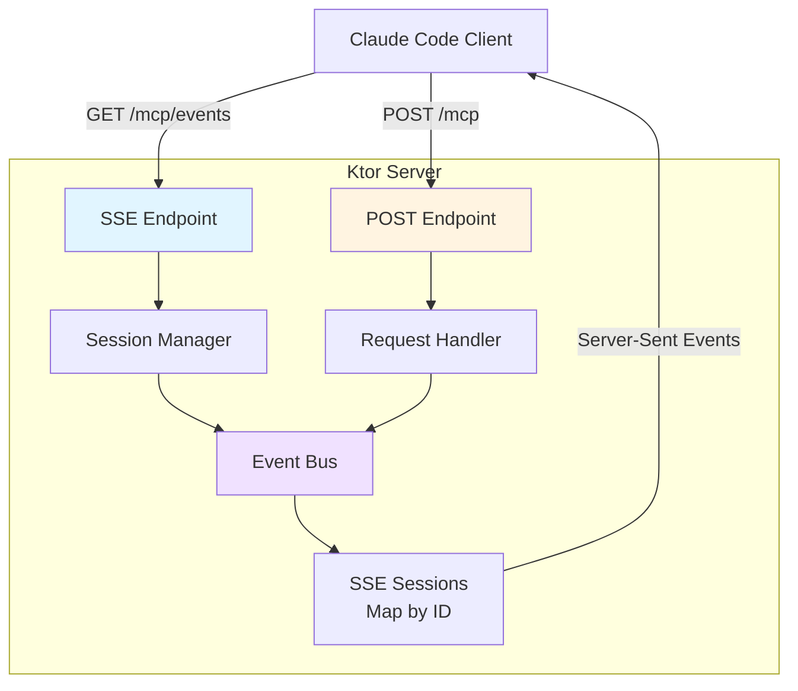
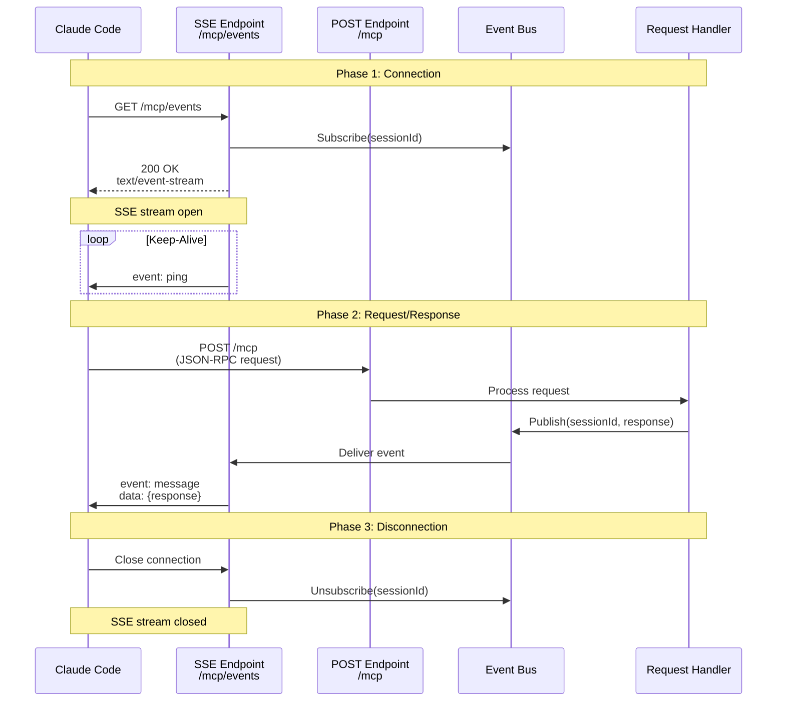

# SSE Transport Pattern for MCP

> [!WARNING]
> **DEPRECATED**: This pattern was removed in SPI-763 (October 2025)
>
> SSE transport was deprecated in MCP specification 2025-06-18 and removed from CycleTime in favor of Streamable HTTP transport. Claude Code v2.0.25 removed SSE support from native builds, making this transport obsolete. This document is preserved for historical reference only.
>
> **Current Implementation**: See [MCP Streamable HTTP Decision](../../../architecture/mcp-streamable-http-decision.md) for the current transport implementation.

## Overview

Server-Sent Events (SSE) provide the unidirectional server-to-client streaming channel required by MCP. This pattern documents how to implement SSE transport in Ktor for reliable, efficient MCP communication.

### Why SSE for MCP?

MCP uses a dual-transport model:
- **SSE**: Server pushes responses and events to client (unidirectional)
- **HTTP POST**: Client sends requests to server (traditional request/response)

**Advantages of SSE**:
- Built-in reconnection handling
- Simple text-based protocol
- HTTP/2 compatible
- Browser and tool support
- Lower overhead than WebSockets

## SSE Architecture in CycleTime

### Component Overview



### Request Flow



## Implementation

### 1. Ktor SSE Configuration

**Application.kt** - SSE plugin setup:

```kotlin
import io.ktor.server.application.*
import io.ktor.server.sse.*

fun Application.configureMCP() {
    // Install SSE plugin
    install(SSE)

    // Configure routing
    configureMCPRouting()
}
```

### 2. SSE Endpoint Implementation

**MCPRouting.kt** - SSE endpoint:

```kotlin
import io.ktor.server.routing.*
import io.ktor.server.sse.*
import io.ktor.sse.*
import kotlinx.coroutines.delay
import org.slf4j.LoggerFactory

fun Application.configureMCPRouting() {
    val logger = LoggerFactory.getLogger("MCPRouting")
    val sessionManager = MCPSessionManager()

    routing {
        // SSE endpoint for server-to-client streaming
        sse("/mcp/events") {
            val sessionId = generateSessionId()
            logger.info("MCP SSE client connected: $sessionId")

            try {
                // Register session
                sessionManager.registerSession(sessionId, this)

                // Keep connection alive
                while (true) {
                    send(ServerSentEvent(data = "ping", event = "ping"))
                    delay(30_000) // 30 second keep-alive
                }
            } catch (e: CancellationException) {
                logger.info("MCP SSE client disconnected: $sessionId")
            } catch (e: Exception) {
                logger.error("Error in MCP SSE session $sessionId", e)
            } finally {
                // Cleanup session
                sessionManager.unregisterSession(sessionId)
            }
        }

        // POST endpoint for client-to-server requests
        post("/mcp") {
            handlePostRequest(call, sessionManager)
        }
    }
}

private fun generateSessionId(): String {
    return "mcp_${System.currentTimeMillis()}_${Random.nextInt()}"
}
```

### 3. Session Management

**MCPSessionManager.kt** - Track active SSE sessions:

```kotlin
import io.ktor.server.sse.*
import kotlinx.coroutines.channels.Channel
import kotlinx.serialization.json.JsonElement
import java.util.concurrent.ConcurrentHashMap

/**
 * Manages active MCP SSE sessions
 */
class MCPSessionManager {
    private val logger = LoggerFactory.getLogger(MCPSessionManager::class.java)
    private val sessions = ConcurrentHashMap<String, MCPSession>()

    /**
     * Register new SSE session
     */
    fun registerSession(sessionId: String, sseSession: ServerSentEventSession) {
        val session = MCPSession(sessionId, sseSession)
        sessions[sessionId] = session
        logger.info("Registered MCP session: $sessionId")
    }

    /**
     * Unregister SSE session
     */
    fun unregisterSession(sessionId: String) {
        sessions.remove(sessionId)?.also {
            it.close()
            logger.info("Unregistered MCP session: $sessionId")
        }
    }

    /**
     * Send message to specific session
     */
    suspend fun sendToSession(sessionId: String, message: JsonElement) {
        sessions[sessionId]?.send(message)
            ?: logger.warn("Attempted to send to non-existent session: $sessionId")
    }

    /**
     * Send message to all sessions
     */
    suspend fun broadcast(message: JsonElement) {
        sessions.values.forEach { it.send(message) }
    }

    /**
     * Get active session count
     */
    fun getActiveSessionCount(): Int = sessions.size
}

/**
 * Represents an active MCP SSE session
 */
data class MCPSession(
    val id: String,
    private val sseSession: ServerSentEventSession
) {
    private val logger = LoggerFactory.getLogger(MCPSession::class.java)

    /**
     * Send JSON-RPC response via SSE
     */
    suspend fun send(message: JsonElement) {
        try {
            sseSession.send(ServerSentEvent(
                data = message.toString(),
                event = "message"
            ))
            logger.debug("Sent message to session $id")
        } catch (e: Exception) {
            logger.error("Failed to send message to session $id", e)
            throw e
        }
    }

    /**
     * Close SSE connection
     */
    fun close() {
        logger.debug("Closing session $id")
        // SSE session closed when coroutine completes
    }
}
```

### 4. POST Request Handling with SSE Response

**MCPPostHandler.kt** - Handle POST requests and respond via SSE:

```kotlin
import io.ktor.server.application.*
import io.ktor.server.request.*
import io.ktor.server.response.*
import io.ktor.http.*
import kotlinx.serialization.json.*

suspend fun handlePostRequest(
    call: ApplicationCall,
    sessionManager: MCPSessionManager
) {
    val logger = LoggerFactory.getLogger("MCPPostHandler")

    try {
        // Parse JSON-RPC request
        val requestBody = call.receiveText()
        val request = Json.parseToJsonElement(requestBody).jsonObject

        // Extract session ID from headers or request
        val sessionId = call.request.header("X-MCP-Session-ID")
            ?: request["sessionId"]?.jsonPrimitive?.content
            ?: run {
                call.respond(HttpStatusCode.BadRequest, "Missing session ID")
                return
            }

        // Process request (delegate to handler)
        val response = processJsonRpcRequest(request)

        // Send response via SSE stream
        sessionManager.sendToSession(sessionId, response)

        // Acknowledge POST request
        call.respond(HttpStatusCode.Accepted)

    } catch (e: Exception) {
        logger.error("Error processing POST request", e)
        call.respond(
            HttpStatusCode.InternalServerError,
            mapOf("error" to e.message)
        )
    }
}
```

## Connection Lifecycle

### Phase 1: Connection Establishment

```kotlin
// Client connects to SSE endpoint
sse("/mcp/events") {
    val sessionId = generateSessionId()

    // Register session for message delivery
    sessionManager.registerSession(sessionId, this)

    // Send session ID to client
    send(ServerSentEvent(
        data = Json.encodeToString(mapOf("sessionId" to sessionId)),
        event = "connected"
    ))

    // ... keep-alive loop ...
}
```

### Phase 2: Keep-Alive

SSE connections require periodic keep-alive to prevent timeouts:

```kotlin
try {
    while (true) {
        // Send ping every 30 seconds
        send(ServerSentEvent(data = "ping", event = "ping"))
        delay(30_000)
    }
} catch (e: CancellationException) {
    // Connection closed normally
}
```

### Phase 3: Message Delivery

Messages sent via EventBus or SessionManager:

```kotlin
// From POST handler
suspend fun handleToolCall(sessionId: String, toolRequest: JsonObject) {
    val result = executeTool(toolRequest)

    // Send result via SSE
    sessionManager.sendToSession(sessionId, buildJsonObject {
        put("jsonrpc", "2.0")
        put("id", toolRequest["id"])
        put("result", result)
    })
}
```

### Phase 4: Disconnection

Cleanup when client disconnects:

```kotlin
finally {
    // Unregister session
    sessionManager.unregisterSession(sessionId)

    // Close resources
    session.close()
}
```

## Event Bus Pattern (Alternative Architecture)

For more complex scenarios with multiple producers:

```kotlin
class EventBus {
    private val channels = ConcurrentHashMap<String, Channel<ServerEvent>>()

    suspend fun subscribe(sessionId: String): Channel<ServerEvent> {
        return channels.getOrPut(sessionId) {
            Channel(Channel.UNLIMITED)
        }
    }

    suspend fun publish(sessionId: String, event: ServerEvent) {
        channels[sessionId]?.send(event) ?: run {
            logger.warn("No channel for session: $sessionId")
        }
    }

    fun unsubscribe(sessionId: String) {
        channels.remove(sessionId)?.close()
    }
}

data class ServerEvent(
    val type: String,
    val data: JsonElement
)

// Usage in SSE endpoint
sse("/mcp/events") {
    val sessionId = generateSessionId()
    val channel = eventBus.subscribe(sessionId)

    try {
        for (event in channel) {
            send(ServerSentEvent(
                data = event.data.toString(),
                event = event.type
            ))
        }
    } finally {
        eventBus.unsubscribe(sessionId)
    }
}
```

## Error Handling

### Connection Errors

```kotlin
sse("/mcp/events") {
    try {
        // ... normal flow ...
    } catch (e: CancellationException) {
        logger.info("Client disconnected gracefully")
        throw e // Re-throw to complete coroutine
    } catch (e: IOException) {
        logger.error("Network error in SSE connection", e)
        // Connection broken, cleanup happens in finally
    } catch (e: Exception) {
        logger.error("Unexpected error in SSE connection", e)
        // Send error event if possible
        try {
            send(ServerSentEvent(
                data = Json.encodeToString(mapOf("error" to e.message)),
                event = "error"
            ))
        } catch (sendError: Exception) {
            // Connection already closed
        }
    } finally {
        cleanup(sessionId)
    }
}
```

### Message Delivery Failures

```kotlin
suspend fun MCPSession.send(message: JsonElement) {
    try {
        sseSession.send(ServerSentEvent(
            data = message.toString(),
            event = "message"
        ))
    } catch (e: Exception) {
        logger.error("Failed to send message, session may be closed", e)
        // Don't throw - session will be cleaned up by connection handler
    }
}
```

## Performance Monitoring

Track SSE connection metrics:

```kotlin
class MCPMetrics(private val registry: MeterRegistry) {
    private val connectionCounter = registry.counter("mcp.connections")
    private val activeGauge = registry.gauge("mcp.connections.active", sessionManager) {
        it.getActiveSessionCount().toDouble()
    }
    private val messageCounter = registry.counter("mcp.messages.sent")

    fun recordConnection() {
        connectionCounter.increment()
    }

    fun recordMessage() {
        messageCounter.increment()
    }
}

// Usage
sse("/mcp/events") {
    metrics.recordConnection()

    try {
        // ... session handling ...

        send(event)
        metrics.recordMessage()
    } finally {
        // Active gauge automatically updates
    }
}
```

## Testing SSE Connections

### Manual Testing with curl

```bash
# Connect to SSE endpoint
curl -N -H "Accept: text/event-stream" http://localhost:8080/mcp/events

# Expected output:
# event: connected
# data: {"sessionId":"mcp_1234567890_12345"}
#
# event: ping
# data: ping
```

### Automated Testing

See [MCP Testing Pattern](./mcp-testing-pattern.md#sse-connection-testing) for complete test implementation.

## Best Practices

### 1. Keep-Alive Interval

Use 30-second interval to balance connection stability and overhead:

```kotlin
delay(30_000) // 30 seconds
```

**Too short**: Excessive network traffic
**Too long**: Risk of proxy/firewall timeouts

### 2. Graceful Shutdown

Handle application shutdown gracefully:

```kotlin
fun Application.configureMCP() {
    environment.monitor.subscribe(ApplicationStopping) {
        sessionManager.closeAllSessions()
    }
}

class MCPSessionManager {
    suspend fun closeAllSessions() {
        sessions.values.forEach { it.close() }
        sessions.clear()
    }
}
```

### 3. Session ID Management

Use secure, unique session IDs:

```kotlin
import java.util.UUID

fun generateSessionId(): String {
    return "mcp_${UUID.randomUUID()}"
}
```

### 4. Memory Management

Clean up sessions promptly to prevent memory leaks:

```kotlin
finally {
    sessionManager.unregisterSession(sessionId)
    // All session resources released
}
```

### 5. Concurrent Session Limits

Prevent resource exhaustion with connection limits:

```kotlin
class MCPSessionManager(
    private val maxSessions: Int = 100
) {
    fun registerSession(sessionId: String, sseSession: ServerSentEventSession) {
        if (sessions.size >= maxSessions) {
            throw IllegalStateException("Maximum sessions exceeded")
        }
        // ... register session ...
    }
}
```

## Troubleshooting

### Issue: SSE Connection Fails

**Symptoms**: Client can't connect to `/mcp/events`

**Solutions**:
1. Verify SSE plugin installed: `install(SSE)`
2. Check routing configuration
3. Test with curl
4. Check firewall/proxy settings

See [Connection Troubleshooting](../../../guides/troubleshooting/mcp/connection-issues.md) for details.

### Issue: Messages Not Delivered

**Symptoms**: POST requests succeed but client doesn't receive responses

**Solutions**:
1. Verify session ID matches between POST and SSE
2. Check EventBus subscription
3. Enable debug logging
4. Test with MCP Inspector

### Issue: Connection Timeouts

**Symptoms**: SSE connection closes unexpectedly

**Solutions**:
1. Reduce keep-alive interval
2. Check proxy timeout settings
3. Monitor server resource usage
4. Review error logs

## Related Patterns

- [JSON-RPC Pattern](./json-rpc-pattern.md) - Message format and handling
- [Session Integration Pattern](./session-integration-pattern.md) - Session context extraction
- [MCP Testing Pattern](./mcp-testing-pattern.md) - Testing SSE connections

## References

- [Server-Sent Events Standard](https://developer.mozilla.org/en-US/docs/Web/API/Server-sent_events) - SSE specification
- [Ktor SSE Documentation](https://ktor.io/docs/server-sent-events.html) - Ktor SSE implementation
- [MCP Specification](https://modelcontextprotocol.io/) - MCP transport requirements
