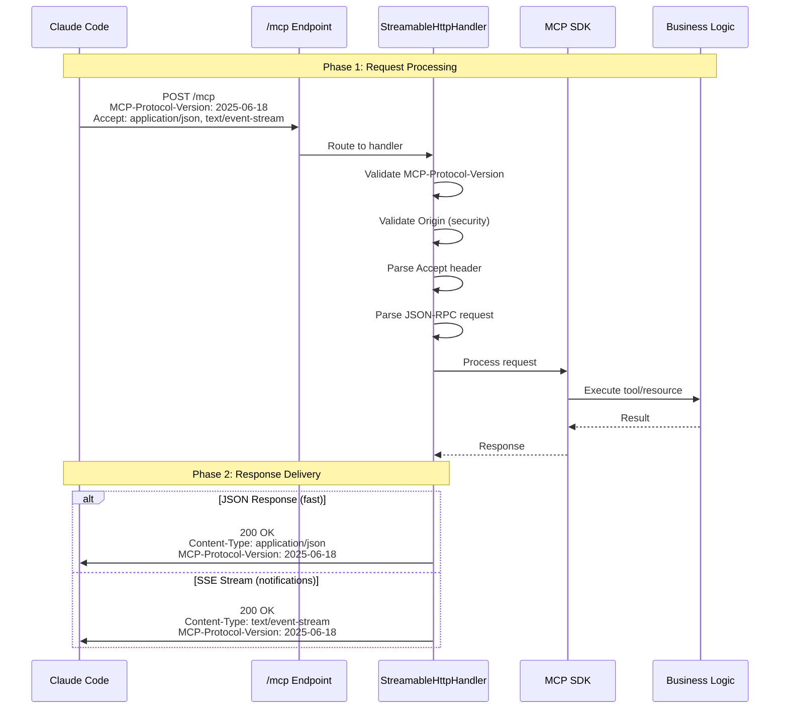

# Streamable HTTP Transport Pattern for MCP

## Overview

Streamable HTTP is the current MCP transport protocol (specification 2025-06-18) that provides a unified single-endpoint approach for client-server communication. This pattern documents how CycleTime implements Streamable HTTP transport using a custom handler on top of Ktor.

### Why Streamable HTTP for MCP?

MCP moved from SSE (Server-Sent Events) to Streamable HTTP transport:

**Advantages of Streamable HTTP**:
- Single endpoint for all communication (simplified routing)
- Serverless-friendly (can be stateless request/response)
- Load balancer compatible (no sticky sessions required)
- Optional SSE streaming when needed
- Required by Claude Code v2.0.25+ (SSE support removed from native builds)

## CycleTime Implementation Status

**Current Implementation**: Custom Streamable HTTP handler (SPI-759, SPI-763)
- SSE transport removed in SPI-763
- Custom handler built on Ktor to bridge to MCP Kotlin SDK v0.7.2
- Single `/mcp` endpoint supporting both POST and GET methods

**Why Custom Handler?**
The MCP Kotlin SDK v0.7.2 does not yet provide server-side Streamable HTTP transport with Ktor (open PR blocked by Ktor routing DSL limitations). CycleTime implements a custom handler that will migrate to official SDK support when available.

## Streamable HTTP Architecture in CycleTime

### Component Overview

```mermaid
graph TB
    Client[Claude Code Client] -->|POST /mcp<br/>Accept: application/json, text/event-stream| Endpoint[/mcp Endpoint]
    Client -->|GET /mcp<br/>Server messages| Endpoint

    subgraph "Ktor Server"
        Endpoint --> Handler[StreamableHttpHandler]
        Handler -->|Parse Accept header| ResponseStrategy[Response Strategy]
        ResponseStrategy -->|JSON| JSONResponse[JSON Response]
        ResponseStrategy -->|SSE| SSEResponse[SSE Stream]

        Handler --> SessionManager[Session Manager]
        Handler --> MCPServer[MCP SDK Server]
        MCPServer --> Tools[Tool Providers]
        MCPServer --> Resources[Resource Providers]
    end

    JSONResponse -->|200 OK<br/>Content-Type: application/json| Client
    SSEResponse -->|200 OK<br/>Content-Type: text/event-stream| Client

    style Endpoint fill:#e1f5ff
    style Handler fill:#fff4e1
    style MCPServer fill:#f0e1ff
```

### Request Flow



## Implementation

### 1. Single Endpoint Configuration

**Application.kt** - Streamable HTTP routing:

```kotlin
import io.ktor.server.application.*
import io.ktor.server.routing.*

fun Application.configureMCP() {
    // Configure MCP routing with Streamable HTTP
    routing {
        configureMCPStreamableHttp()
    }
}
```

### 2. Streamable HTTP Handler Implementation

**StreamableHttpHandler.kt** - Core transport handler:

```kotlin
import io.ktor.server.application.*
import io.ktor.server.request.*
import io.ktor.server.response.*
import io.ktor.server.sse.*
import io.ktor.http.*
import io.ktor.sse.*
import kotlinx.serialization.json.*
import org.slf4j.LoggerFactory

/**
 * Streamable HTTP transport handler for MCP protocol.
 *
 * Implements MCP Specification 2025-06-18 Streamable HTTP transport with:
 * - Single /mcp endpoint for POST and GET requests
 * - Dual-mode responses (JSON or SSE based on Accept header)
 * - Session management via Mcp-Session-Id header
 * - Origin header validation for security
 * - MCP-Protocol-Version header validation
 */
class StreamableHttpHandler(
    private val mcpServer: Server,  // MCP SDK Server instance
    private val sessionManager: SDKSessionManager,
    private val config: StreamableHttpConfig = StreamableHttpConfig()
) {
    companion object {
        private val logger = LoggerFactory.getLogger(StreamableHttpHandler::class.java)
    }

    suspend fun handlePost(call: ApplicationCall) {
        val startTime = System.currentTimeMillis()

        try {
            // 1. Protocol Version: Validate MCP-Protocol-Version header (required in 2025-06-18)
            val protocolVersion = call.request.header("MCP-Protocol-Version")
            validateProtocolVersion(protocolVersion)

            // 2. Security: Validate Origin header (prevent DNS rebinding attacks)
            validateOrigin(call.request.origin)

            // 3. Session Management: Extract session ID
            val sessionId = call.request.header("Mcp-Session-Id")
            logger.debug("Processing POST request with session: $sessionId")

            // 4. Content Negotiation: Parse Accept header
            val acceptHeader = call.request.accept() ?: "application/json"
            val acceptsJSON = acceptHeader.contains("application/json") || acceptHeader.contains("*/*")
            val acceptsSSE = acceptHeader.contains("text/event-stream")

            // 5. Request Processing: Parse JSON-RPC message
            val jsonRpcRequest = call.receiveText()
            val requestJson = Json.parseToJsonElement(jsonRpcRequest)

            // 6. Batch Request Validation: Reject batch requests (removed in 2025-06-18)
            if (requestJson is JsonArray) {
                logger.warn("Batch request rejected (removed in MCP 2025-06-18)")
                return call.respond(HttpStatusCode.BadRequest, buildJsonObject {
                    put("error", "Batch requests are not supported in MCP protocol version 2025-06-18")
                })
            }

            logger.debug("Received JSON-RPC request: ${requestJson.jsonObject["method"]}")

            // 7. Business Logic: Process through MCP SDK
            val response = mcpServer.processRequest(requestJson, sessionId)

            // 8. Response Strategy: Choose based on Accept header
            when {
                acceptsSSE && shouldStreamResponse(requestJson) -> {
                    respondWithSSE(call, response, sessionId)
                }
                acceptsJSON || !acceptsSSE -> {
                    respondWithJSON(call, response, sessionId)
                }
                else -> {
                    call.respond(HttpStatusCode.NotAcceptable)
                }
            }

            val duration = System.currentTimeMillis() - startTime
            logger.info("POST request processed in ${duration}ms")

        } catch (e: InvalidOriginException) {
            logger.warn("Origin validation failed: ${e.message}")
            call.respond(HttpStatusCode.Forbidden, buildJsonObject {
                put("error", "Invalid origin")
            })
        } catch (e: UnsupportedProtocolVersionException) {
            logger.warn("Unsupported protocol version: ${e.message}")
            call.respond(HttpStatusCode.BadRequest, buildJsonObject {
                put("error", e.message)
            })
        } catch (e: Exception) {
            logger.error("POST request failed", e)
            call.respond(HttpStatusCode.InternalServerError, buildJsonObject {
                put("error", e.message)
            })
        }
    }

    suspend fun handleGet(call: ApplicationCall) {
        try {
            // Validate security
            validateOrigin(call.request.origin)

            // Extract session ID (required for GET)
            val sessionId = call.request.header("Mcp-Session-Id")
                ?: return call.respond(HttpStatusCode.BadRequest, buildJsonObject {
                    put("error", "Mcp-Session-Id header required")
                })

            logger.info("Opening SSE stream for session: $sessionId")

            // Open SSE stream for server-initiated messages
            call.response.header("MCP-Protocol-Version", "2025-06-18")
            if (sessionId != null) {
                call.response.header("Mcp-Session-Id", sessionId)
            }

            call.respondSse {
                sessionManager.subscribeToServerMessages(sessionId) { message ->
                    send(ServerSentEvent(
                        data = message.toString(),
                        id = java.util.UUID.randomUUID().toString()
                    ))
                }
            }
        } catch (e: InvalidOriginException) {
            logger.warn("Origin validation failed: ${e.message}")
            call.respond(HttpStatusCode.Forbidden)
        } catch (e: Exception) {
            logger.error("GET request failed", e)
            call.respond(HttpStatusCode.InternalServerError)
        }
    }

    private suspend fun respondWithJSON(
        call: ApplicationCall,
        response: JsonElement,
        sessionId: String?
    ) {
        call.response.header("Content-Type", "application/json")
        call.response.header("MCP-Protocol-Version", "2025-06-18")
        if (sessionId != null) {
            call.response.header("Mcp-Session-Id", sessionId)
        }
        call.respondText(response.toString(), ContentType.Application.Json)
    }

    private suspend fun respondWithSSE(
        call: ApplicationCall,
        response: JsonElement,
        sessionId: String?
    ) {
        call.response.header("MCP-Protocol-Version", "2025-06-18")
        if (sessionId != null) {
            call.response.header("Mcp-Session-Id", sessionId)
        }

        call.respondSse {
            send(ServerSentEvent(
                data = response.toString()
            ))
        }
    }

    private fun validateProtocolVersion(version: String?) {
        when (version) {
            "2025-06-18" -> { /* Current version - OK */ }
            "2025-03-26" -> logger.warn("Legacy protocol version 2025-03-26 detected")
            null -> logger.warn("Missing MCP-Protocol-Version header")
            else -> throw UnsupportedProtocolVersionException("Unsupported protocol version: $version")
        }
    }

    private fun validateOrigin(origin: String?) {
        if (config.validateOrigin && !isAllowedOrigin(origin)) {
            throw InvalidOriginException("Origin not allowed: $origin")
        }
    }

    private fun isAllowedOrigin(origin: String?): Boolean {
        if (origin == null) return config.allowNullOrigin
        return config.allowedOrigins.any { allowed ->
            origin.matches(Regex(allowed))
        }
    }

    private fun shouldStreamResponse(request: JsonElement): Boolean {
        // Determine if response should be streamed based on request type
        val method = request.jsonObject["method"]?.jsonPrimitive?.content
        // Could add logic here for specific methods that benefit from streaming
        return false  // Default to JSON for simplicity
    }
}

data class StreamableHttpConfig(
    val validateOrigin: Boolean = true,
    val allowNullOrigin: Boolean = true,  // For localhost development
    val allowedOrigins: List<String> = listOf(
        "http://localhost:.*",
        "https://.*\\.anthropic\\.com",
        "https://claude\\.ai"
    )
)

class InvalidOriginException(message: String) : Exception(message)
class UnsupportedProtocolVersionException(message: String) : Exception(message)
```

### 3. Routing Configuration

**MCPRouting.kt** - Streamable HTTP endpoint registration:

```kotlin
import io.ktor.server.routing.*
import io.ktor.server.application.*
import org.slf4j.LoggerFactory

fun Routing.configureMCPStreamableHttp() {
    val logger = LoggerFactory.getLogger("MCPRouting")
    val mcpServer: MCPSdkServer by application.dependencies
    val sessionManager: SDKSessionManager by application.dependencies

    val handler = StreamableHttpHandler(
        mcpServer = mcpServer.server,
        sessionManager = sessionManager,
        config = StreamableHttpConfig(
            validateOrigin = true,
            allowedOrigins = listOf(
                "http://localhost:.*",
                "https://.*\\.anthropic\\.com"
            )
        )
    )

    route("/mcp") {
        post {
            handler.handlePost(call)
        }

        get {
            handler.handleGet(call)
        }
    }

    logger.info("MCP Streamable HTTP transport configured at /mcp")
}
```

## Protocol Requirements (MCP Spec 2025-06-18)

### Required Headers

**Client Request Headers**:
```http
POST /mcp HTTP/1.1
Accept: application/json, text/event-stream
Content-Type: application/json
MCP-Protocol-Version: 2025-06-18
Mcp-Session-Id: <optional-session-id>
Origin: <client-origin>
```

**Server Response Headers**:
```http
HTTP/1.1 200 OK
Content-Type: application/json
MCP-Protocol-Version: 2025-06-18
Mcp-Session-Id: <session-id>
```

### Key Protocol Changes from SSE Transport

| Aspect | SSE Transport (Old, Removed) | Streamable HTTP (Current) |
|--------|---------------------------|----------------------|
| **Endpoints** | Separate (`/` POST, `/events` SSE) | Single (`/mcp` for both) |
| **Response Type** | Always SSE for events | Server chooses (JSON or SSE) |
| **Connections** | Long-lived persistent SSE | Optional SSE, can be stateless |
| **Protocol Header** | Not required | `MCP-Protocol-Version` REQUIRED |
| **Batch Requests** | Supported | Removed (rejected with error) |
| **Claude Code Support** | Deprecated (removed in v2.0.25) | Required |

## Connection Lifecycle

### Phase 1: Client Connection

```kotlin
// Client connects to single /mcp endpoint
// POST for requests, GET for server-initiated messages

// Server routes to handler
route("/mcp") {
    post { handler.handlePost(call) }
    get { handler.handleGet(call) }
}
```

### Phase 2: Request Processing

```kotlin
suspend fun handlePost(call: ApplicationCall) {
    // 1. Validate protocol version
    val protocolVersion = call.request.header("MCP-Protocol-Version")

    // 2. Validate security (Origin header)
    validateOrigin(call.request.origin)

    // 3. Parse request
    val request = call.receiveText()

    // 4. Process through MCP SDK
    val response = mcpServer.processRequest(request, sessionId)

    // 5. Send response (JSON or SSE)
    respondWithJSON(call, response, sessionId)
}
```

### Phase 3: Response Delivery

**Option A - JSON Response (typical)**:
```http
HTTP/1.1 200 OK
Content-Type: application/json
MCP-Protocol-Version: 2025-06-18
Mcp-Session-Id: abc-123

{
  "jsonrpc": "2.0",
  "id": 1,
  "result": { ... }
}
```

**Option B - SSE Stream (server messages)**:
```http
HTTP/1.1 200 OK
Content-Type: text/event-stream
MCP-Protocol-Version: 2025-06-18
Mcp-Session-Id: abc-123

data: {"jsonrpc":"2.0","method":"notifications/resources/updated","params":{...}}

```

## Error Handling

### Protocol Validation Errors

```kotlin
// Missing protocol version header
if (protocolVersion == null) {
    logger.warn("Missing MCP-Protocol-Version header")
    // Still process (backward compatibility)
}

// Unsupported protocol version
if (!supportedVersions.contains(protocolVersion)) {
    throw UnsupportedProtocolVersionException(protocolVersion)
}
```

### Security Validation Errors

```kotlin
// Invalid origin (DNS rebinding attack prevention)
if (!isAllowedOrigin(origin)) {
    logger.warn("Origin validation failed: $origin")
    call.respond(HttpStatusCode.Forbidden, mapOf("error" to "Invalid origin"))
    return
}
```

### Request Processing Errors

```kotlin
try {
    val response = mcpServer.processRequest(request, sessionId)
    respondWithJSON(call, response, sessionId)
} catch (e: JsonRpcException) {
    // JSON-RPC protocol errors
    call.respond(HttpStatusCode.OK, buildJsonObject {
        put("jsonrpc", "2.0")
        put("id", requestId)
        put("error", buildJsonObject {
            put("code", e.code)
            put("message", e.message)
        })
    })
} catch (e: Exception) {
    // Internal server errors
    logger.error("Request processing failed", e)
    call.respond(HttpStatusCode.InternalServerError, mapOf("error" to e.message))
}
```

## Performance Monitoring

Track Streamable HTTP metrics:

```kotlin
class StreamableHttpMetrics(private val registry: MeterRegistry) {
    private val requestCounter = registry.counter("mcp.requests.total")
    private val requestDuration = registry.timer("mcp.request.duration")
    private val errorCounter = registry.counter("mcp.errors.total")

    fun recordRequest() {
        requestCounter.increment()
    }

    fun recordDuration(durationMs: Long) {
        requestDuration.record(durationMs, TimeUnit.MILLISECONDS)
    }

    fun recordError() {
        errorCounter.increment()
    }
}

// Usage
suspend fun handlePost(call: ApplicationCall) {
    val startTime = System.currentTimeMillis()
    metrics.recordRequest()

    try {
        // Process request
    } catch (e: Exception) {
        metrics.recordError()
        throw e
    } finally {
        val duration = System.currentTimeMillis() - startTime
        metrics.recordDuration(duration)
    }
}
```

## Testing Streamable HTTP

### Manual Testing with curl

```bash
# Test POST endpoint with JSON response
curl -X POST http://localhost:8080/mcp \
  -H "Content-Type: application/json" \
  -H "Accept: application/json" \
  -H "MCP-Protocol-Version: 2025-06-18" \
  -d '{"jsonrpc":"2.0","id":1,"method":"resources/list","params":{}}'

# Expected output:
# HTTP/1.1 200 OK
# Content-Type: application/json
# MCP-Protocol-Version: 2025-06-18
#
# {"jsonrpc":"2.0","id":1,"result":{"resources":[...]}}
```

### Automated Testing

See [MCP Testing Pattern](./mcp-testing-pattern.md) for comprehensive test implementation.

## Best Practices

### 1. Protocol Version Handling

Support current and legacy protocol versions:

```kotlin
private fun validateProtocolVersion(version: String?) {
    when (version) {
        "2025-06-18" -> { /* Current - OK */ }
        "2025-03-26" -> logger.warn("Legacy version")
        null -> logger.warn("Missing version header")
        else -> throw UnsupportedProtocolVersionException(version)
    }
}
```

### 2. Origin Validation

Always validate Origin header for security:

```kotlin
private val allowedOrigins = listOf(
    "http://localhost:.*",  // Development
    "https://.*\\.anthropic\\.com",  // Production
    "https://claude\\.ai"  // Production
)

private fun isAllowedOrigin(origin: String?): Boolean {
    if (origin == null && config.allowNullOrigin) return true
    return allowedOrigins.any { pattern ->
        origin?.matches(Regex(pattern)) == true
    }
}
```

### 3. Session ID Management

Use secure, unique session IDs:

```kotlin
import java.util.UUID

fun generateSessionId(): String {
    return UUID.randomUUID().toString()  // Cryptographically secure
}
```

### 4. Response Type Selection

Choose appropriate response type based on use case:

```kotlin
private fun shouldUseSSE(request: JsonElement): Boolean {
    val method = request.jsonObject["method"]?.jsonPrimitive?.content

    // Use SSE for long-running operations or notifications
    return when (method) {
        "notifications/initialized" -> true
        "notifications/resources/updated" -> true
        else -> false  // Default to JSON
    }
}
```

### 5. Graceful Error Handling

Provide clear error messages:

```kotlin
catch (e: InvalidOriginException) {
    call.respond(HttpStatusCode.Forbidden, buildJsonObject {
        put("error", "Invalid origin")
        put("message", "Origin header validation failed")
    })
}
```

## Troubleshooting

### Issue: Connection Refused

**Symptoms**: Client can't connect to `/mcp`

**Solutions**:
1. Verify server is running: `curl http://localhost:8080/mcp`
2. Check routing configuration
3. Verify port is not blocked by firewall

See [Connection Troubleshooting](../../guides/troubleshooting/mcp/connection-issues.md) for details.

### Issue: Protocol Version Errors

**Symptoms**: "Unsupported protocol version" errors

**Solutions**:
1. Verify client sends `MCP-Protocol-Version: 2025-06-18` header
2. Check server supports the requested version
3. Update client or server to compatible version

### Issue: Origin Validation Failures

**Symptoms**: 403 Forbidden responses

**Solutions**:
1. Check Origin header in request
2. Verify origin matches allowed patterns
3. Add client origin to allowed list if legitimate
4. For development, temporarily allow null origin

## Migration from SSE Transport

If upgrading from SSE transport (removed in SPI-763):

### Configuration Changes

**Old (.mcp.json)**:
```json
{
  "mcpServers": {
    "cycletime": {
      "type": "sse",
      "url": "http://localhost:8080/"
    }
  }
}
```

**New (.mcp.json)**:
```json
{
  "mcpServers": {
    "cycletime": {
      "type": "streamable-http",
      "url": "http://localhost:8080/mcp"
    }
  }
}
```

### Code Changes

**Old (SSE routing)**:
```kotlin
// Separate SSE and POST endpoints
sse("/mcp/events") { /* SSE logic */ }
post("/mcp") { /* POST logic */ }
```

**New (Streamable HTTP routing)**:
```kotlin
// Single unified endpoint
route("/mcp") {
    post { handler.handlePost(call) }
    get { handler.handleGet(call) }
}
```

## Related Patterns

- [JSON-RPC Pattern](./json-rpc-pattern.md) - Message format and handling
- [Session Integration Pattern](./session-integration-pattern.md) - Session context extraction
- [MCP Testing Pattern](./mcp-testing-pattern.md) - Testing Streamable HTTP connections

## References

- [MCP Specification 2025-06-18](https://modelcontextprotocol.io/specification/2025-06-18) - Current spec
- [Streamable HTTP Transport](https://modelcontextprotocol.io/specification/2025-06-18/basic/transports/) - Transport specification
- [Ktor Documentation](https://ktor.io/docs/) - Ktor framework
- [SPI-759: Streamable HTTP Implementation](../../architecture/mcp-streamable-http-decision.md) - Architecture decision
- [SPI-763: SSE Transport Removal](../../architecture/mcp-streamable-http-decision.md#spi-763-sse-removal-completed) - SSE removal completion
