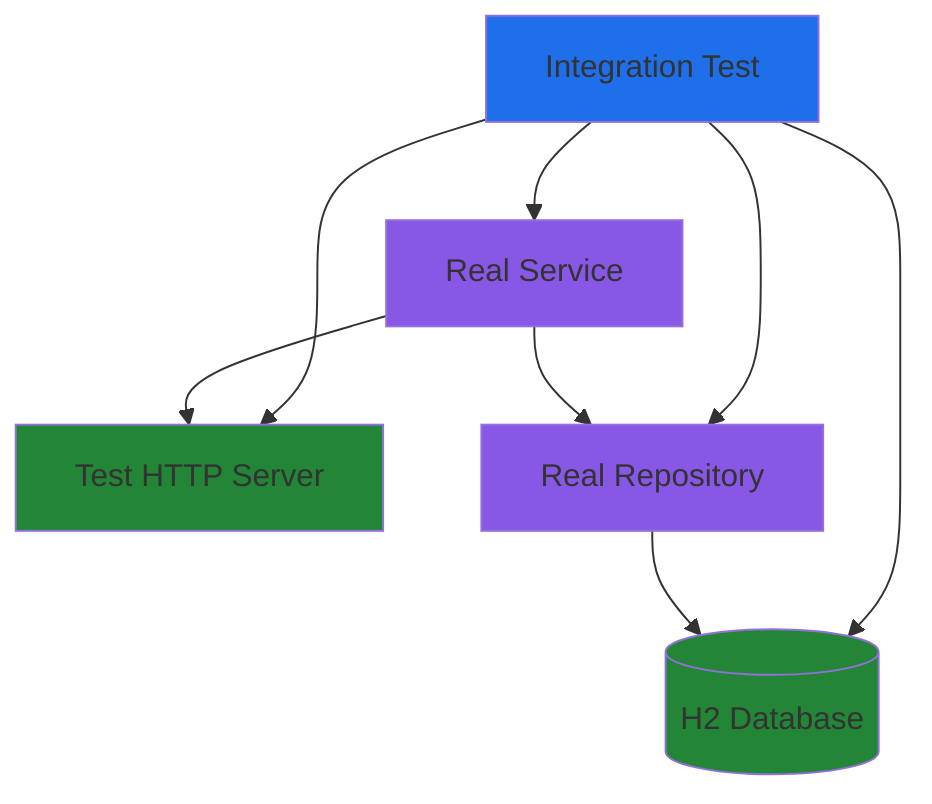

# Integration Test Pattern

## Problem

How do we verify that components work correctly when integrated with real infrastructure like databases, HTTP clients, and messaging systems? Unit tests with mocks cannot catch integration bugs such as SQL errors, serialization failures, or connection pooling issues.

## Solution

**Integration tests** exercise components with real infrastructure in controlled test environments. Tests use in-memory databases, test containers, and isolated resources to validate integration points while maintaining reasonable speed (< 100ms per test).

The pattern involves:

1. **Real infrastructure**: H2 in-memory database, embedded servers
2. **Controlled environment**: Fresh database per test, isolated network resources
3. **Focused scope**: Test one integration point at a time
4. **Explicit cleanup**: Proper resource lifecycle management

## Implementation

### Structure



### Key Components

- **Test Spec**: Kotest spec with lifecycle hooks
- **Test Database**: H2 in-memory instance per test
- **Real Implementations**: Repositories, services, HTTP clients
- **Cleanup Hooks**: `afterEach` for resource disposal

### Code Skeleton

```kotlin
import io.kotest.core.spec.style.DescribeSpec
import org.jetbrains.exposed.sql.Database
import org.jetbrains.exposed.sql.SchemaUtils
import org.jetbrains.exposed.sql.transactions.transaction

class RepositoryIntegrationTest : DescribeSpec({
    lateinit var database: Database
    lateinit var repository: Repository

    beforeEach {
        // Fresh database for each test
        database = Database.connect(
            "jdbc:h2:mem:test_${UUID.randomUUID()};DB_CLOSE_DELAY=-1"
        )
        transaction(database) {
            SchemaUtils.create(Tables.all)
        }
        repository = RealRepository(database, RealTimeProvider())
    }

    afterEach {
        // Explicit cleanup prevents leaks
        TransactionManager.closeAndUnregister(database)
    }

    describe("Repository") {
        it("should persist and retrieve entity") {
            // Test with real database operations
            val entity = createTestEntity()
            repository.save(entity)

            val retrieved = repository.findById(entity.id)
            retrieved shouldNotBe null
        }
    }
})
```

## Considerations

### When to Use

- Testing repository implementations with databases
- Testing HTTP API endpoints
- Testing serialization/deserialization
- Testing transaction boundaries
- Testing database migrations
- Testing connection pooling behavior

### When NOT to Use

- Testing business logic only (use unit tests)
- Testing complete end-to-end workflows (use system tests)
- Testing performance under load (use system tests)
- Testing UI interactions (use system tests)

## Trade-offs

**Pros**:
- **Real integration bugs**: Catches SQL errors, serialization issues, connection problems
- **Moderate speed**: < 100ms per test is acceptable for development
- **Confidence**: Validates actual component interactions
- **Database validation**: Tests real queries against actual schema

**Cons**:
- **Slower than unit tests**: 10-100x slower than unit tests
- **More setup**: Requires database initialization and cleanup
- **Test isolation complexity**: Must ensure tests don't interfere
- **Debugging difficulty**: Failures may involve multiple components

## Related Patterns

- [Unit Test Pattern](unit-test-pattern.md) - Faster tests for business logic
- [System Test Pattern](system-test-pattern.md) - Complete workflow testing
- [Integration Test Database Examples](../../examples/tests/integration-test-database.md) - Complete examples

## Examples

- [Integration Test Database](../../examples/tests/integration-test-database.md) - H2 setup, transaction patterns, cleanup
