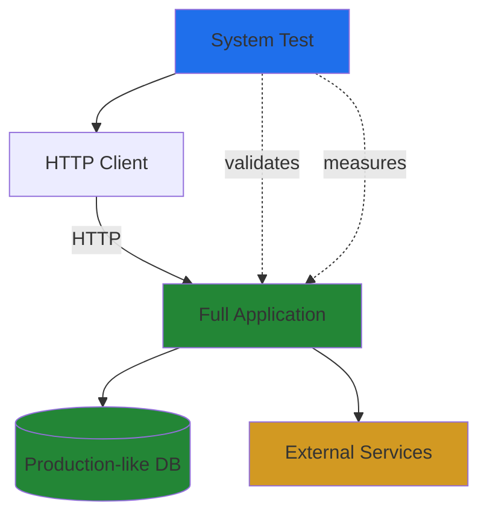

# System Test Pattern

## Problem

How do we verify that the complete system works correctly under production-like conditions? Unit and integration tests validate individual components, but they don't catch issues that only appear when the full system is running, such as performance degradation, resource exhaustion, or complex workflow failures.

## Solution

**System tests** exercise complete end-to-end workflows with production-like infrastructure. These tests validate that critical user paths work correctly under realistic conditions, including performance characteristics and error handling.

The pattern involves:

1. **Complete workflows**: Full request-to-response cycles
2. **Production-like setup**: Real databases, real HTTP servers, realistic data volumes
3. **Performance validation**: Tests verify speed and resource usage
4. **Error scenario testing**: Network failures, timeouts, resource exhaustion

## Implementation

### Structure



### Key Components

- **Test Framework**: Kotest with system test configuration
- **Full Application**: Complete Ktor server with all plugins
- **Production-like Data**: Realistic data volumes and relationships
- **Performance Metrics**: Timing, memory usage, throughput

### Code Skeleton

```kotlin
import io.kotest.core.spec.style.DescribeSpec
import io.ktor.client.request.*
import io.ktor.client.statement.*
import io.ktor.server.testing.*
import kotlin.system.measureTimeMillis

class WorkflowSystemTest : DescribeSpec({
    describe("Complete Issue Workflow") {
        it("should handle full lifecycle under load") {
            testApplication {
                application {
                    configureFullApplication() // All plugins, real DI
                }

                // Measure performance
                val time = measureTimeMillis {
                    // Create project
                    val project = client.post("/api/v1/projects") {
                        setBody(projectJson)
                    }

                    // Create issues
                    repeat(100) {
                        client.post("/api/v1/projects/${project.id}/issues") {
                            setBody(issueJson)
                        }
                    }

                    // Verify workflow
                    val issues = client.get("/api/v1/projects/${project.id}/issues")
                    issues.status shouldBe HttpStatusCode.OK
                }

                // Validate performance
                time shouldBeLessThan 1000
            }
        }
    }
})
```

## Considerations

### When to Use

- Testing critical end-to-end user workflows
- Validating performance under realistic load
- Testing error recovery and resilience
- Validating system-wide integrations
- Performance regression detection

### When NOT to Use

- Testing individual component logic (use unit tests)
- Testing component integrations (use integration tests)
- Testing all edge cases (use unit/integration tests)
- Frequent test execution during development (too slow)

## Trade-offs

**Pros**:
- **Complete validation**: Tests the full system as users experience it
- **Performance insights**: Measures actual system performance
- **Production confidence**: Validates production-ready behavior
- **Integration validation**: Catches cross-component issues

**Cons**:
- **Slow execution**: Takes seconds per test
- **Complex debugging**: Failures may involve many components
- **Fragile**: Can break due to timing, network, or external service issues
- **Expensive maintenance**: Changes often require test updates

## Related Patterns

- [Unit Test Pattern](unit-test-pattern.md) - Fast business logic validation
- [Integration Test Pattern](integration-test-pattern.md) - Component integration testing
- [Performance Testing](../../testing/performance-testing.md) - Detailed performance analysis

## Examples

- [End-to-End Workflow Test](../../examples/tests/e2e-workflow.md) - Complete issue workflow example
