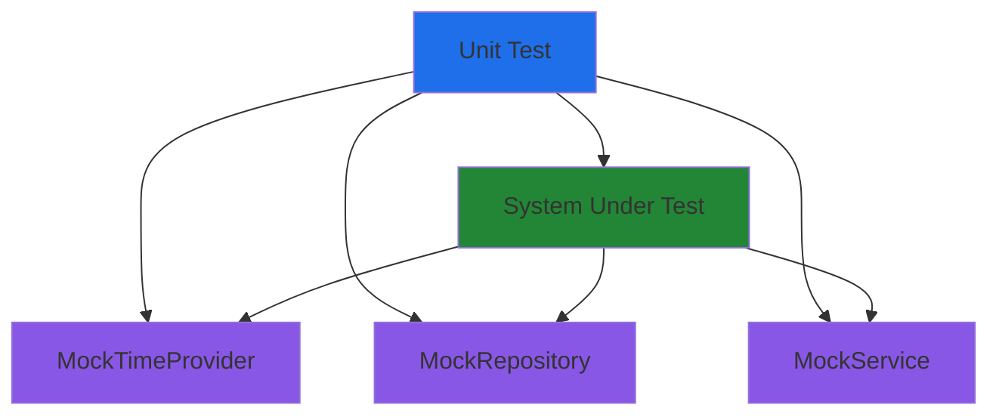

# Unit Test Pattern

## Problem

How do we test business logic quickly and reliably without depending on external systems like databases, networks, or file systems? Tests that depend on external infrastructure are slow, flaky, and difficult to maintain.

## Solution

**Unit tests** isolate business logic by replacing all external dependencies with mocks or fakes. This enables fast execution (< 10ms per test), deterministic results, and focused failure messages.

The pattern involves:

1. **Mocking external dependencies**: Use MockK or custom fakes for all I/O
2. **Testing business logic only**: Focus on domain entities, value objects, and pure functions
3. **Controlling time**: Use `MockTimeProvider` for predictable time-dependent tests
4. **Isolation**: Each test gets fresh instances with no shared state

## Implementation

### Structure



### Key Components

- **Test Spec**: Kotest spec (DescribeSpec, StringSpec) organizing test cases
- **Mock Dependencies**: MockK mocks or custom fakes for external systems
- **System Under Test (SUT)**: The component being tested
- **Assertions**: Kotest matchers validating behavior

### Code Skeleton

```kotlin
import io.kotest.core.spec.style.DescribeSpec
import io.kotest.matchers.shouldBe
import io.mockk.mockk
import io.mockk.every

class ComponentTest : DescribeSpec({
    // Test state
    lateinit var mockDependency: DependencyInterface
    lateinit var systemUnderTest: ComponentToTest

    beforeEach {
        // Fresh mocks for each test
        mockDependency = mockk()
        systemUnderTest = ComponentToTest(mockDependency)
    }

    describe("ComponentToTest") {
        describe("when calling method") {
            it("should behave correctly") {
                // Arrange
                every { mockDependency.operation() } returns expectedValue

                // Act
                val result = systemUnderTest.method()

                // Assert
                result shouldBe expectedResult
            }
        }
    }
})
```

## Considerations

### When to Use

- Testing domain entities with business rules
- Testing value objects with validation
- Testing application services with mocked repositories
- Testing pure functions and algorithms
- Testing time-dependent logic with MockTimeProvider

### When NOT to Use

- Testing database queries (use integration tests)
- Testing HTTP endpoints (use integration tests)
- Testing component interactions (use integration tests)
- Testing performance characteristics (use system tests)

## Trade-offs

**Pros**:
- **Fast execution**: < 10ms per test enables tight feedback loops
- **No external dependencies**: Tests run anywhere without setup
- **Deterministic**: Same input always produces same output
- **Focused failures**: Test failures pinpoint exact business logic issues

**Cons**:
- **Mocking overhead**: Creating and maintaining mocks adds complexity
- **Implementation coupling**: Tests can become coupled to implementation details
- **Limited scope**: Cannot catch integration bugs
- **Mock accuracy**: Mocks may not accurately reflect real dependency behavior

## Related Patterns

- [Integration Test Pattern](integration-test-pattern.md) - Testing with real infrastructure
- [Test Architecture](../../concepts/testing/test-architecture.md) - Designing for testability
- [Unit Test Mocking Examples](../../examples/tests/unit-test-mocking.md) - Complete working examples

## Examples

- [Unit Test Mocking](../../examples/tests/unit-test-mocking.md) - TimeProvider and Repository mocking examples
