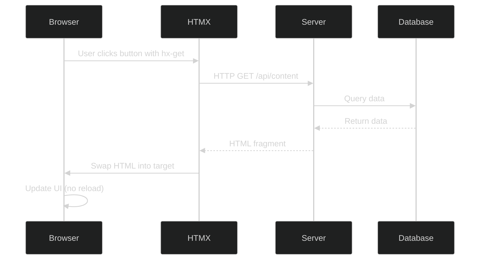

# HTMX Patterns for Server-Driven UIs

## Problem

Modern web applications often require dynamic, interactive user experiences. Traditional approaches present two extremes:

1. **Full Page Reloads**: Simple but slow, poor UX, lost scroll position
2. **Heavy SPAs**: Complex state management, large JavaScript bundles, poor SEO, difficult to maintain

**The Challenge**: How do we build interactive UIs that are:
- Fast and responsive
- Simple to maintain
- Work without JavaScript (progressive enhancement)
- Don't require megabytes of client-side framework code
- Keep business logic on the server where it's secure and testable

## Solution

**HTMX** enables server-driven interactivity through HTML attributes. The server returns HTML fragments (not JSON), which HTMX swaps into the page without full reloads.

**Core Philosophy**:
- HTML is the API response format (hypermedia)
- Server is the source of truth
- Minimal client-side state
- Progressive enhancement (works without JS)
- Use standard HTTP methods and status codes

## Implementation

### Structure



### Key Components

**1. HTMX Attributes**: Declarative triggers and targets
- `hx-get`, `hx-post`, `hx-put`, `hx-delete`: HTTP methods
- `hx-trigger`: When to fire (click, change, revealed, etc.)
- `hx-target`: Where to put the response
- `hx-swap`: How to swap content (innerHTML, outerHTML, beforeend, etc.)
- `hx-indicator`: Loading state element

**2. Server-Side Rendering**: Server returns HTML fragments
- Ktor HTML DSL generates type-safe HTML
- Returns fragments for HTMX, full pages for direct navigation
- Business logic stays on server

**3. Progressive Enhancement**: Base HTML works without JavaScript
- Links and forms work without HTMX
- HTMX enhances with better UX
- Graceful degradation for accessibility

### Pattern 1: Lazy Loading Content

**Use Case**: Load content on demand to reduce initial page size

```kotlin
// Ktor route - returns HTML fragment
get("/dashboard/stories/{storyId}/subtasks") {
    val storyId = call.parameters["storyId"] ?: return@get call.respond(
        HttpStatusCode.BadRequest,
        "Missing storyId"
    )

    val service: DashboardApplicationService by application.dependencies
    val subtasks = service.getStorySubtasks(storyId)

    call.respondHtml(HttpStatusCode.OK) {
        // HTML fragment, not full page
        div {
            subtasks.forEach { subtask ->
                div(classes = "flex items-center gap-2 text-sm text-gray-400") {
                    span { +"📝" }
                    span { +subtask.title }
                    span(classes = "text-xs px-2 py-1 rounded bg-blue-900 text-blue-300") {
                        +"${subtask.estimate} pts"
                    }
                }
            }
        }
    }
}
```

```kotlin
// HTML with HTMX attributes
fun FlowContent.storyNode(story: IssueViewDTO) {
    div(classes = "bg-gray-900 rounded p-3") {
        // Expandable button
        if (story.childCount > 0) {
            button(
                classes = "text-xs text-blue-400 hover:underline",
                type = ButtonType.button
            ) {
                attributes["hx-get"] = "/dashboard/stories/${story.id}/subtasks"
                attributes["hx-target"] = "#subtasks-${story.id}"
                attributes["hx-swap"] = "innerHTML"
                attributes["hx-indicator"] = "#spinner-${story.id}"

                +"${story.childCount} subtasks ▼"
            }
        }

        // Target container for lazy-loaded content
        div {
            id = "subtasks-${story.id}"
            classes = setOf("mt-2", "pl-4", "space-y-1")
        }

        // Loading spinner (shown during request)
        div {
            id = "spinner-${story.id}"
            classes = setOf("htmx-indicator", "text-sm", "text-gray-500")
            +"Loading..."
        }
    }
}
```

**Benefits**:
- Reduces initial page load by 50-70% for hierarchical data
- Content loads only when needed
- Server controls HTML structure and styling

### Pattern 2: Infinite Scroll

**Use Case**: Load more content as user scrolls down

```kotlin
// Server endpoint - returns next page of items
get("/api/items") {
    val page = call.request.queryParameters["page"]?.toIntOrNull() ?: 1
    val pageSize = 20

    val service: ItemService by application.dependencies
    val items = service.getItems(page, pageSize)

    call.respondHtml(HttpStatusCode.OK) {
        items.forEach { item ->
            itemCard(item)
        }

        // Next page trigger (revealed when scrolled into view)
        if (items.size == pageSize) {
            div {
                attributes["hx-get"] = "/api/items?page=${page + 1}"
                attributes["hx-trigger"] = "revealed"
                attributes["hx-swap"] = "afterend"

                // Placeholder/loading state
                +"Loading more..."
            }
        }
    }
}
```

```kotlin
// Initial page setup
fun HTML.itemsPage() {
    body {
        div(classes = "container mx-auto p-6") {
            div {
                id = "items-list"

                // Initial items loaded server-side
                items.forEach { item ->
                    itemCard(item)
                }

                // Infinite scroll trigger
                div {
                    attributes["hx-get"] = "/api/items?page=2"
                    attributes["hx-trigger"] = "revealed"
                    attributes["hx-swap"] = "afterend"

                    +"Loading more..."
                }
            }
        }
    }
}
```

**Benefits**:
- Smooth pagination without clicks
- `revealed` trigger fires when element scrolls into view
- Server maintains page state

### Pattern 3: Optimistic UI Updates

**Use Case**: Immediate feedback while server processes request

```kotlin
// Server endpoint - processes form and returns updated HTML
post("/api/items") {
    val name = call.receiveParameters()["name"] ?: return@post call.respond(
        HttpStatusCode.BadRequest,
        "Missing name"
    )

    val service: ItemService by application.dependencies
    val newItem = service.createItem(name)

    call.respondHtml(HttpStatusCode.OK) {
        itemCard(newItem)
    }
}
```

```kotlin
// Form with optimistic update
fun FlowContent.createItemForm() {
    form(
        classes = "flex gap-2"
    ) {
        attributes["hx-post"] = "/api/items"
        attributes["hx-target"] = "#items-list"
        attributes["hx-swap"] = "beforeend"
        attributes["hx-on::before-request"] = "this.reset()" // Clear form immediately

        input(
            type = InputType.text,
            name = "name",
            classes = "px-3 py-2 bg-gray-800 border border-gray-700 rounded"
        ) {
            placeholder = "Item name"
        }

        button(
            type = ButtonType.submit,
            classes = "px-4 py-2 bg-blue-600 text-white rounded hover:bg-blue-700"
        ) {
            +"Add Item"
        }
    }

    div {
        id = "items-list"
        classes = setOf("mt-4", "space-y-2")
    }
}
```

**Benefits**:
- Form resets immediately (feels instant)
- New item appears without page reload
- Server validates and returns canonical HTML

### Pattern 4: Polling for Live Updates

**Use Case**: Keep data fresh with periodic server checks

```kotlin
// Server endpoint - returns current status
get("/api/health") {
    val service: HealthService by application.dependencies
    val health = service.getServiceHealth()

    call.respondHtml(HttpStatusCode.OK) {
        div(classes = "flex items-center gap-2") {
            // Status indicator
            div(classes = "w-2 h-2 rounded-full ${if (health.isHealthy) "bg-green-400" else "bg-red-400"}")
            span(classes = "text-sm ${if (health.isHealthy) "text-green-400" else "text-red-400"}") {
                +health.status
            }
            span(classes = "text-xs text-gray-500") {
                +"${health.projectCount} projects • ${health.issueCount} issues"
            }
        }
    }
}
```

```kotlin
// Polling element
fun FlowContent.healthStatus() {
    div {
        id = "health-status"
        attributes["hx-get"] = "/api/health"
        attributes["hx-trigger"] = "every 5s" // Poll every 5 seconds
        attributes["hx-swap"] = "innerHTML"

        // Initial state
        +"Loading status..."
    }
}
```

**Benefits**:
- Simple polling without WebSockets
- Server-controlled update frequency
- Automatic cleanup when element removed from DOM

### Pattern 5: Form Submission with Validation

**Use Case**: Submit forms with server-side validation and error handling

```kotlin
// Server endpoint with validation
post("/api/projects") {
    val name = call.receiveParameters()["name"]
    val description = call.receiveParameters()["description"]

    // Validate on server
    if (name.isNullOrBlank()) {
        call.respondHtml(HttpStatusCode.UnprocessableEntity) {
            div(classes = "bg-red-900/50 border border-red-700 rounded p-4") {
                p(classes = "text-red-200") {
                    +"Project name is required"
                }
            }
        }
        return@post
    }

    val service: ProjectService by application.dependencies
    val project = service.createProject(name, description)

    // Return success UI
    call.respondHtml(HttpStatusCode.OK) {
        div(classes = "bg-green-900/50 border border-green-700 rounded p-4") {
            p(classes = "text-green-200") {
                +"Project created successfully: ${project.name}"
            }
        }
    }
}
```

```kotlin
// Form with validation feedback
fun FlowContent.projectForm() {
    form(classes = "space-y-4") {
        attributes["hx-post"] = "/api/projects"
        attributes["hx-target"] = "#form-feedback"
        attributes["hx-swap"] = "innerHTML"

        div {
            label(classes = "block text-sm font-medium text-gray-300") {
                +"Project Name"
            }
            input(
                type = InputType.text,
                name = "name",
                classes = "w-full px-3 py-2 bg-gray-800 border border-gray-700 rounded"
            )
        }

        div {
            label(classes = "block text-sm font-medium text-gray-300") {
                +"Description"
            }
            textArea(
                name = "description",
                classes = "w-full px-3 py-2 bg-gray-800 border border-gray-700 rounded"
            ) {
                rows = "3"
            }
        }

        button(
            type = ButtonType.submit,
            classes = "px-4 py-2 bg-blue-600 text-white rounded hover:bg-blue-700"
        ) {
            +"Create Project"
        }

        // Feedback area
        div {
            id = "form-feedback"
            classes = setOf("mt-4")
        }
    }
}
```

**Benefits**:
- Server-side validation (secure)
- Clear error messages
- Success/error states rendered by server

## Considerations

### When to Use

- **Read-Heavy Applications**: Dashboards, content sites, admin panels
- **Hierarchical Data**: Tree structures, nested content
- **Progressive Enhancement**: Need to work without JavaScript
- **Simple State Management**: Server is source of truth
- **Security-Critical**: Business logic must stay on server

### When NOT to Use

- **Complex Client-Side State**: Shopping cart, multi-step wizards requiring local state
- **Offline-First Apps**: Need to work without network connection
- **Real-Time Collaboration**: Simultaneous multi-user editing (use WebSockets)
- **High-Frequency Updates**: Stock tickers, gaming (use WebSockets or SSE)
- **Heavy Client-Side Logic**: Complex calculations, data transformations on client

### Trade-offs

**Pros**:
- **Simplicity**: No complex state management, no Redux/MobX
- **Security**: Business logic stays on server
- **SEO Friendly**: Real HTML, not client-rendered
- **Small Bundle**: ~14KB (vs 100KB+ for React)
- **Progressive Enhancement**: Works without JavaScript
- **Maintainability**: One language (Kotlin), one codebase

**Cons**:
- **Network Dependency**: Every interaction requires server round-trip
- **Limited Offline**: Requires network connection
- **Server Load**: More server requests (mitigated by caching)
- **Complex State**: Difficult for client-heavy workflows
- **Real-Time Limitations**: Polling has latency, not instant

## Integration with Ktor

### CDN Setup (Development)

```kotlin
fun HTML.dashboardPage() {
    head {
        title("CycleTime Dashboard")
        meta(charset = "UTF-8")
        meta(name = "viewport", content = "width=device-width, initial-scale=1.0")

        // HTMX via CDN
        script(src = "https://unpkg.com/htmx.org@1.9.10") {}

        // Optional extensions
        script(src = "https://unpkg.com/htmx.org@1.9.10/dist/ext/debug.js") {}
    }

    body {
        attributes["hx-ext"] = "debug" // Enable HTMX debugging in console
        // Page content
    }
}
```

### Production Build

For production, download and serve HTMX locally:

```kotlin
// Serve static assets
static("/static") {
    resources("dashboard/static")
}
```

```
src/main/resources/dashboard/static/
├── js/
│   └── htmx.min.js
└── css/
    └── styles.css
```

### Error Handling

```kotlin
// Client-side error handling
script {
    unsafe {
        raw("""
            document.body.addEventListener('htmx:responseError', function(evt) {
                // Show error banner
                const errorDiv = document.createElement('div');
                errorDiv.className = 'bg-red-900/50 border border-red-700 rounded p-4 mb-4';
                errorDiv.innerHTML = '<p class="text-red-200">Failed to load content. Please try again.</p>';
                document.body.prepend(errorDiv);

                // Auto-remove after 5 seconds
                setTimeout(() => errorDiv.remove(), 5000);
            });
        """.trimIndent())
    }
}
```

## Performance Optimizations

### 1. Caching Strategy

```kotlin
class DashboardApplicationService(
    private val cache: DashboardCache
) {
    suspend fun getProjectHierarchy(projectId: String): ProjectHierarchyDTO? {
        return cache.getOrPut("project:$projectId:hierarchy", ttl = 5.minutes) {
            // Expensive query
            buildProjectHierarchy(projectId)
        }
    }
}
```

### 2. Request Debouncing

```html
<!-- Debounce search input -->
<input
    type="text"
    name="search"
    hx-get="/api/search"
    hx-trigger="keyup changed delay:500ms"
    hx-target="#results"
    placeholder="Search...">
```

### 3. Response Compression

```kotlin
install(Compression) {
    gzip {
        priority = 1.0
    }
    deflate {
        priority = 10.0
        minimumSize(1024) // bytes
    }
}
```

## Related Patterns

- [Tailwind Design System](tailwind-design-system.md) - Styling HTMX-powered UIs
- [Ktor HTML DSL Examples](../../examples/ui/ktor-html-dsl-examples.md) - Type-safe HTML generation

## Examples

- [CycleTime Dashboard Implementation](../../design/spi-690-dashboard-design.md) - Complete HTMX dashboard
- [Lazy Loading Pattern](../../examples/ui/ktor-html-dsl-examples.md#lazy-loading) - Working code

## References

- [HTMX Documentation](https://htmx.org/docs/)
- [Hypermedia Systems](https://hypermedia.systems/) - Book on server-driven UIs
- [Progressive Enhancement](https://developer.mozilla.org/en-US/docs/Glossary/Progressive_Enhancement) - MDN Guide
