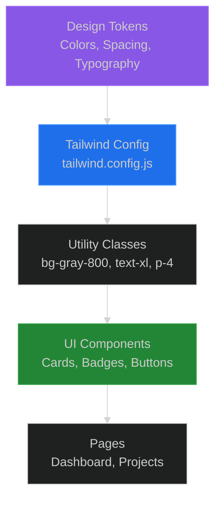

# Tailwind Design System for CycleTime

## Problem

CSS in large applications becomes difficult to maintain:

1. **CSS Bloat**: Custom CSS files grow large and unmaintainable
2. **Naming Conflicts**: Class name collisions across components
3. **Inconsistency**: Different developers use different spacing, colors, font sizes
4. **Dead Code**: Unused CSS accumulates over time
5. **Refactoring Fear**: Changing CSS breaks unexpected UI elements

**The Challenge**: How do we maintain consistent styling across the application while:
- Avoiding CSS file management overhead
- Ensuring design consistency (spacing, colors, typography)
- Supporting responsive design
- Enabling rapid UI development
- Keeping styling close to HTML structure

## Solution

**Tailwind CSS** provides a utility-first approach where styling is applied through composable CSS classes directly in HTML. Combined with **CycleTime design tokens**, this creates a consistent, maintainable design system.

**Core Philosophy**:
- Utility classes over custom CSS
- Composition over inheritance
- Design tokens for consistency
- Responsive by default
- Purge unused styles in production

## Implementation

### Structure



### Key Components

**1. Design Tokens**: Centralized design decisions
- Color palette (primary, surface, text, status)
- Spacing scale (4px base unit)
- Typography scale (6 sizes)
- Responsive breakpoints (sm, md, lg, xl)

**2. Utility Classes**: Composable building blocks
- Layout: `flex`, `grid`, `container`
- Spacing: `p-4`, `m-2`, `gap-3`
- Typography: `text-lg`, `font-bold`
- Colors: `bg-gray-800`, `text-blue-400`

**3. Component Patterns**: Reusable compositions
- Card components
- Badge components
- Button components
- Layout patterns

## CycleTime Design Tokens

### Color Palette

```css
:root {
  /* Background Colors */
  --background: #0d1117;        /* Main page background (gray-950) */
  --surface: #161b22;           /* Card/panel background (gray-900) */
  --surface-hover: #21262d;     /* Hover state (gray-800) */
  --border: #30363d;            /* Border color (gray-700) */

  /* Text Colors */
  --text-primary: #c9d1d9;      /* Primary text (gray-200) */
  --text-secondary: #8b949e;    /* Secondary text (gray-400) */
  --text-muted: #6e7681;        /* Muted text (gray-500) */

  /* Accent Colors */
  --primary: #58a6ff;           /* Blue accent (blue-400) */
  --primary-hover: #1f6feb;     /* Blue hover (blue-600) */

  /* Status Colors */
  --success: #3fb950;           /* Green (green-500) */
  --warning: #d29922;           /* Yellow (yellow-500) */
  --danger: #f85149;            /* Red (red-500) */
  --info: #58a6ff;              /* Blue (blue-400) */

  /* Issue Type Colors */
  --epic: #a371f7;              /* Purple (purple-400) */
  --story: #58a6ff;             /* Blue (blue-400) */
  --subtask: #8b949e;           /* Gray (gray-400) */
}
```

**Tailwind Mapping**:
```kotlin
// Use Tailwind classes that match design tokens
div(classes = "bg-gray-950")      // --background
div(classes = "bg-gray-900")      // --surface
div(classes = "bg-gray-800")      // --surface-hover
div(classes = "border-gray-700")  // --border
span(classes = "text-gray-200")   // --text-primary
span(classes = "text-gray-400")   // --text-secondary
```

**Live Demo**: See the [Color Palette in Action](../../../../src/main/resources/static/mockups/design-system.html#color-palette) with interactive swatches.

### Spacing Scale

Based on 4px base unit (Tailwind's default):

| Token | Pixels | Tailwind Class | Use Case |
|-------|--------|----------------|----------|
| `space-1` | 4px | `p-1`, `m-1` | Tight spacing, badges |
| `space-2` | 8px | `p-2`, `m-2` | Small gaps, compact UI |
| `space-3` | 12px | `p-3`, `m-3` | Default padding |
| `space-4` | 16px | `p-4`, `m-4` | Card padding, section spacing |
| `space-6` | 24px | `p-6`, `m-6` | Page padding, generous spacing |
| `space-8` | 32px | `p-8`, `m-8` | Hero sections, large cards |
| `space-12` | 48px | `p-12`, `m-12` | Major section breaks |

**Example Usage**:
```kotlin
// Card with consistent spacing
div(classes = "p-6 bg-gray-900 rounded-lg") {  // 24px padding
    h3(classes = "mb-3 text-lg") { +"Title" }  // 12px margin-bottom
    p(classes = "text-sm text-gray-400") { +"Content" }
}
```

**Live Demo**: See the [Spacing Scale Examples](../../../../src/main/resources/static/mockups/design-system.html#spacing) demonstrating consistent spacing patterns.

### Typography Scale

| Level | Size | Tailwind Class | Use Case |
|-------|------|----------------|----------|
| **Display** | 30px | `text-3xl` | Hero headings |
| **Heading 1** | 24px | `text-2xl` | Page titles |
| **Heading 2** | 20px | `text-xl` | Section headings |
| **Heading 3** | 18px | `text-lg` | Component headings |
| **Body** | 16px | `text-base` | Paragraph text (default) |
| **Small** | 14px | `text-sm` | Labels, captions |
| **Tiny** | 12px | `text-xs` | Badges, metadata |

**Typography Hierarchy Example**:
```kotlin
div(classes = "space-y-4") {
    h1(classes = "text-2xl font-bold text-gray-200") {
        +"CycleTime Dashboard"
    }
    h2(classes = "text-xl font-semibold text-gray-200") {
        +"Projects"
    }
    p(classes = "text-base text-gray-300") {
        +"Manage your project hierarchy and track progress."
    }
    span(classes = "text-sm text-gray-400") {
        +"Last updated: 2 hours ago"
    }
}
```

**Live Demo**: See the [Typography Scale in Action](../../../../src/main/resources/static/mockups/design-system.html#typography) with font specimens.

### Responsive Breakpoints

Mobile-first approach (default styles for mobile, add classes for larger screens):

| Breakpoint | Width | Prefix | Use Case |
|------------|-------|--------|----------|
| **Mobile** | 0-639px | (none) | Base styles |
| **Small** | 640px+ | `sm:` | Large phones, small tablets |
| **Medium** | 768px+ | `md:` | Tablets |
| **Large** | 1024px+ | `lg:` | Laptops, desktops |
| **Extra Large** | 1280px+ | `xl:` | Large desktops |

**Responsive Grid Example**:
```kotlin
div(classes = "grid grid-cols-1 md:grid-cols-2 lg:grid-cols-3 gap-4") {
    // 1 column on mobile
    // 2 columns on tablets
    // 3 columns on desktops
    projects.forEach { project ->
        projectCard(project)
    }
}
```

**Live Demo**: Resize your browser to see [Responsive Breakpoints](../../../../src/main/resources/static/mockups/design-system.html#main-content) in action.

## Component Patterns

### Pattern 1: Card Component

**Structure**:
- Outer container: Background, border, rounded corners, padding
- Header: Title, status badge
- Body: Description, content
- Footer: Metadata, actions

```kotlin
fun FlowContent.projectCard(project: ProjectViewDTO) {
    a(
        href = "/dashboard/projects/${project.id}",
        classes = "block p-6 bg-gray-800 rounded-lg border border-gray-700 hover:border-blue-500 transition-colors"
    ) {
        // Header with title and status
        div(classes = "flex justify-between items-start mb-3") {
            h3(classes = "text-lg font-semibold text-blue-400") {
                +project.name
            }
            span(classes = "text-xs px-2 py-1 rounded bg-gray-700 text-gray-300") {
                +project.status
            }
        }

        // Description
        project.description?.let { desc ->
            p(classes = "text-sm text-gray-400 mb-4 line-clamp-2") {
                +desc
            }
        }

        // Footer metadata
        div(classes = "flex gap-4 text-xs text-gray-500") {
            span { +"📚 ${project.epicCount} epics" }
            span { +"📖 ${project.storyCount} stories" }
            span { +"📝 ${project.totalIssues} total" }
        }
    }
}
```

**Breakdown**:
- `block`: Makes link fill card area
- `p-6`: 24px padding (space-6)
- `bg-gray-800`: Surface color
- `rounded-lg`: Large rounded corners (8px)
- `border border-gray-700`: 1px border with token color
- `hover:border-blue-500`: Primary color on hover
- `transition-colors`: Smooth color transitions

#### Live Demo
See this pattern implemented: [Card Components](../../../../src/main/resources/static/mockups/design-system.html#cards)

For working code examples: [Card Component Examples](../../examples/ui/card-component-examples.md)

### Pattern 2: Status Badge

**Structure**:
- Small size (text-xs)
- Padding (px-2 py-1)
- Rounded corners
- Background color based on status

```kotlin
fun FlowContent.statusBadge(status: String) {
    val (bgColor, textColor) = when (status.lowercase()) {
        "done", "completed" -> "bg-green-900" to "text-green-300"
        "in progress", "started" -> "bg-blue-900" to "text-blue-300"
        "todo", "backlog" -> "bg-gray-700" to "text-gray-300"
        "blocked" -> "bg-red-900" to "text-red-300"
        else -> "bg-gray-700" to "text-gray-300"
    }

    span(classes = "text-xs px-2 py-1 rounded $bgColor $textColor") {
        +status
    }
}
```

**Breakdown**:
- `text-xs`: 12px font (tiny)
- `px-2 py-1`: 8px horizontal, 4px vertical padding
- `rounded`: 4px border radius
- Dynamic colors: Background and text color based on status type

#### Live Demo
See badge variations: [Status Badges](../../../../src/main/resources/static/mockups/design-system.html#badges)

For working code examples: [Badge & Navigation Examples](../../examples/ui/badge-navigation-examples.md)

### Pattern 3: Loading Spinner

**Structure**:
- Flexbox for centering
- Spinning animation
- Size control
- Accessible text

```kotlin
fun FlowContent.loadingSpinner(message: String = "Loading...") {
    div(classes = "htmx-indicator flex items-center gap-2 text-gray-400") {
        // Spinning circle
        div(classes = "animate-spin rounded-full h-5 w-5 border-b-2 border-blue-400")

        // Loading text
        span(classes = "text-sm") { +message }
    }
}
```

**Breakdown**:
- `htmx-indicator`: Hidden by default, shown during HTMX requests
- `flex items-center gap-2`: Horizontal layout with 8px gap
- `animate-spin`: Tailwind animation (360° rotation)
- `rounded-full`: Perfect circle
- `h-5 w-5`: 20px × 20px size
- `border-b-2 border-blue-400`: Bottom border creates spinner effect

#### Live Demo
See spinner animation: [Loading States](../../../../src/main/resources/static/mockups/design-system.html#component-library)

For working code examples: [Icon & Loading Examples](../../examples/ui/icon-loading-examples.md)

### Pattern 4: Empty State

**Structure**:
- Centered layout
- Large icon/emoji
- Descriptive message
- Optional action button

```kotlin
fun FlowContent.emptyState(
    message: String,
    icon: String = "📭",
    actionLabel: String? = null,
    actionHref: String? = null
) {
    div(classes = "text-center py-12") {
        // Large icon
        div(classes = "text-6xl mb-4") {
            +icon
        }

        // Message
        p(classes = "text-lg text-gray-400 mb-4") {
            +message
        }

        // Optional action
        if (actionLabel != null && actionHref != null) {
            a(
                href = actionHref,
                classes = "inline-block px-4 py-2 bg-blue-600 text-white rounded hover:bg-blue-700 transition-colors"
            ) {
                +actionLabel
            }
        }
    }
}
```

**Breakdown**:
- `text-center`: Centers content horizontally
- `py-12`: 48px vertical padding (space-12)
- `text-6xl`: 60px icon size
- `mb-4`: 16px margin-bottom for spacing
- `inline-block`: Makes link styled like button

#### Live Demo
See empty state patterns: [Component Library](../../../../src/main/resources/static/mockups/design-system.html#component-library)

For working code examples: [Card Component Examples](../../examples/ui/card-component-examples.md)

### Pattern 5: Hierarchical Display

**Structure**:
- Nested levels with visual indentation
- Left border for hierarchy
- Icon differentiation
- Consistent spacing

```kotlin
fun FlowContent.epicNode(epic: IssueHierarchyNode) {
    div(classes = "border border-gray-700 rounded-lg bg-gray-800 p-4") {
        // Epic header
        div(classes = "flex items-center gap-2 mb-3") {
            span { +"📚" }  // Epic icon
            h3(classes = "text-lg font-semibold text-gray-200") {
                +epic.issue.title
            }
        }

        // Stories (nested with left border)
        if (epic.children.isNotEmpty()) {
            div(classes = "mt-4 space-y-2 pl-4 border-l-2 border-gray-700") {
                epic.children.forEach { story ->
                    storyNode(story)
                }
            }
        }
    }
}

fun FlowContent.storyNode(story: IssueHierarchyNode) {
    div(classes = "bg-gray-900 rounded p-3") {
        div(classes = "flex items-center gap-2") {
            span { +"📖" }  // Story icon
            span(classes = "font-medium text-gray-200") {
                +story.issue.title
            }
        }
    }
}
```

**Breakdown**:
- `space-y-2`: 8px vertical spacing between children
- `pl-4`: 16px left padding for indentation
- `border-l-2`: 2px left border shows hierarchy
- Icon differentiation: 📚 Epic, 📖 Story, 📝 Subtask

#### Live Demo
See hierarchy patterns: [Component Library](../../../../src/main/resources/static/mockups/design-system.html#component-library)

For working code examples: [Card Component Examples](../../examples/ui/card-component-examples.md)

## Responsive Design Patterns

### Mobile-First Grid

```kotlin
// Stack on mobile, 2 columns on tablet, 3 on desktop
div(classes = "grid grid-cols-1 md:grid-cols-2 lg:grid-cols-3 gap-4") {
    items.forEach { item ->
        itemCard(item)
    }
}
```

### Responsive Padding

```kotlin
// Smaller padding on mobile, larger on desktop
div(classes = "p-4 md:p-6 lg:p-8") {
    // Content
}
```

### Hide/Show Elements

```kotlin
// Show on mobile only
div(classes = "block md:hidden") {
    mobileMenu()
}

// Hide on mobile, show on tablet+
div(classes = "hidden md:block") {
    desktopMenu()
}
```

### Responsive Typography

```kotlin
// Smaller heading on mobile, larger on desktop
h1(classes = "text-xl md:text-2xl lg:text-3xl font-bold") {
    +"Responsive Heading"
}
```

## Considerations

### When to Use

- **Consistent Design Systems**: Need uniform spacing, colors, typography
- **Rapid UI Development**: Build UIs quickly without writing CSS
- **Responsive Layouts**: Mobile-first responsive design
- **Component Libraries**: Building reusable UI components
- **Team Collaboration**: Multiple developers need consistent styling

### When NOT to Use

- **Highly Custom Designs**: Unique, one-off designs not fitting utility patterns
- **Existing CSS Frameworks**: Already using Bootstrap, Material UI
- **Learning Curve**: Team uncomfortable with utility-first approach
- **Legacy Codebase**: Heavy investment in existing CSS
- **CSS-in-JS Preference**: Team prefers styled-components, emotion

### Trade-offs

**Pros**:
- **Consistency**: Design tokens enforce uniform styling
- **Rapid Development**: No context switching between HTML and CSS files
- **Small Production Bundle**: Purges unused styles (typically < 10KB)
- **No Naming**: No need to invent class names
- **Responsive by Default**: Easy responsive design with breakpoint prefixes
- **No Dead CSS**: Styles removed from HTML are automatically purged

**Cons**:
- **HTML Verbosity**: Long class strings in HTML
- **Learning Curve**: Must learn utility class names
- **Readability**: Class lists can be hard to parse
- **Duplication**: Same class combinations repeated across components
- **Customization**: Requires Tailwind config changes for non-standard values

## Integration with Ktor HTML DSL

### CDN Setup (Development)

```kotlin
fun HTML.dashboardPage() {
    head {
        title("CycleTime Dashboard")
        meta(charset = "UTF-8")
        meta(name = "viewport", content = "width=device-width, initial-scale=1.0")

        // Tailwind CSS via CDN
        script(src = "https://cdn.tailwindcss.com") {}

        // Custom theme configuration
        script {
            unsafe {
                raw("""
                    tailwind.config = {
                        theme: {
                            extend: {
                                colors: {
                                    background: '#0d1117',
                                    surface: '#161b22',
                                    'surface-hover': '#21262d'
                                }
                            }
                        }
                    }
                """.trimIndent())
            }
        }
    }

    body(classes = "min-h-screen bg-background text-gray-200") {
        // Page content
    }
}
```

### Production Build

For production, use Tailwind CLI to generate optimized CSS:

```bash
# Install Tailwind
npm install -D tailwindcss

# Generate optimized CSS
npx tailwindcss -i ./src/main/resources/input.css -o ./src/main/resources/dashboard/static/css/tailwind.min.css --minify
```

**tailwind.config.js**:
```javascript
module.exports = {
  content: [
    "./src/main/kotlin/**/*.kt"
  ],
  theme: {
    extend: {
      colors: {
        background: '#0d1117',
        surface: '#161b22',
        'surface-hover': '#21262d',
      }
    }
  }
}
```

### Component Abstraction

When utility classes repeat, extract to functions:

```kotlin
// Reusable button styles
fun buttonClasses(variant: String = "primary"): String {
    return when (variant) {
        "primary" -> "px-4 py-2 bg-blue-600 text-white rounded hover:bg-blue-700 transition-colors"
        "secondary" -> "px-4 py-2 bg-gray-700 text-gray-200 rounded hover:bg-gray-600 transition-colors"
        "danger" -> "px-4 py-2 bg-red-600 text-white rounded hover:bg-red-700 transition-colors"
        else -> "px-4 py-2 bg-gray-600 text-white rounded hover:bg-gray-500"
    }
}

// Usage
button(classes = buttonClasses("primary")) {
    +"Create Project"
}
```

## Accessibility Considerations

### Color Contrast

Ensure WCAG AA compliance (4.5:1 contrast ratio):

```kotlin
// Good: High contrast
span(classes = "text-gray-200 bg-gray-900")  // Passes WCAG AA

// Bad: Low contrast
span(classes = "text-gray-400 bg-gray-500")  // Fails WCAG AA
```

### Focus States

Always provide visible focus indicators:

```kotlin
button(classes = "px-4 py-2 bg-blue-600 text-white rounded focus:outline-none focus:ring-2 focus:ring-blue-400 focus:ring-offset-2 focus:ring-offset-gray-900") {
    +"Accessible Button"
}
```

### Touch Targets

Minimum 44×44px for mobile touch targets:

```kotlin
// Good: Large enough for touch
button(classes = "px-6 py-3 min-h-[44px] min-w-[44px]") {
    +"Touch-Friendly"
}
```

## Performance Optimizations

### Purge Unused CSS (Production)

Tailwind automatically removes unused classes in production:

```javascript
// tailwind.config.js
module.exports = {
  content: [
    "./src/main/kotlin/**/*.kt"
  ],
  // PurgeCSS analyzes Kotlin files to remove unused classes
}
```

### Minimize Custom CSS

Use Tailwind utilities instead of custom CSS:

```kotlin
// ❌ Bad: Custom CSS
style {
    unsafe {
        raw("""
            .custom-card {
                padding: 24px;
                background: #161b22;
                border-radius: 8px;
            }
        """)
    }
}

// ✅ Good: Tailwind utilities
div(classes = "p-6 bg-gray-900 rounded-lg") {
    // Content
}
```

## Related Documentation

### Foundations
- [Design Tokens Reference](../../reference/ui/design-tokens.md) - Complete token specifications
- [Live Design System Demo](../../../../src/main/resources/static/mockups/design-system.html) - Interactive component showcase

### Patterns
- [HTMX Patterns](htmx-patterns.md) - Server-driven interactivity patterns
- [Dashboard Architecture](../../concepts/dashboard/dashboard-architecture-concept.md) - Architectural concepts

### Examples
- [Button Component Examples](../../examples/ui/button-component-examples.md) - Working button implementations
- [Form Component Examples](../../examples/ui/form-component-examples.md) - Form input components
- [Card Component Examples](../../examples/ui/card-component-examples.md) - Card patterns
- [Badge & Navigation Examples](../../examples/ui/badge-navigation-examples.md) - Status badges and navigation
- [Icon & Loading Examples](../../examples/ui/icon-loading-examples.md) - Icons and loading states
- [Ktor HTML DSL Examples](../../examples/ui/ktor-html-dsl-examples.md) - Comprehensive DSL guide

## References

- [Tailwind CSS Documentation](https://tailwindcss.com/docs)
- [Tailwind UI Components](https://tailwindui.com/) - Premium component library
- [Tailwind CSS IntelliSense](https://marketplace.visualstudio.com/items?itemName=bradlc.vscode-tailwindcss) - VSCode extension
- [WCAG Color Contrast Checker](https://webaim.org/resources/contrastchecker/)
