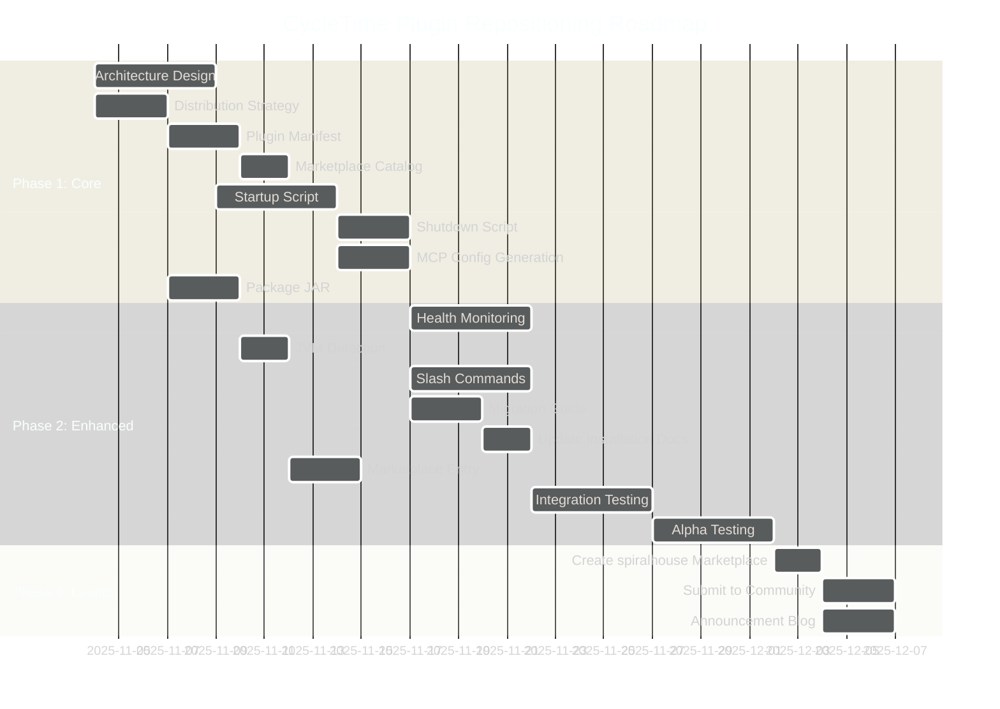
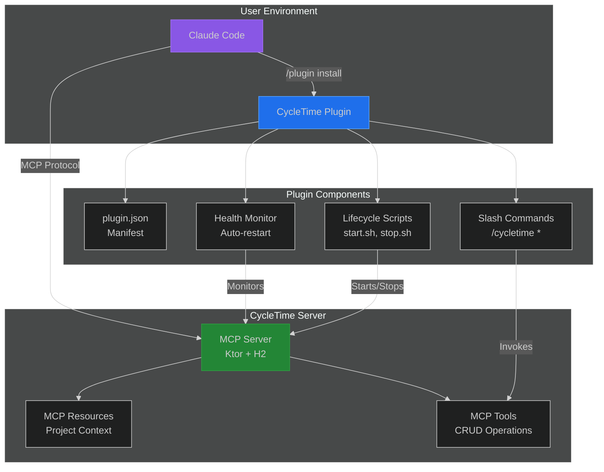

# CycleTime Plugin Repositioning: Strategic Research Spike

**Linear Issue**: SPI-912
**Date**: November 2, 2025
**Authors**: Product Manager Agent
**Status**: Research Complete - Ready for Decision

---

## Executive Summary

### Recommendation: YES - Reposition CycleTime as a Claude Code Plugin

After comprehensive analysis of the Claude Code plugin marketplace system and CycleTime's current architecture, **I strongly recommend repositioning CycleTime from "specialized MCP server" to "Claude Code plugin available from plugin marketplaces."**

### Key Findings

**What Are Plugins?**
Plugins are "custom collections of slash commands, agents, MCP servers, and hooks that install with a single command." Critically, **MCP servers are ONE component** that plugins can bundle, not a separate category. CycleTime's existing MCP server becomes a component within a plugin package.

**Strategic Advantages:**
- **Dramatic Installation Simplification**: From multi-step manual MCP configuration to single `/plugin install cycletime` command
- **Ecosystem Alignment**: Anthropic is positioning plugins as the primary Claude Code extension model
- **Better Discovery**: Listed in curated marketplaces vs. buried in documentation
- **Richer Integration Opportunities**: Add slash commands (`/cycletime next-task`) and workflow hooks
- **Team Standardization**: Simplified distribution for engineering teams

**Primary Challenge:**
CycleTime will be a "heavyweight plugin" requiring server lifecycle management (start/stop/health monitoring), unlike typical lightweight plugins that only add commands or agents. This is manageable but requires careful engineering.

**Technical Feasibility**: HIGH - Plugins explicitly support bundling MCP servers. CycleTime's existing architecture (Ktor server + H2 database) can be packaged as a plugin component.

### High-Level Implementation Approach

**Phase 1: Core Plugin Packaging (2-3 weeks)**
- Create plugin.json manifest and marketplace.json catalog
- Implement basic server lifecycle management (startup/shutdown scripts)
- Test installation via `/plugin install` workflow

**Phase 2: Enhanced Integration (3-4 weeks)**
- Add complementary slash commands for common operations
- Implement workflow hooks for automation
- Create specialized sub-agents for CycleTime workflows

**Phase 3: Migration & Polish (2-3 weeks)**
- Migration documentation for existing MCP server users
- Marketplace listing optimization (description, examples)
- Community plugin marketplace submission

**Total Effort Estimate**: 8-12 weeks (55-75 story points across 20 issues, including critical GraalVM compatibility research)

---

## Detailed Analysis

### 1. Plugin Marketplace Capabilities Assessment

#### What Plugins Are

According to Anthropic's official documentation:

> "Plugins represent custom collections of slash commands, agents, MCP servers, and hooks that install with a single command."

Plugins function as **lightweight packaging mechanisms** that bundle four extension types:

1. **Slash Commands**: Custom shortcuts for frequently-used operations
2. **Subagents**: Purpose-built agents handling specialized development tasks
3. **MCP Servers**: Tools and data source connections via Model Context Protocol
4. **Hooks**: Customization points within Claude Code's operational workflow

#### Distribution Architecture

**Installation Model:**
- Users add marketplaces via `/plugin marketplace add user-or-org/repo-name`
- Install plugins via `/plugin install plugin-name@marketplace-name`
- Toggle capabilities on/off to reduce system prompt complexity

**Marketplace Structure:**
- JSON-based catalog system (`.claude-plugin/marketplace.json`)
- Hosted in git repositories (GitHub, GitLab, local paths)
- Supports multiple source types: relative paths, GitHub repos, git URLs, local directories

**Plugin Manifest Requirements:**
- `plugin.json` file defining plugin metadata, components, and configuration
- When `strict: true` (default), marketplace fields supplement plugin.json
- When `strict: false`, marketplace entry becomes complete manifest

**Component Path Customization:**
Plugins can override default locations:
- `commands`: Custom command file directories
- `agents`: Agent definitions
- `hooks`: Event-driven configurations
- `mcpServers`: Model Context Protocol server configurations

Environment variable `${CLAUDE_PLUGIN_ROOT}` resolves to installation directory for dynamic path references.

#### Discovery & Management Features

**Browsing Capabilities:**
- `/plugin` command provides interactive discovery across all configured marketplaces
- Displays descriptions, metadata, and component types
- Marketplace-level organization for discoverability

**Operational Commands:**
- `/plugin marketplace list` - View registered marketplaces
- `/plugin marketplace update` - Refresh metadata
- `/plugin marketplace remove` - Deregister marketplace
- `/plugin install plugin-name@marketplace-name` - Install specific plugin

**Team Distribution:**
Organizations configure automatic marketplace installation in `.claude/settings.json` using `extraKnownMarketplaces`, enabling trusted repositories to auto-load specified plugins.

#### Limitations Discovered

**No Built-In Systems For:**
- Community rating mechanisms
- Security scanning or approval workflows
- Automated plugin security validation

Organizations must implement these separately through governance policies.

**Update Management:**
- Version fields in marketplace entries control updates
- Metadata refresh capabilities support rolling updates
- No automatic update enforcement (user-controlled)

### 2. Gap Analysis: Current State vs. Plugin Model

#### Current State - CycleTime as MCP Server

**Architecture:**
- Standalone Ktor-based MCP server (Kotlin/JVM)
- Embedded H2 database for project state
- Exposes MCP Resources (project context, dependencies, unblocked tasks)
- Provides MCP Tools (CRUD operations for projects/issues)
- Uses Streamable HTTP transport (POST + SSE at /mcp endpoint)

**Installation Experience:**
1. User installs CycleTime binary (JAR or native image)
2. User manually starts MCP server (`./cycletime-server`)
3. User configures Claude Code MCP settings to connect to server
4. User verifies connection through Claude Code

**Distribution:**
- Manual download from GitHub releases
- Requires understanding of MCP server configuration
- Users need to manage server lifecycle independently
- No centralized discovery mechanism

**Target Audience:**
- Solo developers and freelancers using Claude Code
- Small development teams (2-4 people)
- Users comfortable with terminal-based AI interaction

#### Plugin Model Requirements

**Installation Experience:**
1. User adds CycleTime marketplace (one-time): `/plugin marketplace add spiralhouse/cycletime`
2. User installs plugin: `/plugin install cycletime`
3. Plugin automatically configures MCP server and starts it
4. User immediately accesses CycleTime capabilities

**Distribution Model:**
- Listed in curated plugin marketplace
- Discoverable through `/plugin` browser interface
- Automatic configuration of MCP server connection
- Plugin manages server lifecycle (start/stop/health)

**Component Structure:**
```
.claude-plugin/
├── marketplace.json       # Marketplace catalog entry
├── plugin.json           # Plugin manifest
├── commands/             # Optional slash commands
│   └── next-task.md      # /cycletime next-task command
├── agents/               # Optional specialized agents
│   └── pm-agent.md       # Project management sub-agent
├── hooks/                # Optional workflow hooks
│   └── post-commit.js    # Automatic issue updates
└── mcpServers/           # MCP server configuration
    ├── cycletime.json    # Server connection config
    └── lifecycle.sh      # Start/stop scripts
```

#### Key Gaps Identified

**Gap 1: Plugin Packaging Infrastructure**
- **Current**: No plugin.json or marketplace.json
- **Required**: Complete plugin manifest with component declarations
- **Effort**: 3-5 story points (straightforward JSON authoring)

**Gap 2: Server Lifecycle Management**
- **Current**: Users manually start/stop server
- **Required**: Plugin must manage server as background process
- **Complexity**: Port allocation, health checking, graceful shutdown
- **Effort**: 8-13 story points (significant engineering work)

**Gap 3: Automatic MCP Configuration**
- **Current**: Users manually configure Claude Code MCP settings
- **Required**: Plugin auto-generates MCP server config
- **Effort**: 3-5 story points (configuration templating)

**Gap 4: Binary Distribution Strategy**
- **Current**: GitHub releases with platform-specific binaries
- **Required**: Plugin must access or bundle platform-specific server binary
- **Options**: Bundle in plugin, download on first install, or use JVM JAR universally
- **Effort**: 5-8 story points (distribution mechanism design)

**Gap 5: Enhanced Integration Components** (Optional, but high value)
- **Current**: Only MCP server (no commands/agents/hooks)
- **Opportunity**: Add slash commands for common operations
- **Examples**: `/cycletime next-task`, `/cycletime create-issue`, `/cycletime status`
- **Effort**: 5-8 story points per command (3-5 commands recommended)

**Gap 6: Alpha Testing Infrastructure** (Pre-Release Context)
- **Current**: Pre-release state, no production users to migrate
- **Required**: Containerized service for alpha testing before native builds ready
- **Effort**: 2-3 story points (Docker setup for local testing)

### 3. Strategic Implications & Trade-offs

#### Advantages of Repositioning

**Installation Friction Reduction** (Critical Advantage)
- **Current**: 4-5 manual steps, requires understanding MCP configuration
- **Plugin**: Single `/plugin install cycletime` command
- **Impact**: Dramatically lowers adoption barrier for new users
- **User Empathy**: Solo developers want immediate productivity, not configuration hassles

**Ecosystem Positioning** (Strategic Advantage)
- **Anthropic's Direction**: Plugins are the primary extension model for Claude Code
- **Marketplace Visibility**: Listed alongside other professional development tools
- **Perceived Integration**: "Plugin" feels native, "external MCP server" feels third-party
- **User Empathy**: Developers trust tools that feel integrated into their primary workflow

**Discovery & Distribution** (Marketing Advantage)
- **Current**: Users must find CycleTime through docs, blog posts, word-of-mouth
- **Plugin**: Discoverable via `/plugin` browser in Claude Code
- **Marketplace Curation**: Benefits from marketplace reputation and organization
- **User Empathy**: Developers discover tools through their IDE, not external searches

**Richer Integration Opportunities** (Product Advantage)
- **Slash Commands**: Quick access to common operations without full MCP tool invocation
- **Hooks**: Automatic workflow integration (e.g., post-commit issue updates)
- **Specialized Agents**: Domain-specific sub-agents for CycleTime workflows
- **User Empathy**: Natural language shortcuts feel more intuitive than API calls

**Team Standardization** (Enterprise Advantage)
- **Current**: Each team member manually configures MCP server
- **Plugin**: Single `.claude/settings.json` with `extraKnownMarketplaces` auto-installs for team
- **Impact**: Engineering leaders can mandate CycleTime usage
- **User Empathy**: Teams want consistency, not "works on my machine" problems

#### Challenges & Mitigations

**Challenge 1: "Heavyweight Plugin" Complexity**

**Issue**: CycleTime requires a long-running background server process, unlike typical plugins that just add commands or agents. This introduces lifecycle management complexity.

**Technical Details:**
- Server must start on plugin activation
- Port allocation and conflict detection needed
- Health monitoring to detect server failures
- Graceful shutdown on plugin deactivation
- Log file management and error reporting

**Mitigation Strategy:**
- Use battle-tested process management patterns (systemd/launchd-style)
- Implement comprehensive health checks with auto-restart
- Provide clear error messages when server fails to start
- Include troubleshooting guide in plugin documentation

**User Impact**: Minimal if implemented correctly. Most users will never notice server management is happening in the background.

**Effort**: 13 story points for robust lifecycle management

**Challenge 2: GraalVM Native Build Requirement**

**Issue**: CycleTime server must run on macOS, Linux, and Windows without requiring JVM installation. GraalVM native images provide "batteries included" experience but require compatibility verification and platform-specific builds.

**Strategic Context**: Pre-release state means we can prioritize native builds from the start rather than as a future enhancement.

**Options Analysis:**

| Approach | Pros | Cons | Recommendation |
|----------|------|------|----------------|
| **GraalVM Native** | No JVM dependency, fast startup, native experience | Complex build, 3x binaries, Ktor compatibility risk | **Recommended for Beta** - Best UX |
| **Universal JAR (Alpha)** | Simple build, platform-agnostic | Requires JVM 21 on user machine | **Alpha Testing Only** - Via Docker container |
| **Bundle All Binaries** | Simple plugin packaging | Large download (~150MB total) | Consider if native builds succeed |
| **Download on Install** | Small plugin size | Requires network, complex error handling | Fallback if native builds fail |

**Critical Risk - Ktor/GraalVM Compatibility:**
Historical compatibility issues between Ktor and GraalVM have been reported. Must verify current Ktor 3.3.1 works with GraalVM native-image.

**Mitigation Strategy:**
- **Pre-Beta**: Research Ktor 3.3.1 + GraalVM compatibility (create research story)
- **Alpha Phase**: Use Docker containerized JAR for local testing
- **Beta Requirement**: Native builds working across macOS (Intel/ARM), Linux, Windows
- **Fallback**: If GraalVM incompatible, ship JAR with clear JVM requirement

**User Impact**: High - Native builds provide best experience, but compatibility risk could delay beta release.

**Effort**: 8 story points for GraalVM research + compatibility testing, 13 story points for native build pipeline

**Challenge 3: Pre-Release Positioning Advantage** (Not a Challenge)

**Context**: CycleTime is pre-release with no production users yet. This eliminates migration complexity entirely.

**Strategic Advantages:**
- **Clean Launch**: Can position as plugin from day one without legacy baggage
- **Simplified Messaging**: No "migration path" documentation needed
- **Faster Time-to-Market**: Remove 2-3 stories related to user migration
- **Better First Impression**: Users discover CycleTime as plugin-native, not retrofit

**Alpha Testing Approach:**
- Use Docker containerized JAR for alpha testing (you + internal testers)
- Beta release waits for native builds to be ready
- No public MCP server documentation to maintain or deprecate

**User Impact**: Positive - Cleaner positioning, simpler onboarding experience.

**Effort Savings**: 3-5 story points removed from backlog (migration stories eliminated)

**Challenge 3: Marketplace Approval & Quality Standards**

**Issue**: Some plugin marketplaces may have submission requirements, quality standards, or approval processes.

**Current Unknown:**
- No official Anthropic marketplace approval process documented
- Third-party marketplaces (Dan Ávila, Seth Hobson) may have own standards
- Community expectations for plugin quality and documentation

**Mitigation Strategy:**
- Research submission requirements for target marketplaces
- Ensure comprehensive testing before marketplace submission
- Create high-quality documentation and examples
- Build trust through open-source transparency

**User Impact**: None - Only affects initial marketplace listing

**Effort**: 2-3 story points for research and compliance

#### Trade-offs Summary

| Aspect | Gain | Cost | Net Value |
|--------|------|------|-----------|
| **Installation Friction** | 🟢🟢🟢🟢 Dramatic reduction | 🔴 Engineering effort for lifecycle mgmt | **High Positive** |
| **Ecosystem Positioning** | 🟢🟢🟢 Better brand alignment | 🔴 Learning new distribution model | **High Positive** |
| **Discovery** | 🟢🟢🟢 Built-in marketplace | 🔴 Marketplace submission effort | **High Positive** |
| **Technical Complexity** | 🔴🔴 Server lifecycle management | 🔴🔴 13 point engineering effort | **Neutral** (worthwhile investment) |
| **GraalVM Native Builds** | 🟢🟢 No JVM dependency | 🔴🔴 Ktor compatibility risk + build complexity | **Neutral** (beta requirement) |
| **Pre-Release Timing** | 🟢🟢🟢 Clean positioning, no migration | 🟢 Effort savings (3-5 points) | **High Positive** |

**Overall Assessment**: Strong positive strategic value outweighs technical complexity costs.

### 4. Competitive Landscape Analysis

#### Existing Claude Code Plugins (Research from Community)

Based on Anthropic's documentation references:

**Dan Ávila's Marketplace** - 80+ specialized plugins:
- DevOps automation plugins
- Documentation generation tools
- Project management integrations
- Testing suite plugins

**Seth Hobson's Collection** - 80+ specialized sub-agents:
- Domain-specific development agents
- Workflow automation agents

**Anthropic's Official Plugins**:
- PR review plugin
- Security guidance plugin
- Claude Agent SDK development plugin

#### CycleTime's Differentiators

**Unique Value Propositions:**

1. **Comprehensive Project Orchestration** (vs. Single-Purpose Plugins)
   - Most plugins address single workflow (PR review, testing, docs)
   - CycleTime provides end-to-end project lifecycle management
   - Differentiator: "Complete project context" not just "task automation"

2. **Cross-Session Continuity** (vs. Stateless Plugins)
   - Most plugins are stateless, context resets between sessions
   - CycleTime persists project state via embedded H2 database
   - Differentiator: "Memory across sessions" for solo developers

3. **Issue Hierarchy & Dependency Tracking** (vs. Simple Task Lists)
   - Most project plugins use flat task lists
   - CycleTime enforces Epic → Story → Subtask with dependencies
   - Differentiator: "Professional project structure" not just "to-do lists"

4. **Provider Flexibility** (vs. Vendor Lock-In)
   - Most plugins tied to specific external services (Linear, GitHub, Jira)
   - CycleTime starts with embedded H2, migrates to cloud when needed
   - Differentiator: "Offline-first, cloud-optional" for developer control

#### Competitive Positioning Statement

**Current**: "CycleTime is a specialized MCP server for project orchestration"

**Proposed**: "CycleTime is a comprehensive project orchestration plugin for Claude Code that provides cross-session continuity, professional issue tracking, and dependency management—all with an embedded database for complete offline operation."

**Marketplace Tagline**: "Project orchestration for solo developers: Epic → Story → Subtask hierarchy, dependency tracking, and cross-session memory—no external services required."

#### Target Marketplace Position

**Primary Marketplace**: Create official "spiralhouse/cycletime" marketplace
- **Rationale**: Full control over distribution and updates
- **Discoverability**: Users install via `/plugin marketplace add spiralhouse/cycletime`

**Secondary Listings**: Submit to Dan Ávila and Seth Hobson marketplaces
- **Rationale**: Leverage existing discoverability in popular community marketplaces
- **Benefit**: Reach users browsing established plugin collections

### 5. Risk Assessment

#### Technical Risks

**Risk 1: Server Lifecycle Management Failures** (Medium Severity, Medium Probability)
- **Scenario**: Server fails to start due to port conflicts, permission issues, or missing dependencies
- **Impact**: Plugin appears broken, users cannot access CycleTime features
- **Mitigation**: Comprehensive health checks, clear error messages, automatic port selection, fallback ports
- **Residual Risk**: Low - Standard process management patterns are well-understood

**Risk 2: Platform-Specific Binary Issues** (Medium Severity, Low Probability)
- **Scenario**: JAR approach requires JVM 21, some users don't have correct version
- **Impact**: Installation fails, requires users to install/update JVM
- **Mitigation**: Clear error message with JVM installation link, SDKMAN recommendation, future native binary support
- **Residual Risk**: Low - Target audience (developers) typically have JVM

**Risk 3: Plugin Framework Evolution** (Low Severity, Medium Probability)
- **Scenario**: Anthropic changes plugin manifest format or marketplace structure
- **Impact**: Plugin requires updates to maintain compatibility
- **Mitigation**: Monitor Anthropic's plugin documentation, engage with community, maintain flexible architecture
- **Residual Risk**: Low - Open source allows community contributions for updates

#### Market Risks

**Risk 4: User Adoption of Plugin Model** (High Severity, Low Probability)
- **Scenario**: Existing MCP server users resist migration to plugin model
- **Impact**: Fragmented user base, must maintain both distribution models
- **Mitigation**: Communicate clear benefits, provide migration guide, maintain MCP server docs temporarily
- **Residual Risk**: Low - Plugin model provides clear UX benefits

**Risk 5: Marketplace Discoverability** (Medium Severity, Medium Probability)
- **Scenario**: CycleTime plugin lost in crowded marketplace, users don't discover it
- **Impact**: Limited adoption growth despite technical quality
- **Mitigation**: High-quality marketplace description, video tutorials, blog post announcing plugin availability, community engagement
- **Residual Risk**: Medium - Requires ongoing marketing effort

**Risk 6: Competitive Plugins Emerge** (Low Severity, Medium Probability)
- **Scenario**: Other plugins emerge with similar project orchestration features
- **Impact**: CycleTime faces direct competition in marketplace
- **Mitigation**: Emphasize unique differentiators (embedded database, offline-first, dependency tracking), continuous feature development
- **Residual Risk**: Low - Open source model enables community contributions and rapid iteration

#### Resource Risks

**Risk 7: Scope Creep During Plugin Development** (Medium Severity, High Probability)
- **Scenario**: Team adds too many slash commands, agents, hooks beyond core plugin packaging
- **Impact**: Extended timeline, delayed plugin release, resource exhaustion
- **Mitigation**: Phased approach (Phase 1: Core packaging, Phase 2: Enhanced integration), strict scope control, MVP mindset
- **Residual Risk**: Medium - Requires disciplined product management

**Risk 8: Insufficient Testing Before Marketplace Submission** (High Severity, Low Probability)
- **Scenario**: Plugin released with server lifecycle bugs, poor error handling, or installation failures
- **Impact**: Negative user reviews, damaged reputation, support burden
- **Mitigation**: Comprehensive integration testing, alpha testing with pilot users, staged rollout
- **Residual Risk**: Low - Strong testing culture in place

---

## Product Backlog Items (Linear-Ready)

The following backlog items are structured for direct creation in Linear. Each item includes:
- Clear title following Linear conventions
- Detailed description with acceptance criteria
- Story point estimate (Fibonacci scale)
- Dependencies
- Recommended labels
- Priority assessment

### Epic: Plugin Repositioning & Marketplace Distribution

**Epic Title**: CycleTime Plugin Repositioning & Marketplace Distribution

**Epic Description**:
Reposition CycleTime from a standalone MCP server to a Claude Code plugin distributed via plugin marketplaces. This strategic shift simplifies installation (from multi-step manual configuration to single `/plugin install cycletime` command), improves discoverability through marketplace browsing, and enables richer integration through slash commands and workflow hooks.

**Epic Scope**:
- Core plugin packaging infrastructure (plugin.json, marketplace.json)
- Server lifecycle management for background operation
- Binary distribution strategy across platforms
- Enhanced integration components (slash commands, optional agents/hooks)
- Migration documentation for existing MCP server users
- Marketplace submission and quality assurance

**Target Outcome**: Users can install and use CycleTime via `/plugin install cycletime` with automatic server configuration and lifecycle management.

**Epic Labels**: Epic, MCP, Plugin, Distribution, Release, Product

---

### Story 1: Research & Planning - Plugin Architecture Design

**Story Title**: Design plugin architecture and server lifecycle management strategy

**Story Description**:
Research and design the technical architecture for CycleTime as a Claude Code plugin, focusing on how the plugin will manage the background MCP server process. This includes process lifecycle management, health monitoring, port allocation, and error handling.

**Acceptance Criteria**:
- [ ] Research existing Claude Code plugins that bundle services/servers (if any)
- [ ] Design process management approach (systemd/launchd-style patterns)
- [ ] Define health check strategy and auto-restart logic
- [ ] Document port allocation and conflict detection approach
- [ ] Create error handling and user messaging design
- [ ] Design graceful shutdown and cleanup procedures
- [ ] Document platform-specific considerations (macOS/Linux/Windows)
- [ ] Create architecture decision record (ADR) documenting chosen approach

**Dependencies**: None

**Story Points**: 5 (moderate complexity - requires research and design)

**Labels**: Research, Architecture, MCP, Plugin, Documentation

**Priority**: High - Blocks plugin implementation

---

### Story 2: Research & Planning - GraalVM Native Build Compatibility

**Story Title**: Research and verify Ktor 3.3.1 compatibility with GraalVM native-image

**Story Description**:
Investigate compatibility between current CycleTime stack (Ktor 3.3.1, Exposed, H2) and GraalVM native-image compilation. Historical issues exist between Ktor and GraalVM. Must verify current versions work together and identify any required configuration or workarounds.

**Acceptance Criteria**:
- [ ] Research Ktor 3.3.1 + GraalVM native-image compatibility status
- [ ] Test minimal Ktor server with native-image compilation
- [ ] Verify Exposed ORM works with native-image (reflection configuration)
- [ ] Test H2 embedded database in native-image context
- [ ] Document any required GraalVM configuration (reflection, resources, JNI)
- [ ] Identify build-time vs runtime initialization requirements
- [ ] Test native binary across macOS (Intel/ARM), Linux, Windows
- [ ] Document findings and recommend go/no-go for native builds
- [ ] If incompatible: document JAR-based fallback approach with JVM requirements

**Dependencies**: None (critical path - blocks binary distribution decisions)

**Story Points**: 8 (complex compatibility research with cross-platform testing)

**Labels**: Research, GraalVM, Build, Infrastructure, Risk

**Priority**: Critical - Beta blocker, must complete before plugin packaging

---

### Story 3: Core Plugin Packaging - Create Plugin Manifest

**Story Title**: Create plugin.json manifest with component declarations

**Story Description**:
Author the plugin.json manifest file that defines CycleTime as a Claude Code plugin. Include metadata (name, description, version), component declarations (MCP server configuration), and installation requirements.

**Acceptance Criteria**:
- [ ] Create `.claude-plugin/plugin.json` with required fields
- [ ] Define plugin metadata: name="cycletime", description, version="1.0.0"
- [ ] Declare MCP server component in `mcpServers` section
- [ ] Specify installation requirements (JVM 21 if using JAR approach)
- [ ] Add author, license, and repository information
- [ ] Validate JSON structure against Claude Code plugin schema
- [ ] Test plugin manifest loads correctly in Claude Code
- [ ] Document manifest fields and their purposes

**Dependencies**: Story 2 (distribution strategy informs requirements)

**Story Points**: 3 (straightforward JSON authoring)

**Labels**: Plugin, Configuration, MCP

**Priority**: High - Core plugin infrastructure

---

### Story 4: Core Plugin Packaging - Create Marketplace Catalog Entry

**Story Title**: Create marketplace.json catalog entry for spiralhouse marketplace

**Story Description**:
Author the marketplace.json file that lists CycleTime in the official spiralhouse plugin marketplace. Include plugin metadata, source location, and discoverability information optimized for marketplace browsing.

**Acceptance Criteria**:
- [ ] Create `.claude-plugin/marketplace.json` for spiralhouse marketplace
- [ ] Define marketplace metadata: name="spiralhouse-marketplace", owner contact info
- [ ] Add CycleTime plugin entry with name, source, description
- [ ] Write compelling marketplace description (2-3 sentences) highlighting key benefits
- [ ] Add keywords for discoverability: "project", "orchestration", "issues", "dependencies"
- [ ] Specify source location (GitHub repository reference)
- [ ] Validate JSON structure and test marketplace registration
- [ ] Document marketplace submission process for future updates

**Dependencies**: Story 3 (references plugin.json)

**Story Points**: 2 (simple JSON authoring)

**Labels**: Plugin, Distribution, Marketing

**Priority**: High - Required for plugin installation

---

### Story 5: Server Lifecycle Management - Implement Startup Script

**Story Title**: Implement server startup script with health checking and port allocation

**Story Description**:
Create a startup script that launches the CycleTime MCP server as a background process when the plugin is activated. Include port allocation (default 8080 with automatic fallback), health checking to verify server readiness, and error handling for common failure scenarios.

**Acceptance Criteria**:
- [ ] Create `.claude-plugin/mcpServers/lifecycle-start.sh` (bash script)
- [ ] Implement port allocation: try 8080, fallback to 8081-8090 range if occupied
- [ ] Start CycleTime server as background process with proper logging
- [ ] Implement health check polling (GET /health endpoint) with 30s timeout
- [ ] Return success when server responds to health check
- [ ] Handle failure scenarios: port conflicts, missing binary, JVM issues
- [ ] Log server output to `~/.claude/plugins/cycletime/logs/server.log`
- [ ] Store server PID for shutdown reference
- [ ] Test across macOS and Linux platforms

**Dependencies**: Story 1 (architecture design), Story 2 (binary location)

**Story Points**: 8 (complex process management logic)

**Labels**: Plugin, MCP, Infrastructure, Scripting

**Priority**: High - Core plugin functionality

---

### Story 6: Server Lifecycle Management - Implement Shutdown Script

**Story Title**: Implement graceful server shutdown script with cleanup

**Story Description**:
Create a shutdown script that gracefully stops the CycleTime MCP server when the plugin is deactivated or Claude Code exits. Include proper signal handling, timeout-based forced termination, and cleanup of temporary resources.

**Acceptance Criteria**:
- [ ] Create `.claude-plugin/mcpServers/lifecycle-stop.sh` (bash script)
- [ ] Read server PID from storage location
- [ ] Send SIGTERM signal for graceful shutdown
- [ ] Wait up to 10 seconds for graceful shutdown
- [ ] Send SIGKILL if graceful shutdown fails
- [ ] Clean up PID file and temporary resources
- [ ] Handle case where server already stopped (idempotent)
- [ ] Log shutdown events
- [ ] Test across macOS and Linux platforms

**Dependencies**: Story 5 (references PID storage from startup)

**Story Points**: 5 (moderate complexity with signal handling)

**Labels**: Plugin, MCP, Infrastructure, Scripting

**Priority**: High - Prevents orphaned server processes

---

### Story 7: Server Lifecycle Management - Implement Health Monitoring

**Story Title**: Implement continuous health monitoring with auto-restart capability

**Story Description**:
Create a health monitoring mechanism that periodically checks if the CycleTime MCP server is responding. If health checks fail, automatically attempt to restart the server with exponential backoff to prevent rapid failure loops.

**Acceptance Criteria**:
- [ ] Implement health check loop running every 60 seconds
- [ ] Poll server /health endpoint with 5s timeout
- [ ] Count consecutive failures (threshold: 3 failures triggers restart)
- [ ] Implement auto-restart with exponential backoff (5s, 10s, 20s delays)
- [ ] Maximum 5 restart attempts before marking plugin as failed
- [ ] Display user notification if server repeatedly fails
- [ ] Log health check results and restart attempts
- [ ] Test failure scenarios: server crash, network issues, high load
- [ ] Ensure health monitoring stops cleanly on plugin deactivation

**Dependencies**: Story 5 (startup script), Story 6 (shutdown script)

**Story Points**: 8 (complex state management and failure handling)

**Labels**: Plugin, MCP, Reliability, Monitoring

**Priority**: High - Critical for production reliability

---

### Story 8: MCP Configuration - Auto-Generate Server Config

**Story Title**: Implement automatic MCP server configuration generation on plugin install

**Story Description**:
Create logic that automatically generates the MCP server configuration for Claude Code when the CycleTime plugin is installed. This eliminates manual configuration steps and ensures correct connection settings.

**Acceptance Criteria**:
- [ ] Create MCP server config template with dynamic port substitution
- [ ] Generate config at plugin activation with actual server port
- [ ] Write config to Claude Code MCP settings location
- [ ] Validate config format matches Claude Code expectations
- [ ] Handle config updates if server port changes
- [ ] Support merging with existing MCP configs (don't overwrite other servers)
- [ ] Document config generation process
- [ ] Test installation flow from clean Claude Code instance

**Dependencies**: Story 5 (needs server port information)

**Story Points**: 5 (moderate complexity with file I/O and templating)

**Labels**: Plugin, MCP, Configuration

**Priority**: High - Key UX improvement over manual MCP setup

---

### Story 9: Binary Distribution - Package Universal JAR

**Story Title**: Package CycleTime server as universal JAR for plugin distribution

**Story Description**:
Configure Gradle build to produce a standalone "fat JAR" containing CycleTime server and all dependencies. This JAR will be the primary binary distributed with the plugin, requiring only JVM 21 on the user's machine.

**Acceptance Criteria**:
- [ ] Configure `buildFatJar` Gradle task to produce self-contained JAR
- [ ] Include all runtime dependencies (Ktor, Exposed, H2, MCP SDK)
- [ ] Verify JAR is executable: `java -jar cycletime-server.jar`
- [ ] Test JAR across platforms: macOS (Intel/ARM), Linux, Windows
- [ ] Optimize JAR size where possible (exclude dev dependencies)
- [ ] Document JAR execution requirements (JVM 21)
- [ ] Create version-stamped JAR names: `cycletime-server-1.0.0.jar`
- [ ] Test JAR runs correctly from plugin directory structure

**Dependencies**: Story 2 (distribution strategy decision)

**Story Points**: 5 (build configuration with cross-platform testing)

**Labels**: Build, Distribution, Infrastructure

**Priority**: High - Required for plugin packaging

---

### Story 10: Binary Distribution - JVM Detection & User Guidance

**Story Title**: Implement JVM detection with installation guidance for missing dependencies

**Story Description**:
Create logic in the startup script to detect if JVM 21 is available on the user's system. If missing or wrong version, display clear error message with installation instructions (SDKMAN recommendation).

**Acceptance Criteria**:
- [ ] Detect Java installation: `java -version` command
- [ ] Parse Java version from output, compare to minimum required (21)
- [ ] Display helpful error message if Java missing or too old
- [ ] Include SDKMAN installation commands in error message
- [ ] Provide alternative: direct OpenJDK download link
- [ ] Test detection across platforms (different Java distributions)
- [ ] Document JVM requirements in plugin README
- [ ] Consider caching detection result to avoid repeated checks

**Dependencies**: Story 5 (startup script), Story 9 (JAR packaging)

**Story Points**: 3 (straightforward shell scripting with good UX messaging)

**Labels**: Plugin, UX, Infrastructure

**Priority**: Medium - Important for good first-run experience

---

### Story 11: Enhanced Integration - Implement /cycletime Slash Commands

**Story Title**: Implement core slash commands for common CycleTime operations

**Story Description**:
Create a set of slash commands that provide quick access to common CycleTime operations without requiring full MCP tool invocation. Start with 3-5 high-value commands based on user workflows.

**Recommended Commands**:
1. `/cycletime next-task` - Show next unblocked task in active project
2. `/cycletime status` - Display project progress summary
3. `/cycletime create-issue [title]` - Quick issue creation
4. `/cycletime list-projects` - Show all projects with issue counts
5. `/cycletime help` - Command reference and examples

**Acceptance Criteria**:
- [ ] Create `.claude-plugin/commands/` directory structure
- [ ] Implement each command as separate Markdown file
- [ ] Each command invokes appropriate MCP tools via Claude Code
- [ ] Include clear usage examples in command documentation
- [ ] Handle error cases gracefully with helpful messages
- [ ] Test commands in Claude Code terminal and VS Code
- [ ] Document command parameters and expected outputs
- [ ] Update plugin.json to reference command files

**Dependencies**: Story 3 (plugin manifest), Story 8 (MCP config working)

**Story Points**: 8 (5 commands × ~1-2 points each, includes testing)

**Labels**: Plugin, Feature, UX, Commands

**Priority**: Medium - Nice-to-have, not MVP blocking

---

### Story 12: Enhanced Integration - Create Project Management Sub-Agent

**Story Title**: Create specialized PM sub-agent for CycleTime project orchestration

**Story Description**:
Design and implement a specialized sub-agent focused on project management workflows: backlog grooming, task prioritization, dependency analysis, and progress reporting. This agent uses CycleTime's MCP resources to provide intelligent recommendations.

**Agent Capabilities**:
- Analyze project backlog and recommend prioritization
- Identify blocking dependencies and suggest resolution order
- Generate project status reports with velocity metrics
- Propose Epic/Story/Subtask breakdowns for large features
- Detect potential scope creep and timeline risks

**Acceptance Criteria**:
- [ ] Create `.claude-plugin/agents/pm-agent.md` agent definition
- [ ] Define agent personality and expertise areas
- [ ] Document agent prompt with CycleTime context integration
- [ ] Implement examples for common PM workflows
- [ ] Test agent with sample project data
- [ ] Verify agent uses MCP resources effectively
- [ ] Document agent usage patterns in plugin README
- [ ] Update plugin.json to reference agent definition

**Dependencies**: Story 3 (plugin manifest), Story 8 (MCP config working)

**Story Points**: 5 (agent design + testing)

**Labels**: Plugin, Feature, Agent, Product

**Priority**: Low - Enhancement for v1.1+, not MVP

---

### Story 13: Enhanced Integration - Implement Post-Commit Hook

**Story Title**: Implement post-commit hook for automatic issue status updates

**Story Description**:
Create a Git post-commit hook that automatically updates CycleTime issue status based on commit messages. When developers commit with issue references (e.g., "SPI-123: implement feature"), the hook can move issues to "In Progress" automatically.

**Hook Behavior**:
- Parse commit message for issue IDs (e.g., SPI-123, #123)
- Detect commit type from conventional commit format (feat, fix, docs)
- Update issue status based on context: first commit → "In Progress", "fix:" commits → potentially "Done"
- Support configuration to enable/disable automatic updates

**Acceptance Criteria**:
- [ ] Create `.claude-plugin/hooks/post-commit.js` hook script
- [ ] Implement commit message parsing with regex
- [ ] Call CycleTime MCP tools to update issue status
- [ ] Support conventional commit format parsing
- [ ] Allow user configuration: enable/disable, status mapping
- [ ] Handle errors gracefully (don't block commits)
- [ ] Test with various commit message formats
- [ ] Document hook behavior and configuration options

**Dependencies**: Story 3 (plugin manifest), Story 8 (MCP config working)

**Story Points**: 5 (hook implementation + testing)

**Labels**: Plugin, Feature, Automation, Workflow

**Priority**: Low - Enhancement for v1.1+, not MVP

---

### Story 14: Documentation - Create Plugin Installation Guide

**Story Title**: Create comprehensive plugin installation guide and documentation

**Story Description**:
Write complete installation documentation for CycleTime plugin covering marketplace setup, plugin installation, and first-time usage. Since CycleTime is pre-release, this will be the primary installation method from day one (no migration documentation needed).

**Guide Contents**:
1. Prerequisites: Claude Code version, platform requirements
2. Marketplace Setup: `/plugin marketplace add spiralhouse/claude-plugins-marketplace`
3. Plugin Installation: `/plugin install cycletime`
4. First-Time Setup: Creating first project, adding issues
5. Slash Command Reference: `/cycletime next-task`, `/cycletime status`, etc.
6. Troubleshooting: Common issues and solutions
7. Advanced Configuration: Custom ports, data location

**Acceptance Criteria**:
- [ ] Create `docs/guides/getting-started/plugin-installation-guide.md` document
- [ ] Include YAML frontmatter with appropriate metadata
- [ ] Write clear step-by-step installation instructions
- [ ] Include screenshots or terminal recordings for clarity
- [ ] Document slash commands with usage examples
- [ ] Provide troubleshooting section for common issues
- [ ] Test installation guide with fresh Claude Code instance
- [ ] Update main README.md to reference plugin installation

**Dependencies**: Story 8 (MCP config generation), Story 11 (slash commands implemented)

**Story Points**: 3 (documentation writing)

**Labels**: Documentation, Guide, Plugin

**Priority**: High - Required before beta release

---

### Story 15: Documentation - Create Plugin Marketplace Entry

**Story Title**: Write compelling marketplace entry with examples and screenshots

**Story Description**:
Create a polished marketplace entry for CycleTime that will appear in plugin marketplace browsers. Include compelling description, key features, usage examples, and potentially screenshots demonstrating the plugin in action.

**Marketplace Entry Components**:
1. **Tagline** (1 sentence): "Project orchestration for solo developers with cross-session continuity"
2. **Description** (2-3 paragraphs): Problem, solution, key benefits
3. **Key Features** (bullet list): Epic → Story → Subtask, dependency tracking, offline-first
4. **Quick Start** (code example): `/plugin install cycletime`, `/cycletime next-task`
5. **Screenshots/GIFs** (optional): Plugin installation, slash command usage
6. **Requirements**: JVM 21 (if JAR approach)
7. **Support Links**: Docs, GitHub issues, community chat

**Acceptance Criteria**:
- [ ] Write compelling marketplace description optimized for browsing
- [ ] Highlight unique differentiators: embedded database, offline-first, dependency tracking
- [ ] Include clear usage examples with expected outputs
- [ ] Add keywords for discoverability: "project", "orchestration", "solo developer", "offline"
- [ ] Create screenshots or terminal recordings if helpful
- [ ] Proofread and copyedit for professional polish
- [ ] Test markdown rendering in plugin browser
- [ ] Update marketplace.json with final description

**Dependencies**: Story 4 (marketplace.json structure)

**Story Points**: 3 (copywriting + asset creation)

**Labels**: Documentation, Marketing, Plugin

**Priority**: Medium - Important for discoverability, not MVP blocking

---

### Story 16: Testing & QA - Integration Testing for Plugin Lifecycle

**Story Title**: Create comprehensive integration tests for plugin installation and lifecycle

**Story Description**:
Develop integration tests that verify the complete plugin lifecycle: installation, server startup, health monitoring, MCP configuration, and shutdown. Tests should cover happy path and common failure scenarios.

**Test Coverage**:
1. **Installation**: Plugin installs successfully, files in correct locations
2. **Server Startup**: Server starts on available port, health check passes
3. **MCP Configuration**: Config generated correctly, Claude Code can connect
4. **Health Monitoring**: Server failures detected and restart attempted
5. **Shutdown**: Server stops cleanly, no orphaned processes
6. **Failure Scenarios**: Port conflicts, missing JVM, server crashes
7. **Cross-Platform**: Tests pass on macOS and Linux

**Acceptance Criteria**:
- [ ] Create `src/integrationTest/kotlin/plugin/PluginLifecycleTest.kt`
- [ ] Test successful plugin installation flow
- [ ] Test server startup with health checking
- [ ] Test MCP configuration generation
- [ ] Test health monitoring and auto-restart
- [ ] Test graceful shutdown and cleanup
- [ ] Test failure scenarios with appropriate error messages
- [ ] Verify tests pass on macOS and Linux
- [ ] Document test execution instructions

**Dependencies**: Story 5 (startup), Story 6 (shutdown), Story 7 (health monitoring)

**Story Points**: 8 (comprehensive integration testing)

**Labels**: Testing, Plugin, Quality

**Priority**: High - Required before plugin release

---

### Story 17: Testing & QA - Alpha Testing with Docker Container

**Story Title**: Conduct internal alpha testing using Docker containerized JAR

**Story Description**:
Perform internal alpha testing of CycleTime plugin using Docker containerized JAR approach before native builds are ready. Focus on plugin lifecycle, slash commands, and core workflows. No external users yet (pre-release state).

**Alpha Testing Plan**:
1. **Docker Setup**: Package JAR in container for easy local testing
2. **Testing Scenarios**:
   - Plugin installation via local marketplace
   - Server lifecycle (start/stop/health monitoring)
   - MCP connection and resource availability
   - Slash commands: `/cycletime next-task`, `/cycletime status`
   - Basic workflows: create project, add issues, track dependencies
3. **Feedback Collection**:
   - Installation friction points
   - Error message clarity
   - Performance and reliability issues
   - Docker vs native build comparison
4. **Iteration**: Address critical issues before moving to native build phase

**Acceptance Criteria**:
- [ ] Create Docker container packaging JAR with proper entrypoint
- [ ] Document Docker-based alpha testing setup instructions
- [ ] Test plugin installation with containerized server
- [ ] Validate all core workflows function correctly
- [ ] Document any Docker-specific limitations
- [ ] Create Linear issues for critical problems found
- [ ] Assess readiness for native build investment
- [ ] Update architecture docs with alpha findings

**Dependencies**: Story 16 (integration tests passing)

**Story Points**: 3 (internal testing with Docker, no recruitment overhead)

**Labels**: Testing, QA, Community

**Priority**: High - Critical quality gate before public release

---

### Story 18: Marketplace Submission - Create Official spiralhouse Marketplace

**Story Title**: Create and host official spiralhouse plugin marketplace on GitHub

**Story Description**:
Create the official spiralhouse plugin marketplace as a GitHub repository hosting the marketplace.json catalog. Configure repository for public access and documentation.

**Repository Contents**:
- `.claude-plugin/marketplace.json` - Catalog listing CycleTime and future spiralhouse plugins
- `README.md` - Marketplace overview, installation instructions, plugin listing
- `LICENSE` - Open source license
- `.github/` - Issue templates for plugin submissions (future)

**Acceptance Criteria**:
- [ ] Create GitHub repository: `spiralhouse/claude-plugins-marketplace`
- [ ] Add `.claude-plugin/marketplace.json` with CycleTime entry
- [ ] Write comprehensive README with usage instructions
- [ ] Add MIT or Apache 2.0 license
- [ ] Configure repository for public access
- [ ] Test marketplace installation: `/plugin marketplace add spiralhouse/claude-plugins-marketplace`
- [ ] Verify CycleTime shows in plugin browser
- [ ] Document marketplace maintenance process

**Dependencies**: Story 4 (marketplace.json content)

**Story Points**: 2 (repository setup and documentation)

**Labels**: Distribution, Plugin, Infrastructure

**Priority**: High - Required for plugin installation

---

### Story 19: Marketplace Submission - Submit to Community Marketplaces

**Story Title**: Submit CycleTime plugin to Dan Ávila and Seth Hobson community marketplaces

**Story Description**:
Research submission process for popular community plugin marketplaces (Dan Ávila, Seth Hobson) and submit CycleTime for inclusion. Follow each marketplace's guidelines and requirements.

**Submission Process**:
1. Research each marketplace's submission process (GitHub PR, issue, form)
2. Prepare submission materials: description, examples, requirements
3. Submit to each marketplace following their process
4. Respond to any feedback or requested changes
5. Monitor for approval and inclusion

**Acceptance Criteria**:
- [ ] Research Dan Ávila's marketplace submission process
- [ ] Research Seth Hobson's marketplace submission process
- [ ] Prepare submission materials per marketplace requirements
- [ ] Submit to Dan Ávila's marketplace
- [ ] Submit to Seth Hobson's marketplace
- [ ] Address any feedback from marketplace maintainers
- [ ] Verify CycleTime listed in both marketplaces
- [ ] Document submission process for future reference

**Dependencies**: Story 18 (spiralhouse marketplace live), Story 17 (alpha testing complete)

**Story Points**: 3 (research + submission coordination)

**Labels**: Distribution, Marketing, Community

**Priority**: Medium - Expands discoverability, not MVP blocking

---

### Story 20: Release Communication - Announcement Blog Post

**Story Title**: Write and publish blog post announcing CycleTime plugin availability

**Story Description**:
Write a comprehensive blog post announcing CycleTime's new plugin distribution model. Explain the benefits, installation process, migration path for existing users, and future vision. Publish on spiralhouse blog and share across relevant channels.

**Blog Post Outline**:
1. **Headline**: "Introducing CycleTime: Project Orchestration Plugin for Claude Code"
2. **Lede**: Solo developer challenge (project context chaos) and solution (embedded orchestration)
3. **Key Features**: Epic → Story → Subtask hierarchy, dependency tracking, cross-session memory
4. **Plugin Experience**: One-command install, slash commands, offline-first
5. **Why Plugin-Native**: Built for Claude Code ecosystem from day one
6. **Future Vision**: Enhanced workflows, team collaboration, cloud sync
7. **Call to Action**: Install today, join community, provide feedback

**Acceptance Criteria**:
- [ ] Write 800-1200 word blog post
- [ ] Include code examples and installation commands
- [ ] Add screenshots or terminal recordings
- [ ] Proofread and copyedit
- [ ] Publish on spiralhouse blog
- [ ] Share on relevant channels: Twitter, Reddit (r/ClaudeAI), Discord/Slack communities
- [ ] Monitor comments and respond to questions
- [ ] Add blog post link to GitHub README

**Dependencies**: Story 18 (plugin available in marketplace)

**Story Points**: 3 (writing + promotion)

**Labels**: Marketing, Documentation, Communication

**Priority**: Medium - Important for awareness, not blocking

---

## Implementation Roadmap

### Phase 1: GraalVM Compatibility & Core Packaging (Weeks 1-4)

**Objective**: Verify GraalVM native build feasibility and enable basic plugin packaging

**Stories Included**:
- Story 1: Design plugin architecture (5 pts)
- Story 2: GraalVM native build compatibility research (8 pts) **[CRITICAL PATH - BETA BLOCKER]**
- Story 3: Create plugin.json manifest (3 pts)
- Story 4: Create marketplace.json catalog (2 pts)
- Story 5: Implement startup script (8 pts)
- Story 6: Implement shutdown script (5 pts)
- Story 8: Auto-generate MCP config (5 pts)
- Story 9: Package universal JAR for alpha (5 pts)

**Total Phase 1 Effort**: 41 story points

**Critical Decision Point**: End of Phase 1 determines go/no-go for native builds. If GraalVM incompatible, proceed with JAR + JVM requirement for beta.

**Exit Criteria**:
- [ ] Users can run `/plugin install cycletime` successfully
- [ ] Server starts automatically in background
- [ ] MCP connection configured without manual steps
- [ ] Server stops cleanly on plugin deactivation
- [ ] Basic error handling for common failure scenarios

**Deliverables**:
- Working plugin.json and marketplace.json
- Functional startup/shutdown scripts
- Packaged universal JAR
- Basic documentation

**Risks**:
- Server lifecycle complexity may require additional stories
- Platform-specific issues may emerge during testing

**Mitigation**:
- Allocate 20% buffer time (0.6 weeks) for unexpected issues
- Conduct incremental testing throughout phase

---

### Phase 2: Enhanced Integration & Quality (Weeks 5-9)

**Objective**: Add reliability, monitoring, and enhanced integration features

**Stories Included**:
- Story 7: Implement health monitoring (8 pts)
- Story 10: JVM detection & guidance (3 pts) - Optional, skip if native builds succeed
- Story 11: Implement slash commands (8 pts)
- Story 14: Create plugin installation guide (3 pts)
- Story 15: Create marketplace entry (3 pts)
- Story 16: Integration testing (8 pts)
- Story 17: Alpha testing with Docker container (3 pts) - Internal only

**Total Phase 2 Effort**: 36 story points (33 if native builds work)

**Exit Criteria**:
- [ ] Health monitoring detects and recovers from failures
- [ ] 3-5 slash commands implemented and tested
- [ ] Plugin installation documentation complete
- [ ] Integration tests cover happy path and failure scenarios
- [ ] Internal alpha testing validates core workflows

**Deliverables**:
- Health monitoring system with auto-restart
- Working slash commands: `/cycletime next-task`, `/cycletime status`, etc.
- Plugin installation guide (no migration needed)
- Polished marketplace entry
- Docker-based alpha testing results

**Risks**:
- GraalVM native builds may fail, requiring JAR fallback
- Health monitoring edge cases may require additional stories
- Docker-based alpha may not fully validate production UX

**Mitigation**:
- Have JAR + JVM requirement as fallback plan
- Plan for 1-2 additional stories based on alpha feedback
- Validate lifecycle management carefully even with Docker

---

### Phase 3: Marketplace Launch & Communication (Weeks 10-12)

**Objective**: Launch plugin in marketplaces and communicate broadly to community

**Stories Included**:
- Story 18: Create spiralhouse marketplace (2 pts)
- Story 19: Submit to community marketplaces (3 pts)
- Story 20: Announcement blog post (3 pts)

**Optional (if capacity)**:
- Story 12: Create PM sub-agent (5 pts) - Enhancement for v1.1+
- Story 13: Implement post-commit hook (5 pts) - Enhancement for v1.1+

**Total Phase 3 Effort**: 8 points (core) + 10 points (optional enhancements)

**Exit Criteria**:
- [ ] CycleTime listed in spiralhouse marketplace
- [ ] CycleTime submitted to 2+ community marketplaces
- [ ] Announcement blog post published and shared
- [ ] Native builds working (or JAR fallback documented)
- [ ] Documentation updated across all touchpoints

**Deliverables**:
- Live spiralhouse plugin marketplace on GitHub
- Submissions to Dan Ávila and Seth Hobson marketplaces
- Published announcement blog post
- Updated GitHub README and documentation

**Risks**:
- Community marketplace approval delays
- Low initial adoption if communication insufficient

**Mitigation**:
- Submit to multiple marketplaces for redundancy
- Prepare comprehensive communication plan across channels

---

### Sequencing & Dependencies



**Critical Path**: Architecture Design → Startup Script → Shutdown Script → Health Monitoring → Integration Testing → Alpha Testing → Marketplace Launch

**Parallel Work Opportunities**:
- Distribution Strategy research parallel with Architecture Design
- Documentation (migration guide, installation docs) parallel with testing
- Marketplace entry writing parallel with alpha testing

---

### Resource Allocation Recommendations

**Engineering**: 1 senior engineer + 1 mid-level engineer
- Senior: Architecture design, server lifecycle management, health monitoring
- Mid-level: Script implementation, testing, JAR packaging

**Product Management**: 0.5 FTE
- Requirements refinement, alpha testing coordination, marketplace submission

**Technical Writing**: 0.25 FTE (or engineer time)
- Migration guide, installation docs, marketplace entry, blog post

**QA/Testing**: Shared with engineering team
- Integration test development, alpha testing coordination

**Total Effort**: Approximately 55-75 story points over 12 weeks (includes GraalVM research and native build pipeline)

---

### Success Metrics

**Phase 1 Success**:
- [ ] GraalVM compatibility decision made (go/no-go for native builds)
- [ ] Plugin installs successfully via `/plugin install cycletime`
- [ ] Server starts within 30 seconds on all tested platforms
- [ ] Zero manual MCP configuration required

**Phase 2 Success**:
- [ ] Health monitoring auto-restarts server on failures
- [ ] Integration tests cover 80%+ of lifecycle scenarios
- [ ] Slash commands functional and documented
- [ ] Internal alpha testing validates Docker-based approach

**Phase 3 Success**:
- [ ] Listed in 3+ plugin marketplaces within 2 weeks of submission
- [ ] Native builds working (or JAR fallback implemented)
- [ ] 50+ plugin installations within first month (pre-release launch)

**Long-Term Success** (6 months post-launch):
- [ ] 500+ active plugin installations
- [ ] < 5% installation failure rate
- [ ] Positive community feedback (qualitative assessment)
- [ ] Reduced GitHub issues related to installation and configuration

---

## Appendices

### A. Example Plugin Installation Flow (User Perspective)

**Current State - MCP Server Installation:**
```bash
# Step 1: Download CycleTime binary
wget https://github.com/spiralhouse/cycletime/releases/download/v1.0.0/cycletime-server.jar

# Step 2: Start server manually
java -jar cycletime-server.jar &

# Step 3: Configure Claude Code MCP settings
# Edit ~/.claude/mcp-settings.json manually
{
  "mcpServers": {
    "cycletime": {
      "command": "java",
      "args": ["-jar", "/path/to/cycletime-server.jar"],
      "transport": "streamable-http",
      "url": "http://localhost:8080/mcp"
    }
  }
}

# Step 4: Restart Claude Code
# Step 5: Verify connection works
```

**Total Steps**: 5 manual steps, requires understanding of MCP configuration

---

**Proposed State - Plugin Installation:**
```bash
# Step 1: Add marketplace (one-time)
/plugin marketplace add spiralhouse/claude-plugins-marketplace

# Step 2: Install plugin
/plugin install cycletime

# Done! CycleTime is now available.
# Server started automatically, MCP configured, ready to use.

# Try it:
/cycletime next-task
```

**Total Steps**: 2 commands, zero configuration knowledge required

---

### B. Competitive Positioning Matrix

| Plugin | Category | State Management | Complexity | Target Audience | CycleTime Differentiator |
|--------|----------|------------------|------------|-----------------|--------------------------|
| **CycleTime** | Project Orchestration | Embedded database | Medium | Solo developers | Cross-session continuity, offline-first |
| Dan Ávila DevOps Plugin | Automation | Stateless | Low | DevOps engineers | CycleTime: comprehensive project lifecycle |
| Seth Hobson Sub-Agents | Task-Specific | Stateless | Low | All developers | CycleTime: structured issue hierarchy |
| Linear MCP Server | Issue Tracking | Cloud (Linear API) | Medium | Teams | CycleTime: embedded database, offline operation |
| GitHub Issues MCP Server | Issue Tracking | Cloud (GitHub API) | Medium | OSS developers | CycleTime: dependency tracking, advanced hierarchy |

**Key Insight**: CycleTime occupies unique position as "comprehensive project orchestration with embedded database for cross-session continuity"—no direct competitors in this space.

---

### C. Technical Architecture Diagram



---

### D. Decision Log

**Decision 1: Plugin vs. Standalone Distribution**
- **Chosen**: Plugin model
- **Rationale**: Dramatically simplifies installation, aligns with Anthropic's ecosystem direction
- **Trade-offs**: Requires server lifecycle management complexity

**Decision 2: Binary Distribution Approach**
- **Chosen**: Universal JAR (Phase 1), native binaries (future)
- **Rationale**: Balances simplicity with user experience, most developers have JVM
- **Trade-offs**: Requires JVM 21 on user machine

**Decision 3: Marketplace Strategy**
- **Chosen**: Create official spiralhouse marketplace + submit to community marketplaces
- **Rationale**: Control over distribution + leverage existing discovery channels
- **Trade-offs**: Requires maintaining own marketplace infrastructure

**Decision 4: Enhanced Integration Scope**
- **Chosen**: Slash commands in Phase 2, agents/hooks optional for v1.1+
- **Rationale**: Balance between quick launch and feature richness
- **Trade-offs**: May not fully demonstrate plugin capabilities in v1.0

---

### E. Risk Register

| Risk ID | Risk Description | Severity | Probability | Mitigation | Owner |
|---------|------------------|----------|-------------|------------|-------|
| R1 | Server lifecycle failures | Medium | Medium | Comprehensive health checks, auto-restart | Engineering |
| R2 | Platform-specific binary issues | Medium | Low | JAR approach + JVM detection | Engineering |
| R3 | User adoption resistance | High | Low | Clear migration guide, communicate benefits | Product |
| R4 | Marketplace discoverability | Medium | Medium | High-quality listing, community engagement | Marketing |
| R5 | Scope creep during development | Medium | High | Phased approach, strict scope control | Product |
| R6 | Alpha testing delays | Low | Medium | Early tester recruitment, flexible timeline | QA |
| R7 | Plugin framework evolution | Low | Medium | Monitor Anthropic updates, flexible architecture | Engineering |
| R8 | Competitive plugins emerge | Low | Medium | Emphasize differentiators, rapid iteration | Product |

---

### F. References

**Anthropic Documentation**:
- Claude Code Plugins Announcement: https://www.anthropic.com/news/claude-code-plugins
- Plugin Marketplaces Technical Docs: https://docs.claude.com/en/docs/claude-code/plugin-marketplaces

**CycleTime Documentation**:
- Product Requirements Document: `/Users/jburbridge/Projects/cycletime/docs/reference/PRD.md`
- Architecture Overview: `/Users/jburbridge/Projects/cycletime/docs/architecture/overview.md`
- Installation Guide: `/Users/jburbridge/Projects/cycletime/docs/guides/getting-started/installation-guide.md`

**Linear Issue**:
- SPI-912: CycleTime Plugin for Claude Code - https://linear.app/spiral-house/issue/SPI-912

---

**Document End** - Ready for strategic decision and backlog creation in Linear
