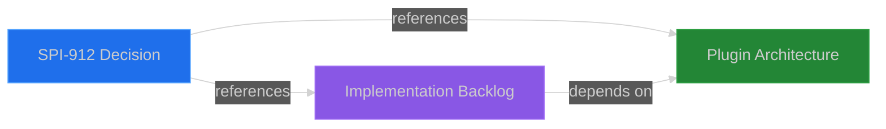

# ⚠️ DOCUMENT ARCHIVED

This monolithic research spike document (1,522 lines) has been **archived** and replaced with a DAG-structured documentation approach optimized for AI agent consumption and RAG retrieval.

---

## Why This Document Was Archived

**Problem**: 1,522-line monolithic document violates SPI-722 DAG architecture principles:
- **Too large for RAG embedding**: 3x the recommended 200-500 line limit
- **Multiple topics in one file**: Prevents focused context delivery
- **Poor Context Engineer performance**: Agents struggle to curate relevant sections
- **Token-heavy**: Inefficient for embedding systems

**Solution**: Break into focused, topic-based documents with explicit dependencies

---

## New Documentation Structure

This research spike has been decomposed into three focused documents:

### 1. Executive Decision Document (212 lines)
**Path**: `docs/reference/SPI-912-plugin-repositioning-decision.md`

**Contents**:
- Executive summary and recommendation
- Strategic advantages and challenges
- Implementation scope (3 phases)
- Success metrics
- Competitive positioning

**Use When**: Need high-level context for decision-making, executive briefings

---

### 2. Plugin Marketplace Architecture (389 lines)
**Path**: `docs/concepts/plugins/plugin-marketplace-architecture.md`

**Contents**:
- What plugins are (4 component types)
- Distribution architecture
- Marketplace structure and discovery
- Heavyweight plugin pattern
- CycleTime-specific mapping

**Use When**: Need deep understanding of plugin system, architecture decisions, technical feasibility

---

### 3. Implementation Backlog (688 lines)
**Path**: `docs/reference/SPI-912-implementation-backlog.md`

**Contents**:
- Complete backlog of 21 Linear stories
- Acceptance criteria for each story
- Dependencies and sequencing
- Phase breakdown (3 phases)
- Resource allocation and success metrics

**Use When**: Need story details for sprint planning, implementation guidance, task breakdowns

---

## Document Dependency Graph

**Reading Path**:
1. Start with **Decision Document** for strategic context
2. Read **Architecture Concept** for technical understanding
3. Use **Implementation Backlog** for execution details

---

## Benefits of DAG Structure

**For AI Agents**:
- Context Engineer can curate relevant sections without loading entire 1,522 lines
- RAG systems can embed focused topics for better retrieval accuracy
- Each document sized for optimal token usage (200-688 lines vs 1,522)

**For Human Readers**:
- Jump directly to relevant topic without scrolling through monolith
- Clearer mental model through explicit dependencies
- Faster navigation via cross-references

**For Documentation Maintenance**:
- Update individual topics without affecting others
- Validate dependencies with automated scripts
- Detect circular references in dependency graph

---

## Migration Guide for Readers

**If you were looking for...**

| Old Section | New Location |
|-------------|--------------|
| Executive Summary | `SPI-912-plugin-repositioning-decision.md` lines 22-64 |
| What Plugins Are | `../concepts/plugins/plugin-marketplace-architecture.md` lines 17-52 |
| Gap Analysis | `SPI-912-plugin-repositioning-decision.md` lines 67-91 |
| Implementation Roadmap | `SPI-912-implementation-backlog.md` lines 1-688 |
| Story Acceptance Criteria | `SPI-912-implementation-backlog.md` (individual story sections) |
| Risk Assessment | `SPI-912-plugin-repositioning-decision.md` lines 93-116 |
| Competitive Analysis | `../concepts/plugins/plugin-marketplace-architecture.md` lines 351-378 |

---

## Context Engineer Integration

When Context Engineer prepares documentation for specialized agents, it should:

1. **For High-Level Planning**: Include `SPI-912-plugin-repositioning-decision.md`
2. **For Architecture Work**: Include `plugin-marketplace-architecture.md`
3. **For Implementation**: Include `SPI-912-implementation-backlog.md` + specific story sections
4. **For Complete Context**: Include all three documents (total 1,289 lines vs original 1,522)

**Dependency Auto-Resolution**: Context Engineer can follow `dependencies` field in YAML frontmatter to automatically include prerequisite topics.

---

## Original Document History

**Created**: November 2, 2025
**Authors**: Product Manager Agent (ultrathink mode)
**Purpose**: Comprehensive research spike for SPI-912 plugin repositioning decision
**Archived**: November 3, 2025
**Reason**: Document length violates SPI-722 DAG architecture (1,522 lines > 500 line max for reference docs)

**Original Contents Preserved**: All content from original research spike is preserved across the three new documents. Nothing was lost in the restructuring.

---

## References

- **Decision Document**: [SPI-912 Plugin Repositioning Decision](SPI-912-plugin-repositioning-decision.md)
- **Architecture Concepts**: [Plugin Marketplace Architecture](../concepts/plugins/plugin-marketplace-architecture.md)
- **Implementation Backlog**: [SPI-912 Implementation Backlog](SPI-912-implementation-backlog.md)
- **DAG Architecture Principles**: [SPI-722 Documentation DAG](../guides/documentation/dag-architecture.md) (if exists)

---

**Status**: ARCHIVED - Do not use for active work
**Replacement**: Use three focused documents listed above
