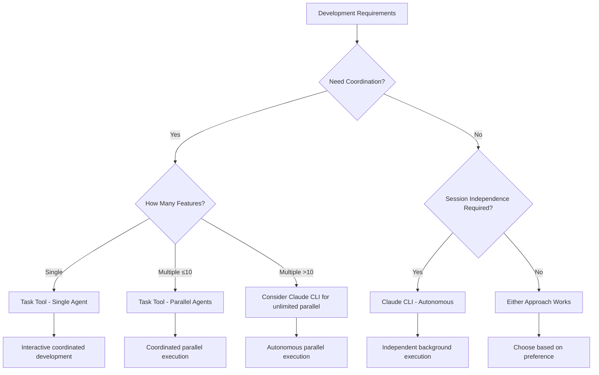

# Agent Reference

This document provides the authoritative reference for all agent types in CycleTime development.

## Agent Types Overview

CycleTime supports two distinct agent invocation methods:

| Agent Type | Environment | Capabilities | Best For |
|------------|-------------|--------------|----------|
| **Task Tool Agents** | Shared context | Interactive, parallel (≤10), coordinated execution | Coordinated development, planning, review |
| **Claude CLI Agents** | Real filesystem | Background execution, unlimited parallel, autonomous | Independent development, automation |

## Task Tool Agents

### Available Agents

CycleTime provides specialized agents for different aspects of software development. Each agent brings domain expertise and follows specific workflows tailored to their role. Choose agents based on the task requirements and coordination needs - use Task tool agents for coordinated development with shared context, or Claude CLI agents for autonomous execution with independent contexts.

#### Core Development Agents

These agents handle the primary implementation, testing, and quality assurance workflows. They work together to deliver production-ready code with comprehensive test coverage and security validation.

**@agent-developer**
Code implementation and development
```
@agent-developer "Implement user authentication with JWT tokens"
```

**@agent-qa**
Testing and quality assurance
```
@agent-qa "Create comprehensive test suite for authentication"
```

**@agent-code-reviewer**
Code review and quality assessment
```
@agent-code-reviewer "Review implementation for security vulnerabilities"
```

#### Architecture and Planning Agents

These agents focus on system design, requirements analysis, and technical coordination. Use them during planning phases to establish solid architectural foundations and break down complex features into implementable work items.

**@agent-software-architect**
System design and architecture
```
@agent-software-architect "Design user management system architecture"
```

**@agent-product-manager**
Requirements and stakeholder coordination
```
@agent-product-manager "Define user stories for authentication feature"
```

**@agent-tech-lead**
Technical coordination and planning
```
@agent-tech-lead "Break down user management epic into implementable stories"
```

**@agent-devops-engineer**
Build, deployment, and infrastructure
```
@agent-devops-engineer "Optimize CI/CD pipeline for parallel testing"
```

#### Infrastructure Support Agents

These agents provide specialized support for context preparation, technical writing, and infrastructure operations. The Context Engineer is particularly valuable for complex multi-agent workflows requiring curated documentation and context distribution.

**@agent-context-engineer**
Preparation specialist for structured context curation before agent delegation
```
@agent-context-engineer "Prepare context for SPI-XXX requiring agents: qa, developer, code-reviewer"
```

### Task Tool Agent Capabilities

✅ **Strengths:**
- Interactive development and iterative refinement
- Parallel execution up to 10 concurrent agents with built-in coordination
- Deep codebase analysis and pattern recognition
- Complex reasoning and architectural decisions
- Real-time problem solving with user feedback
- Shared context enabling coordinated development

❌ **Limitations:**
- Parallel execution limited to 10 concurrent agents maximum
- No state persistence between agent invocations
- Context limited to current Claude Code session
- Cannot run in background independently (session-bound)

### Usage Patterns

**Planning Phase:**
```
@agent-product-manager "Define requirements"
@agent-software-architect "Design architecture"
```

**Implementation Phase:**
```
@agent-developer "Implement feature according to design"
@agent-qa "Create comprehensive tests"
```

**Review Phase:**
```
@agent-code-reviewer "Review for quality and security"
@agent-developer "Address feedback and refine"
```

**Context Preparation Phase:**
```
# Claude Code analyzes Linear issue hierarchy then prepares context
@agent-context-engineer "Prepare context for SPI-XXX requiring agents: qa, developer, code-reviewer"

# Claude Code then uses structured output for targeted delegation:
@agent-qa "Create comprehensive tests... [with curated QA context]"
@agent-developer "Implement feature... [with curated developer context]"
@agent-code-reviewer "Review implementation... [with curated review context]"
```

## Claude CLI Agents

### Agent Types

| Prompt File | Purpose | Use Cases |
|-------------|---------|-----------|
| `task-agent.txt` | General development | Feature implementation, bug fixes |
| `test-agent.txt` | Testing specialist | TDD, validation, regression tests |
| `implementation-agent.txt` | Code implementation | TDD GREEN phase, direct coding |
| `review-agent.txt` | Quality assurance | Code review, TDD REFACTOR phase |

### Command Pattern

```bash
claude -p "task description" \
  --append-system-prompt "$(cat .claude/prompts/[AGENT_TYPE].txt)" \
  --permission-mode bypassPermissions \
  --output-format stream-json \
  --verbose
```

### Capabilities

✅ **Strengths:**
- Make real filesystem changes and git commits
- True parallel execution across worktrees
- Background processing with monitoring
- Production-ready outputs

❌ **Limitations:**
- One-shot execution (no interactive refinement)
- Limited context for complex architectural decisions
- Requires well-defined tasks
- No real-time problem solving

## Decision Matrix



### Selection Guidelines

**Use Task Tool Agents For:**
- Coordinated development (single or multiple features)
- Interactive problem-solving and iterative refinement
- Architecture and planning decisions requiring shared context
- Code review and analysis with coordination
- Research and exploration
- Cross-feature coordination (up to 10 parallel agents)

**Use Claude CLI Agents For:**
- Autonomous development of independent features
- Session-independent workflows
- Well-defined implementation tasks requiring autonomy
- Long-running background processing
- Unlimited parallel execution scenarios
- Production deployments

## Best Practices

### Task Descriptions

**Be Specific:**
```
❌ @agent-developer "Fix auth issue"
✅ @agent-developer "Fix JWT token expiration where tokens expire after 15 minutes instead of configured 1 hour"
```

**Provide Context:**
```
❌ @agent-code-reviewer "Review code"
✅ @agent-code-reviewer "Review JWT authentication for security vulnerabilities, focusing on token handling and session management"
```

**Include Constraints:**
```
❌ @agent-developer "Add user registration"
✅ @agent-developer "Add user registration with email validation, password requirements (8+ chars, mixed case), and duplicate prevention"
```

### Agent Selection

- **Planning/Requirements**: @agent-product-manager
- **Architecture/Design**: @agent-software-architect
- **Implementation**: @agent-developer
- **Testing**: @agent-qa
- **Review/Quality**: @agent-code-reviewer
- **Coordination**: @agent-tech-lead
- **Infrastructure**: @agent-devops-engineer
- **Context Curation**: @agent-context-engineer

### Quality Gates

**Before Agent Use:**
- [ ] Clear requirements defined
- [ ] Appropriate agent selected
- [ ] Specific task description prepared
- [ ] Context and constraints identified

**During Interaction:**
- [ ] Review output carefully
- [ ] Provide specific feedback
- [ ] Iterate until requirements met
- [ ] Validate against project standards

**After Completion:**
- [ ] Review implementations created by Task tool agents
- [ ] Test implementations thoroughly
- [ ] Commit changes with proper messages
- [ ] Update Linear status as needed

## Common Failure Modes

**Generic Responses**: Provide more specific context and requirements
**Codebase Mismatch**: Include existing patterns and conventions in task description
**Requirement Gaps**: Be explicit about all constraints and acceptance criteria

For detailed troubleshooting, see [Troubleshooting Guide](troubleshooting.md).

## Integration

This agent reference integrates with:
- [Single Feature Workflow](../development/single-feature-workflow.md)
- [Parallel Development](../testing/parallel-development.md)
- [Worktree Operations](worktree-operations.md)
- [Decision Guide](decision-guide.md)