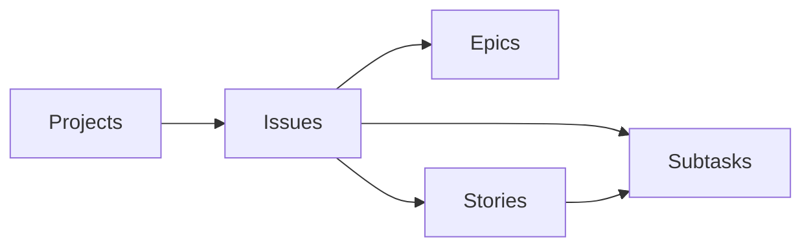
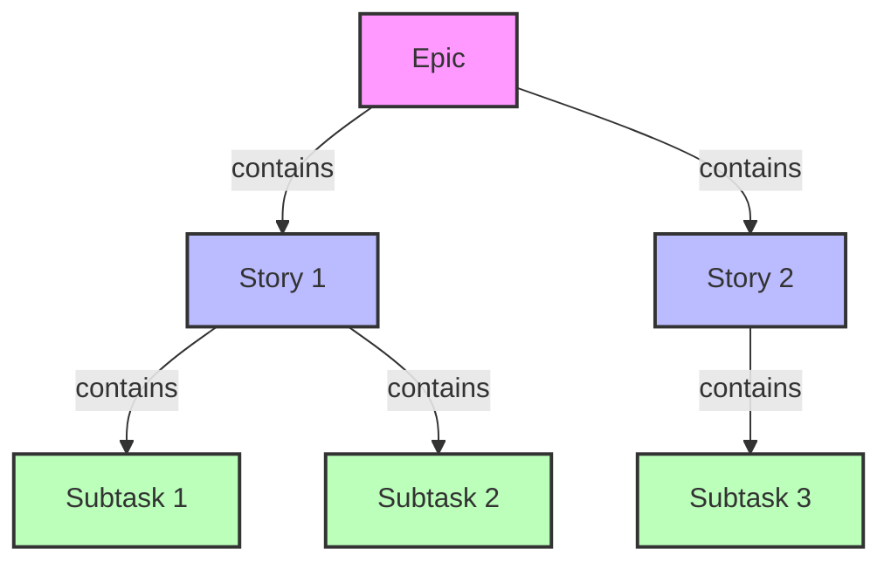
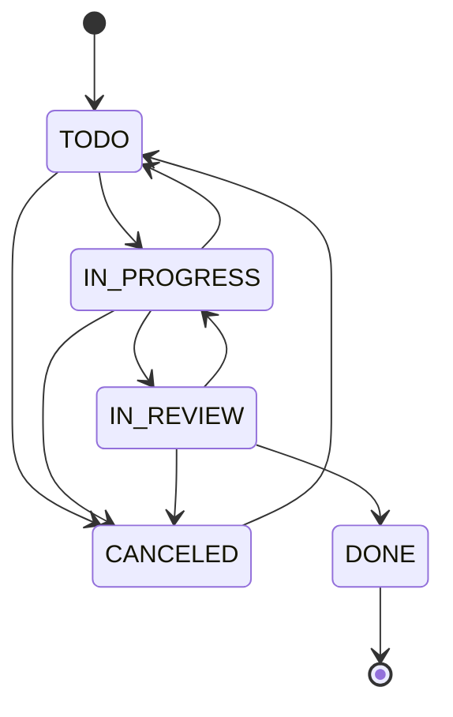
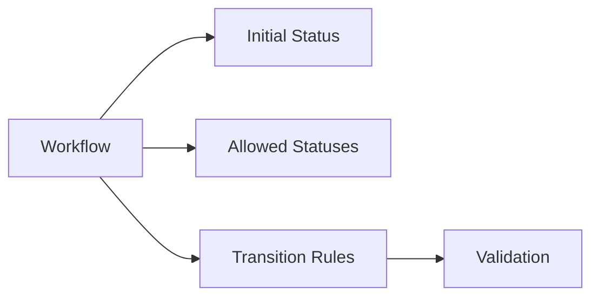

# REST API Reference

## Overview

The CycleTime CE REST API provides programmatic access to project orchestration and issue management capabilities. This API follows REST Level 2 principles with proper resource-based URLs, HTTP verbs, and status codes.

**Base URL**: `http://localhost:8080`
**API Version**: `v1`
**Content Type**: `application/json`

## Key Features

### API Design Principles
- **RESTful Resources**: Nested resource hierarchy (`/projects/{id}/issues`)
- **Standard HTTP Methods**: GET, POST, PUT, DELETE with appropriate semantics
- **Consistent Status Codes**: 2xx success, 4xx client errors, 5xx server errors
- **Query Parameters**: Resource filtering via `?template=` instead of action verbs
- **API Versioning**: All endpoints under `/api/v1/` namespace

### Business Domain
- **Hierarchical Issue Management**: Epic → Story → Subtask relationships
- **Workflow Automation**: Customizable status transitions with validation
- **Project Organization**: Isolated project contexts with issue containment
- **Estimation Rules**: Fibonacci sequence (1, 2, 3, 5, 8, 13) for complexity

## System Endpoints

### Health Check
```http
GET /health
```

Returns comprehensive health status of the application and its dependencies.

**Response Codes**:
- `200 OK` - All systems operational
- `503 Service Unavailable` - Critical system failure

**Response Example**:
```json
{
  "status": "healthy",
  "service": "CycleTime CE",
  "version": "0.2.0-SNAPSHOT",
  "dependencies": {
    "database": "connected",
    "projectService": "initialized",
    "issueService": "initialized",
    "sessionService": "initialized",
    "mcp": "running"
  },
  "metrics": {
    "projects": "5",
    "sessions": "2",
    "mcpConnections": "1",
    "mcpUptime": "3600000"
  },
  "timestamp": "1702934400000"
}
```

### API Discovery
```http
GET /api/v1
```

Returns API version information and available resource endpoints for programmatic discovery.

**Response Example**:
```json
{
  "version": "v1",
  "service": "CycleTime",
  "description": "CycleTime CE API",
  "endpoints": {
    "projects": "/api/v1/projects",
    "workflows": "/api/v1/workflows",
    "issues": "/api/v1/projects/{projectId}/issues"
  },
  "documentation": "/swagger"
}
```

## MCP Protocol Endpoints

### MCP Server Information
```http
GET /mcp/info
```

Returns MCP server information and capabilities.

**Response**:
```json
{
  "protocolVersion": "1.0.0",
  "serverInfo": {
    "name": "cycletime",
    "version": "0.1.0"
  },
  "capabilities": {
    "resources": true,
    "tools": true,
    "sse": true
  }
}
```

### List MCP Resources
```http
GET /mcp/resources
```

List all available MCP resources.

**Response**:
```json
{
  "resources": [
    {
      "id": "project-list",
      "name": "Project List",
      "type": "list",
      "description": "List of all projects"
    },
    {
      "id": "issue-list",
      "name": "Issue List",
      "type": "list",
      "description": "List of all issues"
    },
    {
      "id": "session-state",
      "name": "Session State",
      "type": "state",
      "description": "Current session state"
    }
  ]
}
```

### Get MCP Resource by ID
```http
GET /mcp/resources/{id}
```

**Parameters**:
- `id` (path) - Resource identifier

**Response**:
```json
{
  "id": "project-list",
  "name": "Project List",
  "type": "list",
  "data": [
    {
      "id": "proj_123",
      "name": "CycleTime",
      "description": "Project orchestration framework",
      "status": "active"
    }
  ]
}
```

**Status Codes**:
- `200 OK` - Resource found
- `404 Not Found` - Resource not found

### Execute MCP Tool
```http
POST /mcp/tools/{name}
```

**Parameters**:
- `name` (path) - Tool name

**Request Body**:
```json
{
  "parameters": {
    "key": "value"
  }
}
```

**Response**:
```json
{
  "result": {
    "status": "success",
    "data": {}
  }
}
```

**Status Codes**:
- `200 OK` - Tool executed successfully
- `400 Bad Request` - Invalid parameters
- `404 Not Found` - Tool not found
- `500 Internal Server Error` - Tool execution failed

### MCP Server-Sent Events
```http
GET /mcp/sse
```

Server-sent events stream for real-time updates.

**Response**: Event stream

```
event: update
data: {"type": "project_updated", "data": {...}}

event: notification
data: {"type": "issue_created", "data": {...}}
```

## Project Management

Projects are the top-level containers for organizing issues and work items.



### Create Project
```http
POST /api/v1/projects
Content-Type: application/json

{
  "name": "Q1 Product Launch",
  "description": "New product features for Q1 2024 release"
}
```

**Validation Rules**:
- Name is required (1-255 characters)
- Description is optional (max 2000 characters)

**Response**: `201 Created`
```json
{
  "id": "550e8400-e29b-41d4-a716-446655440001",
  "name": "Q1 Product Launch",
  "description": "New product features for Q1 2024 release",
  "status": "ACTIVE",
  "issueIds": [],
  "createdAt": "2024-01-01T00:00:00Z",
  "updatedAt": "2024-01-01T00:00:00Z"
}
```

### List Projects
```http
GET /api/v1/projects
```

Returns all projects with their issue counts.

**Response**: `200 OK`
```json
{
  "projects": [
    {
      "id": "550e8400-e29b-41d4-a716-446655440001",
      "name": "Q1 Product Launch",
      "description": "New product features for Q1 2024 release",
      "status": "ACTIVE",
      "issueIds": ["550e8400-e29b-41d4-a716-446655440002"],
      "createdAt": "2024-01-01T00:00:00Z",
      "updatedAt": "2024-01-01T00:00:00Z"
    }
  ],
  "totalCount": 1
}
```

### Get Project
```http
GET /api/v1/projects/{id}
```

Retrieves a specific project by ID.

**Path Parameters**:
- `id` (UUID) - Project identifier

**Response**: `200 OK` (same as create response)

**Error Responses**:
- `400 Bad Request` - Invalid UUID format
- `404 Not Found` - Project doesn't exist

### Update Project
```http
PUT /api/v1/projects/{id}
Content-Type: application/json

{
  "name": "Q1 Product Launch - Updated",
  "description": "Updated description with new requirements"
}
```

**Update Behavior**:
- Partial updates supported (null fields ignored)
- At least one field must be provided

**Response**: `200 OK` (returns updated project)

### Delete Project
```http
DELETE /api/v1/projects/{id}
```

**Delete Rules**:
- Cannot delete projects with existing issues
- Returns `204` even if project doesn't exist (idempotent)

**Response**: `204 No Content`

**Error Response**:
- `400 Bad Request` - Project has existing issues

## Issue Management

Issues are work items nested under projects, following a three-tier hierarchy:



### Create Issue
```http
POST /api/v1/projects/{projectId}/issues
Content-Type: application/json

{
  "title": "Implement user authentication",
  "description": "Add OAuth2 authentication support",
  "type": "STORY",
  "parentId": null,
  "estimate": 5,
  "assignee": "john.doe@example.com"
}
```

**Path Parameters**:
- `projectId` (UUID) - Parent project ID

**Business Rules**:
- **Epics**: Cannot have estimates or parent issues
- **Stories**: Can have estimates only if no subtasks exist
- **Subtasks**: Must have a parent story and always require estimates
- Estimates must follow Fibonacci: 1, 2, 3, 5, 8, 13
- Initial status is always `TODO`

**Response**: `201 Created`
```json
{
  "id": "550e8400-e29b-41d4-a716-446655440002",
  "projectId": "550e8400-e29b-41d4-a716-446655440001",
  "title": "Implement user authentication",
  "description": "Add OAuth2 authentication support",
  "type": "STORY",
  "status": "TODO",
  "parentId": null,
  "estimate": 5,
  "assignee": "john.doe@example.com",
  "dependencies": [],
  "blockedBy": [],
  "createdAt": "2024-01-01T00:00:00Z",
  "updatedAt": "2024-01-01T00:00:00Z"
}
```

**Error Responses**:
- `400 Bad Request` - Validation failure or business rule violation
- `404 Not Found` - Project doesn't exist

### List Project Issues
```http
GET /api/v1/projects/{projectId}/issues
```

Returns all issues in a project.

**Response**: `200 OK`
```json
{
  "issues": [
    {
      "id": "550e8400-e29b-41d4-a716-446655440002",
      "projectId": "550e8400-e29b-41d4-a716-446655440001",
      "title": "Implement user authentication",
      "type": "STORY",
      "status": "TODO",
      "estimate": 5
    }
  ],
  "totalCount": 1
}
```

### Get Issue
```http
GET /api/v1/projects/{projectId}/issues/{issueId}
```

**Context Validation**:
- Returns `404` if issue exists but belongs to different project
- Ensures issues are accessed through correct project context

### Update Issue
```http
PUT /api/v1/projects/{projectId}/issues/{issueId}
Content-Type: application/json

{
  "title": "Updated title",
  "description": "Updated description",
  "estimate": 8,
  "assignee": "jane.doe@example.com"
}
```

**Update Restrictions**:
- Issue type cannot be changed
- Parent relationships are immutable
- Use status endpoint for status changes

**Response**: `200 OK` (returns updated issue)

### Delete Issue
```http
DELETE /api/v1/projects/{projectId}/issues/{issueId}
```

**Cascade Rules**:
- Cannot delete issues with child issues
- Dependencies and blockers auto-cleaned

**Response**: `204 No Content`

### Transition Issue Status
```http
POST /api/v1/projects/{projectId}/issues/{issueId}/status
Content-Type: application/json

{
  "status": "IN_PROGRESS"
}
```

**Workflow State Machine**:



**Valid Transitions**:
- `TODO` → `IN_PROGRESS`, `CANCELED`
- `IN_PROGRESS` → `IN_REVIEW`, `TODO`, `CANCELED`
- `IN_REVIEW` → `DONE`, `IN_PROGRESS`, `CANCELED`
- `DONE` → No transitions allowed
- `CANCELED` → `TODO` (reopen only)

**Response**: `200 OK` (returns updated issue)

**Error Response**:
- `400 Bad Request` - Invalid transition

### Get Issue Hierarchy
```http
GET /api/v1/projects/{projectId}/issues/{issueId}/hierarchy
```

Returns extended hierarchy information for an issue.

**Response**: `200 OK`
```json
{
  "issue": { /* current issue */ },
  "parent": { /* parent issue if exists */ },
  "children": [ /* direct children */ ],
  "totalDescendants": 5
}
```

## Workflow Management

Workflows define the allowed status transitions for issues.



### Create Workflow

#### Using Templates
```http
POST /api/v1/workflows?template=default
```

**Available Templates**:
- `default` - Basic workflow (TODO → IN_PROGRESS → DONE)
- `bug` - Bug tracking with verification states
- `feature` - Feature development with review states

#### Custom Workflow
```http
POST /api/v1/workflows
Content-Type: application/json

{
  "name": "Custom Sprint Workflow",
  "description": "Workflow for sprint development",
  "initialStatus": "TODO",
  "allowedStatuses": ["TODO", "IN_PROGRESS", "IN_REVIEW", "DONE", "CANCELED"]
}
```

**Response**: `201 Created`
```json
{
  "id": "550e8400-e29b-41d4-a716-446655440000",
  "name": "Custom Sprint Workflow",
  "description": "Workflow for sprint development",
  "initialStatus": "TODO",
  "allowedStatuses": ["TODO", "IN_PROGRESS", "IN_REVIEW", "DONE", "CANCELED"],
  "createdAt": "2024-01-01T00:00:00Z",
  "updatedAt": "2024-01-01T00:00:00Z"
}
```

### List Workflows
```http
GET /api/v1/workflows
```

Returns all workflows in the system.

### Get Workflow
```http
GET /api/v1/workflows/{id}
```

Retrieves a specific workflow by ID.

### Update Workflow
```http
PUT /api/v1/workflows/{id}
Content-Type: application/json

{
  "name": "Updated Workflow Name",
  "description": "Updated workflow description"
}
```

**Note**: Only name and description can be updated. Status configuration is immutable.

### Delete Workflow
```http
DELETE /api/v1/workflows/{id}
```

Permanently removes a workflow.

**Response**: `204 No Content` or `404 Not Found`

### Get Workflow Transitions
```http
GET /api/v1/workflows/{id}/transitions
```

Returns all possible status transitions for the workflow.

**Response**: `200 OK`
```json
{
  "workflowId": "550e8400-e29b-41d4-a716-446655440000",
  "transitions": [
    {
      "fromStatus": "TODO",
      "validTransitions": ["IN_PROGRESS", "CANCELED"]
    },
    {
      "fromStatus": "IN_PROGRESS",
      "validTransitions": ["IN_REVIEW", "TODO", "CANCELED"]
    }
  ]
}
```

### Validate Transition
```http
POST /api/v1/workflows/{id}/transitions/validation
Content-Type: application/json

{
  "fromStatus": "TODO",
  "toStatus": "IN_PROGRESS"
}
```

Validates whether a specific status transition is allowed.

**Response**: `200 OK`
```json
{
  "isValid": true,
  "reason": null
}
```

## Error Handling

The API uses standard HTTP status codes and returns structured error responses:

### Error Response Format
```json
{
  "error": "Validation failed",
  "details": "Project name must not be empty",
  "timestamp": "2024-01-01T00:00:00Z"
}
```

### Common Status Codes

| Status Code | Meaning | Common Causes |
|------------|---------|---------------|
| `200 OK` | Success | Successful GET, PUT requests |
| `201 Created` | Resource created | Successful POST requests |
| `204 No Content` | Success, no body | Successful DELETE requests |
| `400 Bad Request` | Invalid request | Validation errors, business rule violations |
| `404 Not Found` | Resource not found | Invalid IDs, wrong project context |
| `500 Internal Server Error` | Server error | Unexpected server issues |
| `503 Service Unavailable` | Service down | Database unavailable, critical failure |

## Request/Response Examples

### Complete Issue Creation Flow

#### 1. Create Project
```bash
curl -X POST http://localhost:8080/api/v1/projects \
  -H "Content-Type: application/json" \
  -d '{
    "name": "Mobile App Development",
    "description": "iOS and Android app for Q2 launch"
  }'
```

#### 2. Create Epic
```bash
curl -X POST http://localhost:8080/api/v1/projects/{projectId}/issues \
  -H "Content-Type: application/json" \
  -d '{
    "title": "User Authentication Module",
    "description": "Complete authentication system",
    "type": "EPIC"
  }'
```

#### 3. Create Story
```bash
curl -X POST http://localhost:8080/api/v1/projects/{projectId}/issues \
  -H "Content-Type: application/json" \
  -d '{
    "title": "Implement OAuth2 login",
    "description": "Support Google and GitHub OAuth",
    "type": "STORY",
    "parentId": "{epicId}",
    "estimate": 5
  }'
```

#### 4. Create Subtask
```bash
curl -X POST http://localhost:8080/api/v1/projects/{projectId}/issues \
  -H "Content-Type: application/json" \
  -d '{
    "title": "Setup OAuth2 providers",
    "type": "SUBTASK",
    "parentId": "{storyId}",
    "estimate": 3
  }'
```

#### 5. Transition Status
```bash
curl -X POST http://localhost:8080/api/v1/projects/{projectId}/issues/{issueId}/status \
  -H "Content-Type: application/json" \
  -d '{
    "status": "IN_PROGRESS"
  }'
```

## Migration from Legacy API

All legacy endpoints have been deprecated and replaced:

| Legacy Endpoint | New Endpoint | Changes |
|----------------|--------------|---------|
| `/api/projects` | `/api/v1/projects` | Added versioning |
| `/api/issues` | `/api/v1/projects/{projectId}/issues` | Nested under projects |
| `/api/workflows` | `/api/v1/workflows` | Added versioning |
| `/api/workflows/{id}/validate-transition` | `/api/v1/workflows/{id}/transitions/validation` | Resource-based URL |

Legacy endpoints return `404` with migration guidance.

## Future Features

### Planned

- **Rate Limiting**: Per-client request throttling
- **Authentication**: OAuth2 support
- **Pagination**: List endpoints with page/size parameters
- **Webhooks**: Event notifications for external integrations
- **SDK Support**: Official clients for JavaScript, Python, Go, Java/Kotlin

### Considerations

- All endpoints currently return full result sets
- No caching headers implemented yet
- Authentication not required in current version

## See Also

- [API Quick Start Guide](../../guides/getting-started/api-quick-start.md) - Getting started with the API
- [API Best Practices](../../guides/development/api-best-practices.md) - Design patterns and conventions
- [API Migration Guide](../../guides/development/api-migration-guide.md) - Migrating from legacy endpoints
- [MCP Tools Reference](./mcp-tools-reference.md) - MCP tool specifications
- [MCP Resources Reference](./mcp-resources-reference.md) - MCP resource specifications
