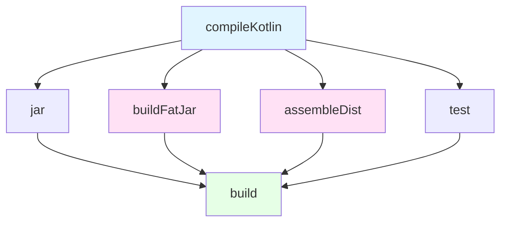
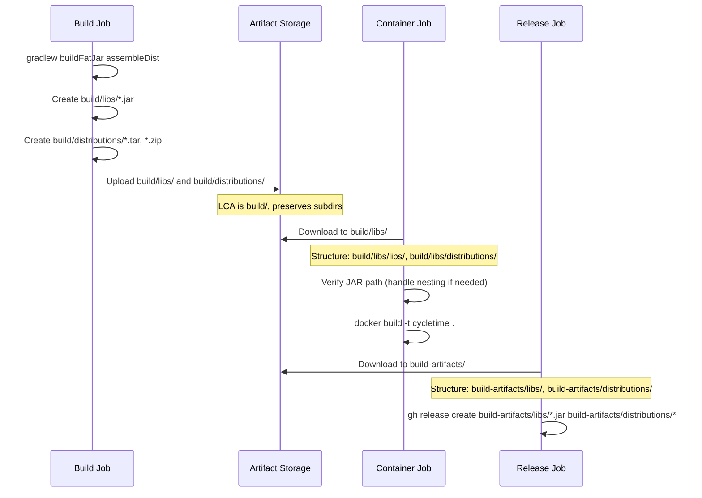

# Artifact Build Commands Reference

## Quick Reference

### Build Tasks Summary

| Task | Output | Use Case | Required For |
|------|--------|----------|--------------|
| `compileKotlin` | `build/classes/kotlin/main/` | Compilation only | All builds |
| `buildFatJar` | `build/libs/cycletime-server.jar` | Executable JAR | Releases, Docker |
| `assembleDist` | `build/distributions/*.tar`<br/>`build/distributions/*.zip` | Distribution packages | Releases |
| `build` | All artifacts | Complete build | Local development |
| `clean` | (deletes build/) | Fresh build | Troubleshooting |

### Artifact Output Paths

| Artifact Type | Path | Size (approx) | Format |
|---------------|------|---------------|--------|
| Fat JAR | `build/libs/cycletime-server.jar` | 50-60 MB | Executable JAR |
| TAR distribution | `build/distributions/cycletime-server.tar` | 50-60 MB | TAR archive |
| ZIP distribution | `build/distributions/cycletime-server.zip` | 50-60 MB | ZIP archive |
| Compiled classes | `build/classes/kotlin/main/` | 5-10 MB | Class files |
| Test classes | `build/classes/kotlin/test/` | 2-5 MB | Class files |

## Build Tasks

### Task: compileKotlin

**Purpose**: Compile main source code to bytecode

**Command**:
```bash
./gradlew compileKotlin
```

**Output**:
```
build/classes/kotlin/main/
└── io/spiralhouse/cycletime/
    ├── Application.class
    ├── ...
```

**Use Cases**:
- Compilation verification
- IDE integration
- Pre-compilation for test jobs

**Performance**:
- Cold build: 15-30 seconds
- Warm build (cached): 2-5 seconds

### Task: buildFatJar

**Purpose**: Build executable JAR with all dependencies

**Command**:
```bash
./gradlew buildFatJar
```

**Output**:
```
build/libs/cycletime-server.jar
```

**JAR Contents**:
- Compiled application classes
- All runtime dependencies
- META-INF/MANIFEST.MF with main class
- Embedded resources

**Execution**:
```bash
java -jar build/libs/cycletime-server.jar
```

**Use Cases**:
- Docker image builds
- Standalone deployments
- GitHub releases

**Performance**:
- Cold build: 20-40 seconds
- Warm build (cached): 5-10 seconds

**Configuration**:
```kotlin
// build.gradle.kts
tasks.register<Jar>("buildFatJar") {
    archiveBaseName.set("cycletime-server")
    archiveClassifier.set("")
    from(sourceSets.main.get().output)
    dependsOn(configurations.runtimeClasspath)
    from({
        configurations.runtimeClasspath.get()
            .filter { it.name.endsWith("jar") }
            .map { zipTree(it) }
    })
}
```

### Task: assembleDist

**Purpose**: Create distribution packages with startup scripts

**Command**:
```bash
./gradlew assembleDist
```

**Output**:
```
build/distributions/
├── cycletime-server.tar
└── cycletime-server.zip
```

**Distribution Contents**:
- `bin/` - Startup scripts (Unix shell + Windows batch)
- `lib/` - Application JAR and dependencies (separate JARs)

**Directory Structure**:
```
cycletime-server/
├── bin/
│   ├── cycletime-server       # Unix shell script
│   └── cycletime-server.bat   # Windows batch script
└── lib/
    ├── cycletime-server.jar   # Application JAR
    ├── ktor-server-core.jar
    ├── ...
```

**Execution**:
```bash
# Extract TAR
tar -xf cycletime-server.tar
cd cycletime-server

# Run with startup script
./bin/cycletime-server

# Or extract ZIP
unzip cycletime-server.zip
cd cycletime-server
./bin/cycletime-server
```

**Use Cases**:
- Production deployments
- System integrations
- Package distributions
- GitHub releases

**Performance**:
- Cold build: 25-45 seconds
- Warm build (cached): 8-12 seconds

### Task: build

**Purpose**: Complete build including compilation, tests, and all artifacts

**Command**:
```bash
./gradlew build
```

**Output**: All of the above plus:
- Test results: `build/reports/tests/`
- Code coverage: `build/reports/kover/`
- Detekt reports: `build/reports/detekt/`

**Use Cases**:
- Local development verification
- Pre-commit validation
- Full project validation

**Performance**:
- Cold build: 60-120 seconds (includes tests)
- Warm build (cached): 15-30 seconds

### Task: clean

**Purpose**: Delete all build outputs

**Command**:
```bash
./gradlew clean
```

**Deleted Directories**:
- `build/` (entire directory)

**Use Cases**:
- Troubleshooting build issues
- Ensuring fresh build
- Resolving caching problems

**Warning**: Requires full recompilation after clean

## CI/CD Build Commands

### Compilation Job (Compile Once, Reuse Everywhere)

```bash
./gradlew compileKotlin \
  compileTestKotlin \
  compileIntegrationTestKotlin \
  compileSystemTestKotlin \
  --no-build-cache \
  --configuration-cache \
  --no-daemon
```

**Output**:
```
build/classes/kotlin/main/
build/classes/kotlin/test/
build/classes/kotlin/integrationTest/
build/classes/kotlin/systemTest/
build/kotlin/
build/tmp/kotlin-classes/
build/resources/
```

**Upload for Reuse**:
```yaml
- uses: actions/upload-artifact@v4
  with:
    name: compiled-artifacts
    path: |
      build/classes/
      build/kotlin/
      build/tmp/kotlin-classes/
      build/resources/
```

### Test Jobs (Reuse Compiled Artifacts)

```bash
./gradlew unitTest koverXmlReport \
  -x compileKotlin \
  -x compileTestKotlin \
  -x compileIntegrationTestKotlin \
  -x compileSystemTestKotlin \
  --no-build-cache \
  --configuration-cache \
  --no-daemon
```

**Key Flags**:
- `-x compileKotlin`: Skip compilation (use downloaded artifacts)
- `--no-build-cache`: Disable Gradle build cache (using artifacts instead)
- `--configuration-cache`: Enable configuration caching for speed
- `--no-daemon`: No daemon in CI (clean environment)

### Build Job (Create Release Artifacts)

```bash
./gradlew buildFatJar assembleDist \
  -x compileKotlin \
  -x compileTestKotlin \
  -x compileIntegrationTestKotlin \
  -x compileSystemTestKotlin \
  -x test \
  --no-build-cache \
  --configuration-cache \
  --no-daemon
```

**Critical**: Both `buildFatJar` and `assembleDist` required for complete releases (SPI-910)

**Output**:
```
build/libs/cycletime-server.jar
build/distributions/cycletime-server.tar
build/distributions/cycletime-server.zip
```

## Artifact Upload/Download Behavior

### upload-artifact@v4 Behavior

**Critical Understanding**: Preserves directory structure from Lowest Common Ancestor (LCA)

#### Example 1: Single Directory Upload

```yaml
- uses: actions/upload-artifact@v4
  with:
    name: compiled-artifacts
    path: build/classes/
```

**LCA**: `build/classes/` is the only path, so LCA is `build/classes/`

**Upload Structure**: Contents of `build/classes/` (no parent directory)

**Download Structure**:
```
download-path/
├── kotlin/
│   ├── main/
│   └── test/
└── ...
```

#### Example 2: Multiple Path Upload

```yaml
- uses: actions/upload-artifact@v4
  with:
    name: build-artifacts
    path: |
      build/libs/*.jar
      build/distributions/
```

**LCA**: `build/` (lowest common ancestor of both paths)

**Upload Structure**: Preserves `build/` subdirectories

**Download Structure**:
```
download-path/
├── libs/
│   └── cycletime-server.jar
└── distributions/
    ├── cycletime-server.tar
    └── cycletime-server.zip
```

### download-artifact@v4 Behavior

```yaml
- uses: actions/download-artifact@v4
  with:
    name: build-artifacts-0.3.2
    path: build-artifacts/
```

**Behavior**:
- Creates `build-artifacts/` directory
- Extracts artifact contents preserving LCA structure
- Does **not** flatten directory structure

**Example Result**:
```
build-artifacts/
├── libs/
│   └── cycletime-server.jar
└── distributions/
    ├── cycletime-server.tar
    └── cycletime-server.zip
```

### Common Artifact Path Mistakes

#### Mistake 1: Assuming Flat Structure

```yaml
# ❌ WRONG: Assumes files are in root of download
- uses: actions/download-artifact@v4
  with:
    path: artifacts/

- run: ls artifacts/*.jar  # FAILS: No JAR in root
```

```yaml
# ✅ CORRECT: Accounts for LCA-preserved structure
- uses: actions/download-artifact@v4
  with:
    path: artifacts/

- run: ls artifacts/libs/*.jar  # SUCCESS: JAR in libs/
```

#### Mistake 2: Incorrect Release Glob Patterns

```yaml
# ❌ WRONG: Missing download path prefix
gh release create v0.3.2 \
  build/libs/*.jar \
  build/distributions/*.tar

# ✅ CORRECT: Includes download path prefix
gh release create v0.3.2 \
  build-artifacts/libs/*.jar \
  build-artifacts/distributions/*.tar \
  build-artifacts/distributions/*.zip
```

**Reference**: SPI-910

## Artifact Versioning

### Version in Artifact Names

Artifact names include version from `build.gradle.kts`:

```kotlin
// build.gradle.kts
group = "io.spiralhouse.cycletime"
version = semver.info.version  // From git-semver plugin
```

**Example Outputs**:
- `cycletime-server-0.3.2.jar`
- `cycletime-server-0.3.2.tar`
- `cycletime-server-0.3.2.zip`

### Version Fallback Issue (SPI-911)

**Problem**: Build job with shallow checkout produces `0.0.1-SNAPSHOT` artifacts

**Cause**: git-semver plugin requires full git history and tags

**Symptom**:
```
# Expected
cycletime-server-0.3.2.jar

# Actual (with shallow checkout)
cycletime-server-0.0.1-SNAPSHOT.jar
```

**Solution**: Use full checkout in build job
```yaml
- uses: actions/checkout@v4
  with:
    fetch-depth: 0
    fetch-tags: true
```

**Verification**:
```bash
# Check version before build
./gradlew printVersion --quiet

# Expected: 0.3.2
# Fallback: 0.0.1-SNAPSHOT

# If fallback, check git state
git describe --tags --abbrev=0
# Should show: v0.3.2 (or latest tag)
```

## Verification Commands

### Verify Build Outputs

```bash
# Check all expected artifacts exist
ls -lh build/libs/cycletime-server.jar
ls -lh build/distributions/cycletime-server.tar
ls -lh build/distributions/cycletime-server.zip

# Verify JAR is executable
java -jar build/libs/cycletime-server.jar --version

# Verify distributions are valid
tar -tzf build/distributions/cycletime-server.tar | head
unzip -l build/distributions/cycletime-server.zip | head
```

### Verify Artifact Versioning

```bash
# Check artifact names
ls -1 build/libs/*.jar build/distributions/*

# Extract version from JAR manifest
unzip -p build/libs/cycletime-server.jar META-INF/MANIFEST.MF | grep Implementation-Version

# Expected: Implementation-Version: 0.3.2
# Not: Implementation-Version: 0.0.1-SNAPSHOT
```

### Verify Upload/Download Structure

```bash
# Simulate artifact upload/download locally
mkdir -p /tmp/artifact-test/download

# Create test structure (simulating build output)
mkdir -p /tmp/artifact-test/build/libs
mkdir -p /tmp/artifact-test/build/distributions
touch /tmp/artifact-test/build/libs/test.jar
touch /tmp/artifact-test/build/distributions/test.tar

# Simulate upload (determine LCA)
# LCA of build/libs/* and build/distributions/ is build/

# Simulate download (preserves structure from LCA)
cp -r /tmp/artifact-test/build/* /tmp/artifact-test/download/

# Verify structure
ls -R /tmp/artifact-test/download/
# Should show:
# download/libs/test.jar
# download/distributions/test.tar
```

## Troubleshooting

### Issue: Missing TAR/ZIP in Release

**Symptom**: GitHub release only has JAR, missing TAR and ZIP

**Cause**: Build command only ran `buildFatJar`

**Solution**: Add `assembleDist`
```bash
./gradlew buildFatJar assembleDist
```

**Reference**: SPI-910

### Issue: JAR Not Found After Download

**Symptom**: `ls build/libs/*.jar` fails after download-artifact

**Cause**: Incorrect path (not accounting for LCA structure)

**Solution**: Use correct download path
```bash
# If downloaded to build-artifacts/
ls build-artifacts/libs/*.jar

# If downloaded to current directory
ls libs/*.jar
```

### Issue: Artifacts Have Wrong Version

**Symptom**: Artifacts named with `0.0.1-SNAPSHOT` instead of release version

**Cause**: Shallow git checkout in build job

**Solution**: Full checkout with tags
```yaml
- uses: actions/checkout@v4
  with:
    fetch-depth: 0
    fetch-tags: true
```

**Reference**: SPI-911

### Issue: Build Takes Too Long

**Symptom**: Build job exceeds 20 minute timeout

**Optimization 1**: Use compiled artifacts from compile job
```bash
./gradlew buildFatJar -x compileKotlin
```

**Optimization 2**: Skip tests in build job
```bash
./gradlew buildFatJar -x test
```

**Optimization 3**: Enable configuration cache
```bash
./gradlew buildFatJar --configuration-cache
```

**Optimization 4**: Use Gradle build cache
```bash
./gradlew buildFatJar --build-cache
```

## Build Task Dependencies



**Key Points**:
- `compileKotlin` is a prerequisite for all build tasks
- `buildFatJar` and `assembleDist` are independent (can run in parallel)
- `build` task depends on all artifact tasks plus tests

## CI/CD Artifact Flow



## Performance Tips

### Parallel Builds

```bash
# Run buildFatJar and assembleDist in parallel
./gradlew buildFatJar assembleDist --parallel
```

### Incremental Builds

```bash
# Skip up-to-date tasks
./gradlew buildFatJar --build-cache
```

### Configuration Cache

```bash
# Reuse configuration from previous builds
./gradlew buildFatJar --configuration-cache
```

### Daemon

```bash
# Use Gradle daemon for faster local builds
./gradlew buildFatJar  # Daemon enabled by default

# Disable in CI (clean environment)
./gradlew buildFatJar --no-daemon
```

## See Also

- [Pipeline Architecture Guide](../../guides/cicd/pipeline-architecture.md) - Complete pipeline structure
- [Troubleshooting Pipeline Failures](../../guides/cicd/troubleshooting-pipeline-failures.md) - Debugging build issues
- [Checkout Configuration Reference](./checkout-configuration.md) - Git checkout patterns
