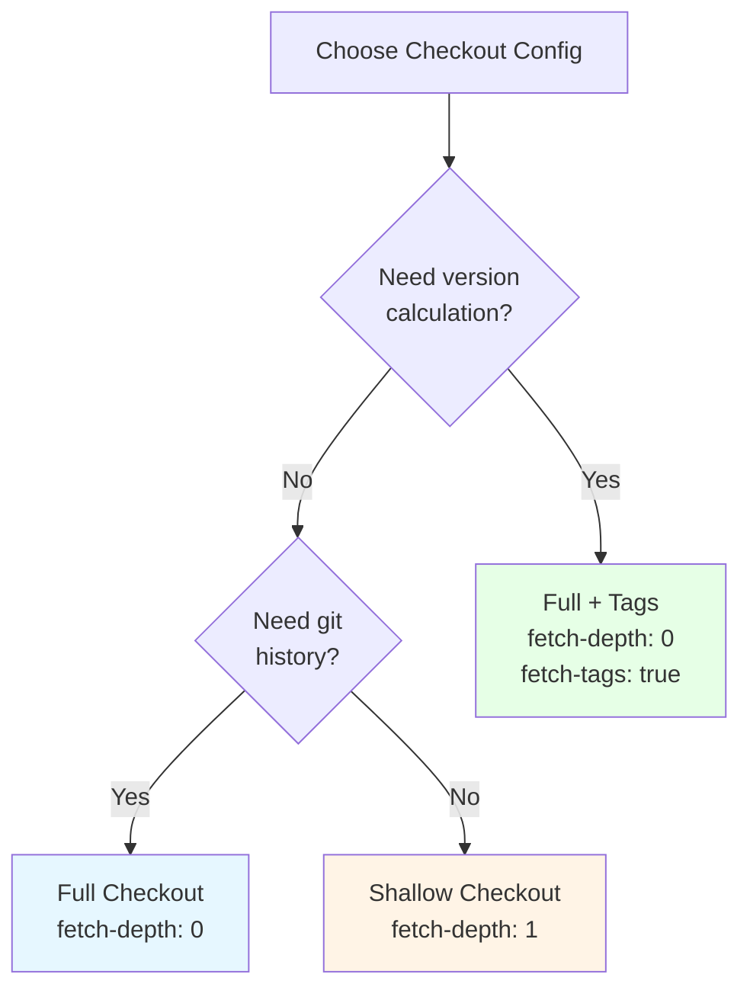

# Git Checkout Configuration Reference

## Quick Reference

### Checkout Configuration Patterns

| Pattern | Configuration | Use Case | Performance |
|---------|---------------|----------|-------------|
| **Shallow** | `fetch-depth: 1` (default) | Static analysis, security scans | Fastest |
| **Full History** | `fetch-depth: 0` | Tests, compilation | Moderate |
| **Full + Tags** | `fetch-depth: 0`<br/>`fetch-tags: true` | Version calculation, builds, releases | Slower |

### Job-Specific Configurations

| Job | fetch-depth | fetch-tags | Reason | Critical? |
|-----|-------------|------------|--------|-----------|
| version | 0 | true | git-semver version calculation | **YES** |
| compile | 0 | false | Build reproducibility | No |
| unit-tests | 0 | false | Test reproducibility | No |
| integration-tests | 0 | false | Test reproducibility | No |
| system-tests | 0 | false | Test reproducibility | No |
| quality | 1 | false | Detekt static analysis | No |
| security | 1 | false | Dependency scanning | No |
| **build** | **0** | **true** | **Artifact versioning (SPI-911)** | **YES** |
| container | 1 | false | Docker build | No |
| **release** | **0** | **true** | **Changelog generation** | **YES** |

## Configuration Details

### Pattern 1: Shallow Checkout (Default)

```yaml
- name: Checkout
  uses: actions/checkout@v4
  # Defaults: fetch-depth: 1, fetch-tags: false
```

**Characteristics**:
- Fetches only the latest commit
- No git history available
- No tags fetched
- Fastest checkout time
- Smallest disk usage

**Use For**:
- Static code analysis (Detekt)
- Security scanning (OWASP Dependency Check)
- Linting and formatting checks
- Any job that doesn't need git history

**Limitations**:
- `git log` only shows 1 commit
- `git describe` fails (no tags)
- Version calculation falls back to default
- Changelog generation fails

**Example Jobs**:
```yaml
quality:
  steps:
    - uses: actions/checkout@v4  # Shallow checkout sufficient
    - run: ./gradlew detekt

security:
  steps:
    - uses: actions/checkout@v4  # Shallow checkout sufficient
    - run: ./gradlew dependencyCheckAnalyze
```

### Pattern 2: Full History Checkout

```yaml
- name: Checkout
  uses: actions/checkout@v4
  with:
    fetch-depth: 0
```

**Characteristics**:
- Fetches complete git history
- All commits accessible via `git log`
- Tags **not** automatically fetched (requires separate `fetch-tags: true`)
- Slower checkout than shallow
- Larger disk usage

**Use For**:
- Compilation (build cache optimization)
- Test execution (reproducibility)
- Any job needing git history but not version calculation

**Benefits**:
- Better Gradle build cache keys (uses git history)
- Reproducible builds across runs
- Full commit history for debugging

**Example Jobs**:
```yaml
compile:
  steps:
    - uses: actions/checkout@v4
      with:
        fetch-depth: 0  # Full history for build reproducibility
    - run: ./gradlew compileKotlin
```

### Pattern 3: Full History + Tags (Version Calculation)

```yaml
- name: Checkout
  uses: actions/checkout@v4
  with:
    fetch-depth: 0        # Full git history
    fetch-tags: true      # Explicitly fetch tags
```

**Characteristics**:
- Fetches complete git history
- Fetches all git tags
- Enables version calculation from tags
- Slowest checkout time
- Largest disk usage

**Use For** (REQUIRED):
- Version calculation jobs
- Build jobs (artifact versioning)
- Release jobs (changelog generation)

**Critical For**:
- git-semver plugin version calculation
- Preventing version fallback to `0.0.1-SNAPSHOT`
- Tag-based changelog generation

**Example Jobs**:
```yaml
version:
  steps:
    - name: Checkout
      uses: actions/checkout@v4
      with:
        fetch-depth: 0
        fetch-tags: true  # REQUIRED for git-semver
    - run: ./gradlew printCleanVersion

build:
  steps:
    - name: Checkout
      uses: actions/checkout@v4
      with:
        fetch-depth: 0
        fetch-tags: true  # REQUIRED for artifact versioning (SPI-911)
    - run: ./gradlew buildFatJar

release:
  steps:
    - name: Checkout
      uses: actions/checkout@v4
      with:
        fetch-depth: 0
        fetch-tags: true  # REQUIRED for changelog generation
    - run: git cliff --latest
```

## Common Issues and Solutions

### Issue: Version Falls Back to 0.0.1-SNAPSHOT

**Symptom**: Artifacts versioned as `0.0.1-SNAPSHOT` instead of actual version

**Cause**: Build job uses shallow checkout without tags

**Solution**: Add full checkout with tags
```yaml
- uses: actions/checkout@v4
  with:
    fetch-depth: 0
    fetch-tags: true
```

**Reference**: SPI-911

### Issue: git describe Fails

**Symptom**: `git describe --tags` returns error: "fatal: No tags found"

**Cause**: Tags not fetched during checkout

**Solution 1**: Add `fetch-tags: true` to checkout
```yaml
- uses: actions/checkout@v4
  with:
    fetch-depth: 0
    fetch-tags: true
```

**Solution 2**: Fetch tags separately
```yaml
- uses: actions/checkout@v4
  with:
    fetch-depth: 0
- run: git fetch --tags
```

### Issue: Changelog Generation Fails

**Symptom**: git-cliff or similar tools fail to generate changelog

**Cause**: Missing git history or tags

**Solution**: Use full checkout with tags
```yaml
- uses: actions/checkout@v4
  with:
    fetch-depth: 0
    fetch-tags: true
```

### Issue: Slow Checkout Times

**Symptom**: Checkout step takes > 30 seconds

**Cause**: Large repository with full history and tags

**Mitigation 1**: Use shallow checkout where possible
```yaml
# For jobs that don't need history
- uses: actions/checkout@v4  # Default: fetch-depth: 1
```

**Mitigation 2**: Limit fetch depth for tests
```yaml
# Compromise: Recent history without all tags
- uses: actions/checkout@v4
  with:
    fetch-depth: 100  # Last 100 commits (usually sufficient)
```

**Trade-off**: Faster checkout vs reproducibility guarantees

## Verification Commands

### Check Git State After Checkout

```bash
# Check fetch depth
git rev-list --count HEAD
# Output: 1 (shallow), N (full history)

# Check if tags are fetched
git tag -l | wc -l
# Output: 0 (no tags), N (tags fetched)

# Check latest tag
git describe --tags --abbrev=0
# Output: vX.Y.Z (if tags fetched), error (if no tags)

# Check git-semver calculation
./gradlew printVersion --quiet
# Output: Actual version (if tags), 0.0.1-SNAPSHOT (fallback)
```

### Test Checkout Configuration Locally

```bash
# Test 1: Shallow checkout
cd /tmp
git clone --depth 1 https://github.com/spiralhouse/cycletime.git shallow
cd shallow
git rev-list --count HEAD  # Should be 1
git tag -l                 # Should be empty

# Test 2: Full history, no tags
cd /tmp
git clone https://github.com/spiralhouse/cycletime.git full
cd full
git rev-list --count HEAD  # Should be > 1000
git tag -l                 # Should be empty (until fetch --tags)

# Test 3: Full history + tags
cd /tmp
git clone https://github.com/spiralhouse/cycletime.git full-tags
cd full-tags
git fetch --tags
git tag -l                 # Should list all tags
```

## Performance Comparison

### Typical Checkout Times (CycleTime Repository)

| Configuration | Time | Disk Usage | History | Tags |
|---------------|------|------------|---------|------|
| Shallow | 2-5s | 50 MB | 1 commit | 0 |
| Full History | 10-15s | 200 MB | All | 0 |
| Full + Tags | 15-20s | 210 MB | All | All |

**Recommendation**: Use most restrictive configuration that meets job requirements

### Network Transfer Comparison

```
Shallow:        ~20 MB download
Full History:   ~80 MB download
Full + Tags:    ~85 MB download
```

## Decision Tree



**Questions to ask**:
1. Does this job calculate version? → Full + Tags
2. Does this job need git history? → Full History
3. Otherwise → Shallow

## Best Practices

### Do
- ✅ Use shallow checkout for static analysis
- ✅ Use full + tags for version-dependent jobs
- ✅ Document why each job uses specific configuration
- ✅ Test version calculation with shallow checkout locally
- ✅ Add verification steps after checkout if critical

### Don't
- ❌ Use full checkout by default "just in case"
- ❌ Assume tags are fetched with full history
- ❌ Skip fetch-tags for build jobs
- ❌ Use shallow checkout for version calculation
- ❌ Forget to verify git state after checkout

## Related Issues

- **SPI-908**: Version tag creation failure (command output contamination)
- **SPI-911**: Artifacts versioned incorrectly due to shallow checkout in build job
- **SPI-892**: Version calculation improvements with printCleanVersion task

## See Also

- [Pipeline Architecture Guide](../../guides/cicd/pipeline-architecture.md) - Complete pipeline structure
- [Troubleshooting Pipeline Failures](../../guides/cicd/troubleshooting-pipeline-failures.md) - Debugging checkout issues
- [Artifact Build Commands](./artifact-build-commands.md) - Build task reference
