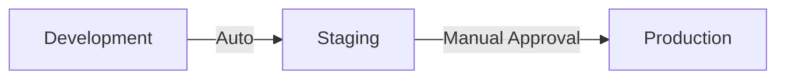

## Overview

CycleTime uses a continuous delivery pipeline with automatic deployments to development and manual approvals for staging and production.

## Environment Hierarchy



## Development Environment

### Deployment
- **Trigger**: Every push to main branch
- **Container Tag**: `ghcr.io/spiralhouse/cycletime:dev`
- **Deployment**: Automatic via external CD system
- **Rollback**: Automatic on health check failure

### Characteristics

The development environment prioritizes rapid feedback and debugging capabilities over production-like conditions. This allows developers to quickly validate changes without approval gates or production constraints.

- Latest code from main branch
- Debug logging enabled
- Development database
- No approval required

## Staging Environment

### Deployment
- **Trigger**: Manual promotion from dev
- **Container Tag**: `ghcr.io/spiralhouse/cycletime:staging`
- **Deployment**: Automatic after promotion
- **Rollback**: Manual or automatic on failure

### Promotion Process
1. Dev container validated in development
2. Manual trigger of staging promotion
3. Container re-tagged as `staging`
4. Automatic deployment to staging
5. Automated tests run
6. Manual validation

See [Staging Promotion](staging-promotion.md) for details.

### Characteristics

Staging mirrors production configuration to validate changes in a production-like environment before customer exposure. It uses a subset of production data to enable realistic testing while protecting sensitive information.

- Production-like configuration
- Production data subset
- Performance monitoring enabled
- Integration testing environment

## Production Environment

### Deployment
- **Trigger**: Manual approval after staging
- **Container Tag**: `ghcr.io/spiralhouse/cycletime:latest`
- **Deployment**: Blue-green with manual switch
- **Rollback**: Immediate rollback capability

### Approval Process
1. Staging validation complete
2. Create production deployment request
3. Required approvals (2 reviewers)
4. Automated production checks
5. Deploy to production (blue)
6. Health checks and smoke tests
7. Switch traffic (green → blue)
8. Monitor and verify

See [Production Approvals](production-approvals.md) for details.

### Characteristics

Production requires the highest level of reliability and observability. The environment includes redundancy, comprehensive monitoring, and rollback capabilities to ensure zero-downtime deployments and rapid incident response.

- High availability configuration
- Full monitoring and alerting
- Backup and disaster recovery
- Zero-downtime deployments

## Environment Protection

### Branch Protection
- **main**: Protected, requires PR approval
- **staging**: Protected, requires staging tests
- **production**: Tags only, requires approval

See [Environment Protection](environment-protection.md) for security details.

### Secret Management
- GitHub Secrets for CI/CD
- Environment-specific secrets
- Rotation policy enforced

## Container Registry

All environments use GitHub Container Registry (GHCR):

```bash
# Development (mutable tag)
ghcr.io/spiralhouse/cycletime:dev

# Staging (mutable tag)
ghcr.io/spiralhouse/cycletime:staging

# Production (immutable versions)
ghcr.io/spiralhouse/cycletime:latest
ghcr.io/spiralhouse/cycletime:1.2.3
```

## Health Checks

Each environment has health monitoring:

```bash
# Development
curl https://dev.cycletime.example.com/health

# Staging
curl https://staging.cycletime.example.com/health

# Production
curl https://api.cycletime.example.com/health
```

## Rollback Procedures

### Development
```bash
# Automatic rollback on failure
# Or redeploy previous commit
git revert HEAD && git push
```

### Staging
```bash
# Re-tag previous version
docker pull ghcr.io/spiralhouse/cycletime:1.2.2
docker tag ghcr.io/spiralhouse/cycletime:1.2.2 ghcr.io/spiralhouse/cycletime:staging
docker push ghcr.io/spiralhouse/cycletime:staging
```

### Production
```bash
# Blue-green switch back
kubectl set image deployment/cycletime cycletime=ghcr.io/spiralhouse/cycletime:1.2.2

# Or use rollback command
kubectl rollout undo deployment/cycletime
```

## Monitoring

### Metrics
- Response times
- Error rates
- Resource usage
- Business metrics

### Alerts
- Health check failures
- Error rate spikes
- Performance degradation
- Security events

## Related Documentation

- [CI/CD Overview](overview.md)
- [Release Process](release-process.md)
- [Environment Protection](environment-protection.md)