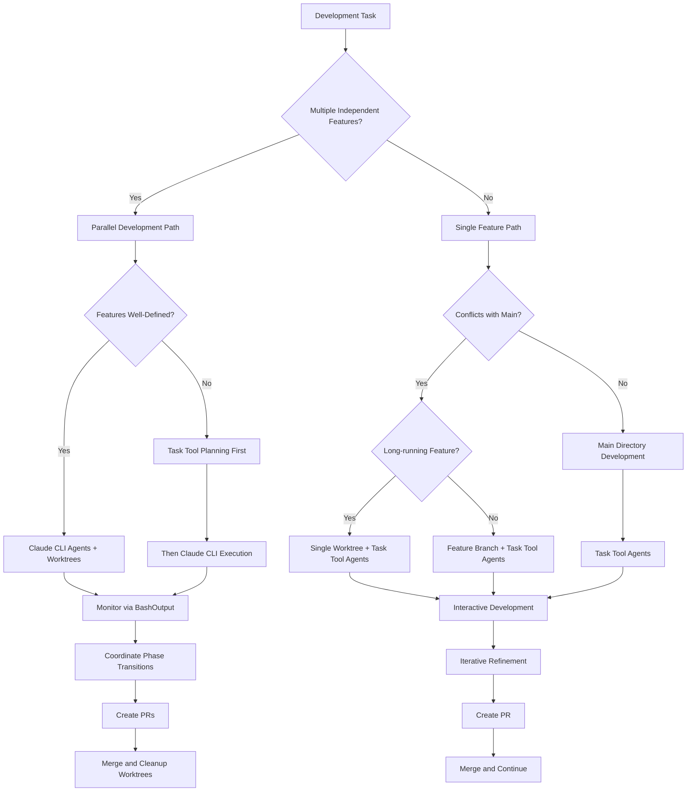
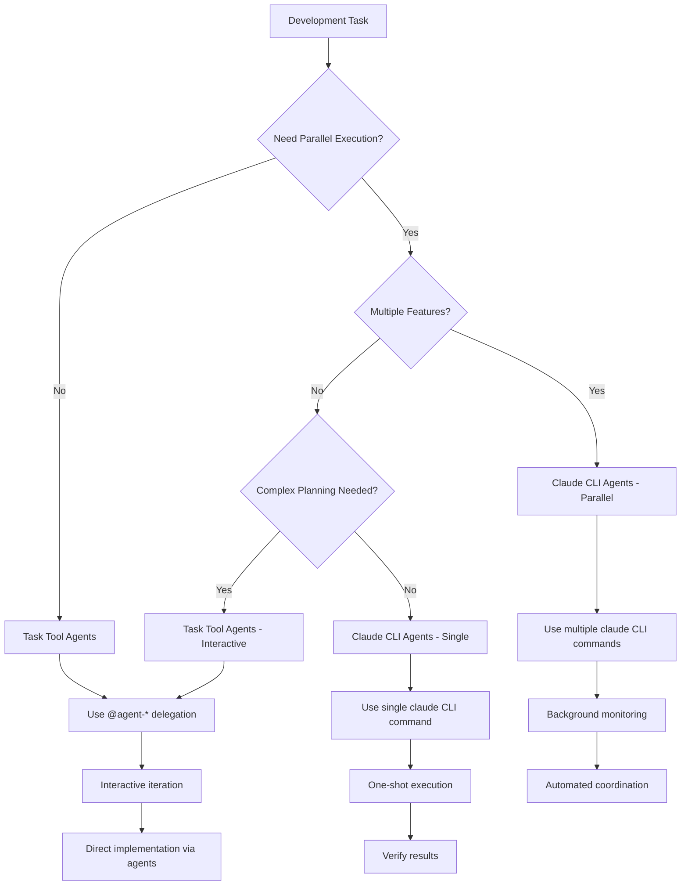
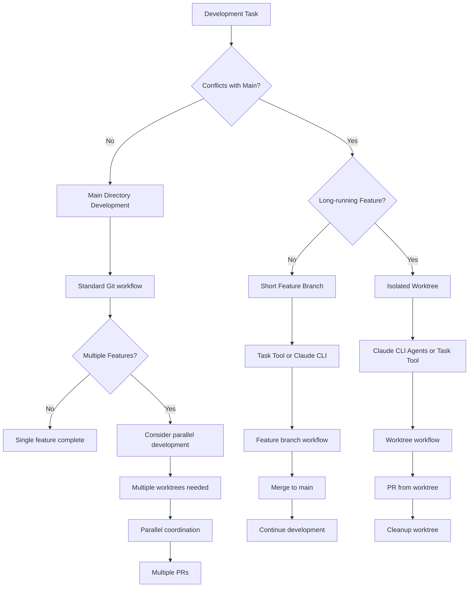
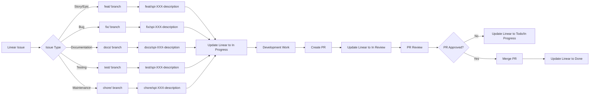

# Development Decision Guide

Unified decision trees for CycleTime development workflows and patterns.

## Master Decision Flow



## Agent Selection Decision



## Worktree Decision Tree



## Linear Integration Decision



## Workflow Selection Matrix

| Scenario | Agent Type | Environment | Best For |
|----------|------------|-------------|----------|
| **Single feature, planning needed** | Task Tool | Main directory | Interactive development |
| **Single feature, well-defined** | Task Tool or Claude CLI | Main directory or worktree | Fast implementation |
| **Multiple features, need coordination** | Task Tool (≤10 parallel) | Multiple worktrees | Coordinated parallel development |
| **Multiple features, independent** | Claude CLI or Task Tool | Multiple worktrees | Autonomous or coordinated parallel |
| **Bug fix, simple** | Task Tool | Main directory | Quick fixes |
| **Bug fix, complex** | Task Tool | Worktree | Isolated debugging |
| **Architecture decisions** | Task Tool | Main directory | Design and planning |
| **Long-running workflows** | Claude CLI | Any | Session-independent automation |

## Decision Criteria Reference

### Use Main Directory When:
- [ ] Small features or bug fixes
- [ ] Low conflict probability with ongoing work
- [ ] Quick implementation (< 1 day)
- [ ] Documentation updates
- [ ] Test additions
- [ ] Configuration changes

### Use Single Worktree When:
- [ ] Large features (multiple days)
- [ ] Database schema changes
- [ ] Architectural modifications
- [ ] Experimental work
- [ ] Need to preserve main for demos/releases
- [ ] High conflict probability

### Use Multiple Worktrees When:
- [ ] Multiple independent features requested
- [ ] Features have clear boundaries
- [ ] Minimal overlap between features
- [ ] Team members working on different features
- [ ] Need to test different approaches in parallel

### Use Task Tool Agents When:
- [ ] Need interactive problem-solving
- [ ] Require deep code analysis
- [ ] Want iterative refinement
- [ ] Need role-based expertise
- [ ] Working on architectural decisions
- [ ] Exploring or researching solutions

### Use Claude CLI Agents When:
- [ ] Need parallel execution across worktrees
- [ ] Want background processing
- [ ] Have well-defined batch tasks
- [ ] Need isolated execution contexts
- [ ] Working on multiple independent features
- [ ] Automating workflows without interaction
- [ ] Running long-running background tasks

## Common Decision Patterns

### Pattern 1: Simple Feature
```
Single feature + Well-defined + Low conflict
→ Main directory + Task Tool agents
```

### Pattern 2: Complex Feature
```
Single feature + Complex + High conflict potential
→ Single worktree + Task Tool agents
```

### Pattern 3: Multiple Features
```
Multiple features + Independent + Clear boundaries
→ Multiple worktrees + Claude CLI agents
```

### Pattern 4: Research Task
```
Unknown requirements + Need exploration
→ Main directory + Task Tool agents
```

### Pattern 5: Automated Task
```
Well-defined + Batch operation + Background execution
→ Claude CLI agents + Appropriate environment
```

## Integration Points

This decision guide integrates with:
- [Agent Reference](agents.md) - Agent capabilities and selection
- [Worktree Operations](worktree-operations.md) - Worktree setup and management
- [Single Feature Workflow](../development/single-feature-workflow.md) - Single feature process
- [Parallel Development](../testing/parallel-development.md) - Multi-feature coordination
- [Linear Integration](../development/linear-branch-integration.md) - Issue tracking

## Quick Decision Checklist

**Before Starting Development:**
1. [ ] How many features am I working on? (Single vs Multiple)
2. [ ] Do I need parallel execution? (Task Tool vs Claude CLI)
3. [ ] Will this conflict with main? (Main directory vs Worktree)
4. [ ] Is this well-defined or exploratory? (Interactive vs Automated)
5. [ ] What's my time constraint? (Speed vs Quality trade-offs)

**Answer these five questions to determine your optimal development approach.**