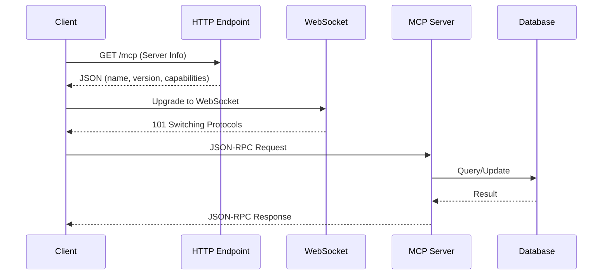

# MCP Troubleshooting Guide

**Last Updated**: October 03, 2025

Comprehensive troubleshooting reference for Model Context Protocol (MCP) server and client issues in CycleTime.

## Overview

This guide addresses the top 10 common MCP issues encountered during development and deployment. Each issue includes symptoms, root causes, concrete solutions, and prevention tips.

## Quick Reference

| Issue | Problem | Jump To |
|-------|---------|---------|
| #1 | Connection Refused | [→](#issue-1-connection-refused) |
| #2 | WebSocket Handshake Failed | [→](#issue-2-websocket-handshake-failed) |
| #3 | Connection Timeout | [→](#issue-3-connection-timeout) |
| #4 | Invalid JSON-RPC Request | [→](#issue-4-invalid-json-rpc-request) |
| #5 | Tool Not Found | [→](#issue-5-tool-not-found) |
| #6 | Resource Not Found | [→](#issue-6-resource-not-found) |
| #7 | Slow Response Times | [→](#issue-7-slow-response-times) |
| #8 | Request Timeout | [→](#issue-8-request-timeout) |
| #9 | MCP Server Disabled | [→](#issue-9-mcp-server-disabled) |
| #10 | Port Already in Use | [→](#issue-10-port-already-in-use) |

**Additional Resources**: [Diagnostic Tools](#diagnostic-tools) • [Error Codes](#common-error-codes) • [Recovery Checklist](#recovery-checklist) • [Getting Help](#getting-help)

## MCP Architecture Context



## Configuration Defaults

Understanding default configuration helps diagnose issues quickly:

**Connection Settings** (MCPConfiguration.kt):
- Host: `0.0.0.0` (all interfaces)
- Port: `8080`
- Path: `/mcp`
- Enabled: `true`

**WebSocket Settings**:
- Ping period: `30000ms` (30 seconds)
- Timeout: `15000ms` (15 seconds)
- Max frame size: `10485760` bytes (10MB)

**Performance Settings**:
- Request timeout: `60000ms` (60 seconds)
- Slow request threshold: `100ms`
- Metrics enabled: `true` (by default)

**Environment Variables**:
```bash
MCP_ENABLED=true          # Enable/disable MCP server
MCP_HOST=0.0.0.0          # Bind address
MCP_PORT=8080             # Server port
MCP_PATH=/mcp             # WebSocket path
MCP_TIMEOUT=15000         # WebSocket timeout (ms)
MCP_REQUEST_TIMEOUT=60000 # Request timeout (ms)
MCP_SLOW_REQUEST_MS=100   # Slow request threshold
MCP_METRICS_ENABLED=true  # Enable metrics (default: true)
DATABASE_LOGGING=false    # Enable SQL logging
```

---

## Issue 1: Connection Refused

### Symptoms

```bash
$ curl http://localhost:8080/mcp
curl: (7) Failed to connect to localhost port 8080: Connection refused
```

```bash
$ wscat -c ws://localhost:8080/mcp
error: Error: connect ECONNREFUSED 127.0.0.1:8080
```

**Observable Behavior**:
- MCP endpoint not accessible
- Connection attempts fail immediately
- No network activity on expected port

### Root Causes

1. **MCP server not running**
   - Application not started
   - Server crashed during startup
   - Build failed before server initialization

2. **Server started on different port**
   - Environment variable override
   - Configuration file mismatch
   - Port conflict forced alternative port

3. **MCP server disabled**
   - `MCP_ENABLED=false` in environment
   - Configuration explicitly disabled MCP

### Step-by-Step Solutions

**Solution 1: Start the MCP server**

```bash
# Navigate to project directory
cd /path/to/cycletime

# Start server with Gradle
./gradlew run

# Wait for startup confirmation
# Expected output: "Application started in X.XX seconds."
```

**Solution 2: Verify server is running and accessible**

```bash
# Check if server is running
curl http://localhost:8080/mcp

# Expected response:
# {
#   "name": "CycleTime CE MCP Server",
#   "version": "0.1.0",
#   "protocolVersion": "2024-11-05",
#   "capabilities": {...}
# }
```

**Solution 3: Check port availability**

```bash
# Check if port 8080 is in use
lsof -i :8080

# If another process is using port 8080:
# Option A: Kill the other process
kill -9 <PID>

# Option B: Use different port
MCP_PORT=3006 ./gradlew run
```

**Solution 4: Verify MCP is enabled**

```bash
# Check application logs for MCP configuration
./gradlew run | grep -i "mcp"

# Expected output:
# MCP Configuration loaded: enabled=true, host=0.0.0.0, port=8080

# Explicitly enable if needed
MCP_ENABLED=true ./gradlew run
```

### Prevention Tips

- **Health check before connecting**: Always verify server info endpoint first
  ```bash
  curl http://localhost:8080/mcp
  ```

- **Use consistent port configuration**: Document and standardize port usage
  ```bash
  # .env file
  MCP_PORT=8080
  ```

- **Monitor startup logs**: Check for MCP initialization messages
  ```bash
  ./gradlew run 2>&1 | tee server.log
  ```

- **Automated health checks**: Include in CI/CD pipelines
  ```bash
  #!/bin/bash
  ./gradlew run &
  sleep 5
  curl -f http://localhost:8080/mcp || exit 1
  ```

### Related Configuration

- `MCPConfiguration.kt:22` - MCP enabled flag
- `MCPConfiguration.kt:19-21` - Connection settings
- Environment: `MCP_ENABLED`, `MCP_HOST`, `MCP_PORT`

---

## Issue 2: WebSocket Handshake Failed

### Symptoms

```bash
$ wscat -c ws://localhost:8080
error: Unexpected server response: 404
```

```bash
$ wscat -c wss://localhost:8080/mcp
error: Error: socket hang up
```

**Observable Behavior**:
- HTTP 400/404 errors during WebSocket upgrade
- Connection closes immediately after attempt
- "Unexpected server response" errors
- SSL/TLS errors with `wss://` protocol

### Root Causes

1. **Incorrect WebSocket URL**
   - Missing `/mcp` path
   - Wrong protocol (`wss://` instead of `ws://` for local)
   - Wrong host or port

2. **Server not configured for WebSocket upgrade**
   - HTTP endpoint exists but WebSocket not initialized
   - Path mismatch between client and server

3. **SSL/TLS configuration issues**
   - Using `wss://` without SSL certificate
   - Certificate validation failures

### Step-by-Step Solutions

**Solution 1: Use correct WebSocket URL**

```bash
# ✅ CORRECT - Local development
wscat -c ws://localhost:8080/mcp

# ❌ WRONG - Missing path
wscat -c ws://localhost:8080

# ❌ WRONG - Wrong protocol for local
wscat -c wss://localhost:8080/mcp

# ❌ WRONG - Wrong path
wscat -c ws://localhost:8080/ws
```

**Solution 2: Verify server info before WebSocket connection**

```bash
# Step 1: Check HTTP endpoint
curl http://localhost:8080/mcp

# Step 2: Verify capabilities include WebSocket
# Look for: "transports": ["websocket"]

# Step 3: Connect to WebSocket
wscat -c ws://localhost:8080/mcp
```

**Solution 3: Test with custom path configuration**

```bash
# Start server with custom path
MCP_PATH=/custom ./gradlew run

# Connect using custom path
wscat -c ws://localhost:8080/custom

# Verify with HTTP endpoint
curl http://localhost:8080/custom
```

**Solution 4: Debug WebSocket handshake**

```bash
# Use curl to see handshake details
curl -i -N \
  -H "Connection: Upgrade" \
  -H "Upgrade: websocket" \
  -H "Sec-WebSocket-Version: 13" \
  -H "Sec-WebSocket-Key: test" \
  http://localhost:8080/mcp

# Expected response:
# HTTP/1.1 101 Switching Protocols
# Upgrade: websocket
# Connection: upgrade
```

### Prevention Tips

- **Document WebSocket URL format**: Include in API documentation
  ```
  Local: ws://localhost:8080/mcp
  Production: wss://api.example.com/mcp
  ```

- **Consistent path configuration**: Use environment variables
  ```bash
  export MCP_PATH=/mcp
  ```

- **Client configuration validation**: Validate URLs before connection
  ```kotlin
  // Validate WebSocket URL (Ktor client)
  import io.ktor.http.*

  fun validateMcpUrl(wsUrl: String) {
      val url = Url(wsUrl)
      require(url.protocol == URLProtocol.WS || url.protocol == URLProtocol.WSS) {
          "Invalid WebSocket protocol: ${url.protocol.name}"
      }
      require(url.encodedPath.startsWith("/mcp")) {
          "Invalid MCP path: ${url.encodedPath}"
      }
  }
  ```

- **Health check integration**: Test WebSocket connectivity in CI
  ```bash
  #!/bin/bash
  echo "Testing WebSocket handshake..."
  wscat -c ws://localhost:8080/mcp --execute "exit" || exit 1
  ```

### Related Configuration

- `MCPConfiguration.kt:21` - MCP path setting
- `MCPConfiguration.kt:25-28` - WebSocket settings
- Environment: `MCP_PATH`, `MCP_TIMEOUT`

---

## Issue 3: Connection Timeout

### Symptoms

```bash
$ wscat -c ws://localhost:8080/mcp
error: Error: Connection timeout
```

**Observable Behavior**:
- Connection attempts hang for extended period
- Eventually times out (default 15 seconds)
- Server may be starting up or under heavy load
- No error message, just timeout

### Root Causes

1. **Server still starting up**
   - Application initialization in progress
   - Database migrations running
   - Resource loading incomplete

2. **Timeout configuration too short**
   - Default 15s timeout insufficient
   - Network latency issues
   - Server performance degradation

3. **Server hanging or unresponsive**
   - Deadlock in initialization
   - Resource exhaustion
   - Database connection pool exhausted

### Step-by-Step Solutions

**Solution 1: Wait for complete server startup**

```bash
# Start server and watch for completion
./gradlew run

# Wait for this message before connecting:
# "Application started in X.XX seconds."
# "MCP server listening on 0.0.0.0:8080"

# Then connect
wscat -c ws://localhost:8080/mcp
```

**Solution 2: Increase client timeout**

```bash
# Increase timeout in client configuration
# Example with wscat
wscat -c ws://localhost:8080/mcp --timeout 30000
```

```kotlin
// Example with Ktor WebSocket client
import io.ktor.client.*
import io.ktor.client.engine.cio.*
import io.ktor.client.plugins.websocket.*

val client = HttpClient(CIO) {
    install(WebSockets) {
        pingInterval = 30_000  // 30 seconds
    }
    engine {
        requestTimeout = 30_000  // 30 seconds
    }
}
```

**Solution 3: Increase server timeout configuration**

```bash
# Start server with longer timeout
MCP_TIMEOUT=30000 ./gradlew run

# Verify configuration loaded
# Look for: "MCP timeout: 30000ms"
```

**Solution 4: Test HTTP endpoint first**

```bash
# Quick health check before WebSocket
curl -f http://localhost:8080/mcp || echo "Server not ready"

# Retry with backoff
for i in {1..10}; do
  curl -f http://localhost:8080/mcp && break
  echo "Attempt $i failed, retrying..."
  sleep 2
done

# Then connect WebSocket
wscat -c ws://localhost:8080/mcp
```

**Solution 5: Check server resource usage**

```bash
# Check if server is hanging
ps aux | grep gradle

# Check memory usage
free -h

# Check database connections
lsof -i :8080 | wc -l

# Restart if necessary
pkill -f gradle
./gradlew run
```

### Prevention Tips

- **Implement startup health checks**: Wait for ready state
  ```bash
  #!/bin/bash
  until curl -f http://localhost:8080/mcp; do
    echo "Waiting for server..."
    sleep 1
  done
  echo "Server ready!"
  ```

- **Configure appropriate timeouts**: Match server and client timeouts
  ```bash
  # Server
  MCP_TIMEOUT=30000
  ```

  ```kotlin
  // Ktor client timeout configuration
  val client = HttpClient(CIO) {
      install(WebSockets) {
          pingInterval = 30_000
      }
      engine {
          requestTimeout = 30_000
      }
  }
  ```

- **Monitor startup performance**: Track initialization time
  ```bash
  time ./gradlew run
  ```

- **Use connection retry logic**: Implement exponential backoff
  ```kotlin
  import io.ktor.client.*
  import io.ktor.client.plugins.websocket.*
  import kotlinx.coroutines.delay
  import kotlin.math.pow

  suspend fun connectWithRetry(
      client: HttpClient,
      url: String,
      maxRetries: Int = 5
  ): DefaultClientWebSocketSession {
      repeat(maxRetries) { attempt ->
          try {
              return client.webSocketSession(url)
          } catch (e: Exception) {
              if (attempt == maxRetries - 1) throw e
              val backoffMs = 2.0.pow(attempt).toLong() * 1000
              delay(backoffMs)  // Exponential backoff
          }
      }
      error("Failed to connect after $maxRetries attempts")
  }
  ```

### Related Configuration

- `MCPConfiguration.kt:26` - WebSocket timeout
- `MCPConfiguration.kt:34` - Request timeout
- Environment: `MCP_TIMEOUT`, `MCP_REQUEST_TIMEOUT`

---

## Issue 4: Invalid JSON-RPC Request

### Symptoms

```bash
# Send malformed request
> {"method": "tools/list"}

# Response
< {
    "jsonrpc": "2.0",
    "error": {
      "code": -32600,
      "message": "Invalid Request"
    },
    "id": null
  }
```

**Observable Behavior**:
- Server returns JSON-RPC error response
- Error code `-32600` (Invalid Request)
- Request not processed
- Connection remains open

### Root Causes

1. **Missing required JSON-RPC fields**
   - Missing `"jsonrpc": "2.0"` field
   - Missing `id` field
   - Missing `method` field

2. **Wrong protocol version**
   - Using JSON-RPC 1.0 format
   - Incorrect version string

3. **Malformed JSON**
   - Syntax errors in JSON
   - Invalid character encoding
   - Truncated messages

4. **Wrong parameter format**
   - Parameters not in object format
   - Missing required parameters
   - Wrong parameter types

### Step-by-Step Solutions

**Solution 1: Use correct JSON-RPC 2.0 format**

```bash
# ✅ CORRECT - Complete JSON-RPC 2.0 request
{
  "jsonrpc": "2.0",
  "id": 1,
  "method": "tools/list",
  "params": {}
}

# ❌ WRONG - Missing jsonrpc field
{
  "id": 1,
  "method": "tools/list"
}

# ❌ WRONG - Wrong version
{
  "jsonrpc": "1.0",
  "id": 1,
  "method": "tools/list"
}

# ❌ WRONG - Missing id
{
  "jsonrpc": "2.0",
  "method": "tools/list"
}
```

**Solution 2: Validate JSON before sending**

```kotlin
// Client-side validation with Ktor and kotlinx.serialization
import kotlinx.serialization.*
import kotlinx.serialization.json.*

@Serializable
data class JsonRpcRequest(
    val jsonrpc: String = "2.0",
    val id: Int,
    val method: String,
    val params: JsonObject = JsonObject(emptyMap())
)

fun createJsonRpcRequest(method: String, params: JsonObject = JsonObject(emptyMap()), id: Int = 1): String {
    require(method.isNotBlank()) { "Method is required" }

    val request = JsonRpcRequest(
        id = id,
        method = method,
        params = params
    )

    return Json.encodeToString(request)
}

// Usage with WebSocket session
suspend fun DefaultClientWebSocketSession.sendJsonRpcRequest(method: String, params: JsonObject = JsonObject(emptyMap())) {
    val request = createJsonRpcRequest(method, params)
    send(Frame.Text(request))
}
```

**Solution 3: Test with known-good requests**

```bash
# Test tools/list
wscat -c ws://localhost:8080/mcp
> {"jsonrpc":"2.0","id":1,"method":"tools/list","params":{}}

# Test resources/list
> {"jsonrpc":"2.0","id":2,"method":"resources/list","params":{}}

# Test tool call
> {
    "jsonrpc":"2.0",
    "id":3,
    "method":"tools/call",
    "params":{
      "name":"create_project",
      "arguments":{"name":"Test Project","description":"Test"}
    }
  }
```

**Solution 4: Handle JSON parsing errors**

```kotlin
// Client error handling with Ktor WebSocket
import io.ktor.websocket.*
import kotlinx.serialization.*
import kotlinx.serialization.json.*

@Serializable
data class JsonRpcError(
    val code: Int,
    val message: String
)

@Serializable
data class JsonRpcResponse(
    val jsonrpc: String,
    val id: Int? = null,
    val result: JsonElement? = null,
    val error: JsonRpcError? = null
)

suspend fun handleWebSocketMessages(session: DefaultClientWebSocketSession) {
    for (frame in session.incoming) {
        if (frame is Frame.Text) {
            try {
                val text = frame.readText()
                val response = Json.decodeFromString<JsonRpcResponse>(text)

                if (response.error != null) {
                    println("JSON-RPC Error: ${response.error}")
                    // Handle specific error codes
                    when (response.error.code) {
                        -32600 -> println("Invalid Request - check JSON-RPC format")
                        -32601 -> println("Method not found")
                        -32602 -> println("Invalid params")
                    }
                } else {
                    println("Success: ${response.result}")
                }
            } catch (e: SerializationException) {
                println("Failed to parse response: ${e.message}")
            }
        }
    }
}
```

### Prevention Tips

- **Use JSON-RPC client libraries**: Avoid manual formatting
  ```kotlin
  // Create a reusable JSON-RPC client with Ktor
  import io.ktor.client.*
  import io.ktor.client.plugins.websocket.*
  import kotlinx.serialization.json.*

  class JsonRpcClient(private val url: String) {
      private val client = HttpClient(CIO) {
          install(WebSockets)
      }

      suspend fun call(method: String, params: JsonObject = JsonObject(emptyMap())): JsonElement? {
          return client.webSocketSession(url).use { session ->
              val request = createJsonRpcRequest(method, params, id = 1)
              session.send(Frame.Text(request))

              val frame = session.incoming.receive() as Frame.Text
              val response = Json.decodeFromString<JsonRpcResponse>(frame.readText())
              response.result
          }
      }
  }

  // Usage
  val client = JsonRpcClient("ws://localhost:8080/mcp")
  client.call("tools/list")
  ```

- **Schema validation**: Validate requests against JSON-RPC schema
  ```kotlin
  // Using kotlinx.serialization for compile-time validation
  @Serializable
  data class JsonRpcRequest(
      val jsonrpc: String = "2.0",
      val id: Int,
      val method: String,
      val params: JsonObject = JsonObject(emptyMap())
  ) {
      init {
          require(jsonrpc == "2.0") { "Invalid JSON-RPC version: $jsonrpc" }
          require(method.isNotBlank()) { "Method is required" }
      }
  }

  fun validateRequest(request: JsonRpcRequest): Result<Unit> = runCatching {
      require(request.jsonrpc == "2.0") { "Invalid JSON-RPC version" }
      require(request.method.isNotBlank()) { "Method is required" }
  }
  ```

- **Request logging**: Log all requests for debugging
  ```kotlin
  // Log WebSocket messages
  suspend fun DefaultClientWebSocketSession.sendWithLogging(message: String) {
      val formatted = Json.parseToJsonElement(message).toString()
      println("[SEND] $formatted")
      send(Frame.Text(message))
  }
  ```

- **Error response handling**: Always handle error responses
  ```kotlin
  // Extension function for response handling
  fun JsonRpcResponse.resultOrThrow(): JsonElement {
      error?.let { err ->
          throw Exception("JSON-RPC Error ${err.code}: ${err.message}")
      }
      return result ?: throw Exception("No result in response")
  }
  ```

### Related Configuration

- `mcp/protocol/` - JSON-RPC protocol handlers
- `mcp/tools/` - Tool implementations
- No environment configuration required

---

## Issue 5: Tool Not Found

### Symptoms

```bash
> {"jsonrpc":"2.0","id":1,"method":"tools/call","params":{"name":"createProject"}}

< {
    "jsonrpc": "2.0",
    "error": {
      "code": -32601,
      "message": "Tool not found: createProject"
    },
    "id": 1
  }
```

**Observable Behavior**:
- Server returns `-32601` error code (Method/Tool not found)
- Tool call fails but connection remains open
- Available tools not matching requested name

### Root Causes

1. **Tool name mismatch**
   - Using camelCase instead of snake_case
   - Typos in tool name
   - Wrong naming convention

2. **Tool not registered**
   - Tool provider not initialized
   - Configuration missing tool registration
   - Development-only tool not available

3. **Wrong tool method**
   - Using `tools/call` instead of correct method
   - Method name not properly formatted

### Step-by-Step Solutions

**Solution 1: List available tools**

```bash
# Connect to MCP server
wscat -c ws://localhost:8080/mcp

# List all available tools
> {"jsonrpc":"2.0","id":1,"method":"tools/list","params":{}}

# Response shows available tools
< {
    "jsonrpc": "2.0",
    "result": {
      "tools": [
        {
          "name": "create_project",
          "description": "Create a new project",
          "inputSchema": {...}
        },
        {
          "name": "get_project",
          "description": "Get project by ID",
          "inputSchema": {...}
        },
        {
          "name": "list_projects",
          "description": "List all projects",
          "inputSchema": {...}
        },
        {
          "name": "update_project",
          "description": "Update project",
          "inputSchema": {...}
        }
      ]
    },
    "id": 1
  }
```

**Solution 2: Use correct tool names**

```bash
# ✅ CORRECT - snake_case naming
> {"jsonrpc":"2.0","id":2,"method":"tools/call","params":{"name":"create_project","arguments":{"name":"Test"}}}

# ❌ WRONG - camelCase naming
> {"jsonrpc":"2.0","id":2,"method":"tools/call","params":{"name":"createProject","arguments":{"name":"Test"}}}

# ❌ WRONG - kebab-case naming
> {"jsonrpc":"2.0","id":2,"method":"tools/call","params":{"name":"create-project","arguments":{"name":"Test"}}}
```

**Solution 3: Verify tool provider configuration**

```bash
# Check application logs for tool registration
./gradlew run | grep -i "tool"

# Expected output:
# Registering tool provider: DefaultProjectToolProvider
# Registered 4 tools: create_project, get_project, list_projects, update_project

# If tools not registered, check configuration
cat src/main/kotlin/io/spiralhouse/cycletime/mcp/MCPModule.kt
```

**Solution 4: Test tool with correct parameters**

```bash
# Get tool schema first
> {"jsonrpc":"2.0","id":1,"method":"tools/list","params":{}}

# Check inputSchema for required parameters
# Then call with correct parameters

> {
    "jsonrpc":"2.0",
    "id":2,
    "method":"tools/call",
    "params":{
      "name":"create_project",
      "arguments":{
        "name":"My Project",
        "description":"Test project",
        "startDate":"2024-01-01"
      }
    }
  }
```

### Prevention Tips

- **Document tool naming conventions**: Use snake_case consistently
  ```
  Tool Naming: snake_case (create_project, list_issues)
  Method Naming: namespace/action (tools/call, resources/read)
  ```

- **Tool discovery on connect**: List tools after connection
  ```kotlin
  // Discover available tools
  @Serializable
  data class ToolInfo(val name: String, val description: String)

  @Serializable
  data class ToolsResult(val tools: List<ToolInfo>)

  suspend fun discoverTools(session: DefaultClientWebSocketSession): List<String> {
      val request = createJsonRpcRequest("tools/list", JsonObject(emptyMap()), id = 1)
      session.send(Frame.Text(request))

      val frame = session.incoming.receive() as Frame.Text
      val response = Json.decodeFromString<JsonRpcResponse>(frame.readText())
      val toolsResult = Json.decodeFromJsonElement<ToolsResult>(response.resultOrThrow())

      val toolNames = toolsResult.tools.map { it.name }
      println("Available tools: $toolNames")
      return toolNames
  }
  ```

- **Client-side tool validation**: Check tool exists before calling
  ```kotlin
  // Tool validation before calling
  class ValidatedToolClient(private val session: DefaultClientWebSocketSession) {
      private lateinit var availableTools: List<String>

      suspend fun initialize() {
          availableTools = discoverTools(session)
      }

      suspend fun callTool(name: String, arguments: JsonObject): JsonElement {
          require(name in availableTools) {
              "Tool not found: $name. Available: ${availableTools.joinToString()}"
          }

          val params = buildJsonObject {
              put("name", name)
              put("arguments", arguments)
          }
          val request = createJsonRpcRequest("tools/call", params, id = 1)
          session.send(Frame.Text(request))

          val frame = session.incoming.receive() as Frame.Text
          val response = Json.decodeFromString<JsonRpcResponse>(frame.readText())
          return response.resultOrThrow()
      }
  }
  ```

- **Generate tool clients**: Create type-safe tool wrappers
  ```kotlin
  // Type-safe tool client interface
  @Serializable
  data class CreateProjectArgs(val name: String, val description: String)

  @Serializable
  data class GetProjectArgs(val id: String)

  @Serializable
  data class Project(val id: String, val name: String, val description: String)

  interface ProjectTools {
      suspend fun createProject(args: CreateProjectArgs): Project
      suspend fun getProject(args: GetProjectArgs): Project
      suspend fun listProjects(): List<Project>
      suspend fun updateProject(id: String, args: CreateProjectArgs): Project
  }
  ```

### Related Configuration

- `DefaultProjectToolProvider.kt` - Project tool definitions
- `ToolRegistry.kt` - Tool registration logic
- No environment configuration required

---

## Issue 6: Resource Not Found

### Symptoms

```bash
> {"jsonrpc":"2.0","id":1,"method":"resources/read","params":{"uri":"cycletime://project/123"}}

< {
    "jsonrpc": "2.0",
    "error": {
      "code": -32602,
      "message": "Resource not found: cycletime://project/123"
    },
    "id": 1
  }
```

**Observable Behavior**:
- Server returns `-32602` error code (Invalid params)
- Resource URI not recognized
- Resource exists but URI format incorrect

### Root Causes

1. **Invalid URI format**
   - Wrong protocol (http:// instead of cycletime://)
   - Incorrect path structure
   - Trailing slashes on ID resources
   - Missing required path segments

2. **Resource doesn't exist**
   - Referencing non-existent resource ID
   - Resource deleted or not yet created
   - Wrong resource type

3. **Resource provider not registered**
   - Provider initialization failed
   - Configuration missing provider
   - Development-only resource

### Step-by-Step Solutions

**Solution 1: List available resources**

```bash
# Connect to MCP server
wscat -c ws://localhost:8080/mcp

# List all available resources
> {"jsonrpc":"2.0","id":1,"method":"resources/list","params":{}}

# Response shows available resource templates
< {
    "jsonrpc": "2.0",
    "result": {
      "resources": [
        {
          "uri": "cycletime://projects",
          "name": "Project List",
          "description": "List of all projects",
          "mimeType": "application/json"
        },
        {
          "uri": "cycletime://projects/{id}",
          "name": "Project",
          "description": "Individual project details",
          "mimeType": "application/json"
        },
        {
          "uri": "cycletime://issues",
          "name": "Issue List",
          "description": "List of all issues",
          "mimeType": "application/json"
        },
        {
          "uri": "cycletime://sessions/active",
          "name": "Active Session",
          "description": "Current active session",
          "mimeType": "application/json"
        }
      ]
    },
    "id": 1
  }
```

**Solution 2: Use correct URI format**

```bash
# ✅ CORRECT - Valid resource URIs
cycletime://projects
cycletime://projects/proj_abc123
cycletime://issues
cycletime://issues/issue_xyz789
cycletime://sessions/active

# ❌ WRONG - Wrong protocol
http://localhost:8080/projects
projects

# ❌ WRONG - Trailing slash on ID resource
cycletime://projects/proj_abc123/

# ❌ WRONG - Wrong path structure
cycletime://project/123  # Should be "projects" plural
cycletime://projectList  # Should be "projects"
```

**Solution 3: Verify resource exists before reading**

```bash
# Step 1: List resources to find valid IDs
> {"jsonrpc":"2.0","id":1,"method":"resources/read","params":{"uri":"cycletime://projects"}}

< {
    "jsonrpc": "2.0",
    "result": {
      "contents": [
        {
          "uri": "cycletime://projects",
          "mimeType": "application/json",
          "text": "[{\"id\":\"proj_abc123\",\"name\":\"Project A\"}]"
        }
      ]
    },
    "id": 1
  }

# Step 2: Read specific resource using valid ID
> {"jsonrpc":"2.0","id":2,"method":"resources/read","params":{"uri":"cycletime://projects/proj_abc123"}}
```

**Solution 4: Check resource provider registration**

```bash
# Check application logs for resource registration
./gradlew run | grep -i "resource"

# Expected output:
# Registering resource provider: DefaultProjectResourceProvider
# Registering resource provider: DefaultIssueResourceProvider
# Registering resource provider: DefaultSessionResourceProvider

# If resources not registered, check configuration
cat src/main/kotlin/io/spiralhouse/cycletime/mcp/MCPModule.kt
```

### Prevention Tips

- **Document URI patterns**: Maintain URI documentation
  ```markdown
  # Resource URI Patterns

  Collection resources (plural):
  - cycletime://projects
  - cycletime://issues
  - cycletime://workflows

  Individual resources (plural + ID):
  - cycletime://projects/{projectId}
  - cycletime://issues/{issueId}
  - cycletime://workflows/{workflowId}

  Special resources:
  - cycletime://sessions/active
  - cycletime://sessions/{sessionId}
  ```

- **URI validation**: Validate URIs client-side
  ```kotlin
  // Resource URI validation
  fun validateResourceUri(uri: String): String {
      val pattern = Regex("^cycletime://[a-z_]+(?:/[a-zA-Z0-9_-]+)?\$")
      require(pattern.matches(uri)) {
          "Invalid resource URI: $uri"
      }
      return uri
  }
  ```

- **Resource discovery**: List resources on startup
  ```kotlin
  // Discover available resources
  @Serializable
  data class ResourceInfo(val uri: String, val name: String, val description: String, val mimeType: String)

  @Serializable
  data class ResourcesResult(val resources: List<ResourceInfo>)

  suspend fun discoverResources(session: DefaultClientWebSocketSession): List<ResourceInfo> {
      val request = createJsonRpcRequest("resources/list", JsonObject(emptyMap()), id = 1)
      session.send(Frame.Text(request))

      val frame = session.incoming.receive() as Frame.Text
      val response = Json.decodeFromString<JsonRpcResponse>(frame.readText())
      val resourcesResult = Json.decodeFromJsonElement<ResourcesResult>(response.resultOrThrow())

      println("Available resources: ${resourcesResult.resources.map { it.uri }}")
      return resourcesResult.resources
  }
  ```

- **Generate resource clients**: Create type-safe resource accessors
  ```kotlin
  // Type-safe resource client
  @Serializable
  data class Session(val id: String, val projectId: String, val active: Boolean)

  class ResourceClient(private val session: DefaultClientWebSocketSession) {
      suspend fun getProjects(): List<Project> {
          return read("cycletime://projects")
      }

      suspend fun getProject(id: String): Project {
          return read("cycletime://projects/$id")
      }

      suspend fun getActiveSession(): Session {
          return read("cycletime://sessions/active")
      }

      private suspend inline fun <reified T> read(uri: String): T {
          val params = buildJsonObject { put("uri", uri) }
          val request = createJsonRpcRequest("resources/read", params, id = 1)
          session.send(Frame.Text(request))

          val frame = this.session.incoming.receive() as Frame.Text
          val response = Json.decodeFromString<JsonRpcResponse>(frame.readText())
          return Json.decodeFromJsonElement(response.resultOrThrow())
      }
  }
  ```

### Related Configuration

- `DefaultResourceProviders.kt` - Resource provider definitions
- `ResourceRegistry.kt` - Resource registration logic
- No environment configuration required

---

## Issue 7: Slow Response Times

### Symptoms

```bash
# Request takes >1 second to respond
> {"jsonrpc":"2.0","id":1,"method":"tools/call","params":{"name":"list_projects"}}

# Long delay...

< {
    "jsonrpc": "2.0",
    "result": {...},
    "id": 1
  }
```

**Observable Behavior**:
- Requests complete but take longer than expected
- Response times >100ms (slow request threshold)
- Progressive slowdown over time
- Some requests fast, others slow

### Root Causes

1. **Database query performance**
   - Missing database indices
   - N+1 query problems
   - Large dataset without pagination
   - Inefficient JOIN operations

2. **Excessive data serialization**
   - Large response payloads
   - Nested object graphs
   - No result limiting

3. **Resource contention**
   - Connection pool exhaustion
   - Thread pool saturation
   - Memory pressure
   - Disk I/O bottlenecks

4. **Network latency**
   - Large message sizes exceeding frame size
   - Network congestion
   - DNS resolution delays

### Step-by-Step Solutions

**Solution 1: Enable performance monitoring**

```bash
# Start server with metrics enabled
MCP_METRICS_ENABLED=true MCP_SLOW_REQUEST_MS=100 ./gradlew run

# Check metrics endpoint
curl http://localhost:8080/mcp/stats

# Expected response:
# {
#   "totalRequests": 1523,
#   "slowRequests": 42,
#   "averageResponseTime": 87,
#   "p95ResponseTime": 234,
#   "p99ResponseTime": 456
# }
```

**Solution 2: Enable database query logging**

```bash
# Start server with SQL logging
DATABASE_LOGGING=true ./gradlew run

# Monitor slow queries in logs
./gradlew run 2>&1 | grep -E "SQL.*[0-9]{3,} ms"

# Look for:
# - Queries taking >100ms
# - N+1 query patterns (same query repeated)
# - Missing indices (table scans)
# - Large result sets
```

**Solution 3: Optimize database queries**

```kotlin
// ❌ SLOW - N+1 query problem
fun getAllProjectsWithIssues(): List<ProjectWithIssues> {
  return transaction {
    Project.all().map { project ->
      ProjectWithIssues(
        project = project,
        issues = Issue.find { Issues.projectId eq project.id }.toList()  // N queries!
      )
    }
  }
}

// ✅ FAST - Single query with JOIN
fun getAllProjectsWithIssues(): List<ProjectWithIssues> {
  return transaction {
    (Projects innerJoin Issues)
      .selectAll()
      .groupBy { it[Projects.id] }
      .map { (projectId, rows) ->
        ProjectWithIssues(
          project = rows.first().toProject(),
          issues = rows.map { it.toIssue() }
        )
      }
  }
}
```

**Solution 4: Implement result pagination**

```bash
# Add pagination to list endpoints
> {
    "jsonrpc":"2.0",
    "id":1,
    "method":"tools/call",
    "params":{
      "name":"list_projects",
      "arguments":{
        "limit": 50,
        "offset": 0
      }
    }
  }

# Smaller result set = faster response
```

**Solution 5: Enable caching**

```bash
# Start server with caching enabled
MCP_CACHE_ENABLED=true MCP_CACHE_TTL=300 ./gradlew run

# Monitor cache hit rate
curl http://localhost:8080/mcp/stats | jq '.cacheHitRate'
```

**Solution 6: Enable async processing**

```bash
# Start server with async enabled
MCP_ASYNC_ENABLED=true ./gradlew run

# Long-running operations processed asynchronously
# Client receives immediate acknowledgment
# Result delivered via callback or polling
```

### Prevention Tips

- **Performance budgets**: Set response time targets
  ```bash
  # Fail build if response times exceed budget
  MCP_SLOW_REQUEST_MS=100 ./gradlew test
  ```

- **Database indexing**: Index all foreign keys and query columns
  ```kotlin
  object Projects : Table() {
    val id = varchar("id", 50)
    val name = varchar("name", 255)
    val ownerId = varchar("owner_id", 50).index()  // Index FK

    override val primaryKey = PrimaryKey(id)
  }
  ```

- **Query result limits**: Always limit result sets
  ```kotlin
  fun listProjects(limit: Int = 50, offset: Int = 0): List<Project> {
    return transaction {
      Project.all()
        .limit(limit, offset.toLong())
        .toList()
    }
  }
  ```

- **Load testing**: Test with realistic data volumes
  ```bash
  # Use k6 or similar tool
  k6 run --vus 10 --duration 30s load-test.js
  ```

- **Performance monitoring**: Track metrics in production
  ```bash
  # Enable metrics in production
  MCP_METRICS_ENABLED=true
  MCP_SLOW_REQUEST_MS=100
  ```

### Related Configuration

- `MCPConfiguration.kt:42-43` - Slow request threshold
- `MCPConfiguration.kt:34` - Request timeout
- Environment: `MCP_METRICS_ENABLED`, `MCP_SLOW_REQUEST_MS`, `DATABASE_LOGGING`

---

## Issue 8: Request Timeout

### Symptoms

```bash
> {"jsonrpc":"2.0","id":1,"method":"tools/call","params":{"name":"generate_large_report"}}

# Wait 60+ seconds...

< {
    "jsonrpc": "2.0",
    "error": {
      "code": -32000,
      "message": "Request timeout after 60000ms"
    },
    "id": 1
  }
```

**Observable Behavior**:
- Requests timeout after 60 seconds (default)
- Long-running operations fail to complete
- Connection closes after timeout
- Client receives timeout error

### Root Causes

1. **Long-running operations**
   - Complex data processing
   - Large report generation
   - Batch operations
   - External API calls

2. **Timeout configuration too short**
   - Default 60s insufficient
   - Operations legitimately take longer
   - No async processing option

3. **Inefficient implementation**
   - Synchronous blocking operations
   - No streaming or chunking
   - Resource-intensive calculations

### Step-by-Step Solutions

**Solution 1: Increase request timeout**

```bash
# Start server with longer timeout
MCP_REQUEST_TIMEOUT=120000 ./gradlew run  # 2 minutes

# Verify configuration loaded
# Look for: "MCP request timeout: 120000ms"

# For very long operations
MCP_REQUEST_TIMEOUT=300000 ./gradlew run  # 5 minutes
```

**Solution 2: Optimize operation performance**

```kotlin
// ❌ SLOW - Sequential processing
fun processAllProjects(): Result {
  return transaction {
    Project.all().forEach { project ->
      processProject(project)  // Slow!
    }
  }
}

// ✅ FAST - Batch processing with progress
suspend fun processAllProjects(): Result = coroutineScope {
  transaction {
    Project.all()
      .chunked(100)  // Process in batches
      .map { batch ->
        async {
          batch.forEach { project ->
            processProject(project)
          }
        }
      }
      .awaitAll()
  }
}
```

**Solution 3: Implement streaming responses**

```bash
# Use server-sent events for long operations
> {
    "jsonrpc":"2.0",
    "id":1,
    "method":"tools/call",
    "params":{
      "name":"generate_report_stream",
      "arguments":{"format":"pdf"}
    }
  }

# Server sends progress updates
< {"jsonrpc":"2.0","method":"progress","params":{"percent":25}}
< {"jsonrpc":"2.0","method":"progress","params":{"percent":50}}
< {"jsonrpc":"2.0","method":"progress","params":{"percent":75}}
< {"jsonrpc":"2.0","result":{"url":"..."},"id":1}
```

**Solution 4: Use async job pattern**

```bash
# Start async job
> {
    "jsonrpc":"2.0",
    "id":1,
    "method":"tools/call",
    "params":{
      "name":"generate_report_async",
      "arguments":{"format":"pdf"}
    }
  }

# Immediate response with job ID
< {
    "jsonrpc":"2.0",
    "result":{
      "jobId":"job_abc123",
      "status":"pending"
    },
    "id":1
  }

# Poll for status
> {
    "jsonrpc":"2.0",
    "id":2,
    "method":"tools/call",
    "params":{
      "name":"get_job_status",
      "arguments":{"jobId":"job_abc123"}
    }
  }

# Eventually complete
< {
    "jsonrpc":"2.0",
    "result":{
      "jobId":"job_abc123",
      "status":"complete",
      "result":{"url":"..."}
    },
    "id":2
  }
```

**Solution 5: Monitor slow queries**

```bash
# Enable query logging
DATABASE_LOGGING=true MCP_REQUEST_TIMEOUT=120000 ./gradlew run

# Monitor for queries exceeding threshold
./gradlew run 2>&1 | grep -E "SQL.*[5-9][0-9]{3,} ms"

# Optimize identified slow queries
```

### Prevention Tips

- **Design for async**: Long operations should be async by default
  ```kotlin
  interface ReportService {
    // ✅ Returns job ID immediately
    suspend fun generateReportAsync(format: String): JobId

    // ❌ Blocks until complete
    // suspend fun generateReport(format: String): Report
  }
  ```

- **Timeout documentation**: Document expected response times
  ```markdown
  # API Response Times

  Fast operations (<100ms):
  - get_project, list_projects, create_issue

  Medium operations (100ms-1s):
  - update_project, list_issues, create_workflow

  Long operations (>1s, use async):
  - generate_report, export_data, batch_update
  ```

- **Client timeout matching**: Client timeout > server timeout
  ```kotlin
  // Server timeout: 60s
  // Client timeout: 65s (5s buffer)
  val client = HttpClient(CIO) {
      install(WebSockets) {
          pingInterval = 30_000
      }
      engine {
          requestTimeout = 65_000  // 5s buffer over server timeout
      }
  }
  ```

- **Progress feedback**: Provide progress updates for long operations
  ```kotlin
  // Progress reporting for long operations
  import kotlinx.coroutines.delay

  suspend fun longOperation(onProgress: (Int) -> Unit) {
      for (i in 1..100) {
          processChunk(i)
          onProgress(i)
          delay(100)
      }
  }

  // Usage
  longOperation { progress ->
      println("Progress: $progress%")
  }
  ```

### Related Configuration

- `MCPConfiguration.kt:34` - Request timeout
- Environment: `MCP_REQUEST_TIMEOUT`, `DATABASE_LOGGING`

---

## Issue 9: MCP Server Disabled

### Symptoms

```bash
$ curl http://localhost:8080/mcp
curl: (7) Failed to connect to localhost port 8080: Connection refused
```

```bash
$ ./gradlew run
# Server starts but no MCP endpoints available
# HTTP 404 on /mcp
```

**Observable Behavior**:
- Application starts successfully
- Other endpoints work (if any)
- MCP endpoints return 404
- No MCP initialization messages in logs

### Root Causes

1. **MCP explicitly disabled**
   - `MCP_ENABLED=false` in environment
   - Configuration file disabled MCP
   - Feature flag turned off

2. **Configuration not loaded**
   - Configuration file missing
   - Environment variables not read
   - Default configuration excludes MCP

3. **Module not initialized**
   - MCP module not loaded
   - Initialization error not surfaced
   - Dependency injection failure

### Step-by-Step Solutions

**Solution 1: Verify MCP configuration**

```bash
# Check application logs for MCP configuration
./gradlew run | grep -i "mcp"

# Expected output:
# MCP Configuration loaded: enabled=true, host=0.0.0.0, port=8080, path=/mcp
# Initializing MCP server...
# MCP server started successfully

# If "enabled=false":
# MCP disabled by configuration
```

**Solution 2: Enable MCP explicitly**

```bash
# Set environment variable
export MCP_ENABLED=true
./gradlew run

# Or inline
MCP_ENABLED=true ./gradlew run

# Verify enabled in logs
# Look for: "MCP Configuration loaded: enabled=true"
```

**Solution 3: Check configuration file**

```bash
# Check application.conf
cat src/main/resources/application.conf | grep -A5 "mcp"

# Expected:
# mcp {
#   enabled = true
#   host = "0.0.0.0"
#   port = 8080
#   path = "/mcp"
# }

# If enabled = false, change to true or use env var override
```

**Solution 4: Verify module initialization**

```bash
# Check Application.kt for MCP module
cat src/main/kotlin/io/spiralhouse/cycletime/Application.kt | grep -i "mcp"

# Expected:
# configureMCP()  // MCP module initialization

# If missing, add module initialization
```

**Solution 5: Test with minimal configuration**

```bash
# Start with all defaults
./gradlew clean run

# MCP should be enabled by default
# If not, check MCPConfiguration.kt default values
cat src/main/kotlin/io/spiralhouse/cycletime/config/MCPConfiguration.kt | grep "enabled"

# Expected:
# val enabled: Boolean = true
```

### Prevention Tips

- **Default to enabled**: MCP should be enabled by default
  ```kotlin
  data class MCPConfiguration(
    val enabled: Boolean = true,  // Default enabled
    val host: String = "0.0.0.0",
    val port: Int = 8080,
    val path: String = "/mcp"
  )
  ```

- **Clear configuration logging**: Log configuration at startup
  ```kotlin
  fun configureMCP() {
    val config = loadMCPConfiguration()
    log.info("MCP Configuration: enabled=${config.enabled}, host=${config.host}, port=${config.port}")

    if (!config.enabled) {
      log.warn("MCP server is DISABLED")
      return
    }

    // Initialize MCP...
  }
  ```

- **Configuration validation**: Validate configuration on startup
  ```kotlin
  fun validateConfiguration(config: MCPConfiguration) {
    if (!config.enabled) {
      log.warn("MCP is disabled - set MCP_ENABLED=true to enable")
    }
    if (config.port < 1024) {
      log.error("MCP port ${config.port} requires root privileges")
    }
  }
  ```

- **Health check verification**: Include MCP status in health checks
  ```bash
  curl http://localhost:8080/health

  # Response includes MCP status
  {
    "status": "healthy",
    "components": {
      "mcp": {
        "status": "up",
        "enabled": true,
        "endpoint": "http://0.0.0.0:8080/mcp"
      }
    }
  }
  ```

### Related Configuration

- `MCPConfiguration.kt:22` - Enabled flag
- `Application.kt` - Module initialization
- Environment: `MCP_ENABLED`

---

## Issue 10: Port Already in Use

### Symptoms

```bash
$ ./gradlew run

> Task :run FAILED
Exception in thread "main" java.net.BindException: Address already in use
    at sun.nio.ch.Net.bind0(Native Method)
    at sun.nio.ch.Net.bind(Net.java:461)
    ...

FAILURE: Build failed with an exception.
```

**Observable Behavior**:
- Application fails to start
- "Address already in use" or "Bind exception" error
- Port 8080 (or configured port) unavailable
- Immediate failure on startup

### Root Causes

1. **Port already bound**
   - Previous server instance still running
   - Another application using the same port
   - Zombie Gradle daemon process

2. **Improper shutdown**
   - Server crashed without releasing port
   - Ctrl+C didn't clean up properly
   - Port in TIME_WAIT state

3. **Port conflict**
   - Multiple instances attempting to start
   - Development and test servers conflicting
   - Docker container using same port

### Step-by-Step Solutions

**Solution 1: Find and kill process using the port**

```bash
# Find process using port 8080
lsof -i :8080

# Example output:
# COMMAND   PID      USER   FD   TYPE DEVICE SIZE/OFF NODE NAME
# java    12345 jburbridge   42u  IPv6  0x123  0t0  TCP *:http-alt (LISTEN)

# Kill the process
kill -9 12345

# Verify port is free
lsof -i :8080  # Should show nothing

# Start server again
./gradlew run
```

**Solution 2: Use different port**

```bash
# Start server on alternative port
MCP_PORT=3006 ./gradlew run

# Update client configuration
wscat -c ws://localhost:3006/mcp

# Or use environment variable
export MCP_PORT=3006
./gradlew run
```

**Solution 3: Stop Gradle daemon**

```bash
# Stop all Gradle daemons
./gradlew --stop

# Verify daemons stopped
ps aux | grep gradle  # Should show nothing

# Start server fresh
./gradlew run
```

**Solution 4: Kill all Java processes (CAUTION)**

```bash
# List all Java processes
jps -l

# Example output:
# 12345 org.gradle.launcher.daemon.bootstrap.GradleDaemon
# 67890 io.spiralhouse.cycletime.ApplicationKt

# Kill specific process
kill -9 12345

# Or kill all (CAUTION: affects all Java apps)
pkill -9 java

# Start server
./gradlew run
```

**Solution 5: Wait for port release**

```bash
# If port in TIME_WAIT, wait and retry
for i in {1..10}; do
  lsof -i :8080 && echo "Port still in use, waiting..." && sleep 2 || break
done

# Start server after port released
./gradlew run
```

**Solution 6: Configure SO_REUSEADDR**

```kotlin
// In server configuration
embeddedServer(Netty, port = 8080) {
  // Enable socket reuse
  connector {
    this.shareWorkGroup = true
  }

  // Configure server
  configureMCP()
}
```

### Prevention Tips

- **Proper shutdown**: Use graceful shutdown
  ```bash
  # Instead of Ctrl+C, use Gradle stop
  ./gradlew --stop

  # Or setup signal handler
  trap "echo 'Shutting down...'; ./gradlew --stop; exit" SIGINT SIGTERM
  ```

- **Process management**: Track running servers
  ```bash
  # Create PID file on startup
  echo $$ > server.pid

  # Stop using PID file
  kill $(cat server.pid)
  rm server.pid
  ```

- **Port configuration**: Use environment variables
  ```bash
  # .env file
  MCP_PORT=8080

  # Development override
  MCP_PORT=3006

  # Load in application
  source .env
  ./gradlew run
  ```

- **Health check before start**: Verify port available
  ```bash
  #!/bin/bash
  PORT=${MCP_PORT:-8080}

  if lsof -i :$PORT > /dev/null; then
    echo "Error: Port $PORT already in use"
    echo "Kill existing process or use different port with MCP_PORT=<port>"
    exit 1
  fi

  ./gradlew run
  ```

- **Docker port mapping**: Use explicit port mapping
  ```yaml
  # docker-compose.yml
  services:
    cycletime:
      ports:
        - "8080:8080"  # Host:Container
      environment:
        - MCP_PORT=8080
  ```

### Related Configuration

- `MCPConfiguration.kt:20` - Port setting
- Environment: `MCP_PORT`

---

## Diagnostic Tools

### Quick Health Check

```bash
#!/bin/bash
# mcp-health-check.sh

echo "=== MCP Server Health Check ==="

# Check if server is running
echo -n "Server running: "
if curl -f -s http://localhost:8080/mcp > /dev/null; then
  echo "✅ YES"
else
  echo "❌ NO"
  echo "Start server with: ./gradlew run"
  exit 1
fi

# Check server info
echo -n "Server info: "
curl -s http://localhost:8080/mcp | jq -r '.name + " v" + .version'

# Check WebSocket
echo -n "WebSocket: "
if echo '{"jsonrpc":"2.0","id":1,"method":"tools/list","params":{}}' | wscat -c ws://localhost:8080/mcp -w 1 > /dev/null 2>&1; then
  echo "✅ OK"
else
  echo "❌ FAILED"
fi

# Check tools
echo "Available tools:"
echo '{"jsonrpc":"2.0","id":1,"method":"tools/list","params":{}}' | \
  wscat -c ws://localhost:8080/mcp -w 1 2>/dev/null | \
  jq -r '.result.tools[].name' | \
  sed 's/^/  - /'

# Check resources
echo "Available resources:"
echo '{"jsonrpc":"2.0","id":1,"method":"resources/list","params":{}}' | \
  wscat -c ws://localhost:8080/mcp -w 1 2>/dev/null | \
  jq -r '.result.resources[].uri' | \
  sed 's/^/  - /'

echo "=== Health Check Complete ==="
```

### Performance Monitor

```bash
#!/bin/bash
# mcp-perf-monitor.sh

echo "=== MCP Performance Monitor ==="

# Enable metrics
export MCP_METRICS_ENABLED=true
export MCP_SLOW_REQUEST_MS=100

# Monitor requests
while true; do
  clear
  echo "=== MCP Performance Stats ==="
  echo "Time: $(date)"
  echo ""

  curl -s http://localhost:8080/mcp/stats | jq '{
    totalRequests,
    slowRequests,
    averageResponseTime,
    p95ResponseTime,
    p99ResponseTime,
    errorRate
  }'

  sleep 5
done
```

### Connection Debugger

```bash
#!/bin/bash
# mcp-debug-connection.sh

echo "=== MCP Connection Debugger ==="

# Check HTTP endpoint
echo "1. Testing HTTP endpoint..."
curl -v http://localhost:8080/mcp 2>&1 | grep -E "(HTTP|connected|Server)"

echo ""
echo "2. Testing WebSocket upgrade..."
curl -v \
  -H "Connection: Upgrade" \
  -H "Upgrade: websocket" \
  -H "Sec-WebSocket-Version: 13" \
  -H "Sec-WebSocket-Key: test" \
  http://localhost:8080/mcp 2>&1 | grep -E "(HTTP|Upgrade)"

echo ""
echo "3. Testing JSON-RPC request..."
echo '{"jsonrpc":"2.0","id":1,"method":"tools/list","params":{}}' | \
  wscat -c ws://localhost:8080/mcp -w 1 2>&1

echo ""
echo "=== Debug Complete ==="
```

## Common Error Codes

### JSON-RPC Error Codes

| Code | Meaning | Common Causes |
|------|---------|---------------|
| -32700 | Parse error | Invalid JSON syntax |
| -32600 | Invalid Request | Missing required JSON-RPC fields |
| -32601 | Method not found | Wrong tool/resource name |
| -32602 | Invalid params | Wrong parameter format or missing required params |
| -32603 | Internal error | Server-side exception |
| -32000 | Server error | Timeout, resource not found, etc. |

### HTTP Status Codes

| Code | Meaning | Common Causes |
|------|---------|---------------|
| 404 | Not Found | Wrong path, MCP disabled, server not started |
| 400 | Bad Request | Malformed WebSocket upgrade request |
| 500 | Internal Server Error | Server crash, unhandled exception |
| 503 | Service Unavailable | Server overloaded, database down |

## Recovery Checklist

When encountering MCP issues:

- [ ] Verify server is running: `curl http://localhost:8080/mcp`
- [ ] Check correct WebSocket URL: `ws://localhost:8080/mcp`
- [ ] Validate JSON-RPC format: Include `jsonrpc`, `id`, `method`
- [ ] List available tools: `{"jsonrpc":"2.0","id":1,"method":"tools/list"}`
- [ ] List available resources: `{"jsonrpc":"2.0","id":1,"method":"resources/list"}`
- [ ] Check server logs: `./gradlew run | grep -i error`
- [ ] Verify port availability: `lsof -i :8080`
- [ ] Enable metrics: `MCP_METRICS_ENABLED=true ./gradlew run`
- [ ] Check database: `DATABASE_LOGGING=true ./gradlew run`
- [ ] Restart server: `./gradlew --stop && ./gradlew run`

## Getting Help

### Before Asking for Help

Gather diagnostic information:

```bash
# 1. Server info
curl http://localhost:8080/mcp

# 2. Server logs
./gradlew run 2>&1 | tail -100 > server.log

# 3. System info
uname -a
java -version
./gradlew --version

# 4. Port status
lsof -i :8080

# 5. Configuration
env | grep MCP
cat src/main/resources/application.conf
```

### Escalation Path

1. Check this troubleshooting guide
2. Review server logs for errors
3. Test with diagnostic tools
4. Search GitHub issues
5. Create new issue with diagnostic information

## Related Documentation

- [MCP Protocol Specification](https://modelcontextprotocol.io/)
- [CycleTime Architecture Overview](../architecture/overview.md)
- [MCP Tools Reference](../api/mcp-tools-reference.md)
- [MCP Resources Reference](../api/mcp-resources.md)
- [General Troubleshooting](troubleshooting.md)
