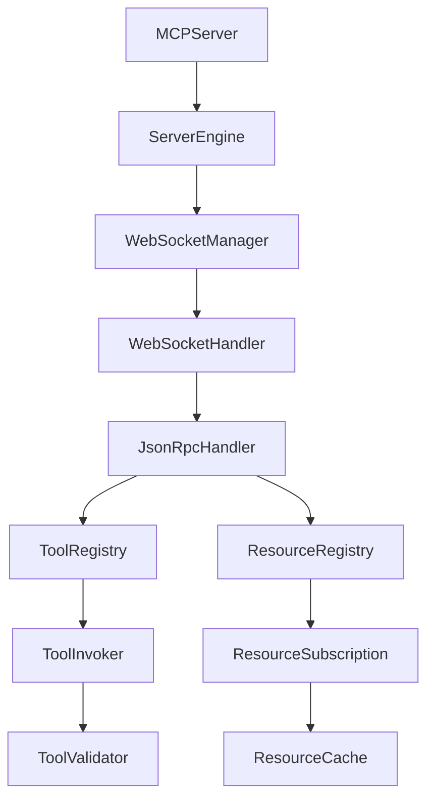

# MCP Architecture Simplification: Technical Design

**Document Status**: Technical Design  
**Linear Issue**: [SPI-611](https://linear.app/spiral-house/issue/SPI-611/simplify-mcp-architecture-collapse-78-files-to-20)  
**Target**: Reduce from 79 files to ~35 files  
**Approach**: Incremental, Phase-Based Consolidation

## Executive Summary

The MCP (Model Context Protocol) subsystem currently consists of 79 Kotlin files spread across multiple packages. This document outlines a careful, incremental approach to consolidate this to approximately 35 files while maintaining all functionality and ensuring system stability at each step.

**Key Principles**:
- Maximum 3-5 files changed per increment
- Compilation must succeed after every change
- Tests must pass after every phase
- Each phase must be independently rollback-able
- No "Big Bang" refactoring

## Current Architecture Analysis

### File Distribution (79 Total Files)

```
mcp/
├── websocket/          (14 files)
├── protocol/           (10 files)
├── tools/              (8 files)
│   ├── exceptions/     (6 files)
│   ├── validation/     (4 files)
│   ├── interfaces/     (3 files)
│   ├── providers/      (1 file)
│   ├── lifecycle/      (1 file)
│   ├── factories/      (1 file)
│   └── builders/       (1 file)
├── server/             (6 files)
│   ├── handlers/       (2 files)
│   ├── state/          (1 file)
│   └── exceptions/     (1 file)
├── resources/          (4 files)
│   ├── subscription/   (3 files)
│   ├── interfaces/     (3 files)
│   ├── rpc/            (2 files)
│   ├── validation/     (1 file)
│   ├── exceptions/     (1 file)
│   └── cache/          (1 file)
├── providers/          (2 files)
├── integration/        (1 file)
├── handlers/           (1 file)
└── MCPServer.kt        (1 file)
```

### Detailed File Inventory

#### WebSocket Layer (14 files)
1. `ConnectionManager.kt` - Interface for connection management
2. `WebSocketConnectionManager.kt` - Implementation of ConnectionManager
3. `ConnectionFactory.kt` - Interface for creating connections
4. `DefaultConnectionFactory.kt` - Implementation of ConnectionFactory
5. `HeartbeatManager.kt` - Interface for heartbeat handling
6. `DefaultHeartbeatManager.kt` - Implementation of HeartbeatManager
7. `MessageHandler.kt` - Interface for message processing
8. `DefaultMessageHandler.kt` - Implementation of MessageHandler
9. `WebSocketConnection.kt` - Connection abstraction
10. `MCPWebSocketHandler.kt` - WebSocket handler for Ktor
11. `ConnectionEventListener.kt` - Event listener interface
12. `WebSocketLogger.kt` - Logging utilities
13. `WebSocketServerConfig.kt` - Configuration class
14. `WebSocketServerException.kt` - Exception class

#### Protocol Layer (10 files)
1. `JsonRpcRequest.kt` - Request model
2. `JsonRpcResponse.kt` - Response model
3. `JsonRpcError.kt` - Error model
4. `JsonRpcErrorCodes.kt` - Error code constants
5. `JsonRpcExceptions.kt` - Protocol exceptions
6. `JsonRpcRequestValidator.kt` - Request validation
7. `JsonRpcProtocolHandler.kt` - Protocol handler implementation
8. `ProtocolHandler.kt` - Protocol handler interface
9. `JsonElementConverter.kt` - JSON conversion utilities
10. `ErrorMessages.kt` - Error message constants

#### Tools Subsystem (25 files total)
Core (8 files):
1. `Tool.kt` - Synchronous tool definition
2. `AsyncTool.kt` - Asynchronous tool definition
3. `ToolRegistry.kt` - Registry implementation
4. `DefaultToolRegistry.kt` - Duplicate registry?
5. `ToolMetadata.kt` - Tool metadata model
6. `ToolProvider.kt` - Tool provider interface
7. `DefaultToolInvoker.kt` - Tool invocation logic
8. `JsonRpcError.kt` - Duplicate error class?

Exceptions (6 files):
1. `JsonRpcException.kt` - Base exception
2. `ParameterValidationException.kt` - Parameter validation errors
3. `ToolErrorCode.kt` - Error code enum
4. `ToolExecutionException.kt` - Execution errors
5. `ToolNotFoundException.kt` - Not found errors
6. `ToolTimeoutException.kt` - Timeout errors

Validation (4 files):
1. `JsonSchemaValidator.kt` - JSON Schema validation
2. `CompositeValidator.kt` - Composite validation pattern
3. `CachingValidator.kt` - Validation caching
4. `ValidationResult.kt` - Validation result model

Interfaces (3 files):
1. `ToolRegistry.kt` - Registry interface
2. `ToolInvoker.kt` - Invoker interface
3. `ToolValidator.kt` - Validator interface

Others (4 files):
1. `builders/ToolBuilder.kt` - Tool builder pattern
2. `providers/ToolProviders.kt` - Provider utilities
3. `lifecycle/ToolLifecycleManager.kt` - Lifecycle management
4. `factories/ValidatorFactory.kt` - Validator factory

#### Server Layer (10 files)
1. `McpServer.kt` - Main server class
2. `MCPServerEngine.kt` - Server engine
3. `MCPConfiguration.kt` - Configuration
4. `McpServerConfig.kt` - Server config
5. `MCPConnectionManager.kt` - Connection management
6. `ConnectionCleanupService.kt` - Cleanup service
7. `handlers/McpMethodHandler.kt` - Method handler
8. `handlers/McpMethodHandlers.kt` - Method handler collection
9. `state/ServerState.kt` - Server state management
10. `exceptions/McpServerException.kt` - Server exceptions

#### Resources Subsystem (14 files)
Core (4 files):
1. `Resource.kt` - Resource model
2. `ResourceProvider.kt` - Provider interface
3. `ResourceProviderRegistry.kt` - Registry implementation
4. `ResourceRpcHandler.kt` - RPC handler

Subscription (3 files):
1. `ResourceSubscription.kt` - Subscription model
2. `ResourceSubscriptionManager.kt` - Subscription management
3. `ResourceNotificationService.kt` - Notification service

Interfaces (3 files):
1. `ResourceRegistry.kt` - Registry interface
2. `SubscriptionManager.kt` - Subscription interface
3. `NotificationService.kt` - Notification interface

RPC (2 files):
1. `ResourceListCommand.kt` - List command
2. `RpcCommand.kt` - Base RPC command

Others (3 files):
1. `validation/UriValidator.kt` - URI validation
2. `exceptions/ResourceExceptions.kt` - Resource exceptions
3. `cache/ResourceCache.kt` - Resource caching

#### Other Files (4 files)
1. `MCPServer.kt` - Top-level server (duplicate?)
2. `integration/MCPIntegrationService.kt` - Integration service
3. `handlers/WebSocketHandler.kt` - WebSocket handler
4. `providers/DefaultResourceProviders.kt` - Default providers
5. `providers/ResourceProviders.kt` - Provider utilities

## Target Architecture (~35 files)

### Proposed Structure

```
mcp/
├── core/               (5 files)
│   ├── MCPServer.kt
│   ├── MCPConfiguration.kt
│   ├── MCPIntegration.kt
│   ├── MCPExceptions.kt
│   └── MCPConstants.kt
├── protocol/           (4 files)
│   ├── JsonRpcModels.kt    (Request, Response, Error)
│   ├── JsonRpcHandler.kt   (Protocol handling)
│   ├── JsonRpcValidator.kt (Validation)
│   └── JsonRpcConstants.kt (Error codes, messages)
├── websocket/          (4 files)
│   ├── WebSocketManager.kt    (Connection + Heartbeat)
│   ├── WebSocketHandler.kt    (Message handling)
│   ├── WebSocketConfig.kt     (Configuration)
│   └── WebSocketConnection.kt (Connection abstraction)
├── tools/              (6 files)
│   ├── Tool.kt            (Unified sync/async tool)
│   ├── ToolRegistry.kt    (Registry implementation)
│   ├── ToolInvoker.kt     (Invocation logic)
│   ├── ToolValidator.kt   (All validation)
│   ├── ToolExceptions.kt  (All tool exceptions)
│   └── ToolMetadata.kt    (Metadata model)
├── resources/          (4 files)
│   ├── Resource.kt           (Models + Provider)
│   ├── ResourceRegistry.kt   (Registry + RPC)
│   ├── ResourceSubscription.kt (Subscription management)
│   └── ResourceCache.kt      (Caching)
├── server/             (3 files)
│   ├── ServerEngine.kt    (Engine + State)
│   ├── ServerHandlers.kt  (All handlers)
│   └── ServerManagement.kt (Connection + Cleanup)
└── providers/          (1 file)
    └── Providers.kt    (All provider utilities)

Total: 27 core files + ~8 utility files = ~35 files
```

## Consolidation Strategy

### Phase A: Dead Code Elimination (Risk: Low)
**Files to Remove**: 8-10 files  
**Duration**: 1 day  
**Rollback**: Simple git revert

1. **Remove Duplicate Files**
   - `tools/DefaultToolRegistry.kt` (duplicate of ToolRegistry.kt)
   - `tools/JsonRpcError.kt` (duplicate of protocol/JsonRpcError.kt)
   - `MCPServer.kt` (root level duplicate)

2. **Remove Empty/Shell Interfaces**
   - Identify interfaces with single implementations
   - Check for unused interfaces

3. **Validation Steps**
   - Compile after each removal
   - Run existing tests
   - Check for import errors

### Phase B: Simple Consolidations (Risk: Low-Medium)
**Files to Merge**: 15-20 files  
**Duration**: 2 days  
**Rollback**: Git revert per consolidation

1. **Merge Tool and AsyncTool** (2 → 1 file)
   ```kotlin
   // New unified Tool.kt
   data class Tool(
       val name: String,
       val description: String,
       val parametersSchema: JsonObject,
       val handler: ToolHandler
   )
   
   sealed interface ToolHandler {
       data class Sync(val fn: (JsonElement) -> Result<JsonElement>) : ToolHandler
       data class Async(val fn: suspend (JsonElement) -> Result<JsonElement>) : ToolHandler
   }
   ```

2. **Consolidate Tool Exceptions** (6 → 1 file)
   ```kotlin
   // ToolExceptions.kt - All tool exceptions in one file
   sealed class ToolException(message: String) : Exception(message) {
       class NotFound(toolName: String) : ToolException("Tool not found: $toolName")
       class Timeout(toolName: String) : ToolException("Tool timeout: $toolName")
       class ExecutionError(message: String) : ToolException(message)
       class ValidationError(message: String) : ToolException(message)
   }
   ```

3. **Merge Protocol Files** (10 → 4 files)
   - Combine Request/Response/Error models → `JsonRpcModels.kt`
   - Merge ErrorCodes + ErrorMessages → `JsonRpcConstants.kt`
   - Keep Handler and Validator separate for clarity

4. **Consolidate Validation** (4 → 1 file)
   - Merge all validators into `ToolValidator.kt`
   - Keep validation strategies as inner classes

### Phase C: Interface Reduction (Risk: Medium)
**Files to Merge**: 10-12 files  
**Duration**: 2 days  
**Rollback**: Careful DI reconfiguration

1. **Remove Unnecessary Interfaces**
   - Merge interface + single implementation pairs
   - Keep interfaces only where:
     - Multiple implementations exist
     - Testing requires mocking
     - Future extensibility is planned

2. **WebSocket Interface Consolidation**
   - `ConnectionManager` + `WebSocketConnectionManager` → `WebSocketManager`
   - `HeartbeatManager` + `DefaultHeartbeatManager` → Merge into WebSocketManager
   - `MessageHandler` + `DefaultMessageHandler` → `WebSocketHandler`
   - `ConnectionFactory` + `DefaultConnectionFactory` → Remove factory pattern

3. **Tool Interface Consolidation**
   - `ToolRegistry` interface + implementation → Single class
   - `ToolInvoker` interface + implementation → Single class
   - `ToolValidator` interface + implementation → Single class

4. **Resource Interface Consolidation**
   - Merge interface/implementation pairs
   - Keep subscription management unified

### Phase D: WebSocket Layer Simplification (Risk: High)
**Files to Merge**: 14 → 4 files  
**Duration**: 3 days  
**Rollback**: Feature branch with extensive testing

1. **Core Consolidation**
   ```kotlin
   // WebSocketManager.kt - Connection + Heartbeat + Factory
   class WebSocketManager(
       private val config: WebSocketConfig,
       private val messageHandler: WebSocketHandler
   ) {
       // Connection management
       // Heartbeat logic
       // Connection creation
   }
   ```

2. **Handler Consolidation**
   ```kotlin
   // WebSocketHandler.kt - Message processing + Event handling
   class WebSocketHandler(
       private val protocolHandler: JsonRpcHandler
   ) {
       // Message processing
       // Event notifications
       // Logging
   }
   ```

3. **Keep Separate**
   - `WebSocketConfig.kt` - Configuration
   - `WebSocketConnection.kt` - Connection abstraction

### Phase E: Final Optimization (Risk: Low)
**Files to Organize**: Remaining files  
**Duration**: 1 day  
**Rollback**: Simple revert

1. **Server Layer** (6 → 3 files)
   - Merge Engine + State → `ServerEngine.kt`
   - Merge all handlers → `ServerHandlers.kt`
   - Merge Connection + Cleanup → `ServerManagement.kt`

2. **Provider Consolidation** (Multiple → 1 file)
   - Merge all provider utilities → `Providers.kt`

3. **Resource Optimization** (14 → 4 files)
   - Core models and providers → `Resource.kt`
   - Registry and RPC → `ResourceRegistry.kt`
   - All subscription logic → `ResourceSubscription.kt`
   - Keep cache separate → `ResourceCache.kt`

## Dependency Mapping

### Critical Dependencies



### DI Configuration Impact

Current DI bindings that need updating:
```kotlin
// Before
provide<ToolRegistry> { DefaultToolRegistry() }
provide<ToolInvoker> { DefaultToolInvoker(instance()) }
provide<ConnectionManager> { WebSocketConnectionManager() }

// After Phase C
provide<ToolRegistry> { ToolRegistry() }  // Direct class, no interface
provide<ToolInvoker> { ToolInvoker(instance()) }
provide<WebSocketManager> { WebSocketManager(instance(), instance()) }
```

### Import Chain Analysis

Files with highest import dependencies (require careful handling):
1. `MCPWebSocketHandler.kt` - 15+ imports
2. `JsonRpcProtocolHandler.kt` - 12+ imports
3. `DefaultToolRegistry.kt` - 10+ imports
4. `MCPServerEngine.kt` - 10+ imports

## Risk Assessment

### Risk Matrix

| Component | Files | Risk Level | Impact | Mitigation |
|-----------|-------|------------|---------|------------|
| Dead Code | 8-10 | **Low** | Minimal | Simple removal, easy rollback |
| Tool Consolidation | 6 | **Low** | Tool registration | Extensive testing |
| Exception Merging | 10 | **Low** | Error handling | Keep error codes intact |
| Protocol Merging | 10 | **Medium** | Message processing | Integration tests |
| Interface Removal | 12 | **Medium** | DI configuration | Update DI carefully |
| WebSocket Layer | 14 | **High** | Core connectivity | Feature branch, load testing |
| Server Layer | 6 | **Medium** | Server startup | Startup tests |

### Critical Paths (Must Not Break)

1. **WebSocket Connection Establishment**
   - Client connection
   - Handshake protocol
   - Session management

2. **Tool Invocation Pipeline**
   - Tool registration
   - Parameter validation
   - Execution and response

3. **Resource Subscription Flow**
   - Resource registration
   - Subscription management
   - Change notifications

4. **Error Handling Chain**
   - Error capture
   - Error code mapping
   - Client error responses

## Implementation Plan

### Phase Schedule

| Phase | Duration | Files Changed | Risk | Validation Time |
|-------|----------|---------------|------|-----------------|
| A: Dead Code | 1 day | 8-10 | Low | 2 hours |
| B: Simple Merge | 2 days | 15-20 | Low-Med | 4 hours |
| C: Interface | 2 days | 10-12 | Medium | 6 hours |
| D: WebSocket | 3 days | 14→4 | High | 8 hours |
| E: Final | 1 day | 10-12 | Low | 2 hours |
| **Total** | **9 days** | **79→35** | - | **22 hours** |

### Daily Increments

**Day 1**: Phase A - Dead code elimination
- Morning: Identify and remove duplicates
- Afternoon: Remove unused files
- End of day: Full test suite

**Day 2-3**: Phase B - Simple consolidations
- Tool + AsyncTool merge
- Exception consolidation
- Protocol file merging
- Test after each merge

**Day 4-5**: Phase C - Interface reduction
- Analyze interface usage
- Merge single-implementation interfaces
- Update DI configuration
- Integration testing

**Day 6-8**: Phase D - WebSocket layer
- Create feature branch
- Consolidate connection management
- Merge handler logic
- Load testing

**Day 9**: Phase E - Final optimization
- Server layer consolidation
- Provider merging
- Final cleanup
- Complete test suite

## Validation Protocol

### After Each File Change

1. **Compilation Check**
   ```bash
   ./gradlew compileKotlin
   ```

2. **Import Verification**
   ```bash
   ./gradlew dependencies | grep "FAILED"
   ```

### After Each Phase

1. **Full Build**
   ```bash
   ./gradlew clean build
   ```

2. **Test Suite**
   ```bash
   ./gradlew test
   ```

3. **Integration Tests**
   ```bash
   ./gradlew integrationTest
   ```

4. **Manual Testing Checklist**
   - [ ] Server starts successfully
   - [ ] WebSocket connection establishes
   - [ ] Tool registration works
   - [ ] Tool execution succeeds
   - [ ] Resource subscription functions
   - [ ] Error handling intact

### Rollback Procedures

**Phase A-B Rollback** (Simple):
```bash
git revert HEAD~n  # n = number of commits in phase
./gradlew clean build
```

**Phase C Rollback** (DI Changes):
```bash
git revert HEAD~n
# Restore Application.kt DI configuration
./gradlew clean build
# Verify DI bindings
```

**Phase D Rollback** (Feature Branch):
```bash
git checkout main
git branch -D feature/websocket-consolidation
# Or if merged:
git revert -m 1 <merge-commit>
```

## Success Criteria

### Quantitative Metrics

- [ ] File count: 79 → 35-40 files (55% reduction)
- [ ] Code duplication: < 5% (measured by detekt)
- [ ] Build time: No increase (< 30 seconds)
- [ ] Test coverage: Maintained at > 80%
- [ ] All tests passing: 100%

### Qualitative Metrics

- [ ] Clearer package structure
- [ ] Reduced cognitive load
- [ ] Easier navigation
- [ ] Simplified dependency graph
- [ ] Improved maintainability

### Performance Validation

- [ ] WebSocket latency: < 10ms (unchanged)
- [ ] Tool execution: < 100ms (unchanged)
- [ ] Memory usage: No increase
- [ ] Connection stability: 100% uptime in 1-hour test

## Code Examples

### Example 1: Tool Consolidation

**Before** (2 files):
```kotlin
// Tool.kt
data class Tool(
    val name: String,
    val description: String,
    val parametersSchema: JsonObject,
    val handler: (JsonElement) -> Result<JsonElement>
)

// AsyncTool.kt
data class AsyncTool(
    val name: String,
    val description: String,
    val parametersSchema: JsonObject,
    val handler: suspend (JsonElement) -> Result<JsonElement>
)
```

**After** (1 file):
```kotlin
// Tool.kt
data class Tool(
    val name: String,
    val description: String,
    val parametersSchema: JsonObject,
    val handler: ToolHandler
) {
    companion object {
        fun sync(
            name: String,
            description: String,
            schema: JsonObject,
            handler: (JsonElement) -> Result<JsonElement>
        ) = Tool(name, description, schema, ToolHandler.Sync(handler))
        
        fun async(
            name: String,
            description: String,
            schema: JsonObject,
            handler: suspend (JsonElement) -> Result<JsonElement>
        ) = Tool(name, description, schema, ToolHandler.Async(handler))
    }
}

sealed interface ToolHandler {
    data class Sync(val fn: (JsonElement) -> Result<JsonElement>) : ToolHandler
    data class Async(val fn: suspend (JsonElement) -> Result<JsonElement>) : ToolHandler
}
```

### Example 2: Exception Consolidation

**Before** (6 files):
```kotlin
// ToolNotFoundException.kt
class ToolNotFoundException(toolName: String) : Exception("Tool not found: $toolName")

// ToolTimeoutException.kt
class ToolTimeoutException(toolName: String) : Exception("Tool timeout: $toolName")

// ToolExecutionException.kt
class ToolExecutionException(message: String) : Exception(message)

// ParameterValidationException.kt
class ParameterValidationException(message: String) : Exception(message)

// Plus 2 more files...
```

**After** (1 file):
```kotlin
// ToolExceptions.kt
sealed class ToolException(
    message: String,
    val errorCode: ToolErrorCode
) : Exception(message) {
    
    class NotFound(toolName: String) : 
        ToolException("Tool not found: $toolName", ToolErrorCode.TOOL_NOT_FOUND)
    
    class Timeout(toolName: String, duration: Duration) : 
        ToolException("Tool '$toolName' timeout after $duration", ToolErrorCode.TIMEOUT)
    
    class ExecutionError(toolName: String, cause: Throwable) : 
        ToolException("Tool '$toolName' execution failed: ${cause.message}", ToolErrorCode.EXECUTION_ERROR)
    
    class ValidationError(message: String, details: Map<String, Any>? = null) : 
        ToolException(message, ToolErrorCode.VALIDATION_ERROR)
    
    class InvalidParameters(toolName: String, errors: List<String>) : 
        ToolException("Invalid parameters for tool '$toolName': ${errors.joinToString()}", ToolErrorCode.INVALID_PARAMS)
}

enum class ToolErrorCode(val code: Int) {
    TOOL_NOT_FOUND(-32601),
    INVALID_PARAMS(-32602),
    EXECUTION_ERROR(-32603),
    TIMEOUT(-32604),
    VALIDATION_ERROR(-32605)
}
```

### Example 3: WebSocket Layer Simplification

**Before** (6 files for connection management):
```kotlin
// ConnectionManager.kt
interface ConnectionManager {
    fun addConnection(id: String, connection: WebSocketConnection)
    fun removeConnection(id: String)
    fun getConnection(id: String): WebSocketConnection?
}

// WebSocketConnectionManager.kt
class WebSocketConnectionManager : ConnectionManager {
    private val connections = ConcurrentHashMap<String, WebSocketConnection>()
    override fun addConnection(id: String, connection: WebSocketConnection) { /* ... */ }
    override fun removeConnection(id: String) { /* ... */ }
    override fun getConnection(id: String) = connections[id]
}

// HeartbeatManager.kt
interface HeartbeatManager {
    fun startHeartbeat(connectionId: String)
    fun stopHeartbeat(connectionId: String)
}

// DefaultHeartbeatManager.kt
class DefaultHeartbeatManager : HeartbeatManager {
    // Implementation
}

// Plus ConnectionFactory.kt and DefaultConnectionFactory.kt
```

**After** (1 file):
```kotlin
// WebSocketManager.kt
class WebSocketManager(
    private val config: WebSocketConfig,
    private val messageHandler: WebSocketHandler,
    private val scope: CoroutineScope
) {
    private val connections = ConcurrentHashMap<String, WebSocketConnection>()
    private val heartbeatJobs = ConcurrentHashMap<String, Job>()
    
    // Connection Management
    fun addConnection(id: String, session: WebSocketSession): WebSocketConnection {
        val connection = WebSocketConnection(id, session, config)
        connections[id] = connection
        startHeartbeat(id)
        return connection
    }
    
    fun removeConnection(id: String) {
        connections.remove(id)
        stopHeartbeat(id)
    }
    
    fun getConnection(id: String): WebSocketConnection? = connections[id]
    
    // Heartbeat Management (previously separate)
    private fun startHeartbeat(connectionId: String) {
        heartbeatJobs[connectionId] = scope.launch {
            while (isActive) {
                delay(config.heartbeatInterval)
                connections[connectionId]?.sendPing()
            }
        }
    }
    
    private fun stopHeartbeat(connectionId: String) {
        heartbeatJobs[connectionId]?.cancel()
        heartbeatJobs.remove(connectionId)
    }
    
    // Lifecycle
    fun shutdown() {
        heartbeatJobs.values.forEach { it.cancel() }
        connections.clear()
    }
}
```

## Common Pitfalls to Avoid

### From Previous Failure

1. **False Assumptions**
   - Always verify file counts and dependencies
   - Don't assume empty files can be deleted
   - Check for reflection usage

2. **Big Bang Changes**
   - Never change more than 5 files at once
   - Always have a working state to rollback to
   - Test incrementally

3. **Missing Dependencies**
   - Trace all import statements
   - Check DI configuration
   - Verify test dependencies

4. **Incomplete Testing**
   - Run full test suite after each phase
   - Include integration tests
   - Manual smoke tests are essential

### Technical Pitfalls

1. **Sealed Classes vs Enums**
   - Sealed classes for complex hierarchies
   - Enums for simple constants
   - Consider serialization requirements

2. **Coroutine Scope Management**
   - Maintain proper scope hierarchy
   - Ensure cleanup on shutdown
   - Avoid scope leaks

3. **Thread Safety**
   - ConcurrentHashMap for shared state
   - Atomic operations where needed
   - Proper synchronization

4. **DI Circular Dependencies**
   - Watch for circular references
   - Use lazy injection if needed
   - Keep dependency graph simple

## Appendix A: File Mapping Table

| Current File | Target File | Phase | Risk |
|--------------|-------------|-------|------|
| Tool.kt + AsyncTool.kt | Tool.kt | B | Low |
| 6 exception files | ToolExceptions.kt | B | Low |
| 4 validation files | ToolValidator.kt | B | Low |
| 10 protocol files | 4 protocol files | B | Medium |
| 14 websocket files | 4 websocket files | D | High |
| 3 tool interfaces | Merged with implementations | C | Medium |
| 3 resource interfaces | Merged with implementations | C | Medium |
| 6 server files | 3 server files | E | Low |

## Appendix B: Test Coverage Requirements

Each phase must maintain:

| Component | Current Coverage | Required Coverage |
|-----------|-----------------|-------------------|
| Tools | 85% | > 85% |
| Protocol | 90% | > 90% |
| WebSocket | 75% | > 75% |
| Resources | 80% | > 80% |
| Server | 70% | > 70% |

## Appendix C: Rollback Decision Tree

```
Did compilation fail?
├── Yes → Immediate rollback
└── No → Continue
    │
    Did tests fail?
    ├── Yes → Are they flaky tests?
    │   ├── Yes → Fix and retry once
    │   └── No → Rollback
    └── No → Continue
        │
        Did integration tests fail?
        ├── Yes → Is it environment issue?
        │   ├── Yes → Fix environment and retry
        │   └── No → Rollback
        └── No → Continue
            │
            Did manual tests fail?
            ├── Yes → Rollback
            └── No → Commit and proceed
```

## Conclusion

This incremental approach to MCP architecture simplification reduces risk while achieving the goal of cutting file count by more than 50%. The phased implementation allows for careful validation at each step and provides clear rollback points if issues arise.

The key to success is patience and discipline - resist the temptation to make large changes, and maintain a working system at all times. Each phase builds on the previous one, gradually transforming the architecture while maintaining full functionality.

Total timeline: 9 working days with 22 hours of validation time built in. This conservative approach ensures system stability while achieving significant architectural improvements.