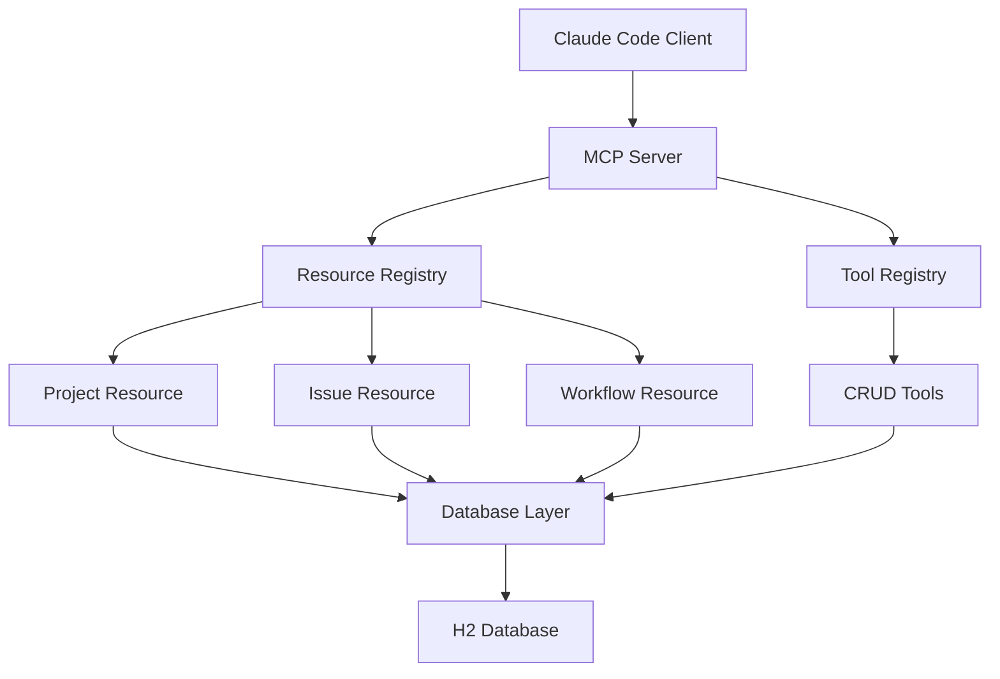

# Technical Design: SPI-290 MCP Resource Integration for Context Provision

## Overview

This document provides comprehensive technical specifications for implementing
Epic SPI-290: "MCP Resource Integration for Context Provision". The
implementation builds upon the completed MCP Server Foundation (SPI-354) to
provide basic CRUD operations and cross-session state persistence through MCP
Resources.

**Design Principles:**

- **Context Provision Over Automation**: Focus on exposing project data, not
  complex orchestration
- **Simple CRUD Operations**: Basic create, read, update, delete functionality
- **Cross-Session Continuity**: Persistent state management for development
  workflow
- **MCP Resources Pattern**: Expose data through structured MCP resource
  endpoints

## Architecture Overview

### High-Level Component Structure



### MCP Resources Explained

**MCP Resources** are structured data endpoints that expose project information
to Claude Code through the Model Context Protocol. They work like a specialized
API designed for AI consumption.

#### What are MCP Resources?

MCP Resources provide **URI-based access** to structured data that Claude Code
agents can read and understand:

```kotlin
// Claude Code can access resources like this:
val projectData = mcp.readResource("project://abc-123")
val issueData = mcp.readResource("issue://def-456")

// Resources return structured data:
ResourceContent(
    uri = "project://abc-123",
    mimeType = "application/json",
    text = Json.encodeToString(ProjectResourceData(
        id = "abc-123",
        name = "My Project",
        status = "active",
        issueCount = 15,
        dependencies = listOf("issue://def-456")
        // ... more project data
    ))
)
```

#### Resource Types

1. **Project Resource** (`project://PROJECT_ID`)
   - **Purpose**: Expose project metadata, status, and basic information
   - **Data**: Project name, description, creation date, issue count, status
   - **Usage**: Context for Claude Code to understand project scope and state

2. **Issue Resource** (`issue://ISSUE_ID`)
   - **Purpose**: Expose individual issue data and relationships
   - **Data**: Issue title, status, priority, dependencies, subtasks, assignee
   - **Usage**: Detailed task information for dependency analysis and work
     planning

3. **Workflow Resource** (`workflow://WORKFLOW_ID`)
   - **Purpose**: Expose workflow state and process information
   - **Data**: Current stage, available transitions, blocking conditions
   - **Usage**: Process context for Claude Code to understand development flow

4. **Session Resource** (`session://SESSION_KEY`) *(Implemented in SPI-346)*
   - **Purpose**: Expose session state and metadata for cross-session continuity
   - **Data**: Session context, active issues, workflow stage, last activity, expiration
   - **Usage**: Maintain development context across Claude Code sessions
   - **Implementation**: Complete with SessionManager, SessionValidator, and persistence layer

#### Key Benefits for JCVD

- **Context Provision**: Claude Code gets structured project data instead of raw
  database access
- **URI-based Access**: Clean, predictable addressing with standard protocols
- **Cross-session Persistence**: Resources maintain state between Claude Code
  sessions
- **Type Safety**: Well-defined schemas for reliable data exchange
- **AI-Optimized**: Data formatted specifically for LLM consumption and analysis

#### Resource Lifecycle

```typescript
// 1. Resource Registration
resourceRegistry.register({
  type: 'project',
  name: 'JCVD Projects',
  description: 'Access to project information and metadata',
  handler: projectResourceHandler,
});

// 2. Claude Code Access
const resources = await mcp.listResources(); // Discovery
const projectData = await mcp.readResource('project://abc-123'); // Access

// 3. Data Utilization
// Claude Code agents use resource data for:
// - Task recommendations
// - Dependency analysis
// - Context-aware development decisions
```

### Data Access Layer Explained

The **Data Access Layer** implements the **Repository pattern** and provides
clean data access abstractions following **Domain-Driven Design** principles. It
sits at the boundary between the application logic and persistence
infrastructure, implementing the **ports** defined by the domain while adapting
to the SQLite **adapter**.

#### Layered Architecture Overview

```typescript
// Domain Layer - Core business entities and logic
export class Project {
  constructor(
    public readonly id: ProjectId,
    public name: string,
    public description: string,
    public status: ProjectStatus,
    private issues: Issue[] = []
  ) {}

  addIssue(issue: Issue): void {
    // Domain logic for issue validation
    if (this.status === ProjectStatus.ARCHIVED) {
      throw new DomainError('Cannot add issues to archived project');
    }
    this.issues.push(issue);
  }
}

// Application Layer - Use cases and application services
export class ProjectService {
  constructor(private projectRepo: ProjectRepository) {}

  async createProjectWithInitialIssues(
    command: CreateProjectCommand
  ): Promise<Project> {
    // Application logic orchestrating domain operations
    const project = new Project(/* ... */);
    command.issues.forEach(issue => project.addIssue(issue));

    return await this.projectRepo.save(project);
  }
}

// Infrastructure Layer - Data access implementations
export class SqliteProjectRepository implements ProjectRepository {
  // Repository implementation using SQLite
}
```

#### Data Access Layer Responsibilities

**1. Repository Pattern Implementation**

```typescript
// Domain Layer - Repository Port (Interface)
export interface ProjectRepository {
  findById(id: ProjectId): Promise<Project | null>;
  findByStatus(status: ProjectStatus): Promise<Project[]>;
  save(project: Project): Promise<void>;
  delete(id: ProjectId): Promise<void>;
}

// Infrastructure Layer - Repository Adapter (Implementation)
export class SqliteProjectRepository implements ProjectRepository {
  constructor(private db: Database.Database) {}

  async findById(id: ProjectId): Promise<Project | null> {
    const stmt = this.db.prepare('SELECT * FROM projects WHERE id = ?');
    const row = stmt.get(id.value) as ProjectData | undefined;

    return row ? this.toDomainEntity(row) : null;
  }

  async save(project: Project): Promise<void> {
    const data = this.toDataModel(project);
    const stmt = this.db.prepare(`
      INSERT OR REPLACE INTO projects (id, name, description, status, updated_at)
      VALUES (?, ?, ?, ?, ?)
    `);
    stmt.run(
      data.id,
      data.name,
      data.description,
      data.status,
      data.updated_at
    );
  }

  private toDomainEntity(data: ProjectData): Project {
    return new Project(
      new ProjectId(data.id),
      data.name,
      data.description,
      ProjectStatus.fromString(data.status)
    );
  }

  private toDataModel(project: Project): ProjectData {
    return {
      id: project.id.value,
      name: project.name,
      description: project.description,
      status: project.status.toString(),
      updated_at: new Date().toISOString(),
    };
  }
}
```

**2. Entity vs Data Transfer Object Separation**

```typescript
// Domain Entity - Rich business logic
export class Project {
  constructor(
    public readonly id: ProjectId,
    private _name: string,
    private _description: string,
    private _status: ProjectStatus,
    private _issues: Issue[] = []
  ) {}

  get name(): string {
    return this._name;
  }
  get status(): ProjectStatus {
    return this._status;
  }

  archive(): void {
    if (this._issues.some(issue => !issue.isCompleted)) {
      throw new DomainError('Cannot archive project with incomplete issues');
    }
    this._status = ProjectStatus.ARCHIVED;
  }

  addIssue(issue: Issue): void {
    if (this._status === ProjectStatus.ARCHIVED) {
      throw new DomainError('Cannot add issues to archived project');
    }
    this._issues.push(issue);
  }
}

// Data Transfer Object - Plain data structure
export interface ProjectData {
  id: string;
  name: string;
  description: string;
  status: string;
  created_at: string;
  updated_at: string;
}

// Value Objects for type safety
export class ProjectId {
  constructor(public readonly value: string) {
    if (!value || value.length < 1) {
      throw new Error('ProjectId cannot be empty');
    }
  }
}

export class ProjectStatus {
  private constructor(private readonly status: string) {}

  static readonly ACTIVE = new ProjectStatus('active');
  static readonly ARCHIVED = new ProjectStatus('archived');
  static readonly COMPLETED = new ProjectStatus('completed');

  static fromString(status: string): ProjectStatus {
    switch (status) {
      case 'active':
        return ProjectStatus.ACTIVE;
      case 'archived':
        return ProjectStatus.ARCHIVED;
      case 'completed':
        return ProjectStatus.COMPLETED;
      default:
        throw new Error(`Unknown project status: ${status}`);
    }
  }

  toString(): string {
    return this.status;
  }
}
```

**3. Domain Services and Application Services**

```typescript
// Domain Service - Complex business logic
export class ProjectDomainService {
  canProjectBeArchived(project: Project, issues: Issue[]): boolean {
    return issues.every(issue => issue.isCompleted || issue.isCanceled);
  }
}

// Application Service - Use case orchestration
export class ProjectApplicationService {
  constructor(
    private projectRepo: ProjectRepository,
    private issueRepo: IssueRepository,
    private domainService: ProjectDomainService,
    private unitOfWork: UnitOfWork
  ) {}

  async archiveProject(projectId: ProjectId): Promise<void> {
    return this.unitOfWork.execute(async () => {
      const project = await this.projectRepo.findById(projectId);
      if (!project) {
        throw new NotFoundError(`Project ${projectId.value} not found`);
      }

      const issues = await this.issueRepo.findByProject(projectId);

      if (!this.domainService.canProjectBeArchived(project, issues)) {
        throw new BusinessRuleViolationError(
          'Cannot archive project with incomplete issues'
        );
      }

      project.archive();
      await this.projectRepo.save(project);
    });
  }
}
```

**4. Unit of Work Pattern for Transactions**

```typescript
// Port - Transaction abstraction
export interface UnitOfWork {
  execute<T>(work: () => Promise<T>): Promise<T>;
}

// Adapter - SQLite transaction implementation
export class SqliteUnitOfWork implements UnitOfWork {
  constructor(private db: Database.Database) {}

  async execute<T>(work: () => Promise<T>): Promise<T> {
    const transaction = this.db.transaction(() => {
      return work();
    });

    return transaction();
  }
}
```

**5. Aggregate Root Pattern**

```typescript
// Project as Aggregate Root
export class Project {
  private _domainEvents: DomainEvent[] = [];

  addIssue(title: string, description: string): Issue {
    // Aggregate ensures business invariants
    if (this._status === ProjectStatus.ARCHIVED) {
      throw new DomainError('Cannot add issues to archived project');
    }

    const issue = new Issue(
      IssueId.generate(),
      this.id, // Aggregate reference
      title,
      description
    );

    this._issues.push(issue);
    this._domainEvents.push(new IssueAddedEvent(this.id, issue.id));

    return issue;
  }

  getUncommittedEvents(): DomainEvent[] {
    return [...this._domainEvents];
  }

  markEventsAsCommitted(): void {
    this._domainEvents = [];
  }
}
```

#### Hexagonal Architecture Structure

```typescript
// Domain Layer - Core business logic (no dependencies)
export interface ProjectRepository {
  findById(id: ProjectId): Promise<Project | null>;
  findByStatus(status: ProjectStatus): Promise<Project[]>;
  save(project: Project): Promise<void>;
  delete(id: ProjectId): Promise<void>;
}

export interface IssueRepository {
  findById(id: IssueId): Promise<Issue | null>;
  findByProject(projectId: ProjectId): Promise<Issue[]>;
  save(issue: Issue): Promise<void>;
  delete(id: IssueId): Promise<void>;
}

// Application Layer - Use cases and orchestration
export class ProjectApplicationService {
  constructor(
    private projectRepo: ProjectRepository,
    private issueRepo: IssueRepository,
    private unitOfWork: UnitOfWork,
    private domainService: ProjectDomainService
  ) {}
}

// Infrastructure Layer - Technical implementations
export class SqliteProjectRepository implements ProjectRepository {}
export class SqliteIssueRepository implements IssueRepository {}
export class SqliteUnitOfWork implements UnitOfWork {}

// Dependency Injection Container
export class Container {
  // Infrastructure
  private db = new Database('jcvd.db');
  private unitOfWork = new SqliteUnitOfWork(this.db);

  // Repositories
  private projectRepo = new SqliteProjectRepository(this.db);
  private issueRepo = new SqliteIssueRepository(this.db);

  // Domain Services
  private projectDomainService = new ProjectDomainService();

  // Application Services
  projectService = new ProjectApplicationService(
    this.projectRepo,
    this.issueRepo,
    this.unitOfWork,
    this.projectDomainService
  );

  // MCP Layer
  projectResource = new ProjectResource(this.projectService);
  createIssueTool = new CreateIssueTool(this.projectService);
}
```

#### Integration with MCP Components

**MCP Resources use Application Services (following Hexagonal Architecture):**

```typescript
export class ProjectResource extends BaseResource {
  constructor(private projectService: ProjectApplicationService) {}

  async read(uri: string): Promise<ResourceContent> {
    const projectIdString = this.parseProjectUri(uri);
    const projectId = new ProjectId(projectIdString);

    // Use Application Service - no direct repository access
    const project = await this.projectService.getProjectDetails(projectId);

    if (!project) {
      throw new ResourceNotFoundError(`Project ${projectId.value} not found`);
    }

    return {
      uri,
      mimeType: 'application/json',
      text: JSON.stringify({
        id: project.id.value,
        name: project.name,
        status: project.status.toString(),
        issueCount: project.getActiveIssueCount(),
        // Only expose what MCP clients need
      }),
    };
  }

  async list(): Promise<ResourceListResult> {
    const projects = await this.projectService.listActiveProjects();

    return {
      resources: projects.map(project => ({
        uri: `project://${project.id.value}`,
        name: project.name,
        description: project.description || '',
        mimeType: 'application/json',
      })),
    };
  }
}
```

**MCP Tools delegate to Application Services:**

```typescript
export class CreateIssueTool extends BaseTool {
  constructor(private projectService: ProjectApplicationService) {}

  async execute(args: CreateIssueArgs): Promise<ToolResult> {
    try {
      // Validate input at boundary
      const command = this.validateAndMapCommand(args);

      // Delegate to Application Service for business logic
      const issue = await this.projectService.createIssue(command);

      return {
        success: true,
        content: `Created issue: ${issue.title.value}`,
        data: {
          id: issue.id.value,
          title: issue.title.value,
          status: issue.status.toString(),
        },
      };
    } catch (error) {
      if (error instanceof DomainError) {
        return {
          success: false,
          error: {
            code: 'BUSINESS_RULE_VIOLATION',
            message: error.message,
          },
        };
      }

      throw error; // Re-throw unexpected errors
    }
  }

  private validateAndMapCommand(args: unknown): CreateIssueCommand {
    // Input validation and mapping to domain command
    if (!this.isValidCreateIssueArgs(args)) {
      throw new ValidationError('Invalid create issue arguments');
    }

    return new CreateIssueCommand(
      new ProjectId(args.projectId),
      new IssueTitle(args.title),
      args.description || null,
      IssuePriority.fromString(args.priority || 'medium')
    );
  }
}
```

**Application Service coordinates Domain and Infrastructure:**

```typescript
export class ProjectApplicationService {
  constructor(
    private projectRepo: ProjectRepository,
    private issueRepo: IssueRepository,
    private unitOfWork: UnitOfWork,
    private domainService: ProjectDomainService
  ) {}

  async createIssue(command: CreateIssueCommand): Promise<Issue> {
    return this.unitOfWork.execute(async () => {
      // Load aggregate
      const project = await this.projectRepo.findById(command.projectId);
      if (!project) {
        throw new NotFoundError(`Project ${command.projectId.value} not found`);
      }

      // Domain logic through aggregate
      const issue = project.addIssue(command.title.value, command.description);

      // Persist changes
      await this.projectRepo.save(project);
      await this.issueRepo.save(issue);

      return issue;
    });
  }

  async getProjectDetails(projectId: ProjectId): Promise<Project | null> {
    return this.projectRepo.findById(projectId);
  }

  async listActiveProjects(): Promise<Project[]> {
    return this.projectRepo.findByStatus(ProjectStatus.ACTIVE);
  }
}
```

#### Key Benefits of Domain-Driven Design Architecture

1. **Domain-Centric Design**: Business logic and rules live in the domain layer,
   not scattered across infrastructure
2. **Technology Independence**: Domain layer has no dependencies on databases,
   frameworks, or external systems
3. **Testability**: Each layer can be unit tested in isolation with proper
   mocking strategies
4. **Maintainability**: Changes to infrastructure don't affect business logic
   and vice versa
5. **Type Safety**: Strong domain types (Value Objects, Entities) prevent
   invalid states and runtime errors
6. **Clear Boundaries**: Hexagonal architecture makes dependencies explicit and
   unidirectional
7. **Business Rule Enforcement**: Aggregates ensure business invariants are
   maintained consistently
8. **Flexibility**: Can swap SQLite for PostgreSQL or any other persistence
   technology without affecting domain logic

### Core Components (Updated Architecture)

1. **Domain Layer**:
   - **Entities**: `Project`, `Issue` with rich business logic and invariants
   - **Value Objects**: `ProjectId`, `ProjectStatus`, `IssueTitle` for type
     safety
   - **Repository Interfaces**: `ProjectRepository`, `IssueRepository` as ports
   - **Domain Services**: Complex business logic that doesn't belong to single
     entity

2. **Application Layer**:
   - **Application Services**: `ProjectApplicationService` - use case
     orchestration
   - **Commands**: `CreateProjectCommand`, `CreateIssueCommand` - input
     contracts
   - **Unit of Work**: Transaction coordination across repositories

3. **Infrastructure Layer**:
   - **Repository Implementations**: `SqliteProjectRepository`,
     `SqliteIssueRepository`
   - **Unit of Work Implementation**: `SqliteUnitOfWork` for transaction
     management
   - **Database Migrations**: `MigrationRunner` for schema evolution
   - **Data Access Objects**: Raw database entity mapping

4. **MCP Layer** (Presentation/Interface):
   - **Resource Registry**: Discovery and routing for MCP Resources
   - **Resource Implementations**: `ProjectResource`, `IssueResource` -
     read-only data access
   - **Tool Registry**: MCP Tool discovery and validation
   - **Tool Implementations**: `CreateIssueTool`, `UpdateIssueTool` - write
     operations

5. **Cross-Cutting Concerns**:
   - **Dependency Injection**: `Container` for managing object construction and
     lifetimes
   - **Error Handling**: Domain-specific exceptions with proper boundary
     translation
   - **Logging and Monitoring**: Structured logging across all layers

### Session Resource Implementation (Completed in SPI-346)

The Session Resource has been fully implemented as part of SPI-346, providing cross-session state persistence:

```typescript
export class SessionResource extends BaseResource {
  constructor(
    private sessionManager: SessionManager,
    private sessionService: SessionApplicationService
  ) {
    super('session', 'Session state and metadata for cross-session continuity');
  }

  async read(uri: string): Promise<ResourceReadResult> {
    const sessionKey = this.extractSessionKey(uri);
    const sessionInfo = await this.sessionManager.getSessionInfo(sessionKey);
    
    if (!sessionInfo) {
      throw new ResourceNotFoundError(uri);
    }

    return {
      uri,
      mimeType: 'application/json',
      text: JSON.stringify({
        sessionKey: sessionInfo.sessionKey,
        projectId: sessionInfo.projectId,
        context: sessionInfo.currentContext,
        metadata: {
          createdAt: sessionInfo.createdAt,
          lastActivity: sessionInfo.lastActivity,
          updateCount: sessionInfo.metadata.updateCount,
          totalActiveTime: sessionInfo.metadata.totalActiveTime,
          issuesAccessed: sessionInfo.metadata.issuesAccessed,
          isExpired: sessionInfo.isExpired,
          expiresAt: sessionInfo.expiresAt
        }
      })
    };
  }

  async list(): Promise<ResourceListResult> {
    const sessions = await this.sessionService.findActiveSessions();
    
    return {
      resources: sessions.map(session => ({
        uri: `session://${session.sessionKey}`,
        name: `Session ${session.sessionKey.substring(0, 8)}...`,
        description: `Project: ${session.projectId || 'None'}, Active: ${session.currentContext?.activeIssues?.length || 0} issues`,
        mimeType: 'application/json'
      }))
    };
  }
}
```

**Integration with MCP Server:**

```typescript
// In MCP Server initialization
const sessionResource = new SessionResource(sessionManager, sessionService);
resourceRegistry.register(sessionResource);

// Claude Code can now access session state
const sessionData = await mcp.readResource('session://abc-123-def-456');
const activeSessions = await mcp.listResources('session');
```

## Database Schema Extensions

### New Tables Required

```sql
-- Resource metadata tracking
CREATE TABLE IF NOT EXISTS resource_metadata (
    id TEXT PRIMARY KEY DEFAULT (lower(hex(randomblob(16)))),
    resource_type TEXT NOT NULL,
    resource_id TEXT NOT NULL,
    last_accessed INTEGER NOT NULL DEFAULT (unixepoch()),
    access_count INTEGER NOT NULL DEFAULT 0,
    metadata_json TEXT,
    created_at INTEGER NOT NULL DEFAULT (unixepoch()),
    updated_at INTEGER NOT NULL DEFAULT (unixepoch()),
    UNIQUE(resource_type, resource_id)
);

-- Session state tracking
CREATE TABLE IF NOT EXISTS session_states (
    id TEXT PRIMARY KEY DEFAULT (lower(hex(randomblob(16)))),
    session_key TEXT UNIQUE NOT NULL,
    project_id TEXT,
    current_context TEXT, -- JSON blob
    last_activity INTEGER NOT NULL DEFAULT (unixepoch()),
    created_at INTEGER NOT NULL DEFAULT (unixepoch()),
    updated_at INTEGER NOT NULL DEFAULT (unixepoch()),
    FOREIGN KEY (project_id) REFERENCES projects(id)
);

-- Resource access logs for debugging
CREATE TABLE IF NOT EXISTS resource_access_logs (
    id TEXT PRIMARY KEY DEFAULT (lower(hex(randomblob(16)))),
    session_key TEXT,
    resource_uri TEXT NOT NULL,
    operation TEXT NOT NULL, -- 'read', 'list', 'create', 'update', 'delete'
    success BOOLEAN NOT NULL DEFAULT true,
    error_message TEXT,
    timestamp INTEGER NOT NULL DEFAULT (unixepoch())
);
```

## Story Implementation Specifications

### SPI-344: Basic MCP Resource Implementation

**Objective**: Implement core MCP Resource infrastructure with Project and Issue
resources.

#### Subtask Breakdown:

**SPI-344-1: Create Resource Registry Infrastructure** (3 points)

- Implement `ResourceRegistry` class
- Add resource registration and discovery
- Create base `Resource` abstract class

```typescript
// src/mcp/resources/registry.ts
export interface ResourceDescriptor {
  type: string;
  name: string;
  description: string;
  mimeType?: string;
  handler: ResourceHandler;
}

export abstract class BaseResource {
  abstract type: string;
  abstract name: string;
  abstract description: string;

  abstract list(cursor?: string, limit?: number): Promise<ResourceListResult>;
  abstract read(uri: string): Promise<ResourceContent>;

  protected validateUri(uri: string): boolean {
    return uri.startsWith(`${this.type}://`);
  }
}

export class ResourceRegistry {
  private resources = new Map<string, ResourceDescriptor>();

  register(resource: ResourceDescriptor): void;
  unregister(type: string): void;
  list(): ResourceDescriptor[];
  get(type: string): ResourceDescriptor | undefined;
}
```

**SPI-344-2: Implement Project Resource** (5 points)

- Create `ProjectResource` class extending `BaseResource`
- Implement list/read operations for projects
- Add project metadata exposure

```typescript
// src/mcp/resources/project.ts
export class ProjectResource extends BaseResource {
  type = 'project';
  name = 'JCVD Projects';
  description = 'Access to project information and metadata';

  async list(cursor?: string, limit = 50): Promise<ResourceListResult> {
    // Implementation: Query projects table with pagination
    // Return: Project URIs and basic metadata
  }

  async read(uri: string): Promise<ResourceContent> {
    // URI format: project://PROJECT_ID
    // Return: Complete project data with related issues count
  }

  private parseProjectUri(uri: string): string {
    // Extract project ID from URI
  }
}
```

**SPI-344-3: Implement Issue Resource** (5 points)

- Create `IssueResource` class extending `BaseResource`
- Implement list/read operations for issues
- Add filtering by project and status

```typescript
// src/mcp/resources/issue.ts
export class IssueResource extends BaseResource {
  type = 'issue';
  name = 'JCVD Issues';
  description = 'Access to issue tracking data';

  async list(cursor?: string, limit = 50): Promise<ResourceListResult> {
    // Support query parameters: ?project=ID&status=STATUS
    // Return: Issue URIs with metadata
  }

  async read(uri: string): Promise<ResourceContent> {
    // URI format: issue://ISSUE_ID
    // Return: Complete issue data with relationships
  }

  private buildIssueUri(issueId: string): string;
  private parseIssueUri(uri: string): string;
}
```

**SPI-344-4: Integrate Resources with MCP Server** (2 points)

- Register resources in main MCP server
- Add resource handlers to server configuration
- Update server initialization

### SPI-345: Simple CRUD Operations for Issues

**Objective**: Implement MCP Tools for basic issue management operations.

#### Subtask Breakdown:

**SPI-345-1: Create Tool Registry Infrastructure** (3 points)

- Implement `ToolRegistry` class
- Add tool registration and validation
- Create base `Tool` abstract class

```typescript
// src/mcp/tools/registry.ts
export interface ToolDescriptor {
  name: string;
  description: string;
  inputSchema: object;
  handler: ToolHandler;
}

export abstract class BaseTool {
  abstract name: string;
  abstract description: string;
  abstract inputSchema: object;

  abstract execute(arguments: unknown): Promise<ToolResult>;

  protected validateInput(input: unknown): boolean {
    // JSON schema validation against inputSchema
  }
}
```

**SPI-345-2: Implement Issue Creation Tool** (5 points)

- Create `CreateIssueTool` class
- Add input validation for issue creation
- Integrate with database layer

```typescript
// src/mcp/tools/issue-create.ts
export class CreateIssueTool extends BaseTool {
  name = 'jcvd_create_issue';
  description = 'Create a new issue in the project';
  inputSchema = {
    type: 'object',
    properties: {
      title: { type: 'string', minLength: 1 },
      description: { type: 'string' },
      projectId: { type: 'string' },
      priority: { type: 'string', enum: ['low', 'medium', 'high', 'critical'] },
      estimatePoints: { type: 'number', minimum: 0 },
    },
    required: ['title', 'projectId'],
  };

  async execute(args: CreateIssueArgs): Promise<ToolResult> {
    // Validation, creation, and response
  }
}
```

**SPI-345-3: Implement Issue Update Tool** (5 points)

- Create `UpdateIssueTool` class
- Support partial updates with validation
- Handle status transitions

**SPI-345-4: Implement Issue Query Tool** (3 points)

- Create `QueryIssuesTool` class
- Support filtering and sorting
- Return structured results

**SPI-345-5: Add Error Handling and Validation** (2 points)

- Implement comprehensive error handling
- Add input validation helpers
- Create error response formatting

### SPI-346: Cross-Session State Persistence

**Objective**: Implement session state management for development continuity.

#### Subtask Breakdown:

**SPI-346-1: Create Session Manager** (5 points)

- Implement `SessionManager` class
- Add session creation and retrieval
- Handle session expiration

```typescript
// src/mcp/session/manager.ts
export interface SessionState {
  sessionKey: string;
  projectId?: string;
  currentContext: {
    activeIssues?: string[];
    workflowStage?: string;
    lastAction?: string;
    contextData?: Record<string, unknown>;
  };
  lastActivity: Date;
}

export class SessionManager {
  async createSession(projectId?: string): Promise<string>;
  async getSession(sessionKey: string): Promise<SessionState | null>;
  async updateSession(
    sessionKey: string,
    context: Partial<SessionState['currentContext']>
  ): Promise<void>;
  async expireSessions(olderThan: Date): Promise<number>;

  private generateSessionKey(): string;
  private isExpired(session: SessionState): boolean;
}
```

**SPI-346-2: Implement State Persistence Tool** (3 points)

- Create `SaveStateTool` for manual state saving
- Add automatic state detection
- Integrate with session manager

**SPI-346-3: Implement State Recovery Tool** (3 points)

- Create `RecoverStateTool` for session restoration
- Add context reconstruction logic
- Handle corrupted state gracefully

**SPI-346-4: Add Session Cleanup Service** (2 points)

- Implement background cleanup for expired sessions
- Add configurable retention policies
- Create cleanup scheduling

### SPI-347: Basic Project Context APIs

**Objective**: Expose project context through MCP Resources and Tools.

#### Subtask Breakdown:

**SPI-347-1: Create Project Context Resource** (5 points)

- Implement `ProjectContextResource` class
- Aggregate project metadata, issues, and workflows
- Support context filtering and scoping

```typescript
// src/mcp/resources/project-context.ts
export class ProjectContextResource extends BaseResource {
  type = 'project-context';
  name = 'Project Context';
  description = 'Aggregated project context information';

  async read(uri: string): Promise<ResourceContent> {
    // URI format: project-context://PROJECT_ID?scope=SCOPE
    // Scopes: 'summary', 'issues', 'workflows', 'full'
    // Return: Contextualized project data
  }

  private async buildProjectContext(
    projectId: string,
    scope: string
  ): Promise<ProjectContext>;
}
```

**SPI-347-2: Implement Context Query Tool** (3 points)

- Create `QueryContextTool` for flexible context queries
- Support filtering by entity types and relationships
- Add context summarization

**SPI-347-3: Add Project Structure Tool** (3 points)

- Create `GetProjectStructureTool`
- Expose project hierarchy and relationships
- Support different view formats (tree, flat, graph)

**SPI-347-4: Implement Context Export Tool** (2 points)

- Create `ExportContextTool` for data export
- Support multiple formats (JSON, YAML, Markdown)
- Add filtering and transformation options

### SPI-348: Simple Data Export and Query Operations

**Objective**: Provide flexible data access through query and export tools.

#### Subtask Breakdown:

**SPI-348-1: Create Query Builder Infrastructure** (5 points)

- Implement `QueryBuilder` class for safe SQL generation
- Add parameter validation and sanitization
- Support common query patterns

```typescript
// src/mcp/query/builder.ts
export class QueryBuilder {
  private table: string;
  private selectFields: string[] = ['*'];
  private whereConditions: WhereCondition[] = [];
  private orderBy: OrderByClause[] = [];
  private limitValue?: number;
  private offsetValue?: number;

  select(fields: string[]): QueryBuilder;
  where(field: string, operator: string, value: unknown): QueryBuilder;
  orderBy(field: string, direction: 'ASC' | 'DESC'): QueryBuilder;
  limit(count: number): QueryBuilder;
  offset(count: number): QueryBuilder;

  build(): { sql: string; parameters: unknown[] };

  private validateField(field: string): boolean;
  private sanitizeValue(value: unknown): unknown;
}
```

**SPI-348-2: Implement Generic Query Tool** (5 points)

- Create `QueryDataTool` for flexible data queries
- Add safety constraints and query validation
- Support joins for related data

**SPI-348-3: Create Export Tool** (3 points)

- Implement `ExportDataTool` for data export
- Support multiple output formats
- Add batch processing for large datasets

**SPI-348-4: Add Data Validation and Security** (2 points)

- Implement query safety validation
- Add access control for sensitive data
- Create audit logging for data access

## Error Handling Strategy

### Error Categories

1. **Validation Errors**: Input validation failures
2. **Database Errors**: SQLite operation failures
3. **Resource Errors**: Resource not found or access denied
4. **Session Errors**: Invalid or expired sessions
5. **System Errors**: Unexpected system failures

### Error Response Format

```typescript
export interface MCPError {
  code: string;
  message: string;
  details?: Record<string, unknown>;
  timestamp: string;
}

export enum ErrorCodes {
  VALIDATION_ERROR = 'VALIDATION_ERROR',
  RESOURCE_NOT_FOUND = 'RESOURCE_NOT_FOUND',
  DATABASE_ERROR = 'DATABASE_ERROR',
  SESSION_EXPIRED = 'SESSION_EXPIRED',
  UNAUTHORIZED = 'UNAUTHORIZED',
  INTERNAL_ERROR = 'INTERNAL_ERROR',
}
```

## Testing Strategy

### Unit Tests Required

1. **Resource Tests**: Each resource implementation
2. **Tool Tests**: Each tool with various input scenarios
3. **Session Tests**: Session management operations
4. **Query Tests**: Query builder and validation
5. **Error Tests**: Error handling scenarios

### Integration Tests Required

1. **MCP Server Integration**: Full server resource/tool flow
2. **Database Integration**: End-to-end data operations
3. **Session Flow**: Cross-session state persistence
4. **Error Propagation**: Error handling through MCP layer

## Performance Considerations

### Optimization Targets

1. **Resource Listing**: Pagination and caching for large datasets
2. **Query Performance**: Indexed queries and query optimization
3. **Session Management**: Efficient state serialization
4. **Memory Usage**: Streaming for large exports

### Caching Strategy

```typescript
// Simple in-memory cache with TTL
export class ResourceCache {
  private cache = new Map<string, CacheEntry>();

  get(key: string): unknown | null;
  set(key: string, value: unknown, ttlMs: number): void;
  invalidate(pattern: string): void;
  cleanup(): void; // Remove expired entries
}
```

## Migration Requirements

### Database Migration Strategy

JCVD uses a **simple, linear migration approach** that aligns with the
"simplicity first" architectural principle. Migrations are just SQL DDL
statements executed in order.

#### Migration Structure

```typescript
// src/database/migrations.ts
export interface Migration {
  version: string;
  description: string;
  sql: string;
}

export const migrations: Migration[] = [
  {
    version: '001',
    description: 'Add resource metadata tracking',
    sql: `
      CREATE TABLE IF NOT EXISTS resource_metadata (
        id TEXT PRIMARY KEY DEFAULT (lower(hex(randomblob(16)))),
        resource_type TEXT NOT NULL,
        resource_id TEXT NOT NULL,
        last_accessed INTEGER NOT NULL DEFAULT (unixepoch()),
        access_count INTEGER NOT NULL DEFAULT 0,
        metadata_json TEXT,
        created_at INTEGER NOT NULL DEFAULT (unixepoch()),
        updated_at INTEGER NOT NULL DEFAULT (unixepoch()),
        UNIQUE(resource_type, resource_id)
      );
    `,
  },
  {
    version: '002',
    description: 'Add session state tracking',
    sql: `
      CREATE TABLE IF NOT EXISTS session_states (
        id TEXT PRIMARY KEY DEFAULT (lower(hex(randomblob(16)))),
        session_key TEXT UNIQUE NOT NULL,
        project_id TEXT,
        current_context TEXT,
        last_activity INTEGER NOT NULL DEFAULT (unixepoch()),
        created_at INTEGER NOT NULL DEFAULT (unixepoch()),
        updated_at INTEGER NOT NULL DEFAULT (unixepoch()),
        FOREIGN KEY (project_id) REFERENCES projects(id)
      );
    `,
  },
  {
    version: '003',
    description: 'Add resource access logging',
    sql: `
      CREATE TABLE IF NOT EXISTS resource_access_logs (
        id TEXT PRIMARY KEY DEFAULT (lower(hex(randomblob(16)))),
        session_key TEXT,
        resource_uri TEXT NOT NULL,
        operation TEXT NOT NULL,
        success BOOLEAN NOT NULL DEFAULT true,
        error_message TEXT,
        timestamp INTEGER NOT NULL DEFAULT (unixepoch())
      );
    `,
  },
  {
    version: '004',
    description: 'Add performance indexes',
    sql: `
      CREATE INDEX IF NOT EXISTS idx_resource_metadata_type 
        ON resource_metadata(resource_type);
      CREATE INDEX IF NOT EXISTS idx_resource_metadata_access 
        ON resource_metadata(last_accessed);
      CREATE INDEX IF NOT EXISTS idx_session_states_key 
        ON session_states(session_key);
      CREATE INDEX IF NOT EXISTS idx_session_states_activity 
        ON session_states(last_activity);
      CREATE INDEX IF NOT EXISTS idx_resource_logs_uri 
        ON resource_access_logs(resource_uri);
      CREATE INDEX IF NOT EXISTS idx_resource_logs_timestamp 
        ON resource_access_logs(timestamp);
    `,
  },
];
```

#### Migration Runner Implementation

```typescript
// src/database/migration-runner.ts
export class MigrationRunner {
  private db: Database.Database;

  constructor(db: Database.Database) {
    this.db = db;
    this.initializeMigrationTable();
  }

  private initializeMigrationTable(): void {
    this.db.exec(`
      CREATE TABLE IF NOT EXISTS schema_migrations (
        version TEXT PRIMARY KEY,
        description TEXT NOT NULL,
        applied_at INTEGER NOT NULL DEFAULT (unixepoch())
      );
    `);
  }

  async runMigrations(): Promise<void> {
    const appliedMigrations = this.getAppliedMigrations();
    const pendingMigrations = migrations.filter(
      migration => !appliedMigrations.has(migration.version)
    );

    for (const migration of pendingMigrations) {
      console.log(
        `Applying migration ${migration.version}: ${migration.description}`
      );

      try {
        this.db.exec(migration.sql);
        this.recordMigration(migration);
        console.log(`✅ Migration ${migration.version} completed`);
      } catch (error) {
        console.error(`❌ Migration ${migration.version} failed:`, error);
        throw error;
      }
    }
  }

  private getAppliedMigrations(): Set<string> {
    const stmt = this.db.prepare('SELECT version FROM schema_migrations');
    const rows = stmt.all() as { version: string }[];
    return new Set(rows.map(row => row.version));
  }

  private recordMigration(migration: Migration): void {
    const stmt = this.db.prepare(`
      INSERT INTO schema_migrations (version, description) 
      VALUES (?, ?)
    `);
    stmt.run(migration.version, migration.description);
  }
}
```

#### Integration with SqliteStore

```typescript
// Updated src/sqlite-store.ts initialization
export class SqliteStore {
  private db: Database.Database;
  private migrationRunner: MigrationRunner;

  constructor(dbPath: string = 'jcvd.db') {
    this.db = new Database(dbPath);
    this.migrationRunner = new MigrationRunner(this.db);
    this.initialize();
  }

  private async initialize(): Promise<void> {
    // Run any pending migrations first
    await this.migrationRunner.runMigrations();

    // Then ensure core tables exist (for compatibility)
    this.ensureCoreTables();
  }

  private ensureCoreTables(): void {
    // Basic tables that existed before migration system
    this.db.exec(`
      CREATE TABLE IF NOT EXISTS projects (
        id TEXT PRIMARY KEY,
        name TEXT NOT NULL,
        description TEXT,
        path TEXT,
        status TEXT,
        created_at TEXT,
        updated_at TEXT
      );
      
      CREATE TABLE IF NOT EXISTS issues (
        id TEXT PRIMARY KEY,
        project_id TEXT NOT NULL,
        title TEXT NOT NULL,
        description TEXT,
        status TEXT,
        priority TEXT,
        created_at TEXT,
        updated_at TEXT,
        assignee TEXT,
        labels TEXT,
        FOREIGN KEY (project_id) REFERENCES projects(id)
      );
    `);
  }
}
```

### Migration Principles

**✅ Simple & Linear**

- **Sequential execution**: Migrations run in version order (001, 002, 003...)
- **Idempotent operations**: Use `IF NOT EXISTS` and `IF NOT EXISTS` patterns
- **No rollbacks**: Forward-only migrations (align with simplicity principle)

**✅ Minimal Complexity**

- **Pure SQL DDL**: No complex data transformations or business logic
- **No external dependencies**: Migrations are just SQL strings
- **No branching**: Linear sequence without conditional logic

**✅ Error Handling**

- **Fail fast**: Stop on first migration error
- **Clear logging**: Console output for migration progress and errors
- **Transaction safety**: Each migration runs in isolation

### Migration Lifecycle

1. **Development**: Add new migration to `migrations` array
2. **Testing**: Verify migration runs cleanly on test databases
3. **Deployment**: Migrations run automatically on `SqliteStore` initialization
4. **Production**: Applied migrations tracked in `schema_migrations` table

This approach provides **database evolution** while maintaining JCVD's core
principle of simplicity over complexity.

### Configuration Updates

Update `src/config/default.ts` to include:

```typescript
export const mcpConfig = {
  resources: {
    enableCaching: true,
    cacheTimeoutMs: 300000, // 5 minutes
    maxCacheSize: 1000,
  },
  sessions: {
    defaultTimeoutMs: 3600000, // 1 hour
    cleanupIntervalMs: 1800000, // 30 minutes
    maxSessions: 100,
  },
  tools: {
    maxQueryResults: 1000,
    enableQueryLogging: true,
  },
};
```

## Security Considerations

### Access Control

1. **Resource Access**: No sensitive data exposure
2. **Query Limits**: Prevent resource exhaustion
3. **Input Validation**: SQL injection prevention
4. **Session Security**: Secure session key generation

### Data Protection

1. **Sensitive Data**: No credentials or secrets in resources
2. **Query Safety**: Whitelist-based field access
3. **Export Limits**: Size and frequency restrictions
4. **Audit Logging**: Track data access patterns

## Implementation Priority

### Phase 1 (Critical Path)

1. SPI-344: Basic MCP Resource Implementation
2. SPI-346: Cross-Session State Persistence

### Phase 2 (Core Functionality)

3. SPI-345: Simple CRUD Operations for Issues
4. SPI-347: Basic Project Context APIs

### Phase 3 (Enhanced Features)

5. SPI-348: Simple Data Export and Query Operations

## Success Criteria

### Functional Requirements

- [ ] All MCP Resources accessible via Claude Code
- [ ] CRUD operations working for issues
- [ ] Cross-session state persistence functional
- [ ] Project context exposed through resources
- [ ] Data export/query tools operational

### Non-Functional Requirements

- [ ] Resource responses < 500ms for typical queries
- [ ] Session state restored within 100ms
- [ ] No data corruption or loss
- [ ] Graceful error handling
- [ ] Comprehensive test coverage > 80%

## Conclusion

This technical design provides comprehensive specifications for implementing
Epic SPI-290. Each story has clear subtasks with complexity estimates, detailed
interface specifications, and implementation guidance. The design maintains
architectural alignment while providing the Developer agent with concrete,
actionable implementation tasks.

The implementation follows the principle of "Context Provision Over Automation"
by focusing on data access and basic CRUD operations rather than complex
orchestration or analysis features.
