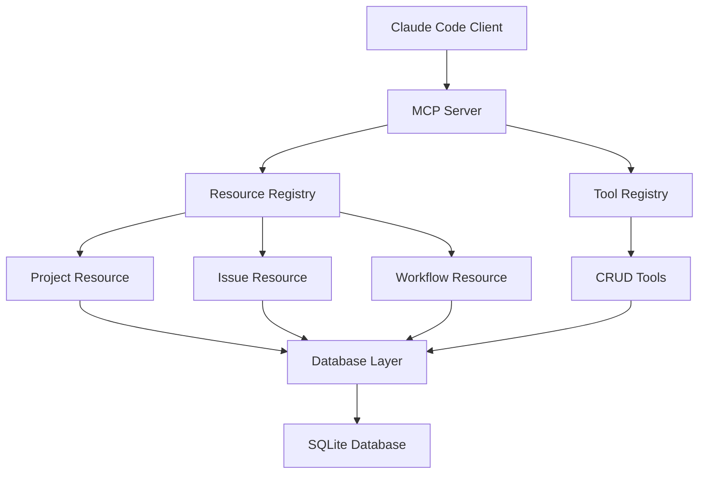

# Technical Design: SPI-290 MCP Resource Integration for Context Provision

## Overview

This document provides comprehensive technical specifications for implementing Epic SPI-290: "MCP Resource Integration for Context Provision". The implementation builds upon the completed MCP Server Foundation (SPI-354) to provide basic CRUD operations and cross-session state persistence through MCP Resources.

**Design Principles:**
- **Context Provision Over Automation**: Focus on exposing project data, not complex orchestration
- **Simple CRUD Operations**: Basic create, read, update, delete functionality
- **Cross-Session Continuity**: Persistent state management for development workflow
- **MCP Resources Pattern**: Expose data through structured MCP resource endpoints

## Architecture Overview

### High-Level Component Structure



### Core Components

1. **Resource Registry**: Central registry for MCP Resources
2. **Resource Implementations**: Specific resources for Projects, Issues, Workflows
3. **Tool Registry**: CRUD operation tools
4. **Data Access Layer**: Database abstraction with validation
5. **State Manager**: Cross-session state persistence

## Database Schema Extensions

### New Tables Required

```sql
-- Resource metadata tracking
CREATE TABLE IF NOT EXISTS resource_metadata (
    id TEXT PRIMARY KEY DEFAULT (lower(hex(randomblob(16)))),
    resource_type TEXT NOT NULL,
    resource_id TEXT NOT NULL,
    last_accessed INTEGER NOT NULL DEFAULT (unixepoch()),
    access_count INTEGER NOT NULL DEFAULT 0,
    metadata_json TEXT,
    created_at INTEGER NOT NULL DEFAULT (unixepoch()),
    updated_at INTEGER NOT NULL DEFAULT (unixepoch()),
    UNIQUE(resource_type, resource_id)
);

-- Session state tracking
CREATE TABLE IF NOT EXISTS session_states (
    id TEXT PRIMARY KEY DEFAULT (lower(hex(randomblob(16)))),
    session_key TEXT UNIQUE NOT NULL,
    project_id TEXT,
    current_context TEXT, -- JSON blob
    last_activity INTEGER NOT NULL DEFAULT (unixepoch()),
    created_at INTEGER NOT NULL DEFAULT (unixepoch()),
    updated_at INTEGER NOT NULL DEFAULT (unixepoch()),
    FOREIGN KEY (project_id) REFERENCES projects(id)
);

-- Resource access logs for debugging
CREATE TABLE IF NOT EXISTS resource_access_logs (
    id TEXT PRIMARY KEY DEFAULT (lower(hex(randomblob(16)))),
    session_key TEXT,
    resource_uri TEXT NOT NULL,
    operation TEXT NOT NULL, -- 'read', 'list', 'create', 'update', 'delete'
    success BOOLEAN NOT NULL DEFAULT true,
    error_message TEXT,
    timestamp INTEGER NOT NULL DEFAULT (unixepoch())
);
```

## Story Implementation Specifications

### SPI-344: Basic MCP Resource Implementation

**Objective**: Implement core MCP Resource infrastructure with Project and Issue resources.

#### Subtask Breakdown:

**SPI-344-1: Create Resource Registry Infrastructure** (3 points)
- Implement `ResourceRegistry` class
- Add resource registration and discovery
- Create base `Resource` abstract class

```typescript
// src/mcp/resources/registry.ts
export interface ResourceDescriptor {
  type: string;
  name: string;
  description: string;
  mimeType?: string;
  handler: ResourceHandler;
}

export abstract class BaseResource {
  abstract type: string;
  abstract name: string;
  abstract description: string;
  
  abstract list(cursor?: string, limit?: number): Promise<ResourceListResult>;
  abstract read(uri: string): Promise<ResourceContent>;
  
  protected validateUri(uri: string): boolean {
    return uri.startsWith(`${this.type}://`);
  }
}

export class ResourceRegistry {
  private resources = new Map<string, ResourceDescriptor>();
  
  register(resource: ResourceDescriptor): void;
  unregister(type: string): void;
  list(): ResourceDescriptor[];
  get(type: string): ResourceDescriptor | undefined;
}
```

**SPI-344-2: Implement Project Resource** (5 points)
- Create `ProjectResource` class extending `BaseResource`
- Implement list/read operations for projects
- Add project metadata exposure

```typescript
// src/mcp/resources/project.ts
export class ProjectResource extends BaseResource {
  type = 'project';
  name = 'JCVD Projects';
  description = 'Access to project information and metadata';
  
  async list(cursor?: string, limit = 50): Promise<ResourceListResult> {
    // Implementation: Query projects table with pagination
    // Return: Project URIs and basic metadata
  }
  
  async read(uri: string): Promise<ResourceContent> {
    // URI format: project://PROJECT_ID
    // Return: Complete project data with related issues count
  }
  
  private parseProjectUri(uri: string): string {
    // Extract project ID from URI
  }
}
```

**SPI-344-3: Implement Issue Resource** (5 points)
- Create `IssueResource` class extending `BaseResource`
- Implement list/read operations for issues
- Add filtering by project and status

```typescript
// src/mcp/resources/issue.ts
export class IssueResource extends BaseResource {
  type = 'issue';
  name = 'JCVD Issues';
  description = 'Access to issue tracking data';
  
  async list(cursor?: string, limit = 50): Promise<ResourceListResult> {
    // Support query parameters: ?project=ID&status=STATUS
    // Return: Issue URIs with metadata
  }
  
  async read(uri: string): Promise<ResourceContent> {
    // URI format: issue://ISSUE_ID
    // Return: Complete issue data with relationships
  }
  
  private buildIssueUri(issueId: string): string;
  private parseIssueUri(uri: string): string;
}
```

**SPI-344-4: Integrate Resources with MCP Server** (2 points)
- Register resources in main MCP server
- Add resource handlers to server configuration
- Update server initialization

### SPI-345: Simple CRUD Operations for Issues

**Objective**: Implement MCP Tools for basic issue management operations.

#### Subtask Breakdown:

**SPI-345-1: Create Tool Registry Infrastructure** (3 points)
- Implement `ToolRegistry` class
- Add tool registration and validation
- Create base `Tool` abstract class

```typescript
// src/mcp/tools/registry.ts
export interface ToolDescriptor {
  name: string;
  description: string;
  inputSchema: object;
  handler: ToolHandler;
}

export abstract class BaseTool {
  abstract name: string;
  abstract description: string;
  abstract inputSchema: object;
  
  abstract execute(arguments: unknown): Promise<ToolResult>;
  
  protected validateInput(input: unknown): boolean {
    // JSON schema validation against inputSchema
  }
}
```

**SPI-345-2: Implement Issue Creation Tool** (5 points)
- Create `CreateIssueTool` class
- Add input validation for issue creation
- Integrate with database layer

```typescript
// src/mcp/tools/issue-create.ts
export class CreateIssueTool extends BaseTool {
  name = 'jcvd_create_issue';
  description = 'Create a new issue in the project';
  inputSchema = {
    type: 'object',
    properties: {
      title: { type: 'string', minLength: 1 },
      description: { type: 'string' },
      projectId: { type: 'string' },
      priority: { type: 'string', enum: ['low', 'medium', 'high', 'critical'] },
      estimatePoints: { type: 'number', minimum: 0 }
    },
    required: ['title', 'projectId']
  };
  
  async execute(args: CreateIssueArgs): Promise<ToolResult> {
    // Validation, creation, and response
  }
}
```

**SPI-345-3: Implement Issue Update Tool** (5 points)
- Create `UpdateIssueTool` class
- Support partial updates with validation
- Handle status transitions

**SPI-345-4: Implement Issue Query Tool** (3 points)
- Create `QueryIssuesTool` class
- Support filtering and sorting
- Return structured results

**SPI-345-5: Add Error Handling and Validation** (2 points)
- Implement comprehensive error handling
- Add input validation helpers
- Create error response formatting

### SPI-346: Cross-Session State Persistence

**Objective**: Implement session state management for development continuity.

#### Subtask Breakdown:

**SPI-346-1: Create Session Manager** (5 points)
- Implement `SessionManager` class
- Add session creation and retrieval
- Handle session expiration

```typescript
// src/mcp/session/manager.ts
export interface SessionState {
  sessionKey: string;
  projectId?: string;
  currentContext: {
    activeIssues?: string[];
    workflowStage?: string;
    lastAction?: string;
    contextData?: Record<string, unknown>;
  };
  lastActivity: Date;
}

export class SessionManager {
  async createSession(projectId?: string): Promise<string>;
  async getSession(sessionKey: string): Promise<SessionState | null>;
  async updateSession(sessionKey: string, context: Partial<SessionState['currentContext']>): Promise<void>;
  async expireSessions(olderThan: Date): Promise<number>;
  
  private generateSessionKey(): string;
  private isExpired(session: SessionState): boolean;
}
```

**SPI-346-2: Implement State Persistence Tool** (3 points)
- Create `SaveStateTool` for manual state saving
- Add automatic state detection
- Integrate with session manager

**SPI-346-3: Implement State Recovery Tool** (3 points)
- Create `RecoverStateTool` for session restoration
- Add context reconstruction logic
- Handle corrupted state gracefully

**SPI-346-4: Add Session Cleanup Service** (2 points)
- Implement background cleanup for expired sessions
- Add configurable retention policies
- Create cleanup scheduling

### SPI-347: Basic Project Context APIs

**Objective**: Expose project context through MCP Resources and Tools.

#### Subtask Breakdown:

**SPI-347-1: Create Project Context Resource** (5 points)
- Implement `ProjectContextResource` class
- Aggregate project metadata, issues, and workflows
- Support context filtering and scoping

```typescript
// src/mcp/resources/project-context.ts
export class ProjectContextResource extends BaseResource {
  type = 'project-context';
  name = 'Project Context';
  description = 'Aggregated project context information';
  
  async read(uri: string): Promise<ResourceContent> {
    // URI format: project-context://PROJECT_ID?scope=SCOPE
    // Scopes: 'summary', 'issues', 'workflows', 'full'
    // Return: Contextualized project data
  }
  
  private async buildProjectContext(projectId: string, scope: string): Promise<ProjectContext>;
}
```

**SPI-347-2: Implement Context Query Tool** (3 points)
- Create `QueryContextTool` for flexible context queries
- Support filtering by entity types and relationships
- Add context summarization

**SPI-347-3: Add Project Structure Tool** (3 points)
- Create `GetProjectStructureTool` 
- Expose project hierarchy and relationships
- Support different view formats (tree, flat, graph)

**SPI-347-4: Implement Context Export Tool** (2 points)
- Create `ExportContextTool` for data export
- Support multiple formats (JSON, YAML, Markdown)
- Add filtering and transformation options

### SPI-348: Simple Data Export and Query Operations

**Objective**: Provide flexible data access through query and export tools.

#### Subtask Breakdown:

**SPI-348-1: Create Query Builder Infrastructure** (5 points)
- Implement `QueryBuilder` class for safe SQL generation
- Add parameter validation and sanitization
- Support common query patterns

```typescript
// src/mcp/query/builder.ts
export class QueryBuilder {
  private table: string;
  private selectFields: string[] = ['*'];
  private whereConditions: WhereCondition[] = [];
  private orderBy: OrderByClause[] = [];
  private limitValue?: number;
  private offsetValue?: number;
  
  select(fields: string[]): QueryBuilder;
  where(field: string, operator: string, value: unknown): QueryBuilder;
  orderBy(field: string, direction: 'ASC' | 'DESC'): QueryBuilder;
  limit(count: number): QueryBuilder;
  offset(count: number): QueryBuilder;
  
  build(): { sql: string; parameters: unknown[] };
  
  private validateField(field: string): boolean;
  private sanitizeValue(value: unknown): unknown;
}
```

**SPI-348-2: Implement Generic Query Tool** (5 points)
- Create `QueryDataTool` for flexible data queries
- Add safety constraints and query validation
- Support joins for related data

**SPI-348-3: Create Export Tool** (3 points)
- Implement `ExportDataTool` for data export
- Support multiple output formats
- Add batch processing for large datasets

**SPI-348-4: Add Data Validation and Security** (2 points)
- Implement query safety validation
- Add access control for sensitive data
- Create audit logging for data access

## Error Handling Strategy

### Error Categories

1. **Validation Errors**: Input validation failures
2. **Database Errors**: SQLite operation failures
3. **Resource Errors**: Resource not found or access denied
4. **Session Errors**: Invalid or expired sessions
5. **System Errors**: Unexpected system failures

### Error Response Format

```typescript
export interface MCPError {
  code: string;
  message: string;
  details?: Record<string, unknown>;
  timestamp: string;
}

export enum ErrorCodes {
  VALIDATION_ERROR = 'VALIDATION_ERROR',
  RESOURCE_NOT_FOUND = 'RESOURCE_NOT_FOUND',
  DATABASE_ERROR = 'DATABASE_ERROR',
  SESSION_EXPIRED = 'SESSION_EXPIRED',
  UNAUTHORIZED = 'UNAUTHORIZED',
  INTERNAL_ERROR = 'INTERNAL_ERROR'
}
```

## Testing Strategy

### Unit Tests Required

1. **Resource Tests**: Each resource implementation
2. **Tool Tests**: Each tool with various input scenarios
3. **Session Tests**: Session management operations
4. **Query Tests**: Query builder and validation
5. **Error Tests**: Error handling scenarios

### Integration Tests Required

1. **MCP Server Integration**: Full server resource/tool flow
2. **Database Integration**: End-to-end data operations
3. **Session Flow**: Cross-session state persistence
4. **Error Propagation**: Error handling through MCP layer

## Performance Considerations

### Optimization Targets

1. **Resource Listing**: Pagination and caching for large datasets
2. **Query Performance**: Indexed queries and query optimization
3. **Session Management**: Efficient state serialization
4. **Memory Usage**: Streaming for large exports

### Caching Strategy

```typescript
// Simple in-memory cache with TTL
export class ResourceCache {
  private cache = new Map<string, CacheEntry>();
  
  get(key: string): unknown | null;
  set(key: string, value: unknown, ttlMs: number): void;
  invalidate(pattern: string): void;
  cleanup(): void; // Remove expired entries
}
```

## Migration Requirements

### Database Migration Strategy

JCVD uses a **simple, linear migration approach** that aligns with the "simplicity first" architectural principle. Migrations are just SQL DDL statements executed in order.

#### Migration Structure

```typescript
// src/database/migrations.ts
export interface Migration {
  version: string;
  description: string;
  sql: string;
}

export const migrations: Migration[] = [
  {
    version: '001',
    description: 'Add resource metadata tracking',
    sql: `
      CREATE TABLE IF NOT EXISTS resource_metadata (
        id TEXT PRIMARY KEY DEFAULT (lower(hex(randomblob(16)))),
        resource_type TEXT NOT NULL,
        resource_id TEXT NOT NULL,
        last_accessed INTEGER NOT NULL DEFAULT (unixepoch()),
        access_count INTEGER NOT NULL DEFAULT 0,
        metadata_json TEXT,
        created_at INTEGER NOT NULL DEFAULT (unixepoch()),
        updated_at INTEGER NOT NULL DEFAULT (unixepoch()),
        UNIQUE(resource_type, resource_id)
      );
    `
  },
  {
    version: '002',
    description: 'Add session state tracking',
    sql: `
      CREATE TABLE IF NOT EXISTS session_states (
        id TEXT PRIMARY KEY DEFAULT (lower(hex(randomblob(16)))),
        session_key TEXT UNIQUE NOT NULL,
        project_id TEXT,
        current_context TEXT,
        last_activity INTEGER NOT NULL DEFAULT (unixepoch()),
        created_at INTEGER NOT NULL DEFAULT (unixepoch()),
        updated_at INTEGER NOT NULL DEFAULT (unixepoch()),
        FOREIGN KEY (project_id) REFERENCES projects(id)
      );
    `
  },
  {
    version: '003', 
    description: 'Add resource access logging',
    sql: `
      CREATE TABLE IF NOT EXISTS resource_access_logs (
        id TEXT PRIMARY KEY DEFAULT (lower(hex(randomblob(16)))),
        session_key TEXT,
        resource_uri TEXT NOT NULL,
        operation TEXT NOT NULL,
        success BOOLEAN NOT NULL DEFAULT true,
        error_message TEXT,
        timestamp INTEGER NOT NULL DEFAULT (unixepoch())
      );
    `
  },
  {
    version: '004',
    description: 'Add performance indexes', 
    sql: `
      CREATE INDEX IF NOT EXISTS idx_resource_metadata_type 
        ON resource_metadata(resource_type);
      CREATE INDEX IF NOT EXISTS idx_resource_metadata_access 
        ON resource_metadata(last_accessed);
      CREATE INDEX IF NOT EXISTS idx_session_states_key 
        ON session_states(session_key);
      CREATE INDEX IF NOT EXISTS idx_session_states_activity 
        ON session_states(last_activity);
      CREATE INDEX IF NOT EXISTS idx_resource_logs_uri 
        ON resource_access_logs(resource_uri);
      CREATE INDEX IF NOT EXISTS idx_resource_logs_timestamp 
        ON resource_access_logs(timestamp);
    `
  }
];
```

#### Migration Runner Implementation

```typescript
// src/database/migration-runner.ts
export class MigrationRunner {
  private db: Database.Database;
  
  constructor(db: Database.Database) {
    this.db = db;
    this.initializeMigrationTable();
  }
  
  private initializeMigrationTable(): void {
    this.db.exec(`
      CREATE TABLE IF NOT EXISTS schema_migrations (
        version TEXT PRIMARY KEY,
        description TEXT NOT NULL,
        applied_at INTEGER NOT NULL DEFAULT (unixepoch())
      );
    `);
  }
  
  async runMigrations(): Promise<void> {
    const appliedMigrations = this.getAppliedMigrations();
    const pendingMigrations = migrations.filter(
      migration => !appliedMigrations.has(migration.version)
    );
    
    for (const migration of pendingMigrations) {
      console.log(`Applying migration ${migration.version}: ${migration.description}`);
      
      try {
        this.db.exec(migration.sql);
        this.recordMigration(migration);
        console.log(`✅ Migration ${migration.version} completed`);
      } catch (error) {
        console.error(`❌ Migration ${migration.version} failed:`, error);
        throw error;
      }
    }
  }
  
  private getAppliedMigrations(): Set<string> {
    const stmt = this.db.prepare('SELECT version FROM schema_migrations');
    const rows = stmt.all() as { version: string }[];
    return new Set(rows.map(row => row.version));
  }
  
  private recordMigration(migration: Migration): void {
    const stmt = this.db.prepare(`
      INSERT INTO schema_migrations (version, description) 
      VALUES (?, ?)
    `);
    stmt.run(migration.version, migration.description);
  }
}
```

#### Integration with SqliteStore

```typescript
// Updated src/sqlite-store.ts initialization
export class SqliteStore {
  private db: Database.Database;
  private migrationRunner: MigrationRunner;
  
  constructor(dbPath: string = 'jcvd.db') {
    this.db = new Database(dbPath);
    this.migrationRunner = new MigrationRunner(this.db);
    this.initialize();
  }
  
  private async initialize(): Promise<void> {
    // Run any pending migrations first
    await this.migrationRunner.runMigrations();
    
    // Then ensure core tables exist (for compatibility)
    this.ensureCoreTables();
  }
  
  private ensureCoreTables(): void {
    // Basic tables that existed before migration system
    this.db.exec(`
      CREATE TABLE IF NOT EXISTS projects (
        id TEXT PRIMARY KEY,
        name TEXT NOT NULL,
        description TEXT,
        path TEXT,
        status TEXT,
        created_at TEXT,
        updated_at TEXT
      );
      
      CREATE TABLE IF NOT EXISTS issues (
        id TEXT PRIMARY KEY,
        project_id TEXT NOT NULL,
        title TEXT NOT NULL,
        description TEXT,
        status TEXT,
        priority TEXT,
        created_at TEXT,
        updated_at TEXT,
        assignee TEXT,
        labels TEXT,
        FOREIGN KEY (project_id) REFERENCES projects(id)
      );
    `);
  }
}
```

### Migration Principles

**✅ Simple & Linear**
- **Sequential execution**: Migrations run in version order (001, 002, 003...)
- **Idempotent operations**: Use `IF NOT EXISTS` and `IF NOT EXISTS` patterns
- **No rollbacks**: Forward-only migrations (align with simplicity principle)

**✅ Minimal Complexity**
- **Pure SQL DDL**: No complex data transformations or business logic
- **No external dependencies**: Migrations are just SQL strings
- **No branching**: Linear sequence without conditional logic

**✅ Error Handling**
- **Fail fast**: Stop on first migration error
- **Clear logging**: Console output for migration progress and errors
- **Transaction safety**: Each migration runs in isolation

### Migration Lifecycle

1. **Development**: Add new migration to `migrations` array
2. **Testing**: Verify migration runs cleanly on test databases
3. **Deployment**: Migrations run automatically on `SqliteStore` initialization
4. **Production**: Applied migrations tracked in `schema_migrations` table

This approach provides **database evolution** while maintaining JCVD's core principle of simplicity over complexity.

### Configuration Updates

Update `src/config/default.ts` to include:

```typescript
export const mcpConfig = {
  resources: {
    enableCaching: true,
    cacheTimeoutMs: 300000, // 5 minutes
    maxCacheSize: 1000
  },
  sessions: {
    defaultTimeoutMs: 3600000, // 1 hour
    cleanupIntervalMs: 1800000, // 30 minutes
    maxSessions: 100
  },
  tools: {
    maxQueryResults: 1000,
    enableQueryLogging: true
  }
};
```

## Security Considerations

### Access Control

1. **Resource Access**: No sensitive data exposure
2. **Query Limits**: Prevent resource exhaustion
3. **Input Validation**: SQL injection prevention
4. **Session Security**: Secure session key generation

### Data Protection

1. **Sensitive Data**: No credentials or secrets in resources
2. **Query Safety**: Whitelist-based field access
3. **Export Limits**: Size and frequency restrictions
4. **Audit Logging**: Track data access patterns

## Implementation Priority

### Phase 1 (Critical Path)
1. SPI-344: Basic MCP Resource Implementation
2. SPI-346: Cross-Session State Persistence

### Phase 2 (Core Functionality)  
3. SPI-345: Simple CRUD Operations for Issues
4. SPI-347: Basic Project Context APIs

### Phase 3 (Enhanced Features)
5. SPI-348: Simple Data Export and Query Operations

## Success Criteria

### Functional Requirements
- [ ] All MCP Resources accessible via Claude Code
- [ ] CRUD operations working for issues
- [ ] Cross-session state persistence functional
- [ ] Project context exposed through resources
- [ ] Data export/query tools operational

### Non-Functional Requirements
- [ ] Resource responses < 500ms for typical queries
- [ ] Session state restored within 100ms
- [ ] No data corruption or loss
- [ ] Graceful error handling
- [ ] Comprehensive test coverage > 80%

## Conclusion

This technical design provides comprehensive specifications for implementing Epic SPI-290. Each story has clear subtasks with complexity estimates, detailed interface specifications, and implementation guidance. The design maintains architectural alignment while providing the Developer agent with concrete, actionable implementation tasks.

The implementation follows the principle of "Context Provision Over Automation" by focusing on data access and basic CRUD operations rather than complex orchestration or analysis features.