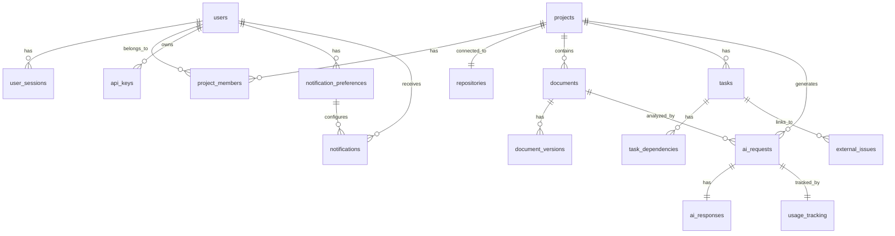

# Core Database Schema - Technical Design

**Issue**: SPI-11  
**Created**: 2025-01-04  
**Status**: Design Phase  
**Assignee**: Development Team  

## 1. Overview

This document outlines the technical design for CycleTime's core database schema using PostgreSQL 17 and Prisma ORM. The schema supports intelligent project orchestration, AI-powered document generation, and repository-centric development workflows.

## 2. Goals & Requirements

### 2.1 Primary Goals
- **Scalable Data Model**: Support for thousands of projects and users
- **AI Integration Ready**: Store AI requests, responses, and usage tracking
- **Repository-Centric**: Git repository as the source of truth for documentation
- **Audit Trail**: Complete history of changes and AI interactions
- **Performance Optimized**: Efficient queries for real-time operations

### 2.2 Functional Requirements
- User management with GitHub OAuth integration
- Project lifecycle management with repository connections
- Document storage, versioning, and AI analysis tracking
- Task breakdown and Linear/GitHub issue integration
- AI request logging and cost tracking
- Notification and preference management

### 2.3 Non-Functional Requirements
- **Performance**: Sub-100ms queries for common operations
- **Scalability**: Support 10,000+ projects, 1M+ AI requests
- **Data Integrity**: Foreign key constraints and validation
- **Backup**: Point-in-time recovery capability
- **Security**: Row-level security and audit logging

## 3. Technology Stack

### 3.1 Database Technology
- **Primary Database**: PostgreSQL 17-alpine
- **ORM**: Prisma 5.x with TypeScript
- **Migration System**: Prisma migrate
- **Connection Pooling**: PgBouncer (future)
- **Backup**: pg_dump with continuous WAL archiving

### 3.2 Technology Selection Rationale

#### 3.2.1 PostgreSQL 17 Selection
**Why PostgreSQL over alternatives (MySQL, MongoDB, etc.)?**

- **ACID Compliance**: Critical for financial data (AI usage costs) and audit trails
- **Advanced JSON Support**: Native JSONB for flexible metadata without sacrificing performance
- **Full-Text Search**: Built-in FTS capabilities eliminate need for separate search infrastructure
- **UUID Support**: Native UUID type with optimal indexing for distributed systems
- **Extensibility**: Rich ecosystem of extensions (uuid-ossp, pg_trgm for fuzzy search)
- **Mature Ecosystem**: 30+ years of development, battle-tested in production environments
- **Row-Level Security**: Built-in multi-tenant data isolation without application-level complexity
- **Advanced Indexing**: GIN, GiST indexes for complex queries on JSONB and arrays
- **Streaming Replication**: Built-in high availability and read scaling capabilities
- **Version 17 Benefits**: Improved performance, better JSONB operations, enhanced security features

**PostgreSQL vs. Alternatives:**
- **vs MySQL**: Superior JSON support, better complex query performance, more advanced features
- **vs MongoDB**: ACID guarantees, better consistency, SQL familiarity, mature tooling
- **vs SQLite**: Multi-user concurrency, better scalability, advanced features
- **vs Cloud Databases**: Cost control, data sovereignty, consistent performance

#### 3.2.2 Prisma ORM Selection
**Why Prisma over alternatives (TypeORM, Sequelize, Drizzle)?**

- **Type Safety**: Generate TypeScript types from schema, eliminating runtime type errors
- **Developer Experience**: Intuitive API with excellent IntelliSense and auto-completion
- **Migration System**: Robust, reversible migrations with automatic diff generation
- **Query Performance**: Optimized query generation with automatic JOIN optimization
- **Schema-First Approach**: Single source of truth for database structure
- **Modern Architecture**: Built for modern Node.js with async/await throughout
- **Introspection**: Can generate schema from existing databases for gradual adoption
- **Database Agnostic**: Easy switching between PostgreSQL, MySQL, SQLite in development
- **Active Development**: Rapidly evolving with strong community and commercial backing
- **Prisma Studio**: Built-in database GUI for development and debugging

**Prisma vs. Alternatives:**
- **vs TypeORM**: Better TypeScript integration, simpler syntax, more reliable migrations
- **vs Sequelize**: Modern architecture, better performance, superior TypeScript support
- **vs Drizzle**: More mature ecosystem, better tooling, established migration patterns
- **vs Raw SQL**: Type safety, reduced boilerplate, automatic query optimization

#### 3.2.3 PgBouncer Selection
**Why PgBouncer for connection pooling?**

- **Lightweight**: Minimal memory footprint (<10MB) compared to application-level pooling
- **Battle-Tested**: Industry standard used by major platforms (Heroku, DigitalOcean, etc.)
- **Connection Modes**: Session, transaction, and statement-level pooling options
- **PostgreSQL Optimized**: Built specifically for PostgreSQL, understands protocol nuances
- **Transparent**: Zero application code changes required
- **Monitoring**: Built-in statistics and monitoring capabilities
- **High Performance**: Written in C, minimal overhead compared to Node.js pools
- **Production Ready**: Handles thousands of concurrent connections efficiently
- **Auth Support**: Multiple authentication methods including SCRAM-SHA-256
- **Load Balancing**: Can distribute connections across multiple PostgreSQL instances

**PgBouncer vs. Alternatives:**
- **vs pgpool-II**: Simpler configuration, better performance for connection pooling use case
- **vs Application-level pools**: Better resource utilization, reduced memory usage per connection
- **vs Cloud poolers**: Cost control, consistent performance, no vendor lock-in
- **vs HAProxy**: PostgreSQL-specific features, protocol awareness, simpler setup

### 3.3 Architecture Justification

This technology stack provides:

1. **Performance**: PostgreSQL + PgBouncer handle 10,000+ concurrent connections efficiently
2. **Developer Productivity**: Prisma eliminates 80% of database boilerplate code
3. **Type Safety**: End-to-end TypeScript integration prevents runtime database errors
4. **Scalability**: Connection pooling and query optimization support high-load scenarios
5. **Maintainability**: Schema-driven development with automatic migrations
6. **Cost Efficiency**: Open-source stack with predictable operational costs
7. **Future-Proof**: Modern tools with active development and strong ecosystems

### 3.2 Data Types Strategy
- **UUID**: Primary keys for all entities (uuid-ossp extension)
- **JSONB**: Flexible metadata storage
- **Timestamps**: UTC timestamps with timezone support
- **Enums**: Type-safe status and role definitions
- **Full-text Search**: PostgreSQL built-in search capabilities

## 4. Database Schema Design

### 4.1 Core Domain Model



### 4.2 Entity Specifications

#### 4.2.1 Users & Authentication

```prisma
model User {
  id              String    @id @default(uuid()) @db.Uuid
  email           String    @unique
  github_id       Int       @unique
  github_username String    @unique
  name            String
  avatar_url      String?
  bio             String?
  company         String?
  location        String?
  
  // Preferences
  timezone        String    @default("UTC")
  locale          String    @default("en")
  
  // Metadata
  first_login_at  DateTime?
  last_login_at   DateTime?
  is_active       Boolean   @default(true)
  
  // Timestamps
  created_at      DateTime  @default(now())
  updated_at      DateTime  @updatedAt
  
  // Relations
  project_members ProjectMember[]
  api_keys        ApiKey[]
  user_sessions   UserSession[]
  notifications   Notification[]
  notification_preferences NotificationPreference[]
  ai_requests     AiRequest[]
  
  @@map("users")
}

model UserSession {
  id           String   @id @default(uuid()) @db.Uuid
  user_id      String   @db.Uuid
  session_id   String   @unique
  access_token String
  refresh_token String?
  expires_at   DateTime
  ip_address   String?
  user_agent   String?
  
  created_at   DateTime @default(now())
  updated_at   DateTime @updatedAt
  
  user User @relation(fields: [user_id], references: [id], onDelete: Cascade)
  
  @@map("user_sessions")
}

model ApiKey {
  id          String      @id @default(uuid()) @db.Uuid
  user_id     String      @db.Uuid
  name        String
  key_hash    String      @unique
  permissions Json        @default("[]")
  
  last_used_at DateTime?
  expires_at   DateTime?
  is_active    Boolean     @default(true)
  
  created_at   DateTime    @default(now())
  updated_at   DateTime    @updatedAt
  
  user User @relation(fields: [user_id], references: [id], onDelete: Cascade)
  
  @@map("api_keys")
}
```

#### 4.2.2 Projects & Repositories

```prisma
enum ProjectStatus {
  DRAFT
  ACTIVE
  PAUSED
  COMPLETED
  ARCHIVED
}

enum MemberRole {
  OWNER
  ADMIN
  MEMBER
  VIEWER
}

model Project {
  id           String        @id @default(uuid()) @db.Uuid
  name         String
  description  String?
  status       ProjectStatus @default(DRAFT)
  
  // Repository connection
  repository_id String?      @unique @db.Uuid
  
  // Project settings
  settings     Json          @default("{}")
  
  // AI Configuration
  ai_model     String        @default("claude-4-sonnet")
  ai_budget    Decimal?      @db.Decimal(10, 2)
  
  // Timestamps
  created_at   DateTime      @default(now())
  updated_at   DateTime      @updatedAt
  
  // Relations
  repository   Repository?   @relation(fields: [repository_id], references: [id])
  members      ProjectMember[]
  documents    Document[]
  tasks        Task[]
  ai_requests  AiRequest[]
  
  @@map("projects")
}

model ProjectMember {
  id         String     @id @default(uuid()) @db.Uuid
  project_id String     @db.Uuid
  user_id    String     @db.Uuid
  role       MemberRole @default(MEMBER)
  
  joined_at  DateTime   @default(now())
  created_at DateTime   @default(now())
  updated_at DateTime   @updatedAt
  
  project Project @relation(fields: [project_id], references: [id], onDelete: Cascade)
  user    User    @relation(fields: [user_id], references: [id], onDelete: Cascade)
  
  @@unique([project_id, user_id])
  @@map("project_members")
}

model Repository {
  id            String  @id @default(uuid()) @db.Uuid
  github_id     Int     @unique
  full_name     String  @unique
  name          String
  owner         String
  description   String?
  
  // Repository details
  clone_url     String
  ssh_url       String
  default_branch String @default("main")
  is_private     Boolean @default(false)
  
  // Webhook configuration
  webhook_id     Int?
  webhook_secret String?
  
  // Sync status
  last_sync_at   DateTime?
  sync_status    String?   @default("pending")
  
  // Timestamps
  created_at     DateTime  @default(now())
  updated_at     DateTime  @updatedAt
  
  // Relations
  project Project?
  
  @@map("repositories")
}
```

#### 4.2.3 Documents & Versioning

```prisma
enum DocumentType {
  PRD
  PROJECT_PLAN
  MILESTONES
  ARCHITECTURE
  TECHNICAL_DESIGN
  README
  OTHER
}

enum DocumentStatus {
  DRAFT
  UNDER_REVIEW
  APPROVED
  PUBLISHED
  ARCHIVED
}

model Document {
  id           String         @id @default(uuid()) @db.Uuid
  project_id   String         @db.Uuid
  title        String
  filename     String
  file_path    String
  document_type DocumentType
  status       DocumentStatus @default(DRAFT)
  
  // Content metadata
  word_count   Int?
  char_count   Int?
  frontmatter  Json?
  
  // AI Analysis
  analysis_status String?     @default("pending")
  analysis_summary String?
  
  // Timestamps
  created_at   DateTime      @default(now())
  updated_at   DateTime      @updatedAt
  
  // Relations
  project     Project           @relation(fields: [project_id], references: [id], onDelete: Cascade)
  versions    DocumentVersion[]
  ai_requests AiRequest[]
  
  @@unique([project_id, file_path])
  @@map("documents")
}

model DocumentVersion {
  id          String   @id @default(uuid()) @db.Uuid
  document_id String   @db.Uuid
  version     Int
  
  // Content
  content     String
  content_hash String  @unique
  
  // Git information
  commit_sha  String?
  commit_message String?
  author_name String?
  author_email String?
  
  // Changes
  diff_stats  Json?
  change_summary String?
  
  // Timestamps
  created_at  DateTime @default(now())
  
  // Relations
  document Document @relation(fields: [document_id], references: [id], onDelete: Cascade)
  
  @@unique([document_id, version])
  @@map("document_versions")
}
```

#### 4.2.4 Tasks & External Integration

```prisma
enum TaskStatus {
  TODO
  IN_PROGRESS
  IN_REVIEW
  DONE
  CANCELLED
}

enum TaskPriority {
  LOW
  MEDIUM
  HIGH
  URGENT
}

enum ExternalIssueProvider {
  LINEAR
  GITHUB
  JIRA
}

model Task {
  id          String       @id @default(uuid()) @db.Uuid
  project_id  String       @db.Uuid
  title       String
  description String?
  status      TaskStatus   @default(TODO)
  priority    TaskPriority @default(MEDIUM)
  
  // Effort estimation
  estimated_hours Decimal? @db.Decimal(5, 2)
  actual_hours    Decimal? @db.Decimal(5, 2)
  
  // Assignment
  assignee_id String?      @db.Uuid
  
  // AI Generation
  generated_by_ai Boolean  @default(false)
  ai_confidence   Decimal? @db.Decimal(3, 2)
  
  // Dates
  due_date    DateTime?
  started_at  DateTime?
  completed_at DateTime?
  
  // Timestamps
  created_at  DateTime     @default(now())
  updated_at  DateTime     @updatedAt
  
  // Relations
  project         Project            @relation(fields: [project_id], references: [id], onDelete: Cascade)
  dependencies    TaskDependency[]   @relation("DependentTask")
  dependents      TaskDependency[]   @relation("DependsOnTask")
  external_issues ExternalIssue[]
  
  @@map("tasks")
}

model TaskDependency {
  id              String @id @default(uuid()) @db.Uuid
  dependent_task_id String @db.Uuid
  depends_on_task_id String @db.Uuid
  
  created_at      DateTime @default(now())
  
  dependent_task  Task @relation("DependentTask", fields: [dependent_task_id], references: [id], onDelete: Cascade)
  depends_on_task Task @relation("DependsOnTask", fields: [depends_on_task_id], references: [id], onDelete: Cascade)
  
  @@unique([dependent_task_id, depends_on_task_id])
  @@map("task_dependencies")
}

model ExternalIssue {
  id          String                @id @default(uuid()) @db.Uuid
  task_id     String                @db.Uuid
  provider    ExternalIssueProvider
  external_id String
  url         String
  
  // Sync status
  last_sync_at DateTime?
  sync_status  String?   @default("pending")
  
  // Timestamps
  created_at   DateTime  @default(now())
  updated_at   DateTime  @updatedAt
  
  // Relations
  task Task @relation(fields: [task_id], references: [id], onDelete: Cascade)
  
  @@unique([provider, external_id])
  @@map("external_issues")
}
```

#### 4.2.5 AI Integration & Usage Tracking

```prisma
enum AiRequestType {
  PRD_ANALYSIS
  PROJECT_PLAN_GENERATION
  TASK_BREAKDOWN
  DOCUMENT_GENERATION
  CODE_REVIEW
  GENERAL_QUERY
}

enum AiRequestStatus {
  PENDING
  PROCESSING
  COMPLETED
  FAILED
  CANCELLED
}

model AiRequest {
  id           String          @id @default(uuid()) @db.Uuid
  user_id      String          @db.Uuid
  project_id   String?         @db.Uuid
  document_id  String?         @db.Uuid
  
  // Request details
  request_type AiRequestType
  status       AiRequestStatus @default(PENDING)
  model        String          @default("claude-4-sonnet")
  
  // Request content
  prompt       String
  context      Json?
  parameters   Json?
  
  // Processing
  started_at   DateTime?
  completed_at DateTime?
  error_message String?
  
  // Timestamps
  created_at   DateTime        @default(now())
  updated_at   DateTime        @updatedAt
  
  // Relations
  user        User            @relation(fields: [user_id], references: [id], onDelete: Cascade)
  project     Project?        @relation(fields: [project_id], references: [id], onDelete: Cascade)
  document    Document?       @relation(fields: [document_id], references: [id], onDelete: Cascade)
  response    AiResponse?
  usage       UsageTracking?
  
  @@map("ai_requests")
}

model AiResponse {
  id           String    @id @default(uuid()) @db.Uuid
  request_id   String    @unique @db.Uuid
  
  // Response content
  content      String
  metadata     Json?
  
  // Quality metrics
  confidence_score Decimal? @db.Decimal(3, 2)
  quality_rating   Int?     @db.SmallInt
  human_feedback   String?
  
  // Timestamps
  created_at   DateTime  @default(now())
  updated_at   DateTime  @updatedAt
  
  // Relations
  request AiRequest @relation(fields: [request_id], references: [id], onDelete: Cascade)
  
  @@map("ai_responses")
}

model UsageTracking {
  id         String @id @default(uuid()) @db.Uuid
  request_id String @unique @db.Uuid
  
  // Token usage
  input_tokens  Int
  output_tokens Int
  total_tokens  Int
  
  // Cost tracking
  cost_usd      Decimal @db.Decimal(10, 6)
  model_version String
  
  // Performance
  response_time_ms Int
  
  // Timestamps
  created_at    DateTime @default(now())
  
  // Relations
  request AiRequest @relation(fields: [request_id], references: [id], onDelete: Cascade)
  
  @@map("usage_tracking")
}
```

#### 4.2.6 Notifications & User Preferences

```prisma
enum NotificationType {
  PROJECT_CREATED
  DOCUMENT_UPDATED
  TASK_ASSIGNED
  AI_ANALYSIS_COMPLETE
  BUDGET_ALERT
  SYSTEM_NOTIFICATION
}

enum NotificationChannel {
  IN_APP
  EMAIL
  SLACK
  TEAMS
}

enum NotificationStatus {
  PENDING
  SENT
  DELIVERED
  READ
  FAILED
}

model Notification {
  id         String             @id @default(uuid()) @db.Uuid
  user_id    String             @db.Uuid
  type       NotificationType
  channel    NotificationChannel
  status     NotificationStatus @default(PENDING)
  
  // Content
  title      String
  message    String
  metadata   Json?
  
  // Links
  action_url String?
  
  // Delivery
  sent_at    DateTime?
  read_at    DateTime?
  
  // Timestamps
  created_at DateTime           @default(now())
  updated_at DateTime           @updatedAt
  
  // Relations
  user User @relation(fields: [user_id], references: [id], onDelete: Cascade)
  
  @@map("notifications")
}

model NotificationPreference {
  id         String              @id @default(uuid()) @db.Uuid
  user_id    String              @db.Uuid
  type       NotificationType
  channels   NotificationChannel[]
  
  // Settings
  is_enabled Boolean             @default(true)
  frequency  String              @default("immediate") // immediate, daily, weekly
  
  // Timestamps
  created_at DateTime            @default(now())
  updated_at DateTime            @updatedAt
  
  // Relations
  user User @relation(fields: [user_id], references: [id], onDelete: Cascade)
  
  @@unique([user_id, type])
  @@map("notification_preferences")
}
```

## 5. Indexes & Performance Optimization

### 5.1 Primary Indexes

```sql
-- User lookups
CREATE INDEX idx_users_github_id ON users(github_id);
CREATE INDEX idx_users_email ON users(email);
CREATE INDEX idx_users_active ON users(is_active) WHERE is_active = true;

-- Project queries
CREATE INDEX idx_projects_status ON projects(status);
CREATE INDEX idx_projects_created_at ON projects(created_at);
CREATE INDEX idx_project_members_user_id ON project_members(user_id);
CREATE INDEX idx_project_members_project_role ON project_members(project_id, role);

-- Document searches
CREATE INDEX idx_documents_project_type ON documents(project_id, document_type);
CREATE INDEX idx_documents_status ON documents(status);
CREATE INDEX idx_documents_updated_at ON documents(updated_at);
CREATE INDEX idx_document_versions_document ON document_versions(document_id, version DESC);

-- Task management
CREATE INDEX idx_tasks_project_status ON tasks(project_id, status);
CREATE INDEX idx_tasks_assignee ON tasks(assignee_id) WHERE assignee_id IS NOT NULL;
CREATE INDEX idx_tasks_due_date ON tasks(due_date) WHERE due_date IS NOT NULL;
CREATE INDEX idx_tasks_priority_status ON tasks(priority, status);

-- AI request analytics
CREATE INDEX idx_ai_requests_user_type ON ai_requests(user_id, request_type);
CREATE INDEX idx_ai_requests_project ON ai_requests(project_id) WHERE project_id IS NOT NULL;
CREATE INDEX idx_ai_requests_status_created ON ai_requests(status, created_at);
CREATE INDEX idx_usage_tracking_cost ON usage_tracking(cost_usd);
CREATE INDEX idx_usage_tracking_created_at ON usage_tracking(created_at);

-- Notifications
CREATE INDEX idx_notifications_user_status ON notifications(user_id, status);
CREATE INDEX idx_notifications_unread ON notifications(user_id, created_at) 
  WHERE status IN ('PENDING', 'SENT', 'DELIVERED');
```

### 5.2 Full-Text Search

```sql
-- Document content search
ALTER TABLE documents ADD COLUMN search_vector tsvector;
CREATE INDEX idx_documents_fts ON documents USING gin(search_vector);

-- Update search vector trigger
CREATE OR REPLACE FUNCTION update_document_search_vector()
RETURNS trigger AS $$
BEGIN
  NEW.search_vector := 
    setweight(to_tsvector('english', COALESCE(NEW.title, '')), 'A') ||
    setweight(to_tsvector('english', COALESCE(NEW.analysis_summary, '')), 'B');
  RETURN NEW;
END;
$$ LANGUAGE plpgsql;

CREATE TRIGGER tsvector_update_trigger
  BEFORE INSERT OR UPDATE ON documents
  FOR EACH ROW EXECUTE FUNCTION update_document_search_vector();
```

## 6. Data Migration Strategy

### 6.1 Migration System Setup

```typescript
// prisma/migrations/ structure
// 20250104000001_initial_schema/
// 20250104000002_add_search_indexes/
// 20250104000003_add_audit_triggers/

// Migration naming convention
// YYYYMMDDHHMMSS_description_of_change
```

### 6.2 Seed Data Structure

```typescript
// prisma/seed.ts
export const seedData = {
  // Default user roles and permissions
  defaultRoles: [
    { name: 'owner', permissions: ['*'] },
    { name: 'admin', permissions: ['project:*', 'task:*', 'document:*'] },
    { name: 'member', permissions: ['project:read', 'task:*', 'document:read'] },
    { name: 'viewer', permissions: ['project:read', 'task:read', 'document:read'] }
  ],
  
  // Document templates
  documentTemplates: [
    {
      type: 'PRD',
      template: '# Product Requirements Document\n\n## Overview\n...',
      schema: { /* JSON schema for validation */ }
    },
    {
      type: 'PROJECT_PLAN',
      template: '# Project Plan\n\n## Milestones\n...',
      schema: { /* JSON schema for validation */ }
    }
  ],
  
  // Notification defaults
  defaultNotificationPreferences: [
    { type: 'PROJECT_CREATED', channels: ['IN_APP', 'EMAIL'] },
    { type: 'TASK_ASSIGNED', channels: ['IN_APP', 'EMAIL'] },
    { type: 'AI_ANALYSIS_COMPLETE', channels: ['IN_APP'] }
  ]
};
```

## 7. Backup & Recovery Strategy

### 7.1 Backup Configuration

```bash
# Daily automated backups
pg_dump -h localhost -U cycletime -d cycletime_dev \
  --verbose --clean --no-owner --no-privileges \
  --format=custom --file="backup_$(date +%Y%m%d_%H%M%S).dump"

# Continuous WAL archiving for point-in-time recovery
archive_mode = on
archive_command = 'cp %p /backup/wal_archive/%f'
```

### 7.2 Recovery Procedures

```bash
# Point-in-time recovery
pg_restore --verbose --clean --no-owner --no-privileges \
  --dbname=cycletime_dev backup_20250104_120000.dump

# WAL replay for specific timestamp
pg_basebackup -h localhost -D /tmp/recovery -U cycletime
# Edit recovery.conf with target time
pg_ctl start -D /tmp/recovery
```

## 8. Security Considerations

### 8.1 Row-Level Security

```sql
-- Enable RLS on sensitive tables
ALTER TABLE projects ENABLE ROW LEVEL SECURITY;
ALTER TABLE documents ENABLE ROW LEVEL SECURITY;
ALTER TABLE ai_requests ENABLE ROW LEVEL SECURITY;

-- Project access policy
CREATE POLICY project_access_policy ON projects
  FOR ALL TO authenticated_users
  USING (id IN (
    SELECT project_id FROM project_members 
    WHERE user_id = current_user_id()
  ));

-- Document access policy  
CREATE POLICY document_access_policy ON documents
  FOR ALL TO authenticated_users
  USING (project_id IN (
    SELECT project_id FROM project_members 
    WHERE user_id = current_user_id()
  ));
```

### 8.2 Audit Logging

```sql
-- Audit log table
CREATE TABLE audit_log (
  id uuid PRIMARY KEY DEFAULT gen_random_uuid(),
  table_name text NOT NULL,
  operation text NOT NULL,
  old_values jsonb,
  new_values jsonb,
  user_id uuid,
  timestamp timestamptz DEFAULT now()
);

-- Generic audit trigger function
CREATE OR REPLACE FUNCTION audit_trigger()
RETURNS trigger AS $$
BEGIN
  INSERT INTO audit_log (table_name, operation, old_values, new_values, user_id)
  VALUES (
    TG_TABLE_NAME,
    TG_OP,
    CASE WHEN TG_OP IN ('UPDATE', 'DELETE') THEN row_to_json(OLD) END,
    CASE WHEN TG_OP IN ('INSERT', 'UPDATE') THEN row_to_json(NEW) END,
    current_user_id()
  );
  RETURN COALESCE(NEW, OLD);
END;
$$ LANGUAGE plpgsql;
```

## 9. Performance Benchmarks

### 9.1 Target Performance Metrics

| Query Type | Target Response Time | Test Load |
|------------|---------------------|-----------|
| User authentication | < 50ms | 1000 concurrent |
| Project list | < 100ms | 100 projects/user |
| Document search | < 200ms | 10,000 documents |
| AI request creation | < 100ms | 100 requests/min |
| Task list filtering | < 150ms | 1000 tasks/project |

### 9.2 Load Testing Strategy

```sql
-- Sample performance test queries
EXPLAIN ANALYZE 
SELECT p.*, pm.role FROM projects p
JOIN project_members pm ON p.id = pm.project_id
WHERE pm.user_id = $1 AND p.status = 'ACTIVE';

EXPLAIN ANALYZE
SELECT d.*, dv.content FROM documents d
JOIN document_versions dv ON d.id = dv.document_id
WHERE d.project_id = $1 AND dv.version = (
  SELECT MAX(version) FROM document_versions 
  WHERE document_id = d.id
);
```

## 10. Implementation Plan

### 10.1 Phase 1: Core Schema (Week 1)
1. **Prisma Setup**: Initialize Prisma with PostgreSQL connection
2. **Core Entities**: Implement Users, Projects, ProjectMembers, Repositories
3. **Authentication**: Add UserSessions and ApiKeys tables
4. **Basic Indexes**: Create essential performance indexes
5. **Migration System**: Set up automated migration workflow

### 10.2 Phase 2: Documents & AI (Week 1)
1. **Document Management**: Implement Documents and DocumentVersions
2. **AI Integration**: Add AiRequest, AiResponse, UsageTracking tables
3. **Full-text Search**: Configure PostgreSQL FTS for documents
4. **Seed Data**: Create development fixtures and test data

### 10.3 Phase 3: Tasks & Integration (Week 1)
1. **Task Management**: Implement Tasks, TaskDependencies, ExternalIssues
2. **Notifications**: Add Notifications and NotificationPreferences
3. **Performance Optimization**: Add remaining indexes and query optimization
4. **Security**: Implement RLS policies and audit logging

### 10.4 Phase 4: Production Ready (Week 1)
1. **Backup Strategy**: Configure automated backups and WAL archiving
2. **Monitoring**: Add query performance monitoring
3. **Connection Pooling**: Configure PgBouncer for production
4. **Load Testing**: Validate performance under expected load

## 11. Success Criteria

### 11.1 Functional Success
- [ ] All Prisma models generate without errors
- [ ] Database migrations run successfully 
- [ ] Seed data populates correctly
- [ ] Foreign key constraints are properly enforced
- [ ] Full-text search returns relevant results

### 11.2 Performance Success
- [ ] All target query response times are met
- [ ] Database can handle 1000+ concurrent connections
- [ ] Indexes provide expected query optimization
- [ ] Memory usage remains under 2GB for development

### 11.3 Security Success
- [ ] Row-level security policies prevent unauthorized access
- [ ] Audit logging captures all data modifications
- [ ] API keys are properly hashed and validated
- [ ] No sensitive data is logged in plain text

## 12. Risk Mitigation

### 12.1 Technical Risks
- **Migration Failures**: Test all migrations on data copies before production
- **Performance Issues**: Implement query monitoring from day one
- **Data Loss**: Multiple backup strategies with tested recovery procedures
- **Schema Changes**: Use Prisma migration system for safe schema evolution

### 12.2 Operational Risks
- **Backup Corruption**: Regular backup validation and multiple retention periods
- **Connection Limits**: Monitor connection usage and implement pooling early
- **Disk Space**: Automated monitoring with alerts for space consumption
- **Index Maintenance**: Regular VACUUM and REINDEX operations

---

This technical design provides a comprehensive foundation for CycleTime's data layer, supporting intelligent project orchestration while maintaining performance, security, and scalability requirements.