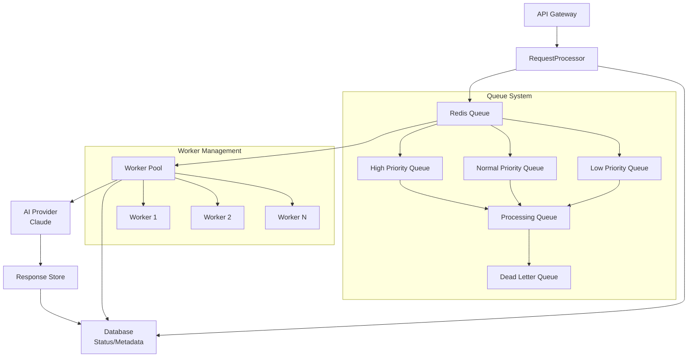
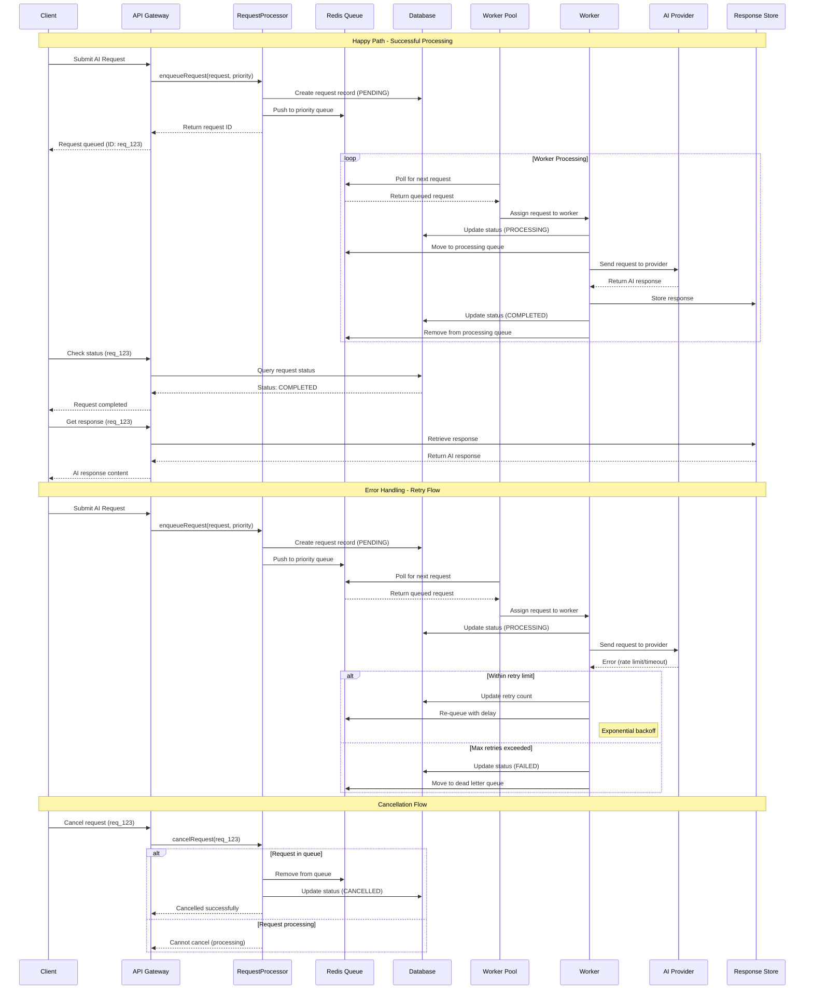

# Technical Design: Asynchronous Request Processing Engine

**Issue**: SPI-50  
**Created**: 2025-07-14  
**Status**: Design Phase  
**Complexity**: 5 Points  

## Overview

This design implements an asynchronous request processing engine that handles AI requests with proper lifecycle management, status tracking, and queue-based processing. The system ensures reliable processing of large, time-consuming AI requests while maintaining database consistency and providing comprehensive monitoring.

## Architecture

### Core Components



### Request Lifecycle States

1. **PENDING** - Request queued for processing
2. **PROCESSING** - Currently being processed by AI provider
3. **COMPLETED** - Successfully processed with results
4. **FAILED** - Processing failed, may be retryable
5. **CANCELLED** - Request cancelled by user

### Request Processing Flow



## Implementation Details

### 1. RequestProcessor Class

```typescript
export class RequestProcessor {
  private redisClient: Redis;
  private providers: Map<string, BaseAIProvider>;
  private workers: Worker[];
  private statusTracker: StatusTracker;
  
  async enqueueRequest(request: AIRequest): Promise<string>;
  async processRequest(requestId: string): Promise<AIResponse>;
  async getRequestStatus(requestId: string): Promise<RequestStatus>;
  async retryFailedRequest(requestId: string): Promise<void>;
  async cancelRequest(requestId: string): Promise<void>;
}
```

### 2. Queue Management

**Redis Queue Structure**:
```
QUEUE:priority:high     - High priority requests (PRD analysis, urgent)
QUEUE:priority:normal   - Normal priority requests
QUEUE:priority:low      - Low priority requests (background tasks)
QUEUE:processing        - Currently processing requests
QUEUE:retry             - Failed requests awaiting retry
```

**Queue Operations**:
- FIFO processing within priority levels
- Dead letter queue for permanently failed requests
- Configurable retry policies with exponential backoff
- Rate limiting to prevent API overload

### 3. Status Tracking System

**Database Schema**:
```sql
CREATE TABLE request_status (
  id UUID PRIMARY KEY,
  request_id VARCHAR(255) UNIQUE NOT NULL,
  status VARCHAR(50) NOT NULL,
  provider VARCHAR(100) NOT NULL,
  model VARCHAR(100) NOT NULL,
  priority VARCHAR(20) NOT NULL,
  created_at TIMESTAMP NOT NULL,
  updated_at TIMESTAMP NOT NULL,
  started_at TIMESTAMP,
  completed_at TIMESTAMP,
  retry_count INTEGER DEFAULT 0,
  error_message TEXT,
  metadata JSONB
);
```

**Status Operations**:
- Atomic status updates using database transactions
- Event-driven status notifications
- Historical tracking for debugging and analytics
- Metrics collection for performance monitoring

### 4. Worker Pool Management

**Worker Configuration**:
```typescript
interface WorkerConfig {
  maxConcurrentRequests: number;
  processingTimeout: number;
  retryPolicy: RetryPolicy;
  healthCheckInterval: number;
}
```

**Worker Responsibilities**:
- Pull requests from priority queues
- Execute AI provider calls with timeout handling
- Update request status atomically
- Handle provider-specific errors and retries
- Report worker health and performance metrics

### 5. Error Handling & Retry Logic

**Retry Strategy**:
```typescript
interface RetryPolicy {
  maxRetries: number;
  baseDelay: number;
  maxDelay: number;
  backoffMultiplier: number;
  retryableErrors: string[];
}
```

**Error Categories**:
- **Transient**: Network timeouts, rate limits (retryable)
- **Permanent**: Invalid API keys, malformed requests (not retryable)
- **Provider-specific**: Model capacity, content policy violations

## Configuration

### Environment Variables

```typescript
interface ProcessingConfig {
  REDIS_URL: string;
  WORKER_COUNT: number;
  MAX_CONCURRENT_REQUESTS: number;
  PROCESSING_TIMEOUT: number;
  RETRY_MAX_ATTEMPTS: number;
  RETRY_BASE_DELAY: number;
  QUEUE_POLL_INTERVAL: number;
  STATUS_UPDATE_INTERVAL: number;
}
```

### Queue Priorities

```typescript
enum QueuePriority {
  HIGH = 'high',     // PRD analysis, urgent requests
  NORMAL = 'normal', // Standard processing
  LOW = 'low'        // Background tasks, bulk operations
}
```

## Performance Considerations

### Scalability Features

1. **Horizontal Scaling**: Multiple worker instances can process queues
2. **Load Balancing**: Redis queue ensures even distribution
3. **Resource Management**: Configurable concurrency limits
4. **Memory Optimization**: Streaming for large responses

### Monitoring & Metrics

```typescript
interface ProcessingMetrics {
  queueDepth: Record<QueuePriority, number>;
  processingTime: {
    avg: number;
    p95: number;
    p99: number;
  };
  throughput: {
    requestsPerSecond: number;
    completedRequests: number;
    failedRequests: number;
  };
  workerHealth: {
    activeWorkers: number;
    healthyWorkers: number;
    processingCapacity: number;
  };
}
```

## Testing Strategy

### Unit Tests

- RequestProcessor class methods
- Queue operations and priority handling
- Status tracking and database updates
- Error handling and retry logic
- Worker lifecycle management

### Integration Tests

- End-to-end request processing flow
- Redis queue integration
- Database transaction consistency
- AI provider integration
- Worker pool management

### Performance Tests

- Concurrent request handling (100+ requests)
- Queue throughput under load
- Memory usage with large responses
- Recovery from worker failures
- Provider rate limit handling

## Security Considerations

### Data Protection

- Secure Redis configuration with authentication
- Encrypted storage for sensitive request data
- Request timeout to prevent resource exhaustion
- Input validation and sanitization

### Access Control

- Request ownership validation
- API key management for providers
- Worker authentication for queue access
- Database connection security

## Migration & Rollout Plan

### Phase 1: Core Implementation
- RequestProcessor class with basic queue management
- Redis integration and status tracking
- Single worker implementation

### Phase 2: Advanced Features
- Multi-worker pool management
- Sophisticated retry policies
- Comprehensive monitoring

### Phase 3: Production Optimization
- Performance tuning based on metrics
- Advanced error handling
- Operational monitoring integration

## Dependencies

### Required Services
- Redis server for queue management
- PostgreSQL for status tracking
- Existing AI provider implementations (ClaudeProvider)

### Package Dependencies
```json
{
  "redis": "^4.6.11",
  "ioredis": "^5.3.2",
  "bull": "^4.12.0",
  "prisma": "^5.7.1"
}
```

## Acceptance Criteria

- [ ] Request processing handles all lifecycle stages correctly
- [ ] Redis queue management works with different priorities
- [ ] Status updates are atomic and consistent in database
- [ ] Failed request retry logic works properly
- [ ] Queue monitoring provides useful metrics
- [ ] Integration tests cover happy path and error scenarios
- [ ] Performance tests handle 100+ concurrent requests
- [ ] Worker pool can scale up/down based on load
- [ ] Error handling covers all provider-specific scenarios
- [ ] Request cancellation works correctly
- [ ] Comprehensive logging for debugging
- [ ] Metrics collection for operational monitoring

## Implementation Tasks

1. **Setup Redis Queue Infrastructure**
   - Redis configuration and connection management
   - Queue structure and priority implementation
   - Basic queue operations (enqueue, dequeue, peek)

2. **Implement RequestProcessor Class**
   - Core class structure with lifecycle management
   - Request validation and preprocessing
   - Integration with existing provider system

3. **Database Integration**
   - Status tracking schema and migrations
   - Atomic status update operations
   - Request metadata storage

4. **Worker Pool Implementation**
   - Worker class with processing logic
   - Health monitoring and failure handling
   - Concurrent processing management

5. **Testing & Validation**
   - Comprehensive unit and integration tests
   - Performance testing with load scenarios
   - Error scenario validation

## Success Metrics

- Request processing latency < 30 seconds for 95% of requests
- Queue throughput > 100 requests/minute
- Worker failure recovery time < 5 seconds
- Database consistency maintained under concurrent load
- Provider rate limit compliance > 99%

---

*This technical design provides the foundation for implementing robust asynchronous request processing in the CycleTime AI service.*