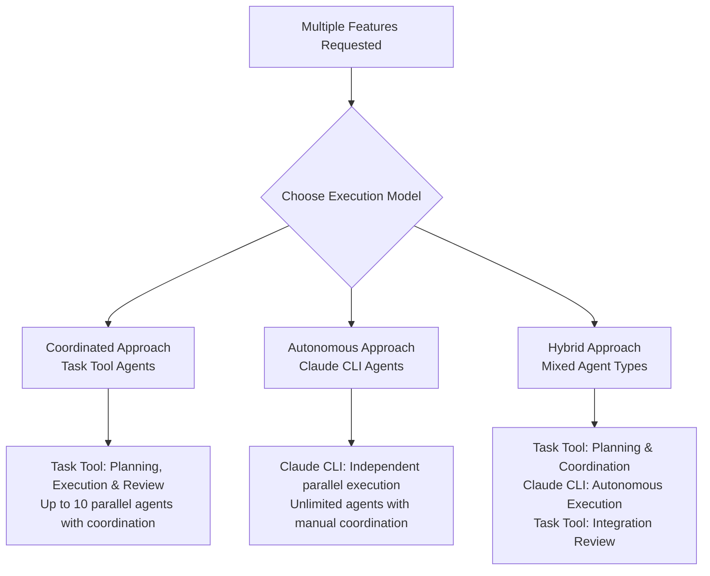

# Parallel Agent Development

Parallel development enables multiple independent features to be developed simultaneously using Git Worktrees with Claude orchestration.

## Overview

Parallel development accelerates delivery by leveraging isolation and coordination:

- **Feature-Level Parallelism**: Multiple independent features developed simultaneously
- **Claude Orchestration**: Claude coordinates all agents and phase transitions
- **Isolated Workspaces**: Each feature gets its own worktree to prevent conflicts
- **Flexible Workflows**: Support for TDD, direct implementation, bug fixes, and custom workflows

**Integration Note**: This document focuses on orchestration concepts. For agent selection, see [Agent Reference](../reference/agents.md). For worktree commands, see [Worktree Operations](../reference/worktree-operations.md).

## When to Use Parallel Development

Use parallel development when:
- Multiple independent features requested explicitly
- Features have clear boundaries and minimal overlap
- User explicitly asks for parallel workflow
- Combined complexity would benefit from parallel execution

**Decision Point**: Use [Decision Guide](../reference/decision-guide.md) to determine if parallel development is appropriate.

## Orchestration Responsibility

**CRITICAL**: During parallel development, Claude acts as sole orchestrator and coordinator. Agents work independently without inter-agent communication.

### Claude's Orchestration Role

When executing parallel development, Claude MUST:

1. **Setup**: Create worktrees, verify dependencies, ensure agent prerequisites
2. **Launch**: Start agents with correct parameters and monitor execution IDs
3. **Monitor**: Track agent progress via BashOutput, verify completion status
4. **Coordinate**: Launch subsequent phases only after prior phases complete
5. **Verify**: Check test results, commits, and implementation quality

### Orchestration vs Normal Development

**Normal Development** (Single Feature):
- User works with Claude interactively
- Claude assists but doesn't orchestrate
- No worktrees needed unless conflicts exist
- Standard Git workflow on current branch

**Parallel Development** (Orchestrated):
- Claude takes orchestration role
- Multiple worktrees created and managed
- Parallel agents launched and monitored
- Claude coordinates phase transitions
- Pull requests created for each feature

## Agent Type Selection for Parallel Development

### Parallel Development Approaches

Parallel development supports both coordinated and autonomous execution models:



### Agent Selection Guidelines

**Use Task Tool Agents For Parallel Development**:
- Coordinated parallel execution (up to 10 concurrent agents)
- Cross-feature coordination requiring shared context
- Interactive refinement during parallel development
- Architecture decisions affecting multiple features
- Complex parallel workflows requiring built-in coordination

**Use Claude CLI Agents For Parallel Development**:
- Autonomous parallel execution across multiple worktrees
- Session-independent background processing
- Unlimited parallel execution scenarios (>10 agents)
- Long-running automated workflows
- Independent feature development with manual coordination

For detailed agent capabilities, see [Agent Reference](../reference/agents.md).

## Parallel Execution Patterns

### Pattern 1: Planning → Execution → Review

```bash
# 1. Planning Phase (Task Tool)
@agent-software-architect "Design architecture for user management features that can be developed in parallel"
@agent-tech-lead "Break down the user management epic into 3 parallel features and identify dependencies"

# 2. Setup Phase (see Worktree Operations reference)
# Create worktrees for each feature

# 3. Parallel Execution Phase (Claude CLI)
# Launch multiple Claude CLI agents in background

# 4. Review Phase (Task Tool after completion)
@agent-code-reviewer "Review all implementations for consistency and integration compatibility"
```

### Pattern 2: Direct Parallel Implementation

For well-defined features, skip planning and execute directly:

1. Create worktrees for each feature
2. Launch parallel Claude CLI agents immediately
3. Monitor completion via BashOutput
4. Coordinate sequential phases as needed

### Pattern 3: TDD Parallel Workflow

Execute TDD phases in parallel across features:

1. **RED Phase**: All features create failing tests in parallel
2. **GREEN Phase**: All features implement code in parallel
3. **REFACTOR Phase**: All features refactor in parallel

See [TDD Workflow](../../.claude/workflows/tdd-workflow.md) for detailed patterns.

### Pattern 4: Task Tool Coordinated Parallel Development

Execute multiple features in parallel using Task tool agents with built-in coordination:

```bash
# Coordinated Parallel Implementation (Task Tool)
@agent-tech-lead "Coordinate parallel development of user management features: authentication, profiles, and permissions"

# This launches 3 concurrent developers automatically:
# - @agent-developer working on authentication
# - @agent-developer working on user profiles
# - @agent-developer working on permissions
# All with shared context and automatic coordination
```

### Pattern 5: Task Tool Mixed Parallel Workflow

Combine parallel implementation with coordinated review:

```bash
# 1. Parallel Implementation Phase
@agent-tech-lead "Launch parallel development: authentication, profiles, permissions"

# 2. Coordinated Integration Phase (after implementation)
@agent-software-architect "Review parallel implementations for integration consistency"
@agent-qa "Design cross-feature test strategy for user management components"
```

### Pattern 6: Hybrid Orchestration

Use Task tool coordination to orchestrate Claude CLI autonomous execution:

```bash
# 1. Task Tool Planning and Coordination
@agent-tech-lead "Plan autonomous parallel development and create worktree structure"

# 2. Claude CLI Autonomous Execution (based on Task tool planning)
# Launch multiple independent claude-cli agents in separate worktrees

# 3. Task Tool Integration Review
@agent-code-reviewer "Review autonomous implementations for consistency"
```

## Coordination Mechanics

### Phase Coordination

**Sequential Phases**: Only launch next phase after ALL current phase agents complete successfully:

```python
# 1. VERIFY all implementation agents completed
for bash_id in implementation_agent_ids:
    result = BashOutput(bash_id=bash_id)
    # Must show: "status": "completed", "exit_code": 0

# 2. THEN launch review agents
# Launch review agents only after verification
```

### Agent Independence

Each Claude CLI agent:
1. **Reads** current filesystem state to understand context
2. **Performs** specialized task (tests, code, or review)
3. **Commits** work with appropriate messages
4. **Exits** with status indicating success/failure

**Key Insight**: Agents coordinate through filesystem state, not communication. Claude coordinates the agents.

### Monitoring and Status

**Real-time Monitoring**:
```python
# Check agent progress
BashOutput(bash_id="bash_5")  # Get current status and output

# Filter for important events
BashOutput(bash_id="bash_5", filter="commit|feat:|fix:|completed|ERROR")
```

**Status Indicators**:
- `"status": "running"` - Agent actively working
- `"status": "completed"` - Agent finished successfully
- `"status": "failed"` - Agent encountered error
- `"exit_code": 0` - Success, ready for next phase

## Workflow Coordination Examples

### Implementation → Testing Coordination

```python
# Launch implementation agents in parallel
implementation_agents = [
    "bash_5",  # authentication feature
    "bash_6",  # user profile feature
    "bash_7"   # permissions feature
]

# Wait for ALL implementations to complete
all_completed = False
while not all_completed:
    results = [BashOutput(bash_id=bid) for bid in implementation_agents]
    all_completed = all(r.get("status") == "completed" and r.get("exit_code") == 0 for r in results)

# Then launch testing agents
# Launch test agents only after implementation phase verified complete
```

### Quality Gate Enforcement

**Between Phases**: Verify all agents in current phase completed successfully before advancing
**Final Gate**: Ensure all tests pass before creating pull requests
**Integration Gate**: Verify no conflicts between parallel features

## Pull Request Strategy

### Coordinated PR Creation

After all parallel work completes:

1. **Verify Quality**: All tests pass, commits present, no conflicts
2. **Create PRs**: One PR per feature from respective worktrees
3. **Link PRs**: Reference related PRs in descriptions
4. **Coordinate Review**: Schedule reviews to avoid conflicts
5. **Sequential Merge**: Merge in dependency order if needed

### PR Templates for Parallel Features

Include coordination information:
```markdown
## Parallel Development Context
- Part of parallel development for [Epic Name]
- Related PRs: #123, #124, #125
- Dependencies: [List any dependencies]
- Integration notes: [Any coordination requirements]
```

## Best Practices

### Setup Phase
- Verify all prerequisites before launching agents (see [Troubleshooting](../reference/troubleshooting.md))
- Create consistent worktree naming with Linear issue IDs
- Install dependencies in all worktrees before starting

### Execution Phase
- Launch agents in logical dependency order
- Monitor progress actively via BashOutput
- Enforce quality gates between phases
- Document coordination decisions

### Completion Phase
- Verify all work completed before creating PRs
- Test integration between parallel features
- Create PRs in dependency order
- Clean up worktrees after successful merges

For detailed commands and troubleshooting, see:
- [Worktree Operations](../reference/worktree-operations.md) - Setup and cleanup commands
- [Agent Reference](../reference/agents.md) - Agent selection and usage
- [Troubleshooting](../reference/troubleshooting.md) - Common issues and solutions
- [Decision Guide](../reference/decision-guide.md) - When to use parallel development

## Integration with Other Workflows

Parallel development integrates with:
- [Single Feature Workflow](../development/single-feature-workflow.md) - Individual feature patterns
- [Linear Integration](../development/linear-branch-integration.md) - Issue tracking coordination
- [Task Tool Workflow](../../.claude/workflows/task-tool-workflow.md) - Planning and review phases

**Key Principle**: Parallel development is orchestrated sequential development. Claude coordinates agents through filesystem state and phase transitions, enabling true parallelism while maintaining quality and integration.