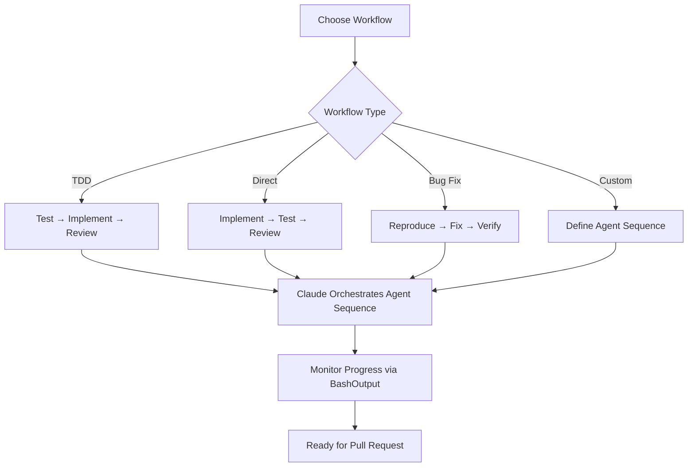

# Parallel Agent Development

This document describes how to enable multiple agents to work on independent features simultaneously using Git Worktrees with Claude orchestration. Parallel development can be used with any development workflow.

## Overview

Parallel development in CycleTime CE allows multiple features to be developed simultaneously by leveraging Git Worktrees. Each feature can follow any development workflow with Claude-orchestrated specialized agents within its own isolated workspace.

### Key Concepts

- **Feature-Level Parallelism**: Multiple independent features developed simultaneously
- **Claude Orchestration**: Claude coordinates all agents and phase transitions
- **Isolated Workspaces**: Each feature gets its own worktree to prevent conflicts
- **Flexible Workflows**: Support for TDD, direct implementation, bug fixes, and custom workflows

## Orchestration Responsibility

**CRITICAL**: During parallel development workflows, Claude (you) is the sole orchestrator and coordinator. Agents work independently without inter-agent communication.

### Claude's Responsibilities During Parallel Development

When executing parallel development, Claude MUST:

1. **Setup**: Create worktrees, distribute prompt files, install dependencies
2. **Launch**: Start agents with correct parameters and monitor bash_ids
3. **Monitor**: Track agent progress via BashOutput, verify completion status
4. **Coordinate**: Launch subsequent phases only after prior phases complete
5. **Verify**: Check test results, commits, and implementation quality

### What Claude Does NOT Do During Normal Development

Outside of parallel development workflows:
- Do NOT automatically create worktrees without user request
- Do NOT launch multiple agents unless explicitly asked
- Do NOT assume orchestration role for single-feature development
- Let users drive the workflow unless they request parallel execution

**Key Principle**: Orchestration mode is ONLY activated when user explicitly requests parallel development or multiple feature implementation.

### Single vs Parallel Development

#### Single Feature Development (Default)
- User works with Claude interactively
- Claude assists but doesn't orchestrate
- No worktrees needed
- No parallel agents launched
- Standard Git workflow on current branch

#### Parallel Feature Development (Orchestrated)
- Claude takes orchestration role
- Multiple worktrees created
- Parallel agents launched and monitored
- Claude coordinates phase transitions
- Pull requests created for each feature

**Decision Point**: Use parallel development ONLY when:
- Multiple independent features requested
- User explicitly asks for parallel workflow
- Features have clear boundaries and minimal overlap

## Claude CLI Agent Execution

**CRITICAL**: This section documents the EXACT commands and patterns that enable real parallel agent work. These patterns use Claude CLI directly, NOT Task tool delegation.

**IMPORTANT DISTINCTION**:
- ✅ **CORRECT**: Use `claude` CLI commands with prompt files (documented below)
- ❌ **WRONG**: Do NOT use Task tool with `@agent-*` patterns (e.g., `@agent-developer`)
- ❌ **WRONG**: Do NOT use Task tool delegation - agents work in isolated environments

**Why Claude CLI?** Only Claude CLI agents can make real filesystem changes and commits. Task tool agents work in isolated environments and cannot modify actual worktree files.

### MANDATORY Prerequisites

**WARNING**: ALL prerequisites MUST be completed before attempting parallel agent execution. Missing any step will cause silent or confusing failures.

#### 1. Claude CLI Installation Verification
```bash
# VERIFY Claude CLI is available
which claude
# MUST return a path like: /usr/local/bin/claude
# If empty/error: Agents will fail with "command not found" (exit code 127)
```

#### 2. Agent Prompt File Availability
```bash
# VERIFY prompt files exist in main repository (should be committed beforehand)
ls -la .claude/prompts/
# Should show: task-agent.txt, test-agent.txt, implementation-agent.txt, review-agent.txt (and legacy TDD agents)

# If prompt files are committed to main branch, they will automatically be 
# available in all worktrees created from that branch
# VERIFY all files exist in worktrees:
find .worktrees -name "*.txt" -path "*/.claude/prompts/*"
```

#### 3. Worktree Dependency Installation
```bash
# Each worktree MUST have dependencies installed
for worktree in .worktrees/*/; do
    echo "Installing dependencies in $worktree"
    (cd "$worktree" && npm install)
done
```

### Claude CLI Command Pattern

**EXACT COMMAND STRUCTURE** (do NOT modify any flags):

```bash
claude -p "[TASK_DESCRIPTION]" \
  --append-system-prompt "$(cat .claude/prompts/[AGENT_TYPE].txt)" \
  --permission-mode bypassPermissions \
  --output-format stream-json \
  --verbose
```

**FLAG EXPLANATIONS** (all flags are mandatory):

- **`-p "[TASK]"`**: Non-interactive execution. Agent reads task, completes it, and exits.
- **`--append-system-prompt`**: Loads agent specialization from prompt file. MUST use `$(cat ...)` syntax.
- **`--permission-mode bypassPermissions`**: Skips permission prompts for automated execution. Required for background agents to avoid interactive prompts that would block execution.
- **`--output-format stream-json`**: Structured output for monitoring. Essential for tracking parallel progress.
- **`--verbose`**: Detailed progress logging. Required for debugging agent failures.

### Agent Types and Their Prompt Files

| Agent Type | Prompt File | Purpose | Use Cases |
|------------|-------------|---------|----------|
| Task Agent | `task-agent.txt` | General purpose development tasks | Feature implementation, bug fixes, refactoring |
| Test Agent | `test-agent.txt` | Testing specialist (all modes) | TDD tests, validation tests, regression tests |
| Implementation Agent | `implementation-agent.txt` | Code implementation specialist | Direct implementation, TDD GREEN phase |
| Review Agent | `review-agent.txt` | Code review and quality assurance | Code review, TDD REFACTOR phase, quality gates |

### Development Workflow Options

Parallel development supports multiple workflows:

- **TDD Workflow**: Test-first development with RED → GREEN → REFACTOR cycles (see `docs/TDD_WORKFLOW.md`)
- **Direct Implementation**: Build features directly from specifications (see `.claude/workflows/direct-workflow.md`)
- **Bug Fix Workflow**: Reproduce → Fix → Verify process (see `.claude/workflows/bugfix-workflow.md`)
- **Custom Workflows**: Define your own agent sequences using the generic agents

Choose the workflow that best fits your requirements, team preferences, and project constraints.

## Parallel Agent Execution

**CRITICAL**: This section documents how to launch and monitor multiple Claude CLI agents simultaneously using proven patterns.

### Monitoring Agent Progress

When running parallel agents, monitor completion using BashOutput. Completion times vary based on feature complexity and system performance.

### Launching Multiple Agents Simultaneously

**METHOD**: Use Bash tool with `run_in_background=true` for each agent.

**Example: Launch 3 Task Agents in Parallel (Direct Implementation)**

```python
# Agent 1: user-authentication feature
Bash(
    command="cd /Users/[user]/Projects/jcvd/.worktrees/authentication && claude -p 'Implement user authentication system with login, logout, and session management. Create secure, production-ready code following project patterns.' --append-system-prompt \"$(cat .claude/prompts/task-agent.txt)\" --permission-mode bypassPermissions --output-format stream-json --verbose",
    run_in_background=true  # Returns bash_id like "bash_5"
)

# Agent 2: user-profile feature
Bash(
    command="cd /Users/[user]/Projects/jcvd/.worktrees/user-profile && claude -p 'Implement user profile management with create, read, update operations. Include validation and error handling.' --append-system-prompt \"$(cat .claude/prompts/task-agent.txt)\" --permission-mode bypassPermissions --output-format stream-json --verbose",
    run_in_background=true  # Returns bash_id like "bash_6"
)

# Agent 3: password-reset feature
Bash(
    command="cd /Users/[user]/Projects/jcvd/.worktrees/password-reset && claude -p 'Implement secure password reset flow with email verification and token-based reset process.' --append-system-prompt \"$(cat .claude/prompts/task-agent.txt)\" --permission-mode bypassPermissions --output-format stream-json --verbose",
    run_in_background=true  # Returns bash_id like "bash_7"
)
```

### Monitoring Parallel Agents

**Use BashOutput tool to check agent progress:**

```python
# Check individual agent status
BashOutput(bash_id="bash_5")  # Check authentication task agent
BashOutput(bash_id="bash_6")  # Check user-profile task agent  
BashOutput(bash_id="bash_7")  # Check password-reset task agent

# Filter for important events (faster monitoring)
BashOutput(bash_id="bash_5", filter="commit|feat:|fix:|ERROR|completed")
```

**Status Indicators**:
- `"status": "running"` - Agent is actively working
- `"status": "completed"` - Agent finished successfully  
- `"status": "failed"` - Agent encountered error
- `"exit_code": 0` - Success
- `"exit_code": 127` - Command not found (claude CLI missing)

### Sequential Workflow Phases

**Launch Follow-up Agents After Initial Phase Completion:**

```python
# Example: Add validation tests after direct implementation
# ONLY after ALL implementation agents show "status": "completed" with "exit_code": 0

Bash(
    command="cd /Users/[user]/Projects/jcvd/.worktrees/authentication && claude -p 'Add comprehensive validation tests for the implemented authentication system. Focus on security, edge cases, and integration testing.' --append-system-prompt \"$(cat .claude/prompts/test-agent.txt)\" --permission-mode bypassPermissions --output-format stream-json --verbose",
    run_in_background=true
)

# Repeat for other features as needed...
```

## Common Failures and Solutions

**CRITICAL**: This section documents ALL encountered failure modes and their exact solutions.

### Failure 1: "command not found: claude"

**Symptom**: Agent fails immediately with exit code 127
**Error Message**: `(eval):1: command not found: claude`
**Root Cause**: Claude CLI not available in PATH within worktree environment

**Solutions** (in order of preference):
1. **Verify Installation**:
   ```bash
   which claude
   # Should return: /usr/local/bin/claude or similar
   ```

2. **Use Full Path**:
   ```bash
   # Replace 'claude' with full path in commands:
   /usr/local/bin/claude -p "..." --append-system-prompt ...
   ```

3. **Fix PATH**:
   ```bash
   export PATH="/usr/local/bin:$PATH"
   ```

### Failure 2: Missing prompt files

**Symptom**: Agent fails during startup
**Error Message**: `cat: .claude/prompts/test-agent.txt: No such file or directory`
**Root Cause**: Prompt files not committed to main branch before creating worktrees

**Solution**:
```bash
# Commit prompt files to main branch FIRST:
git add .claude/prompts/*.txt
git commit -m "feat: add agent prompt files for parallel development"

# Then create worktrees - files will be automatically available
git worktree add .worktrees/feature-name -b feat/feature-name

# VERIFY files exist:
ls .worktrees/feature-name/.claude/prompts/
```

### Failure 3: Using Task tool instead of Claude CLI

**Symptom**: Task tool reports agent completion but no files modified, no commits made
**Root Cause**: Task tool agents work in isolated environments, not real worktrees
**CRITICAL**: Task tool `@agent-*` patterns do NOT work for parallel development
**Solution**: ALWAYS use Claude CLI directly with `--permission-mode bypassPermissions`

### Failure 4: Tests fail due to import errors

**Symptom**: Agent completes but tests fail with module resolution errors
**Error Example**: `Cannot find module '@/widgets/feature'`
**Root Cause**: Missing dependencies or incorrect import paths in worktree

**Solutions**:
1. **Install Dependencies**:
   ```bash
   cd .worktrees/feature-name
   npm install
   ```

2. **Verify TypeScript Configuration**:
   ```bash
   # Check tsconfig.json exists and has correct path mappings
   cat tsconfig.json | grep -A5 "paths"
   ```

### Failure 5: Permission denied errors

**Symptom**: Agent cannot create/modify files
**Error Example**: `EACCES: permission denied, open 'src/feature.ts'`
**Root Cause**: Missing `--permission-mode bypassPermissions` flag

**Solution**: Always include `--permission-mode bypassPermissions` in Claude CLI commands.

## Agent Prompt File System

**CRITICAL**: Agent prompt files define behavior and expertise. These MUST be identical across all worktrees.

### Required Prompt Files

**Location**: `.claude/prompts/` (must exist in EACH worktree)
**File Permissions**: Read-accessible by claude CLI process

#### Legacy TDD-Specific Agents (For Backward Compatibility)

The original TDD-specific agents are still available:
- `qa-agent.txt` - TDD RED phase specialist
- `developer-agent.txt` - TDD GREEN phase specialist  
- `reviewer-agent.txt` - TDD REFACTOR phase specialist

For new workflows, use the generic agents listed above which provide more flexibility.

### Prompt File Management

**Preparation Command**:
```bash
# Commit prompt files to main branch before creating worktrees
git add .claude/prompts/*.txt
git commit -m "feat: add agent prompt files for parallel development"
```

**Verification**:
```bash
# Verify prompt files exist in all worktrees
find .worktrees -name "*.txt" -path "*/.claude/prompts/*" -exec ls -la {} \;
```

**Version Control**: Prompt files should be versioned in main repository under `.claude/prompts/` and distributed to worktrees as needed.

## Parallel Feature Development Strategy

### When to Use Parallel Development

Use parallel development when:
- Multiple independent features can be developed simultaneously
- Features have minimal dependencies on each other
- Clear scope boundaries can be established
- Each feature can follow any development workflow independently

### Feature Selection Criteria

**Good Candidates:**
- New feature implementations
- Bug fixes with isolated scope
- Component enhancements
- Independent utility functions

**Avoid Parallel Development For:**
- Features that modify the same core files
- Interdependent features requiring coordination
- Major architectural changes
- Database schema migrations

## Workflow Execution

Each feature branch can follow different development workflows orchestrated by Claude:



### Workflow Coordination

**Claude's Role**:
- Choose appropriate agents based on selected workflow
- Launch agents in correct sequence (parallel or sequential)
- Monitor agent completion via BashOutput
- Coordinate phase transitions and dependencies
- Verify quality gates and success criteria

**Agent Independence**:
- Each agent reads filesystem state to understand context
- Agents perform their specialized tasks autonomously
- No inter-agent communication required
- Claude coordinates agents through filesystem state and monitoring

For specific workflow details, see:
- **TDD Workflow**: `docs/TDD_WORKFLOW.md`
- **Direct Implementation**: `.claude/workflows/direct-workflow.md`
- **Bug Fix Process**: `.claude/workflows/bugfix-workflow.md`

## Worktree Organization

### Directory Structure

```
jcvd/                          # Main worktree (main branch)
├── .git/                      # Shared Git database
├── src/                       # Main development area
├── .worktrees/                # Parallel development area
│   ├── widget-one/            # Feature: Widget implementation
│   │   ├── .claude/prompts/   # Agent prompt files
│   │   ├── src/               # Feature implementation
│   │   └── tests/             # Feature tests
│   ├── red-thingy/            # Feature: Red component
│   │   ├── .claude/prompts/   # Agent prompt files
│   │   ├── src/               # Feature implementation
│   │   └── tests/             # Feature tests
│   └── broken-fix/            # Bug fix: Specific issue
│       ├── .claude/prompts/   # Agent prompt files
│       ├── src/               # Bug fix implementation
│       └── tests/             # Regression tests
└── docs/                      # Shared documentation
```

### Worktree Setup Commands

#### Create New Feature Worktree

```bash
# Create feature branch and worktree
git worktree add .worktrees/widget-one -b feat/widget-one

# Navigate to feature workspace
cd .worktrees/widget-one

# Worktree is ready for Claude CLI agent execution
```

#### Create Bug Fix Worktree

```bash
# Create fix branch and worktree
git worktree add .worktrees/broken-fix -b fix/broken-gets-fixed

# Navigate to fix workspace
cd .worktrees/broken-fix

# Worktree is ready for Claude CLI agent execution
```

## Agent Coordination (Claude CLI Method)

**CRITICAL**: With Claude CLI agents, there is NO handoff mechanism needed between agents. Each agent works independently, and Claude orchestrates the entire workflow.

### How Agent Coordination Works

Each Claude CLI agent:
1. **Reads** the current filesystem state (tests exist? code exists?)
2. **Performs** their specialized task (create tests, implement code, or review)
3. **Commits** their work with appropriate messages
4. **Exits** with status code indicating success/failure

**Claude monitors and coordinates** by:
- Tracking bash_ids from parallel agent launches
- Using BashOutput to check completion status and logs
- Launching next phase only after all current phase agents complete
- No JSON files, no manual handoffs, no inter-agent communication

### Workflow Coordination Examples

#### Implementation → Review Coordination

**CRITICAL**: Only launch review agents AFTER all implementation agents complete successfully.

```python
# 1. VERIFY implementation agents completed successfully
for bash_id in ["bash_5", "bash_6", "bash_7"]:
    result = BashOutput(bash_id=bash_id)
    # Must show: "status": "completed", "exit_code": 0

# 2. Launch review agents for quality assurance
Bash(
    command="cd /Users/[user]/Projects/jcvd/.worktrees/authentication && claude -p 'Review the authentication implementation for code quality, security, performance, and adherence to project standards. Suggest improvements and ensure best practices are followed.' --append-system-prompt \"$(cat .claude/prompts/review-agent.txt)\" --permission-mode bypassPermissions --output-format stream-json --verbose",
    run_in_background=true
)

# Repeat for each feature worktree...
```

#### Multi-Phase Workflow Example

```python
# Example: TDD workflow coordination
# Phase 1: Create tests (using test-agent in TDD mode)
# Phase 2: Implement code (using implementation-agent in test-driven mode)  
# Phase 3: Review and refactor (using review-agent)

# See docs/TDD_WORKFLOW.md for complete TDD coordination examples
```

### Benefits of Claude CLI Coordination

- **Agents are independent**: No communication between agents required
- **Real filesystem changes**: Agents modify actual files and make commits
- **Parallel execution**: Multiple agents work simultaneously across worktrees
- **Structured monitoring**: Claude tracks progress via BashOutput JSON streams
- **Automatic phase transitions**: Claude controls when to advance to next phase
- **No manual state management**: No JSON files or handoff protocols needed

**Key Insight**: Agents don't coordinate with each other - they coordinate with the filesystem. Claude coordinates the agents.

## Pull Request Workflow

### Branch Management Strategy

Each feature branch follows this lifecycle:
1. **Local Development**: Complete TDD cycle in worktree
2. **Push to Origin**: Push feature branch for backup and sharing
3. **Pull Request**: Create PR for code review and integration
4. **CI/CD**: Automated testing and quality checks
5. **Merge**: Integration to main branch via GitHub

### Creating Pull Requests

#### Standard PR Creation

```bash
# From feature worktree (after completing TDD cycle)
cd .worktrees/feature-name

# Final commit with complete TDD cycle
git add .
git commit -m "feat: complete feature implementation

🤖 Generated with [Claude Code](https://claude.ai/code)

Co-Authored-By: Claude <noreply@anthropic.com>"

# Push to origin
git push -u origin feat/feature-name

# Create PR with comprehensive description
gh pr create --title "feat: implement feature-name" --body "$(cat <<'EOF'
## Summary
Brief description of the feature and its purpose

## TDD Phase Completion
- ✅ RED Phase: Comprehensive failing tests created
- ✅ GREEN Phase: Implementation completed, all tests pass
- ✅ REFACTOR Phase: Code reviewed and optimized

## Changes Made
- List of key changes
- Files modified
- New functionality added

## Test Plan
- [ ] All existing tests pass
- [ ] New functionality tested
- [ ] Integration verified

🤖 Generated with [Claude Code](https://claude.ai/code)
EOF
)"
```

#### PR Status Monitoring

```bash
# Check status of all open PRs
gh pr status

# View specific PR details
gh pr view feat/feature-name

# Check PR checks/CI status
gh pr checks feat/feature-name
```

## Coordination and Best Practices

### Preventing Conflicts

1. **Clear Scope Boundaries**: Each feature should modify distinct file sets
2. **Shared Code Changes**: Coordinate through main branch integration
3. **Database Schema**: Avoid parallel schema changes
4. **Configuration Files**: Minimize parallel config modifications
5. **PR Dependencies**: Clearly document if PRs depend on each other

### Communication Patterns

- **Status Updates**: Use Linear issue status updates for progress
- **Blocking Issues**: Create Linear issue comments or update issue status to blocked
- **Questions**: Create comments on Linear issues for clarification
- **Architecture Decisions**: Coordinate through Claude or involve Software Architect for guidance

### Quality Gates

- **RED Phase**: All tests must fail meaningfully
- **RED Validation**: Code Reviewer must approve test design
- **GREEN Phase**: All tests must pass
- **REFACTOR Phase**: Tests must continue passing
- **Final Review**: Code Reviewer must approve for merge

## Cleanup Procedures

### Feature Completion

#### Push and Create Pull Request

```bash
# From feature worktree
cd .worktrees/widget-one

# Commit all changes
git add .
git commit -m "feat: implement widget-one functionality

Complete TDD cycle with Claude orchestration:
- RED Phase: Comprehensive failing tests written
- GREEN Phase: Implementation completed, all tests pass  
- REFACTOR Phase: Code reviewed and optimized

🤖 Generated with [Claude Code](https://claude.ai/code)

Co-Authored-By: Claude <noreply@anthropic.com>"

# Push feature branch to origin
git push -u origin feat/widget-one

# Create pull request
gh pr create --title "feat: implement widget-one functionality" --body "$(cat <<'EOF'
## Summary
- Complete widget-one implementation following TDD methodology
- All tests passing with comprehensive coverage
- Agent handoffs completed successfully

## TDD Phase Completion
- ✅ RED Phase: Failing tests created and validated
- ✅ GREEN Phase: Implementation completed, all tests pass
- ✅ REFACTOR Phase: Code reviewed and optimized

## Test Plan
- [ ] Verify all existing tests continue to pass
- [ ] Confirm widget-one functionality works as specified
- [ ] Check integration with existing codebase

🤖 Generated with [Claude Code](https://claude.ai/code)
EOF
)"
```

#### Worktree Cleanup (After PR Merge)

```bash
# After PR is merged on GitHub
# Remove completed worktree
git worktree remove .worktrees/widget-one

# Delete local feature branch
git branch -d feat/widget-one

# Clean up remote tracking branch (handled by GitHub after merge)
# git push origin --delete feat/widget-one  # Usually automatic after PR merge
```

### Emergency Cleanup

#### Abandoned Features

```bash
# Force remove worktree with uncommitted changes
git worktree remove --force .worktrees/abandoned-feature

# Force delete branch
git branch -D feat/abandoned-feature
```
## Quick Start: Complete Parallel Development Workflow

**ORCHESTRATION MODE**: This workflow assumes Claude is orchestrating. Users can follow these steps manually, but Claude should execute them automatically when parallel development is requested.

### When to Use This Workflow

- User requests: "Implement these features in parallel"
- User requests: "Use parallel agents for multiple tasks"  
- User explicitly asks for parallel development across multiple independent items
- NOT for single feature development (use standard sequential workflow)

### Workflow Selection

Before starting, choose appropriate workflow:
- **TDD**: For test-first development (see `docs/TDD_WORKFLOW.md`)
- **Direct Implementation**: For direct feature building (see `.claude/workflows/direct-workflow.md`)
- **Bug Fixes**: For systematic bug resolution (see `.claude/workflows/bugfix-workflow.md`)

**CRITICAL**: This section provides a complete, tested workflow for parallel development using Claude CLI agents with any workflow.

### Prerequisites Checklist

```bash
# 1. Verify Claude CLI installation
which claude
# Must return: /usr/local/bin/claude

# 2. Verify current directory is main repository
pwd
# Should end with: /jcvd (not .worktrees/*)

# 3. Verify prompt files exist
ls -la .claude/prompts/
# Should show: task-agent.txt, test-agent.txt, implementation-agent.txt, review-agent.txt (and legacy TDD agents)
```

### Step 1: Setup Parallel Worktrees

```bash
# Create 3 feature worktrees from main repository
git worktree add .worktrees/red-thingy -b feat/spi-XXX-red-thingy
git worktree add .worktrees/broken-fix -b fix/spi-XXX-broken-fix  
git worktree add .worktrees/widget-one -b feat/spi-XXX-widget-enhancement

# Verify worktrees created
git worktree list
# Should show 4 entries: main + 3 feature worktrees
```

### Step 2: Verify Agent Prompt Files

```bash
# VERIFY prompt files exist in worktrees (inherited from main branch)
find .worktrees -name "*.txt" -path "*/.claude/prompts/*" | wc -l
# Should return: 9 (3 worktrees × 3 prompt files)

# If missing, prompt files need to be committed to main branch first:
# git add .claude/prompts/*.txt
# git commit -m "feat: add agent prompt files for parallel development"
# Then recreate worktrees from updated main branch
```

### Step 3: Install Dependencies in All Worktrees

```bash
# Each worktree needs dependencies for testing and building
for worktree in .worktrees/*/; do
    echo "Installing dependencies in $worktree"
    (cd "$worktree" && npm install)
done

# VERIFY installations completed successfully
for worktree in .worktrees/*/; do
    if [ -d "$worktree/node_modules" ]; then
        echo "✓ Dependencies installed in $worktree"
    else
        echo "✗ Missing dependencies in $worktree"
    fi
done
```

### Step 4: Launch Parallel Agents (Example: Direct Implementation)

**Use these EXACT commands with appropriate path adjustments:**

```python
# Launch Task Agent 1: authentication feature
Bash(
    command="cd /Users/[USER]/Projects/jcvd/.worktrees/authentication && claude -p 'Implement user authentication system with secure login, logout, and session management. Include proper validation, error handling, and security best practices.' --append-system-prompt \"$(cat .claude/prompts/task-agent.txt)\" --permission-mode bypassPermissions --output-format stream-json --verbose",
    description="Launch task agent for authentication feature",
    run_in_background=true  
)
# Returns bash_id (e.g., "bash_5")

# Launch Task Agent 2: user profile feature  
Bash(
    command="cd /Users/[USER]/Projects/jcvd/.worktrees/user-profile && claude -p 'Implement user profile management with create, read, update operations. Include data validation, error handling, and proper API integration.' --append-system-prompt \"$(cat .claude/prompts/task-agent.txt)\" --permission-mode bypassPermissions --output-format stream-json --verbose",
    description="Launch task agent for user profile feature",
    run_in_background=true
)
# Returns bash_id (e.g., "bash_6")

# Launch Task Agent 3: password reset feature
Bash(
    command="cd /Users/[USER]/Projects/jcvd/.worktrees/password-reset && claude -p 'Implement secure password reset functionality with email verification, token generation, and secure reset process following security best practices.' --append-system-prompt \"$(cat .claude/prompts/task-agent.txt)\" --permission-mode bypassPermissions --output-format stream-json --verbose",
    description="Launch task agent for password reset feature",
    run_in_background=true
)
# Returns bash_id (e.g., "bash_7")
```

### Step 5: Monitor Agent Progress

```python
# Check status of all task agents
BashOutput(bash_id="bash_5")  # authentication
BashOutput(bash_id="bash_6")  # user-profile  
BashOutput(bash_id="bash_7")  # password-reset

# Filter for important events (faster monitoring)
BashOutput(bash_id="bash_5", filter="commit|feat:|fix:|completed|ERROR")
BashOutput(bash_id="bash_6", filter="commit|feat:|fix:|completed|ERROR")
BashOutput(bash_id="bash_7", filter="commit|feat:|fix:|completed|ERROR")
```

**Wait for ALL agents to show:**
- `"status": "completed"`
- `"exit_code": 0`

**Wait for all agents to complete before proceeding to next phase (if applicable).**

### Step 6: Launch Follow-up Agents (Optional)

**Example: Add validation testing after direct implementation**

```python
# Launch Test Agent 1: authentication validation
Bash(
    command="cd /Users/[USER]/Projects/jcvd/.worktrees/authentication && claude -p 'Add comprehensive validation tests for the authentication system. Focus on security testing, edge cases, error conditions, and integration scenarios.' --append-system-prompt \"$(cat .claude/prompts/test-agent.txt)\" --permission-mode bypassPermissions --output-format stream-json --verbose",
    description="Launch test agent for authentication validation",
    run_in_background=true
)

# Launch Test Agent 2: user profile validation
Bash(
    command="cd /Users/[USER]/Projects/jcvd/.worktrees/user-profile && claude -p 'Add comprehensive validation tests for user profile functionality. Test CRUD operations, validation logic, and error handling.' --append-system-prompt \"$(cat .claude/prompts/test-agent.txt)\" --permission-mode bypassPermissions --output-format stream-json --verbose",
    description="Launch test agent for user profile validation",
    run_in_background=true
)

# Launch Test Agent 3: password reset validation
Bash(
    command="cd /Users/[USER]/Projects/jcvd/.worktrees/password-reset && claude -p 'Add comprehensive security tests for password reset functionality. Focus on security vulnerabilities, token handling, and edge cases.' --append-system-prompt \"$(cat .claude/prompts/test-agent.txt)\" --permission-mode bypassPermissions --output-format stream-json --verbose",
    description="Launch test agent for password reset validation",
    run_in_background=true
)
```

**Note**: Follow-up phases depend on chosen workflow. See workflow documentation for specific agent sequences.

### Step 7: Verify Results

```bash
# Check that all tests pass in each worktree
for worktree in .worktrees/*/; do
    echo "=== Testing $(basename "$worktree") ==="
    (cd "$worktree" && npm run test:run)
done

# Check git commits were made
for worktree in .worktrees/*/; do
    echo "=== Commits in $(basename "$worktree") ==="
    (cd "$worktree" && git log --oneline -n 3)
done
```

**Expected Results**:
- All implementations working correctly in all worktrees
- Git commits for each development phase
- Implementation files created (src/auth.ts, src/user-profile.ts, src/password-reset.ts)
- Appropriate test coverage based on chosen workflow

### Step 8: Final Quality Review

```python
# Launch Review agents for final quality assurance
for worktree in ["authentication", "user-profile", "password-reset"]:
    Bash(
        command=f"cd /Users/[USER]/Projects/jcvd/.worktrees/{worktree} && claude -p 'Perform comprehensive code review of {worktree} implementation. Check code quality, security, performance, and adherence to project standards. Suggest any necessary improvements.' --append-system-prompt \"$(cat .claude/prompts/review-agent.txt)\" --permission-mode bypassPermissions --output-format stream-json --verbose",
        description=f"Launch review agent for {worktree} quality check",
        run_in_background=true
    )
```

### Step 9: Create Pull Requests

```bash
# Create PRs for each feature from their respective worktrees
cd .worktrees/authentication
git push -u origin feat/spi-XXX-user-authentication
gh pr create --title "feat: implement user authentication system" --body "Complete implementation with parallel agent development"

cd ../user-profile  
git push -u origin feat/spi-XXX-user-profile
gh pr create --title "feat: implement user profile management" --body "Complete implementation with parallel agent development"

cd ../password-reset
git push -u origin feat/spi-XXX-password-reset  
gh pr create --title "feat: implement password reset functionality" --body "Complete implementation with parallel agent development"
```

### Quality Verification

**Quality Indicators**:
- All tests passing in each worktree
- Clean git commit history for each feature  
- TypeScript compilation with no errors
- ESLint passing with no warnings
- Proper test coverage for new functionality

### Troubleshooting Commands

```bash
# If any agent fails, check these:

# 1. Verify Claude CLI is available
which claude

# 2. Check prompt files exist
find .worktrees -name "*.txt" -path "*/.claude/prompts/*"

# 3. Check dependencies installed  
find .worktrees -name "node_modules" -type d

# 4. Check for obvious errors
for worktree in .worktrees/*/; do
    echo "=== Checking $worktree ==="
    (cd "$worktree" && npm run type-check 2>&1 | head -5)
done
```

### Cleanup After Success

```bash
# After PRs are merged, clean up worktrees
git worktree remove .worktrees/red-thingy
git worktree remove .worktrees/broken-fix  
git worktree remove .worktrees/widget-one

# Clean up local branches (if desired)
git branch -d feat/spi-XXX-user-authentication
git branch -d feat/spi-XXX-user-profile
git branch -d feat/spi-XXX-password-reset
```

**This Quick Start enables reproducible parallel development with measurable success criteria and comprehensive error handling.**

---

*This documentation enables reproducible parallel development workflows while maintaining code quality and clear coordination between specialized agents.*
